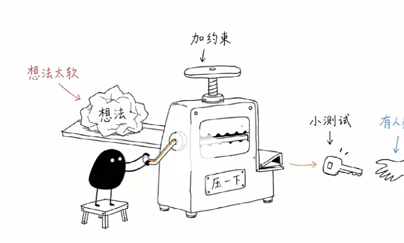

# 好玩的skill

现在分享skill, 大部分在讲提效，比如写代码、做PPT、搭工作流。
相比于在干中学skill, 在玩中学更有意思。

因为只有在你玩起来之后，才会理解AI到底能够去帮你做什么。

## ian Xiaohei illustrations
小黑插画skill 

你给他一片文章， 它会把抽象观点，变成白底手绘插图。
画面里的小黑，可能是在推机器，搬资料，或者被卡在某个流程里
它不只是画图， 反而是让小黑把那段话，直接演给你看。

帮我安装skill                                                          https://github.com/helloianneo/ian-xiaohei-illustrations

请使用ian-xiaohei-illustrations 先不要生图.                                 
  请分析下面这篇文章哪里值得配图，输出 5 张左右的 shot list。                 
  每张图写清楚：                                                              
  - 放在哪个段落后                                                            
  - 图的主题                                                                  
  - 核心意思                                                                  
  - 结构类型                                                                  
  - 小黑在图里做什么                                                          
  - 建议元素                                                                  
  - 建议中文标注词  @a.md 

   帮我为滚动加载三层进化 生成图吧

  复制到豆包 生图， 粘帖。

## awesome personal skill

也就是人格Skill 合集啊
有前任， 有老板 有同事，鲁迅， 自己的skill

帮我安装skill https://github.com/momozi1996/awesome-ai-persona-skills.git 

/luxun-perspective 如今前端开发里，不少人写耦合严重的粘连代码，不肯拆分封装，代
码一团乱麻，新人接手根本无从下手，请你评析这一现象。

## Talk a little bit More
再聊一会儿
作者因为不太会聊天，干脆做了一个skill, 专门去复盘自己， 为什么会把天聊死。
你把聊天记录丢进去， 它会告诉你，聊天是从那一句变冷的， 当时还可以怎么去接，
它可以帮我们复盘为什么对方回复哈哈， 这段聊天就没有然后了。

帮我安装skill https://github.com/caibucaiAI/talk-a-little-bit-more

女：今天课排满一整天，早上八点早八到下午六点，社团还要开例会，现在走回宿舍脚都酸死了
男：谁让你当初非要报那么多社团，自己给自己找罪受
女：社团是我喜欢的部门嘛，而且今天开会部长还当众夸我做的策划，本来有点开心，但是忙完突然好累，没人跟我分享这种心情
男：夸你策划又不是什么大事，下次少揽点任务不就轻松了
女：我就是想跟你说说今天的心情，有开心也有疲惫，你都不安慰我一下吗
男：安慰能减轻你的累？还不如早点回宿舍躺平，别想那么多
女：我们这周说好周末一起去校门口新开的甜品店，我期待好久了，你还记得不
男：忘了，我周末约室友打球了，打球早就定好了，甜品店哪天不能去
女：你怎么不提前跟我说一声啊，我心心念念期待好几天了
男：多大点事，甜品又不贵，下次单独带你去不就行了，至于生气吗
女：重点不是甜品，是你根本没把我们约定放在心上……
男：行了别闹小脾气，我打两把游戏，你自己消化下情绪吧，晚点再说
我刚聊完，帮我看看有没有本可以再聊一会儿的地方