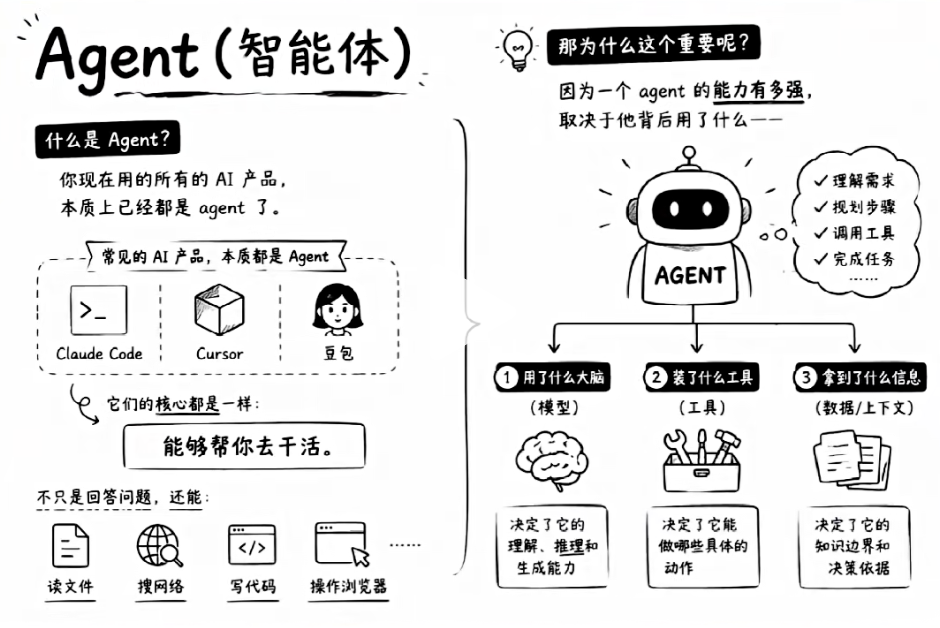
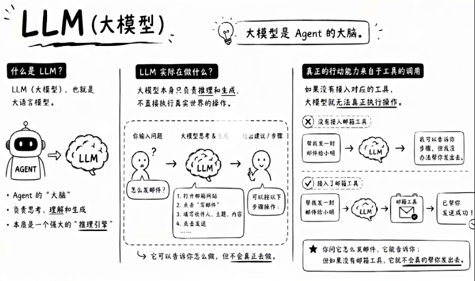

# 入手AI, 搞懂那几个关键概念？

## Agent(智能体)
现在最值钱的就是Agent, Agent工程师已经取代传统软件工程， 刷新工资上线。
FDE 通过开发各种Agent，帮助企业AI落地， 降本增效。
你现在用的所有AI产品，本质上已经都是Agent。
不管是Claude Code、Cursor、Codex ,他们的核心都是一样， 能够帮你去干活。
不只是回答问题，还能读文件、搜网络、写代码、操作浏览器，这些都是Agent在做

- 一个Agent 有多强， 取决于背后用了什么大脑，装了什么工具，拿到了什么信息。

## LLM
也就是大模型，是Agent的大脑。豆包背后是字节的大模型，claude背后是Anthoric 研发的大模型。

有一点，要搞清楚，LLM 只负责推理和生成。真正的行动能力来自工具的调用。
你问它怎么发邮件， 他会告诉你用哪家， 怎么发， 但是不会真的帮你发出去。
所以想要AI 真的帮你去操作文件、上网、自动化处理任务，关键不在于用聊天界面，
还是调用API, 而在于有没有给他接入对应的工具。

## TOOl
python/function_call
Tool 是 AI 落地执行的最小原子能力，是 Agent 真正落地做事的接口与执行单元。LLM 只有推理生成能力，无法对接外部世界，而 Tool 能补齐实操短板。像联网搜索、读写文件、执行代码、调用接口、浏览器操作等，都属于工具能力。没有工具加持，AI 只能空有推理，无法完成真实自动化任务。 

Tool 是封装好的可调用函数，大模型通过指定规则触发函数执行外部操作。

## SKILL
很多人以为skill 就是工具， 其实不是。
我用一个比喻， 来给大家理解一下。
skill 更像是SOP Standard Operating Procedure
是工作手册， 告诉AI 遇到昨夜任务， 按什么样的步骤，什么样的规矩来做。
就好像新员工， 光有脑子不行，没有SOP 就会乱来。 
新员工入职， 会有培训， skill 是这个培训的内容。

所以，同一个大模型， 有skill 和没skill 输出差别非常大。
你以为是AI 不够聪明， 其实是没有给它工作手册。
我们以后会装各种各样的skill
/plugin install code-review
/skills 查看列表 
/code-review --file=src/api/user.js

## Context

上下文， 非常关键。

Context 是AI 回答你之前，能看到的全部信息。不只是你输入的那段话，
还包括你上传的文件，对话历史，系统设定，系统提示词，他能考到所有东西
都加载一起。

Karpathy, Tesla前AI 高级总监、OpenAI 联创，说过一句话，
上下文工程是把对的信息对的时间，放在AI面前的艺术。

AI 没用好， 大多数不是AI 不够聪明， 而是给的信息不够。
你喂给AI 的context质量， 直接决定AI 输出的上限。

- stateless 
每次 API 调用都是一个完全独立的 HTTP 请求，服务器不会记住你上一句话问了什么。
无状态（Stateless）”的特性
- 怎么让大模型记住我们呢？
维护聊天数组

总结：
LLM 是大脑
Agent是手脚
Skill 是SOP
Context 是当前能看到的所有信息

哪个环节没做好， AI就会表现的非常差， 搞懂这四个，你就知道AI 为什么是
好用的， 该从哪里下手去提升。 
