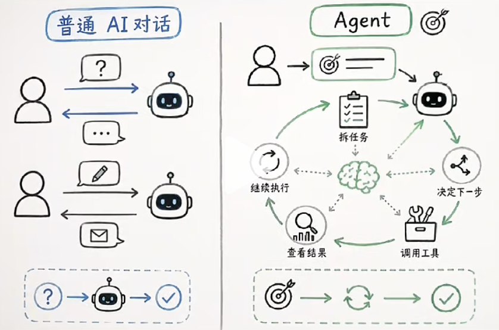
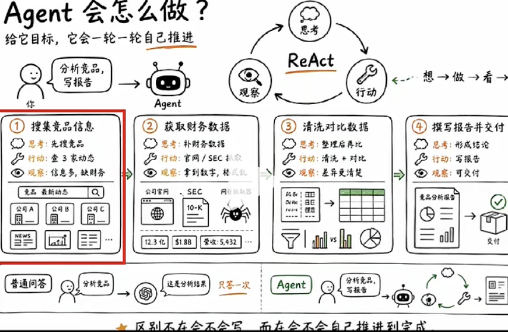
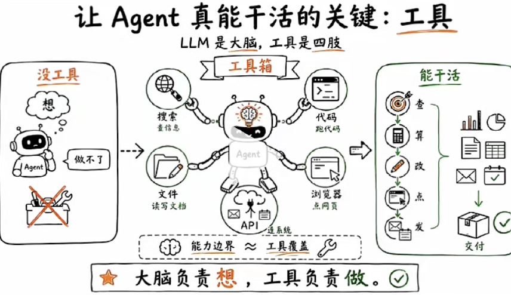

# Agent 智能体

字面意义 AI会自己干活。

这句话没错，它遮住了一个更重要的问题。

Agent 和普通的AI对话 到底它的差别在哪里？
凭什么Agent会自己干活？

- 对话结构

普通对话， 你问他答，一问一答结束。
比如你问 “帮我写一封邮件”

它写完交给你了， 任务就在这里终止了， 这本质是个问答机器， 输出一次， 没有后续。
Agent不一样， 他有一个持续运转的结构。 
你给他一个目标， 它会去拆任务， 决定下一步， 去调工具，看结果。
这过程是一个循环，知道任务完成， 或者呢它自己判断（超出循环次数， token 上限，想同结果次数， 失败了）。

我们把Agent 这个工作方式， 核心就三个动作。
第一个动作叫思考 Reason。
第二个动作叫行动 Act。
第三个动作叫观察 Observe。

观察完再回到思考， 再行动， 再观察。循环往复，那这个循环呢， 就叫做ReAct。

ReAct（Reasoning+Acting）是一套标准 Agent 执行范式 / 轻量框架，不是 LangChain 那种大型开发库，是 Agent 通用的循环工作标准。

## 举个例子
帮我写分析的竞品，然后去写一份报告。Agent会怎么去做呢？

第一轮它会先去思考 （reason）
  我需要去搜索竞品的信息 
  调用搜索工具（act）,去查询三家竞品的最新动态
  查完以后， 把结果拿回来了，
  然后观察（observe）, 信息量挺大的
  到这里第一轮就结束了，它会怎么办呢?

  再回到思考， 发现缺少财务数据（reason）
  可以去官网或查SEC文件
  然后呢再去行动啊，  (act)
  去抓取相应数据
  然后再到观察（observe）
  拿到财务数据， 需要整理
  第二轮结束

  思考怎么去整理， ....

  第三、第四， 到最后一轮 把这个报告写完， 交给你，这和ai 普通对话是完全不同的事情。

llm 能写， 但它只用自己知道的信息， 不会主动，去搜，去抓，去验证。

Agent 最核心的这个动作，靠什么落地呢？ 靠的就是工具。工具就是Agent的手脚, 没有工具， 它只能在脑力里转。转完了之后，还是只有文字。 它常见的工具有哪些？
- 搜索工具 能上网查实时信息
- 代码执行器 能运行代码， 能看结果。
- 文件读写I/O 打开文档， 修改内容
- 浏览器的操控browser 打开网页， 点击按钮。
- API的调用  和外部系统交互， 发邮件， 查日历...
工具越多， Agent 能干的事情越多。
很多Agent 产品， 调用了很多工具， 工具的覆盖范围，直接决定它的能力边界。 
