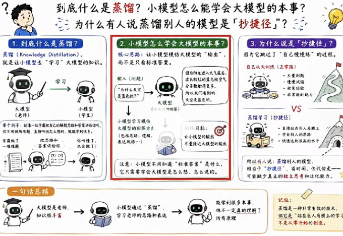
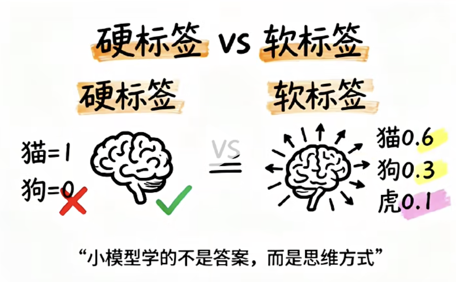
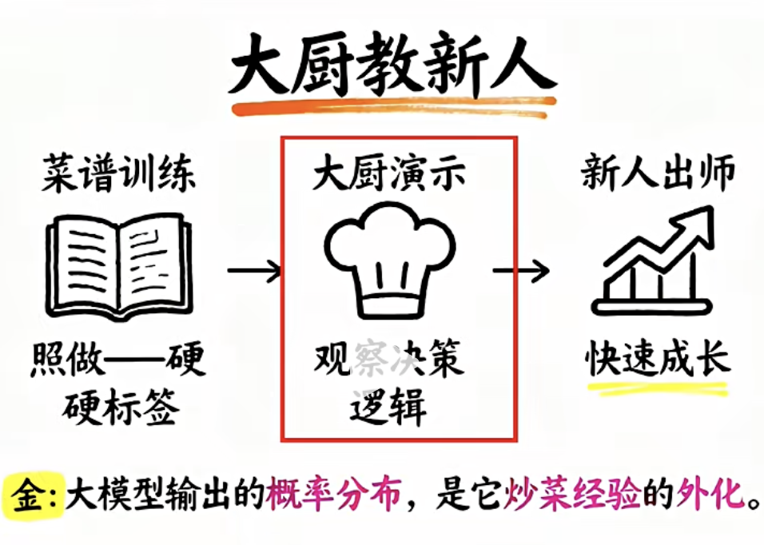
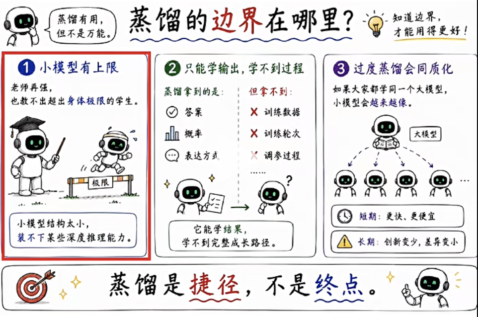

# 模型蒸馏

- 什么是蒸馏

小模型怎么去学会大模型的本事？

2025年初DeepSeek 横空出世，一个中国团队， 用了不到600万
美元的训练成本，做出了能和OpenAI 正面掰手腕的模型。

OpenAI 指控，DeepSeek用了一个叫蒸馏的技术，把OpenAI
的模型输出，拿去训练自己的模型,是抄捷径。

## 灵魂提问

- 到底什么是蒸馏
  化学术语
  把混合液体加热， 让某些成分变成了蒸汽挥发，
  然后再去冷凝收集，提取精华，去掉杂质。

  大模型的蒸馏核心思路是一样的

  就是把llm里的精华知识，提取出来，灌进给小模型。
  大模型叫老师模型，小模型叫学生模型。
  提取的过程叫知识蒸馏。

  无涯子传虚竹毕生内力：辛辛苦苦攒一辈子家底，一键打包全部过户给半路捡来的徒弟。
  然后就破了戒， 有了本事了谁还当和尚啊，直接峨眉派掌门。

- 小模型怎么学会大模型的本事
  普通的训练是给模型去看题目和标准答案。
  比如，记住这个图是猫， 对或错
  模型死记答案， 他有一个label 叫硬标签。
  要么是0， 要么是1
  

  但大模型在回答问题的时候，它其实并不是给你一个答案。
  它给的是一组概率分布。比如， 猫的概率80%， 狗的概率
  10%， 鸡的概率1%， 老虎的概率5%。

  这种概率分布叫软标签。

  软标签比硬标签更有信息量， 因为它包含了llm 对这道题的
  理解方式。

  答案不只是猫这么简单， 而是猫和狗有相似之处，
  猫和老虎也比较像， 但是没狗那么像，这种类比感，关联感
  是大模型积累了海量数据后，形成的我们定义为的暗知识。

  那蒸馏呢， 就是让小模型去模仿这一套的概率分布，而不
  只是去背标准答案，而是思维方式。

  再打一个生活中的比喻， 我们假设要去培养一个厨师新人。
  第一种方案， 你给他一本菜谱，上面写了 “放两克盐，炒三分钟”
  让它去照做，这就是硬标签训练。

  新人只学到了步骤，没学到为什么。

  第二种方法， 让米其林三星的大厨亲自的示范， 新人在旁边看
  大厨怎么去判断火候、怎么去凭感觉调味，哪个时间点加什么配料
  这个就是蒸馏训练。

  新人学到的是大厨的决策逻辑。
  大模型就是那个米其林大厨， 它输出的概率分布是它几十年来
  炒菜经验的外化。小模型在旁边学， 即使规模小10倍，也能够去
  习得其中最精华的一个部分。

  

- 为什么不直接训练小模型， 非要蒸馏？
  答案是可以的， 会差很多。 原因有三个：
  1. 数据效率
  从原始数据开始学， 小模型要见过海量的数据，才能去形成
  规律，但通过蒸馏， 大模型已经把规律给提炼好了，小模型
  直接去学结论，事半功倍。

  2. 暗知识的传递
  大模型在训练中形成了很多无法写进文字的判断能力，也就是
  直觉式推理，藏在概率分部里面。 蒸馏是目前少数能够去传递
  暗知识的方式。
  3. 成本， 大模型训练动则几亿美金，蒸馏学生模型，只需要
  几十万，也就是10%的成本，获得80%的能力。

  真实蒸馏真实的价值所在。

- 为什么能蒸馏别人的模型？

  为什么有人会指控DeepSeek 蒸馏了OpenAI模型，到底
  合不合法，技术上，蒸馏别人的模型， 其实非常简单。
  只要你能调它的API, 回答大量问题， 收集输出结果

  用这些结果训练自己的模型，蒸馏就完成了。

  为什么OpenAI 盯上了DeepSeek?
  他们发现了大量的API的调用异常， 怀疑有人在用程序
  批量提问来取吸取模型知识，违法吗？
  技术上本身不违法，但违反了服务条款。
  OpenAI的用户协议里，写明了禁止用模型输出去训练竞争
  性的模型。
  这是合同层面上的纠纷， 不是法律层面上的定罪。

  OpenAI 当年训练GPT, 把互联网上的公开数据都爬了个遍
  包括大量有版权的内容。纽约时报现在还在告他们。

  所以蒸馏别人这件事，整个行业其实都在做。
  只是角色互换了。

  蒸馏也不是万能的， 他有边界，也有明确的天花板，
  
  1. 小模型能力上限受自身结构限制。
  就好像再好的师傅， 也教不出体能上先天不足的徒弟去跑
  百米的世界记录。
  大模型的某些深度推理能力，小模型本身就装不下。

  2. 蒸馏只能去传递显性输出，不能传递训练过程。
  大模型之所以强，是因为他见过的数据， 训练的轮次，精调
  的方式。蒸馏只拿到了输出端的概率，拿不到过程本身。

- 蒸馏的边界在哪里？
  过渡蒸馏导致同质化。 小模型都从同一个大模型蒸馏。
  他们也会越来越像，那整个行业的多样性，创新空间都会
  被缩窄

## 总结
蒸馏就是让小模型去学大模型的思考方式，而不是去背答案。
它的核心就是软标签。大模型输出的概率携带他的暗知识。
那小模型通过模仿这种概率，就能够在低成本下获得大模型
相当一部分能力。

- 为什么这里别人的模型是去抄捷径？

