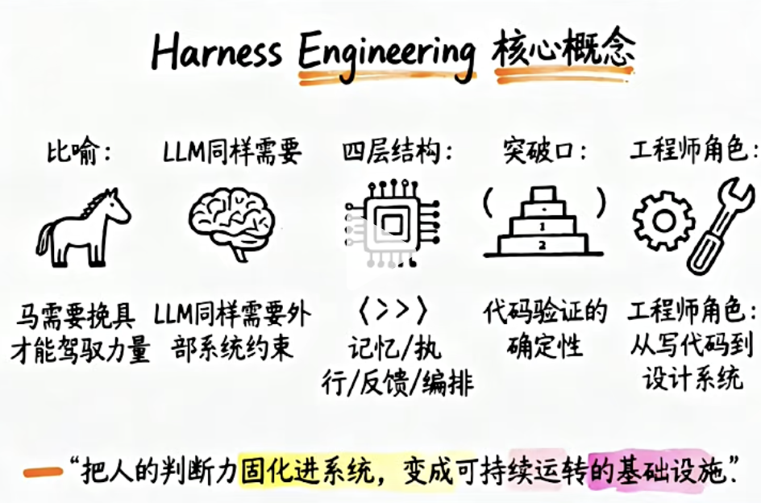
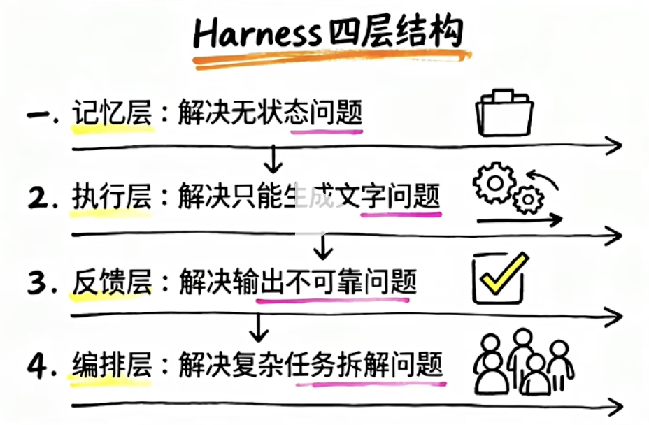
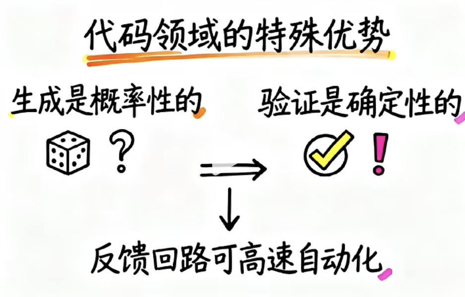

# Harness Engineering

想像你有一匹马，那马很有力量。真正让马变得有用， 需要啥？ 伯乐。 

这个年代， 我们要努力优秀， 成为自己的伯乐， 在AI浪潮打拼房子、车子、票子。

给马套上 挽具， 缰绳、马鞍等等， 这个统称是harness。

现在的Harness Engineering 这么火， 因为llm 也是一样， 模型很有能力，上知天文下知地理， 但是模型有能力，不代表 他能给出一个好的输出。

Harness 主要研究怎么在模型外面套一层好的这种像马一样的那个挽具。

让模型的能力可以稳定、重复的去驾驭。

而且Harness 不再是单单的去吧prompt 给它提升（RAG 就是提升prompt）, 

它更多呢， 是比Prompt 更大一个量级。

在了解Harness 之前， 先要了解 LLM 有哪些结构性的缺陷？

- stateless 无状态
  每次对话结束，它什么都不记得
- 无法主动操作外部世界， 只能生成文字
- 有上下文的限制， 不能无限制的去处理信息
deepseek-v4-flash 原生支持最高 1M（100万 Tokens） 的超长上下文处理能力
- 它的输出是概率性的
同样的输入，可能产生不同的输出。
无法事先保证，哪一次是对的，或更好

这些并不是bug, 而是模型自己基本的性质。

Harness 要做的， 就是在这些基本的性质上，建造一套系统，让模型可以完成原本无法去独立完成的任务。

打个比方：

模型是引擎， harness就是装着v8引擎的车。引擎在牛， 没有好的变速箱、没有刹车、没有仪表盘，这个车没办法上路。

## harness包含了哪几个结构？


harness 不是具体工具，而是围绕着这个模型 去构建的几类的基础设施的总称

核心有四层

- 记忆层

解决模型无状态的问题， 模型本身就不记得上一次对话说什么，也不知道你的项目有什么规范。那记忆层用文件系统去做这个。

把需要模型知道的东西， 给它写下来，结构化存储。

让模型每次工作， 都能检索到正确的背景信息。那在代码场景里面， 通常就是claude.md 或者Agents.md 他们是导航地图， 告诉agent 最关键的约束和这个规则。

## 案例
- add-demo 新建
- /init 
  - 自动定位项目根目录
    作用：自动向上检索，找到当前会话绑定的项目文件夹 add-demo，锁定工作目录，后续读写文件只会在该目录内，防止越界操作。
  - 加载或创建根目录 claude.md 配置
    作用：把上面 md 里的技术栈、目录、代码规则载入 AI 上下文，后续写代码强制遵守规则，不会自动用 TS、不会安装外部包、不会乱建文件夹。
  - 扫描当前项目现有文件
    当前只有 claude.md，识别为空项目，AI 判定需要从零新建入口文件。
    如果当前项目有其他文件， 则判断为非空项目，AI 判定不需要从零新建入口文件。 读取其他文件的内容， 作为上下文。
  - 初始化会话项目上下文
    ：本次对话全程绑定该项目配置，后续所有指令（写代码、改 bug、运行测试）都基于本次 init 的规则；不执行 /init，claude.md 不会生效。
    每次切换项目、修改了 claude.md 文件后，必须重新执行一次 /init，才能加载最新配置。

  在claude.md 里编写
  ```
  # 项目规则 - 极简Node加法工具
## 1. 技术栈
语言：Node.js 原生JS，仅内置模块，不许引入第三方npm包
## 2. 目录规范
入口文件：index.js，所有代码写在该文件，不拆分文件
## 3. 代码要求
1. 函数必须加单行注释，代码极简，拒绝冗余
2. 输出结果用console.log清晰打印
3. 必须提供调用示例
## 4. 输出约定
写完代码后，附带运行命令：node index.js
  ```

- 再执行/init ，才能加载最新配置。
- 发送业务需求，AI 根据 init 配置生成代码
```
写一个加法工具函数，支持两个数字相加，附带调用测试
```
自动在项目根目录生成 index.js，代码如下：

印证 init+claude.md 的约束效果
没有引入 npm 包（符合技术栈规则）
入口文件固定 index.js（目录规范生效）
函数带单行注释、自带调用案例（代码规则生效）
结尾附带运行命令（输出约定生效）

- 修改 claude.md，新增规则

```
新增减法函数，代码使用 ES6 箭头函数写法
```
- /init 
重载最新的 claude.md 配置，AI 读取到新增的箭头函数规则；如果不执行 init，AI 依旧沿用旧配置，不会遵守新规则。

- 发送需求：新增减法函数

```
新增减法函数
```
总结

claude.md = 项目的规矩手册，定义项目怎么写；
/init = 加载手册 + 绑定项目文件夹的启动指令，是让 md 规则生效的唯一入口；
流程固定：新建 claude.md → /init初始化 → 提需求生成代码；改 md → 重新/init → 新规则生效。

## 第二层， 执行层 

解决模型只能去生成文字的问题， 像Bash 执行、代码运行、浏览器的操控，API的调用

让模型从讲话，变成了真的我去做这个事情。

harness 提供了沙箱环境， 保证试错成本为0。

Agent在隔离的工作区里，可以大胆的去改动， 改坏了直接丢掉， 不影响主分支。

Agent 自主决策、 Tool Use 、 sandbox 

- 第三层  反馈层  解决输出不可靠问题

最核心部分 
有测试 \linter\CI 流水线

这些工具构成了对模型产出的确定性的验证机制。

模型生成代码， 测试立刻去跑一遍， 不通过， 就自动打回重式。

通过了才下一步。

反馈的速度， 从人工review的小时级， 缩短到了秒级， 测试工程师被干掉了。

代码有种特殊性质， 生成是有概率性的， 但是我们的验证是确定性的。

所以不需要模型每次都对， 只需要有足够好的验证手段就够了。

- 第四层 编排层， 主要解决的是复杂任务的拆解

  我们的大任务， 有可能不只交给一个模型去做，可能拆成几个并行的子任务。

  多个Agent 并行的子任务， 分工协作， 远超本次对话能力上限的工程任务。

总结：
Harness四个组成框架 记忆层、执行层、反馈层、编排层

## 为什么代码领域是突破口？

llm 在很多领域都有应用， 但harness 在代码场景发展最快、最系统的。

原因在于的就是一个不对称性。

原因： 

代码生成是概率性的， 但是验证是确定性的。

编译器不会放过一个错误。测试也不会放过一个错误， 假装通过。

这个反馈的回路， 在代码领域可以做到完全自动化。 

相比之下， 写一篇文章、做一个影视内容 好不好， 很难用机器去自动判断。
代码能不能通过100个测试用例 可以在30秒内就能给你一个答案。

所以，意味着，Agent在代码领域犯错了， 系统可以立刻去打回， Agent重试后，
系统可以再次验证 这种循环可以告诉的运转。不需要人盯着。

所以，在Harness时代， AI  infra 基础设施非常重要。 
比如配套的测试框架， 持续集成等

一个没有被约束的Agent， 会以机器速度， 重复同样的错误。

了解理论后， 我们在落地上，有反复被验证的设计模式。

## 测试demo 
npm init -y
pnpm install mocha chai --save-dev
Mocha：专门用来跑测试用例的组织者，负责把所有测试代码挨个执行、展示成败。
Chai：专门写判断语句的校验工具，用来判断代码运行结果对不对。


在项目根目录下新建一个 src 文件夹，并创建 math.js 文件。这里是我们需要测试的 add 函数：

在项目根目录下新建一个 test 文件夹，并创建 math.test.js 文件。
这里需要引入 chai 的 expect 断言风格（它读起来最像自然语言），并引入我们的 add 函数：

Mocha 默认会去 test 文件夹下寻找测试文件。我们需要在 package.json 中配置测试脚本。
打开 package.json，修改 scripts 部分：

