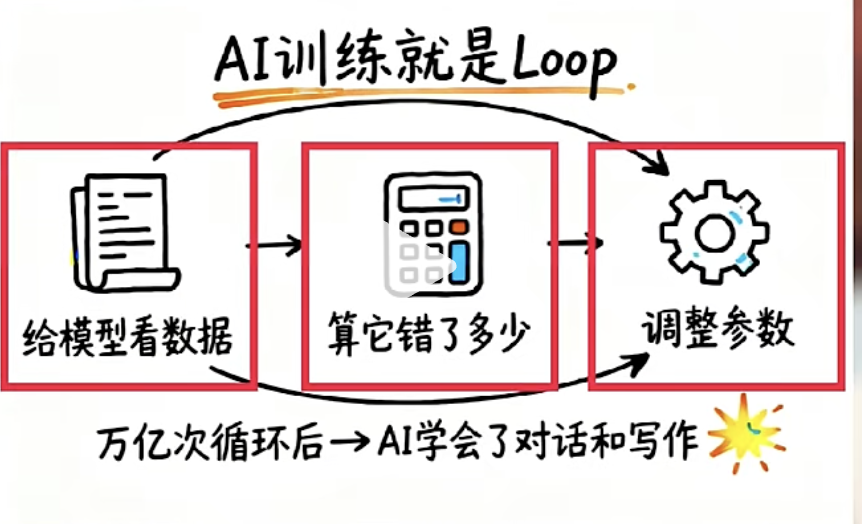
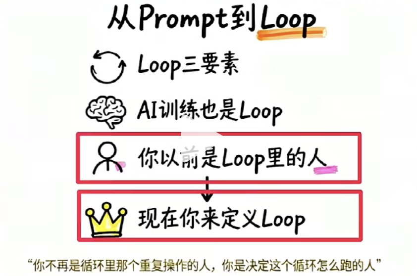

# 什么是Loop

一条推文迎来了700万人围观。
开源大佬发了一条推文，别再给AI 写Prompt了， 你应该去设计Loop。
Claude Code 设计者也说 我也不写prompt, 我也Loop。

## Loop 循环

计算机最底层的能力之一。

Loop 告诉计算机三件事。

从哪里开始， 重复做什么， 什么时候停。

一万行的数据，要逐行检查， 逐行改格式， 人工干可能要一周。计算机用一个Loop
跑完0.3秒。

却任何一条都会出问题， 尤其是第三条，缺他会永远的跑下去，知道崩溃，这个就叫
死循环。

我们现在用的所有AI都是Loop 跑出来的。

DeepSeek, Claude, Qwen

训练的底层都是同一个逻辑

那一批数据给模型看， 算它错了多少， 调整参数， 再来一轮。
万亿次循环后，AI就学会了对话和写作。

每天跟AI一问一答的过程，
写Prompt, 看结果， 不满意，再改， 再来

就是在手动的跑一个Loop。

我们是那个循环里去判断和决策的人。

你不打字， 他就停掉。

而现在，这个Loop 不需要你去当了。

你可以给AI 一个目标， 一套工具，一个判断标准，

让他自己去跑， 干完一步他自己去检查，没到位，
自己再来一轮。你也不用去盯着， 这就和自动化脚本
不一样啊。

脚本是写死的， 第一步第二步不会去变。

但这个Loop 里跑的是AI 模型， 它会看当前的情况， 去判断是否需要调整。

自己去决定下一步， 碰到意外， 他就会去换思路。

这件事， 真正考验人的地方来了。

你怎么定义什么叫做完了呢？

Loop跑出来的东西能不能用？

你让Ai 写一篇小红书文案

如果完成标准是写得好， Ai第一轮就会觉得自己写的好，停下来。

但如果你说标题必须包含数字，正文不超过300字，结尾
必须要有行动号召，写完自己再对着这三条检查。

他就会不断的去修改， 直到三条全部通过。

用Loop 用的最好的人， 不是Prompt 写的最长的人。

而是把模糊目标拆成可验证标准的人。

什么时候用？

这事得试好多次的时候， 比如说调一个海报，

改一个文案， 测试不同标题，重点明确， 但要多试

最适合交给Loop

当然，这可能会花费比较多的token, 

每跑一轮都在花钱， 它会一直重试， 团队4个月烧了

全年的预算， 就是Loop 跑飞了没人去管

认真用Loop 的人都会去加三个刹车。

![5.png]

- 最多跑多少轮

- 花多少钱强制停

- 连续两轮没变化自动停

## 总结

从头到尾， 就一件事情。 

你以前是Loop 里面的人， 

每一轮都得你去判断， 你来打字， 现在你可以退出去，

去定义那个Loop本身， 目标是什么， 工具有哪些

做到什么程度算完

工作没消失， 但你站的位置变了， 你不再是循环里面

那个重复操作的人， 你是决定这个循环怎么去
跑的人。

你需要像一个问题， 我每天跟AI 重复去做的
事情， 能不能变成一个 它自己就能跑的流程

想明白了， 你就从Prompt时代， 来到Loop 时代。

