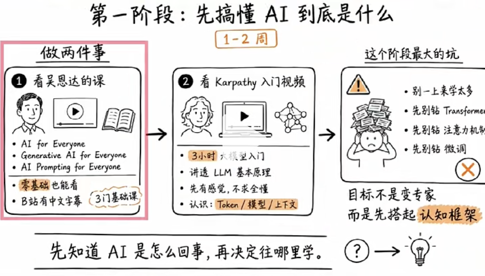
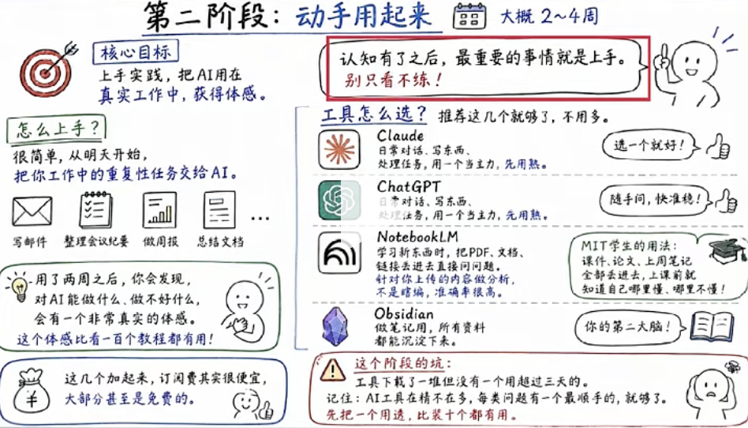
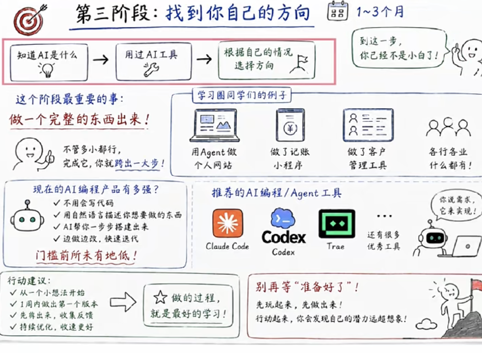

# 怎么学习AI

https://jishuzhan.net/article/1974665412307648513
## 先搞懂AI 到底是什么

- 吴恩达
  - AI for Everyone
  - Generative for Everyone
  - AI prompting for Everyone
- karpathy
  tesla, openai 
  - 大模型入门视频
  大模型底层原理讲透

Transformer、注意力机制、微调， 别急， 慢慢来

## 动手用起来

把日常重复性工作交给AI
- cc, codex
- notebookllm  学习新东西的时候
  Google 出品、只啃你上传文件的专属 AI 学霸笔记工具，不乱编答案，还能把文档做成双人 AI 播客解读。
- Obsidian 
  第二大脑

## 找到自己的方向

做一个完整的东西出来
用Agent 做网站、记账小程序、客户管理工具....

别再等， 边做边学

关注那些人:
晓辉博士  专业深度
42章经 
宝玉AI   Prompt Engineer
歸藏    产品设计师

## Intro to Large Language Models 大模型入门

###  分词 Tokenization
demo
一般情况下模型中 token 和字数的换算比例大致如下：

1 个英文字符 ≈ 0.3 个 token。
1 个中文字符 ≈ 0.6 个 token。
-  为什么必须分词
神经网络只能处理数字（向量、矩阵），看不懂中文、英文、字符(主要是由计算机的底层运行机制和模型训练的效率决定的。)，必须把文字转为一串数字离散符号 ID，这就是 Token。
- 原始文本 是高度非结构化的。
- Token ID 离散的整数
这些整数随后会被映射为高维的浮点数向量（Embeddings）。只有变成了向量，文本才能被输入到神经网络的矩阵乘法中进行计算。

咱们就拿英文句子：low low new wide 举例,对应 tiktoken 真实分词逻辑。
这个过程也叫Byte Pair Encoding 字节对编码

一 BPE 到底是干嘛的？
神经网络不认单词，只能认小片段。
BPE 就像打包快递：

1. 一开始只有最小的单个字母（最小包裹）；
2. 哪两个字母天天挨在一起出现，就把它们打包成一个大包裹； 
3. 打包次数越多，大包越多，同样一句话拆出来的包裹（token）数量就越少，AI 计算越快。
tiktoken 就是 OpenAI 做好的成品打包规则库，GPT 全系都在用这套打包方案。

二、手把手案例实操（原始文本：low low new wide）
初始状态：拆成单个字符（最细颗粒）
原始拆分：l, o, w, l, o, w, n, e, w, w, i, d, e
我们统计相邻字母对的频次：
lo、ow 出现次数最高，因为 low 反复出现。

第一轮合并：把高频 l+o 打包成新 token lo
现在片段变成：lo,w, lo,w, n,e,w, w,i,d,e

第二轮合并：高频 lo+w 打包成 low
现在直接出现完整大包 low，原本 3 个字母，现在1 个 token 搞定。
同理 ne、ew 高频，会逐步合并出 new、wide。

最终分词结果（tiktoken 真实效果）
整句最终 token：[low, low, new, wide]
短短 4 个 token，而如果按单个字母拆分，要十几个 token。

那么怎么打包就需要词汇表， tiktoken 用的 cl100k_base， 就是 10 万的词表

切出来 token 片段：low
词汇表：low → 数字 325
最终就得到数字 325。

byte pair 相邻的单词凑成一对。

demo2

比喻

- 文本 = 一堆食材
- 分词 切成大小合适的食材块（不大不小刚好下锅）
- 向量 = 把每一块食材的味道、软硬、品类，变成一组量化数据，方便厨师（大模型）加工计算。

https://p26-flow-imagex-sign.byteimg.com/labis/image/9d029aa14f40ce3785849294d2d248d8~tplv-a9rns2rl98-pc_smart_face_crop-v1:512:384.image?lk3s=8e244e95&rcl=2026062310383449E7D4DD5A3109C2D38B&rrcfp=cee388b0&x-expires=2097542331&x-signature=sDIX%2FbfjEouaekADxK0bBfWz3rg%3D