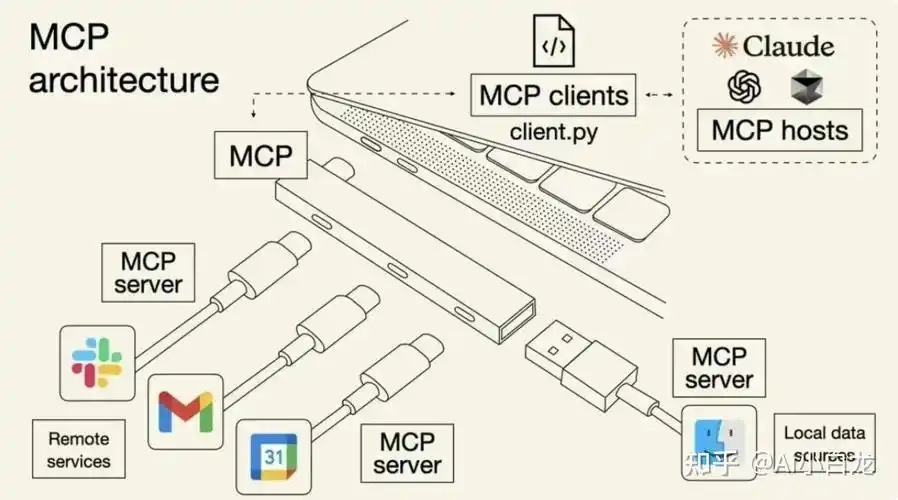

# MCP
最近介绍了上下文工程， 今天来聊聊非常火的 MCP（Model Context Protocol）协议。



MCP 就是 Anthropic 于 2024 年 11 月 25 日 推出的 AI 界通用 USB-C 接口协议。电脑端是 MCP 客户端 client（Cursor, Trae），对接 Claude、OpenAI 等各大模型宿主(host)。各类网盘、远程服务、邮件服务、本地文件都能做成 MCP 服务端（Server），一根标准接口即插即用，不用为不同模型单独写对接代码，能轻松把各类数据工具标准化接入大模型上下文。为 Context Engineering 提供标准化的底层通信底座，彻底终结过往 RAG、函数调用零散适配的乱象。

我们可以把它比作 USB-C 比较通用的数据线接口, 能够实现任意 MCP 服务端与客户端的自由互联。依托这套统一标准，大模型可调用的上下文来源得到极大扩充，各类外部数据与工具的接入调用也变得高效便捷。

## 三部分
- MCP Host
  就是那个跑着大模型的“大管家”，它负责统筹全局、拍板决策，并把各种外部工具连接起来给大模型用。
  cursor/claude code.
- MCP Client
  中间人传话员，一边连MCP host，一边连外部工具，负责两边消息传递。
- MCP Server
  各式各样的外接工具（文件、网盘、邮箱），乖乖待命，接到指令就提供对应数据。
  类似 Web Server , 专门面向 AI 客户端，只管接收指令、干活、回传结果。

MCP Host是老板， 思考决策， MCP client 是秘书， 包揽所有对接脏活累活， MCP Server 是外面的仓库、供应商、文件柜（各种上下文数据）。

## 案例
- npm install -g @modelcontextprotocol/server-filesystem
@modelcontextprotocol/server-filesystem 是 MCP 官方文件系统服务端，用于通过 MCP 协议安全读写本地指定目录文件，为 AI 模型提供合规的本地文件访问能力。

- npx @modelcontextprotocol/server-filesystem D:/mcp-test
启动服务，允许读取【D:/mcp-test】这个文件夹（改成你自己的文件夹路径）
npx 是 npm 自带的命令工具，可直接远程调用执行 npm 包，无需本地提前安装。
本地已安装对应包时，npx 会优先调用项目本地 node_modules/.bin 里的版本，找不到才去拉取远程包执行。
- 根目录添加 .mcp.json 文件
项目级别MCP配置  
- test.js   var i = 1;
- 帮我读取test.js ,并且改成es6 风格

全局安装 的@modelcontextprotocol/server-filesystem 是MCP Server
负责执行文件读写、目录浏览的实际操作

### trae 中使用 MCP 
 首选项， 设置 MCP Server

```
{
  "mcpServers": {
    "filesystem": {
      "command": "npx",
      "args": [
        "-y",
        "@modelcontextprotocol/server-filesystem",
        "/Users/shunwuyu/workspace/lesson/ai_lesson/ai/yao/mcp"
      ]
    }
  }
}
```
讲讲工具
- 帮我使用 filesystem mcp 读取 test.js 并返回代码

MCP 不单单只是便利， 而是从根本上重构了AI 的整个应用架构，真正把AI， 从 chatbot 推进到了 Agentic AI（智能体AI） 这个阶段。


## MCP 是什么

- 它不是一个工具，不是一个应用， 不是一个api sdk, 也不是一个产品， 而是一个协议。它的目标是希望任何一个AI的模型， gpt/claude 能以统一的方式去访问资源和工具。

http 是网页和服务器·的通信协议， 而mcp呢 就是模型和外部世界的一个通信协议。

模型需要交互什么呢？

任何你希望模型知道、能用、能调的内容。 （资源和工具。）

### 资源
数据库， API, 文件， Saas（高德地图、飞书）
mcp接入 高德地图 可以 获得 地图数据、
接入 飞书 可以获得会议数据

### Tool
创建日历、发邮件、执行命令、远程控制、

这些资源和工具就是让大模型变得真正有用的上下文和能力。

## 为什么需要MCP 

过去我们经历了三个阶段

第一个阶段就是AI模型单独使用的阶段， 最初 gpt/claude 本质就是基于海量数据训练的下一个词的预测器。 next-token prediction 
拿到用户的输入， 一个词一个词最大概率的方式去 给到用户输出 
他们确实很聪明， 但也经常会胡说八道（幻觉）

因为他们是孤立存在的， 没有接受任何的外部信息。

进化到第二个阶段， 就是上下文工输入给大模型。
比如现在使用的豆包， 就有联网等各种 选项，这就在添加各种上下文。

AI 编程模型CURsor/claude code 相当于 模型 + 我的代码
Gemini呢 相当于 模型 + google  日历文档邮箱
他们不再是一个chatbog,  他们集成了各种的工具和信息。

这就是AI 可是提供很炫酷的服务和产品原因。 比如千问点奶茶

在这个context engineering 阶段， 你需要去调用api, 去调用数据， 去更新文件，情况就变了。 相当于碰到了一个N*M 的大规模集成问题。

比如你有n 个AI 应用， 有m 个外部的服务。 就会有n*m 个链接，

每个链接都需要去定制代码， 去写特定性的服务， 去处理权限， 去管理格式，保证足够的兼容性， 最终呢就会导致这个系统非常的复杂， 千问点奶茶宕机， 我还没喝上。 

极难去维护， 去规模化。 

相当于你抽屉里装满了各种各样的充电器， type c \ 以前苹果的， 安卓的， 混乱不堪， 我们迎来了第三阶段 MCP

- MCP 提供了一个统一的协议， 只要你实现了 MCP， 你就可以即插即用的连接AI和整个世界。 

## MCP是怎么工作的？

可以理解为一条标准化的数据和能力的一个调用通路。

用户输入prompt->Mcp host(cc) -> MCP client(某个实例) -> MCP Server（本地/远程） -> 资源/工具

MCP client 相当于 AI应用  cc, trae, bot, agent
它会把用户的prompt 优化为明确意图， 告诉系统， 我想做一件事， 我要去发邮件、我要去写一个数据库， 我要去写一段代码。 这些请求会发送给mcp server , 

一个Gmail server 可以发送邮件 
一个 Calendar server 可以创建日历事件
一个 github server 可以执行代码审查

他们实现了统一的协议， 去和mcp client 通信。 

比如一个更实际的例子

请帮我约张老师下周二喝咖啡， 并发一个邮件给他提醒。 
这个请求包含两个目标， 第一个是找到我和张老师在周二都空闲的时间， 
第二个是创建一个日程提醒并发送通知。

AI应用作为一个MCP client 会先向系统中已经注册的 MCP Server 去查询它的能力列表， 比如是不是可以访问日历？ 是不是有权限去发邮件， 是不是能够获取到联系人的信息。 这些能力的申明和用户的请求一并发给大语言模型去处理。 模型基于给定的上下文去判断我应该怎么去整合现在的工具， 去完成我打到的任务。 

它决策， 第一步从calendar server里面找到 我和张老师可用的一段时间 ， 第二部决定最终的会议时间， 第三部调用email server 去发送邮件 第四步提问用户， 我是不是该确定一个会议地点？整个流程非常的标准清晰， 逻辑也是闭环的。 关键是， 你不需要为每个流程写死一个逻辑， 模型也不需要去提前训练才知道每个api, 
模型能动态的发现、调用、执行

以下特性

- plugin 插件机制
- Discover 发现
- Compass 可组合型

可以把每个MCP Server 理解成一个功能模块，像拼积木一样去接近系统。 

你要去构建AI应用时， 你只需要去注册你所需要的MCP Server , 模型能立刻接入
这些能力， 就像插入了一个插件， 获得一个新的技能。 你只需要告诉llm , 这里有一组工具和资源

MCP它不仅仅是一个方便的工具接入接口， 它是一个全新的协议标准， 正在重构AI和世界的交互方式。 让我们从使用AI, 迈向AI 使用的系统， 从知识单纯的生成文字，生成图像， 转化成一个调度生成， 

有了mcp, 你也不用担心AI 怎么去接，怎么去做， 怎么去集成， 你只需要去清晰表达， 你想要让AI 去完成什么任务。 其余的AI就能自己去搞定。 这个正是我们希望AI Agent  的核心本质， 也是它带来的深度变革。 

/Users/shunwuyu/workspace/lesson/ai_lesson/ai/yao/mcp/mcp-test