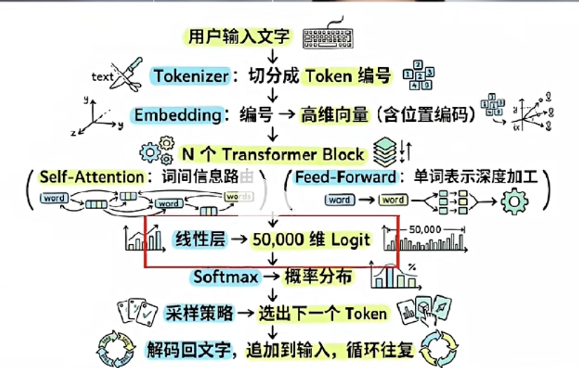

# llm 怎么预测下一个词

- 走进模型内部， 看看模型拿到token 后怎么去处理的， 经历了什么，才会去做下一个词的预测。

## Token 词元
词元?
大模型处理的最小文本单元不一定是完整的“词”，可能是子词、字符甚至标点，用“词元”能更精准地表达它是模型计算和计费的通用最小处理单位，而非语言学意义上的词。

unhappiness 大模型通常不会把它当成一个完整的词，而是会拆成三个子词（Subword）： un happi  ness

tokenization
token + ization

为什么要这么切？

因为如果只认完整的词，模型需要记住几十万个英文单词和几百万个中文词汇，计算量太大了。把词切成“子词”，模型只需要掌握几万个基础“积木”（词元），就能像拼乐高一样，灵活组合出任何它没见过的生僻词或新词。

比如 happi + ness 就可以组成 happiness
goodness = good + ness 

中文  “我爱人工智能，自然语言处理很有趣”
词语 Token：
[我, 爱, 人工智能, ，, 自然语言处理, 很, 有趣]
Token 数量：7

- 把词元理解为llm 的货币
发一段文字给llm 比如：你
llm 只会做一件事， 预测下一个词
你->llm-> 好
假设你给定的输入是：
中国的首都是->llm->北京 概率92% 北平 4% 长安 2% 
llm其实不是去理解“中国的首都”（全程只是计算词的接续概率，不是思考得出答案），它是基于“中国的首都”前面的输入，给出我后面这些词汇表里面每一个词的概率。 通过这一系列的概率的词汇表找出概率最高的这个词，追加到输出中，那就是北京。
后面再接什么呢？ 会是逗号。
然后再循环的以此预测， 这就叫自回归生成。（Recursive Generation）
预测一个词，下一个词， 下下一个词

coding, translation, 推理， 都是基于词元的预测涌现出来的。
理解这点， 就能理解llm的基础。


## 模型的内部拆解
一个Token 到底是怎么一步一步从llm 里预测出来的， 剖析一下， 把模型的内部拆解出来看一看。

- 第一步 把编号变成一个坐标
比如说一个词“你”进入模型的时候，会转成一个数字编号
你->llm->token id(57668)  demo

好 token id (53901)
token ID 本身不携带任何意义
你不能通过这两个编号的加减法，你和好之间到底距离有多远？
你推出下一个token 是好， 那就是他们之间距离比较近?
这个概念叫**语义距离**

llm 做的第一件事情就是把编号查表这个事情转成一个高维的向量， 这个叫做embedding的过程

模型内部有一个巨大的“向量查找表”（Embedding Matrix）

模型拿到 Token ID（57668）后，就会直接去第 57668 号柜子里，把对应的向量“抽”出来。

向量可以理解成一个多维空间里的一个坐标
语义相近的词， 他们的向量距离就比较近
看图
举个例子：
国王 和 王后 这两个点的距离 接近
和苹果的距离更远一点，
空间是有方向的
国王-男性的向量 + 女性向量 非常接近 王后的点
这就是向量运算了。

模型的训练就会构建这样的几何结构或者空间坐标系。

光有语义的理解还不够， 
接着再理解一个案例
“我咬了狗”
“狗咬了我”
虽然词都是想同的4个字， 但顺序不一样， 他们表达的意思就是不一样的。
能想到什么?
既然这个embedding, 不携带位置信息（顺序）， 我们就给每个向量叠加一个
叫位置编码的东西（Position Encoding PE）, 告诉llm, 这个词属于句子里的第几个。

那么现在，每个token 就会携带两类信息：它是什么（语义信息）， 位置（位置编码）在哪里。

当每个词有了语义信息，和位置信息以后，下一个问题

模型怎么理解上下文？它毕竟不能只光靠这个词的向量。

举例

The animal didn't cross the street, because it was too tired.

这里的it 指的是animal呢， 还是street? 

我们一眼就能看出来， it 指的是animal。
但llm 怎么做呢？llm引用的机制叫self-attention （自注意力）

Google大神的《Attention is All You Need》搞出了 Transformer 结构，从此拉开了大模型挨个猜字续写的序幕，像 GPT 这类顺着往下生成文字的模型，全都是靠它打底做出来的。

self-attention 是怎么做到理解上下文的？

让每一个词去“询问”其他词， 找到跟自己关系最密切的那个。

每一个token, 进入了注意力层的时候， 会生成Q K V 三个向量
Q Query 我在找什么
K Key 我能提供什么
V Value 如果我被选中， 我能贡献什么内容

那么就是把it 的 这个query向量 和句子里每一个词的key向量做一个这样的点积，得到一组注意力分数，分数越高， 就说明两个词相关性就越强。

然后再经过 softmax 的一个归一化， 当成一个权重， 用这些权重再乘以value向量， 再做加权的求和， it 的向量被更新了， 不再只代表it 本身， 而是混入了"animal"的信息。 这就是代词和它所指代关系被关联起来的方式。

以句子：animal it 两个 Token，一步步拆解自注意力计算：
1. 生成三套向量（Q/K/V）
两个词各自通过线性层，分别算出专属的 Query (Q)、Key (K)、Value (V)

token1：animal → (Q_1、K_1、V_1)
token2：it → (Q_2、K_2、V_2)

我们要更新的是 it(Q_2) 的特征。

- 步骤 2：it 的 Query，和全部 Key 做点积算相似度
拿 it 的 \(Q_2\)，分别和 \(K_1(animal)、K_2(it)\) 点积，得到原始分数：
score1 = \(Q_2·K_1\)（it 和 animal 的相关分）
score2 = \(Q_2·K_2\)（it 和自身的相关分）
因为指代关系，score1 数值远大于 score2。

步骤 3：Softmax 归一化，转为权重把两个分数送入 softmax，得到总和为 1 的权重：\(w_1、w_2\)
此时 \(w_1\)（animal 权重）远大于 \(w_2\)（it 自身权重）。

步骤 4：权重 × 对应位置的 Value 向量，加权求和权重必须一一匹配对应 token 的 Value：
最终 it 新向量 = \(w_1 × V_1(animal的value) + w_2 × V_2(it的value)\)最终结果
因为 \(w_1\) 权重更高，求和后的新向量，主要融合了 animal 的 Value 信息，实现代词指代绑定。

模型事实上会运行很多组的QKV, 叫多头注意力， Multi Head Attention

          Multi Head Attention
  attention1  attention2  attention3  attention4

有很多attention的头， 每组头它是独立计算的， 
为什么需要这么多的头呢？
不同当注意力头去关注不同的信息。

有的捕捉语法的依赖，
有的捕捉语义的关联
有的是指代关系
把各个组拼接起来，得到的就是更加丰富的上下文表示。

self - attention 解决了词和词之间交流的问题。
每个词自身的信息还需要加工。

一词多义：“苹果” 原始向量分不清水果 / 品牌，线性加工出 QKV 后，能根据上下文（吃苹果 / 苹果手机）锁定对应词义。
语序区分：“猫追狗” 和 “狗追猫” 原始向量相似度高，加工后的向量可以配合注意力，分清谁是主体、谁是客体。

紧跟着self-attention 后面的就是FFN , 一个前馈的神经网络。它不处理词和词之间的关系，而是对每个token 的向量做独立的非线性变换。那相当于让模型在这一步去消化刚才吸收的上下文。提炼出更加有用的表示。

self-attention 负责在词之间找到他们的路由信息。
前馈层FFN 负责的是对每个词的表示做一个深度加工。
这两层合在一起， 就叫做transformer 的一个block。

大模型会有很多的transformer block。他们会堆叠在一起，会对个几十个，或上百个。
用画油画做比喻
第一层 Transformer：打底铺色块，只勾勒每个单词基础词义，如同油画起稿打轮廓。
中层堆叠区块：逐层调色融合邻近色块，对应注意力拉近邻近词语，理清短句搭配。
几十层堆叠完成：反复晕染全局色彩、光影关系，远距离词语逻辑全部联动，最终画出完整语义画面。

每一层都在上一层的基础上做一个继续提炼， 不断改变预测质量。



## 线性层（Linear Layer）—— 把向量变回“人话”

经过几十上百层 Transformer Block 的加工，最后一个词的向量已经是一锅浓缩高汤了——语义、语法、上下文关系全炖在里面。

但问题来了：这个向量是个4096维或者8192维的浮点数数组，人类看不懂，更没法用。我们想要的是一个具体的词。

这就要用到**线性层**，也叫输出投影层（Output Projection）。

打个比方：

模型内部一直用高维向量说话——就像一个人全程用摩斯密码在思考。现在他要开口跟外面的人说话了，得把密码翻译成人类语言。线性层就是这个“翻译官”。

它的工作很简单：拿着这个浓缩向量，和一个巨大的矩阵做一次乘法。

这个矩阵有多大？ 假设词表有5万个词，向量的维度是4096，那这个矩阵就是 4096 × 50000。

矩阵乘完之后，得到一个长度为 50000 的数组——**每个位置对应词表里的一个词**。

这就是 **Logits**。

## Logits —— 还没归一化的“原始信心分”

Logits 翻译成“对数几率”，听起来很吓人，其实就是**原始分数**，还没经过任何处理。

比如输入“中国的首都是”，最后一层的 Logits 长这样：

```
北京:  9.2
北平:  3.1
长安:  1.8
上海:  0.3
苹果: -2.4
```

数字越大，表示模型越“看好”这个词。注意这里还可能有负数——Logits 是未归一化的，正负、大小都没被约束过。

你可以把 Logits 理解为：**模型在交卷之前打的草稿分**。每个词都有一个分数，但还没换算成百分比。

## Softmax —— 把草稿分变成概率

Softmax 就是一个"强行端水大师"——把一堆高低不平的原始分全部挤──
   0 到 1 之间，还保证所有人加起来刚好等于                      
  1，高的更高、低的更低，谁也不许出格。

有了原始分，下一步就是把它变成概率。这用的是 **Softmax** 函数。

它的核心思路就两步：

1. **把分数全部拉正**：对每个分数做 e 的指数运算。负分变小数，正分变放大。
2. **归一化**：让所有词的分数加起来等于 1（100%）。

还是上面的例子，经过 Softmax：

```
Logits              →  概率
北京:  9.2          →  92%
北平:  3.1          →   4%
长安:  1.8          →   2%
上海:  0.3          →   0.2%
苹果: -2.4          →   0.001%
...（其余49995个词瓜分剩下的 1.7%）
```

到这里，模型终于交出了答案：**下一个词是“北京”，置信度 92%**。


## 整条流水线回顾

把整个过程串起来，一个 Token 走完全程是：

```
"中国的首都是"
  ↓ Tokenizer（分词器）
[中国, 的, 首都, 是] → token ID: [1234, 567, 8901, 234]
  ↓ Embedding（查表）+ Position Encoding（位置编码）
高维向量 + 位置信息
  ↓ Transformer Block × N（几十到上百层）
Self-Attention（词互相交流）→ FFN（各自加工）→ 下一层 → ...
  ↓ 最后一个词的向量
浓缩了全部上下文的 4096 维向量
  ↓ Linear Layer（线性层）
Logits = 50000 个原始分数
  ↓ Softmax
概率分布：北京 92%、北平 4%、长安 2% ...
选出“北京”，追加到输出串里
  ↓
"北京" → 加上之前的输入，变成 "中国的首都是北京"，再从头来一遍，
预测下一个词 → "。" → 再下一个词 ...
```

这就是自回归生成的全貌。没有什么魔法，就是一堆矩阵乘法 + 注意力机制 + Softmax，循环往复，一个字一个字往外吐。

