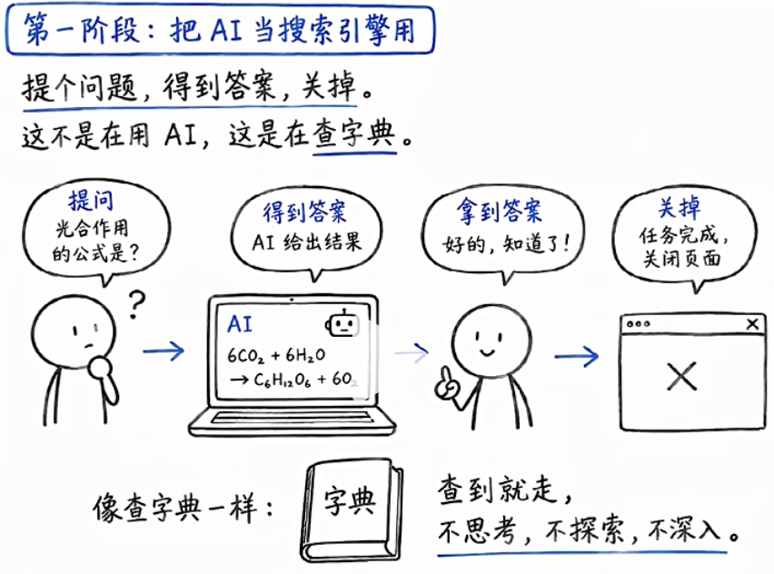
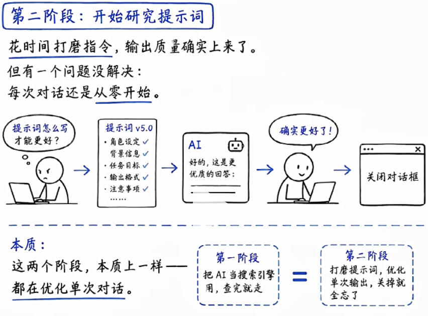
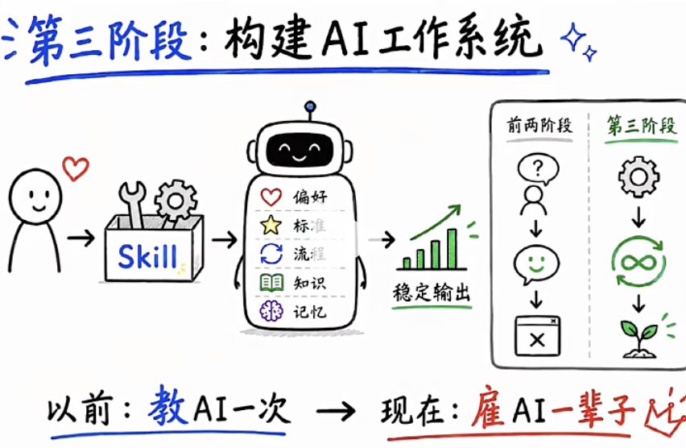
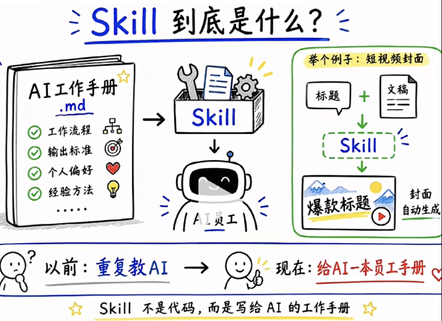
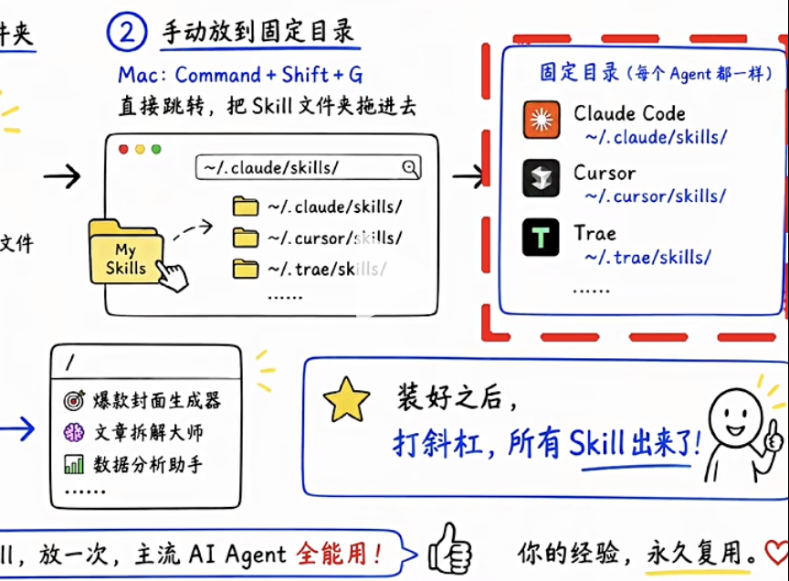

# Skill 技能 0 基础

2026年用AI的人分成了两批。 

- 第一批人每次打开对话框， 第一句话还在解释，我是在做什么的，风格是这样，这次要做什么。（Prompt）

- 第二批人打开就能干活了， AI知道它是谁， 按他的方式工作(记忆， skills)。

差距不是在模型, 不是在提示词， 而是在skill。

## Skill 
是什么， 去哪找， 怎么装？装哪些。 

## 用AI 的三个阶段

- 把Ai当搜索引擎
  你提个问题， 得到答案， 然后关掉。
  这不是在用AI, 而是在查字典。

- 开始研究提示词

花时间打磨指令， 输出质量确实上来了。
但是每次对话都是从0开始， 你花10分钟调教好的AI,关掉对话框就全忘了。

所以这两个阶段，本质都一样， 都在优化单个对话。
所以， 来到第三阶段

- 去构建AI的工作系统

不再去优化每次对话， 而是让AI永久的去记住你的工作方式。
你的偏好，你的标准，流程， 全部都封装进去。
打开就能用， 不用在重新解释了。 

你不再是AI的用户， 你是AI的雇主， 而SKILLs 就是进入第三阶段的 一个工具。

## skill到底是什么？

它其实就是一个md的文件，里面全是自然语言写的指令， 就
好像一本“AI 工作手册”。你把你的工作方式写进去， 装进
claude, 他就按手册来。

如果你去阿里上班， 你会收到一份阿里巴巴前端规约|阿里巴巴 Java 开发手册

里面有代码规范、工程配套手册等。
你把它们写进skill, 就可以在用AI的时候， 直接按手册来。

再举个例子

如果戴总许下诺言， 要成为东里第一个大模型开发工程师，用短视屏记录自己的成长。

短视屏封面设计这件事， 每次都要去找素材、选字体、调配色， 如果封装成了
一个skill, 输入标题和文稿， 2分钟自动的出封面。

封装一次， 以后每次调用就可以了。 

## 怎么找到合适的skill？
- skills.pub 300多个经过筛选的。
- skills.sh 看数据， 24小时安装量， 历史总量， 1小时趋势
想知道大家都在用什么

## 如何安装？

- 把链接丢给AI， 告诉claude 帮我安装这个。
  
  Agent Reach 
  
  youtube 小红书， twitter, 公众号， 一句话去跨平台搜素材。还能直接去
  拉视频字幕。

  给你的 AI Agent 一键装上互联网能力

  找素材这件事， 基本不用手动了。

  帮我安装 Agent Reach：https://raw.githubusercontent.com/Panniantong/agent-reach/main/docs/install.md

  帮我识别https://weixin.qq.com/sph/AvuhdD3M96 返回字幕文案

- npx 命令
  github 上大部分skill 都是npx 命令。
  npx skills add https://github.com/garrytan/gstack --skill office-hours

  office-hours 是gstack 里 YC 导师式前置思考技能，做任何事情前通过 6 轮深度提问拆解验证你的产品想法，把握好目标，边界，成功标准，从源头避免无效开发或工作。

  启动新的任务， 第一件事就跑它，返工率特别低。

  YC（Y Combinator）是全球顶级硅谷早期创业加速器，以小额种子资金 + 3 个月高强度导师辅导批量孵化初创团队，输出海量行业巨头

  Airbnb、OpenAI、Stripe、Reddit

- 手动去把他放到文件夹里。
  每个AI Agent 都有一个固定目录， 
  
  打一个/ 所有的skill 都能出来

## 常用的

- 做产品， 写代码的 superpowers
20 万star, anthropic 官方收录的
14个skill 的套件， 给AI 编程装一套工作规范。可以把它想像成一个严格的监工，动手之前先把方案写出来， 确认没问题， 才开始写代码。

- frontend slides
ppt skills  张咋啦做的， 小红书发补贴2.4万赞
核心逻辑 先看后选， 先生成3个风格预览， 确认了， 再跑完整个内容。 

https://github.com/zarazhangrui/frontend-slides