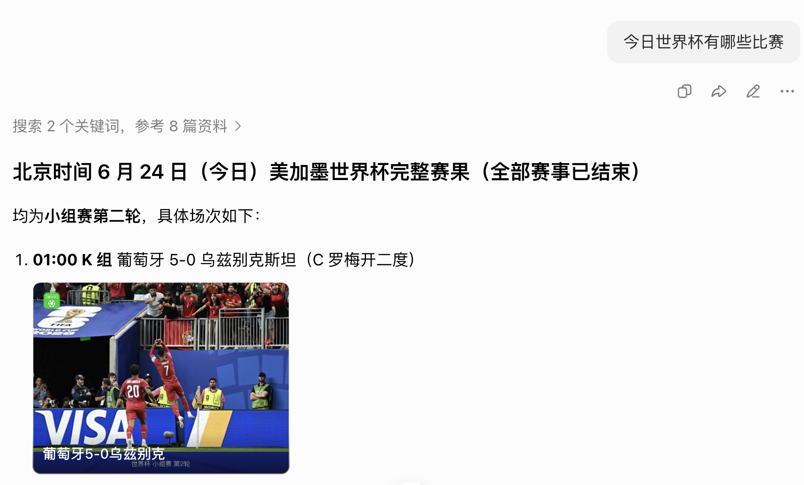

# Tool Use
工具调用， 背后真正的技术逻辑。

- 豆包可以自动的搜索网页 
- claude 可以分析excel 表格 
- AI Agent 操作电脑的时候 

然道AI 有了某种的自我意识？但作为一名开发者，就会知道，这是一个精心设计的错觉（演戏不是真的打， 搂着的不是真的夫妻）。
那个在显卡里疯狂跑的LLM, 本质上还是个词语接龙的游戏。 它是被困在服务器里的缸中之脑。它看不见屏幕， 摸不到键盘。所以问题来了，一个只能去预测下一个词的概率模型，Next Token prediction 是怎么突破物理限制，它是怎么去调用API,怎么去读取数据库，怎么去操作物理世界的工具的？

## Tool Use
- 认知植入
工具降维为语言
一切起点就发生在按下了回车键之前，当你在system prompt里配置工具的时候，
其实你是在做一个非常巧妙的事情， 就是认知植入。
我们需要理解一个根本性的限制， 大语言模型根本就不懂什么是天气API, 他也不懂什么是数据库查询，它只懂一个东西叫做语言。
开发者做了什么， 通过 JSON schema ,把一个复杂的软件接口，翻译成了大语言模型
能够去理解的使用说明书。
比如你有一个查询天气的API,  get_weather
传统编程里会去定义好参数、city  这样的一个函数调用
对AI 来说， 这个其实根本就毫无意义。开发者会给他转成这样的一个描述

也就是在system prompt 里会这么写
我这里有个工具叫get_weather, 它的作用呢 是去查天气，他需要一个参数城市，它是字符串类型。这就好像你对AI说， 我这里有个特殊的咒语，当你需要去知道天气的时候， 你不要自己瞎猜， 而是把这个咒语呢， 严格按照JSON schema 形式给它写出来， 

所以在这个阶段， 一个复杂的软件工具， 也就是get_weather 这个API, 他被降维成了一个纯粹的文本描述。
对AI来说，这样的工具跟写一首诗没啥区别。
就是把原始的api 生成一个文本， 拿到文本后， 接着第二层。

- 意图识别
API 转成语言的精确性。
比如用户问， 上海的天气怎么样？
llm 的推理引擎开始工作，它会进行一系列的快速评估。
首先，根据原始训练语料里的知识， 我能够去回答明天的天气吗？好像不能回答。
接着绕回来， 我的知识有截止日期， 我的system prompt 会有可用的工具吗？
它真的有， get_weather 这个函数。 那神器的一幕就开始了。
AI 会停止和你的对话， 转而开始自言自语， 它严格按照我们刚刚定义的那套使用说明书哈，去生成一段非常完美的生成代码。
Tool: get_weather
params city 上海
它凭借强大的模式识别和逻辑推理能力， 去虚构出一个在语法上完全正确的请求。
它赌这段代码发出后， 会有人去响应。
第三层 runtime的介入
你的应用程序的运行时， 你的node/python脚本 捕捉到了AI 输出的那段JSON, 
这个程序并不关心这段代码是AI写的， 还是人类写的， 他只管一键事情， 执行。

http 请求 -> 服务器响应 -》 返回天气， 这是确定的， 没有任何概率成分，没有任何的幻觉风险，是经典的软件工程

runtime拿到天气的返回以后， 它不是直接把数据展示给用户， 而是把这个查询结果， 再次伪装成一段对话，塞给AI 的一个上下文里， 就好像对AI说， 你刚才要查的天气数据回来了，现在你可以假装是自己查到的， 然后用自然语言去回答用户。
所以对话历史就变成了， 用户问 明天上海的天气怎么样？Ai内部去调用工具get_weather, 然后系统就拿到工具返回的结果，可能是温度15度，晴天，AI 
拿着这个结果去做一个整合， 然后它会回复根据查询， 上海的天气晴朗，温度15度。建议你多穿衣服。
在用户眼里， 这就是一个流畅对话， 在技术视角， 这就是概率模型和确定性程序的一个完美协作。
- 第四层， ReAct 闭环
真正让Ai 从工具人到智能体。
如果只是查个天气， 我们叫函数调用。
Tool Use 的真正威力在于 Resoning + Acting。
推理加上执行。
然后循环往复。
想像一个更复杂场景， 比如我们去分析
苹果、微软、Google, 三家公司最新的财报数据， 找出营收增长最高的业务线。
生成一个对比图标。
这个时候， AI就会陷入一个多轮循环
第一轮它会思考， 需要的是商家的一个财报数据
然后它再行动， 那可能就是去调用搜索工具，查找最新的财报数据
第三步， 观察 runtime 返回三篇财报 PDF的一个·链接
得到这个PDF 后， 进行第二轮的思考观察
拿到pdf 后， 需要提取PDF里的文字， 他就会调用文档解析工具，去读取PDF 里的内容。第三步它再去观察， 你让runtime去返回解析后的文本数据。
第二轮结束
拿到文本数据后， 进入第三轮的思考、观察、行动循环
第三轮思考， 数据太多太乱了， 可以调用python 代码去做一个执行，清洗、
观察runtime 去运行的代码， 并返回计算结果
拿到计算结果， 进行第四轮的思考行动观察。
有了这个数据后， 就需要去生成图表了。
然后再去调用数据可视化的一个工具，最后拿到图表。

尽力了一轮， 两轮， 三轮， 四轮的思考到行动到观察的一个流程
最终拿到了图标文件， 然后AI 的最终输出就变成 谷歌云计算的增长率是最高的，达到了28%， 还有详细的对比图， 所以在这个过程里， LLM 变成CPU, 它是负责调度和决策的， Context Window 就变成内存， Tool Use 就变成一个总线， 链接各个功能的模块。
那么， AI正在从chat bot 进化成agent 

Tool Use 让我们看到了人机共存的一个雏形， AI负责去理解、规划、决策
程序去负责执行、验证、反馈，它也带来前所未有的一个挑战。

那如果AI决定调用 删除数据库的工具怎么办？如果它陷入死循环，无限的去调用工具，
消耗资源怎么办， 如果它被恶意的Prompt 诱导，调用危险的系统命令时候，该怎么办？
工具的权限控制、调用次数限制， 像沙盒隔离，像人类审批机制， 我们正在见证一个新的计算范式的诞生
