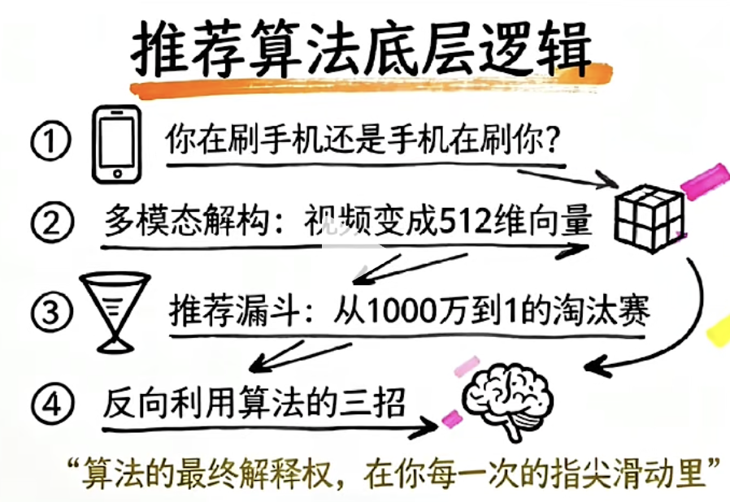

https://juejin.cn/post/6899267681959018510?searchId=20241210093022910079EC734E10C1EC1C#heading-7

- 为何考？
  - 理解数据结构
    平面列表和树状结构是常见的数据表示形式。
    面试官想要测试你对树形结构的理解，尤其是如何通过具有层级关系的数据构建树形结构。
  - 递归与循环的应用：
    将列表转换为树形结构通常需要递归或循环操作来处理每个节点的父子关系。面试官会看你是否能正确处理父子节点之间的关系，以及你是否能有效地使用递归（或者通过栈模拟递归）来构建树形结构。 2.js

    这个解法通过哈希表（map）将每个节点存储为对象，利用 parentId 构建父子关系，避免递归，直接在两次遍历中建立树形结构，确保高效地将每个节点插入到正确的位置。

  - 性能和效率：
    面试官可能关注你如何处理数据的遍历，如何提高性能，尤其是对于大数据量时。你需要考虑时间复杂度和空间复杂度（如O(n)的复杂度）来优化解决方案。
  - 数据的完整性和处理边界情况：
    处理节点的父子关系时，可能会有一些特殊情况，比如某些节点没有父节点，或者某些节点是孤立的，面试官可能想看看你是否能考虑到这些边界条件，并能编写鲁棒的代码。
  - 代码简洁性和可读性：
    
- 上列表 
  列表是一种有序的元素集合，允许重复元素，并可以通过索引访问每个元素。
- 与数组有何区别？
  列表通常指的是可以包含不同类型元素的有序集合，而数组是固定大小、类型一致的元素集合，通常用于高效存储和访问数据。

- 列表特点
  - 列表结构通常是在节点信息中给定了父级元素的id， 然后通过这个依赖关系将列表转换为树形结构
  
- 如何转？
  所有非根节点放到对应父节点的chilren数组中，然后把根节点提取出来


- 递归解法 
  - 大问题是如何将一个平面的节点列表转换为树形结构
  - 相似的小问题
    如何找出当前 parentId 对应的所有子节点，并将这些子节点组成 children 数组？
  - 退出条件 filter 为空时 

- 时间复杂度
  - 递归解法的时间复杂度通常是 O(n^2)，因为每一层递归都会遍历整个列表。每次递归中调用 filter 来找到子节点，filter 遍历整个列表，因此在最坏的情况下，总体时间复杂度会达到 O(n^2)。
  - 非递归解法通过构建哈希表 map，每个节点和其父节点的查找操作是常数时间 O(1)，因此每次遍历的效率都很高，整体时间复杂度为 O(n)，非常高效。 尤其在处理较大数据集时性能更好。

## 深度优先 
Depth-First Search
沿着一条分支一路遍历到底，回溯后再探索其余分支的图 / 树遍历算法。

       A
    B     C
  D
一路往最深子节点走，走到底再回头换分支（先深挖，再回溯）
遍历执行顺序

遍历执行顺序（前序 DFS）
1. 访问根 A
2. 走左子树 B
3. 走 B 的左子树 D（D 无孩子，走到最深）
4. D 遍历完，回溯回 B，B 无右孩子
5. 回溯回 A，走右子树 C
6. C 无孩子，遍历结束
输出顺序：A → B → D → C

先序遍历

二叉树先序、中序、后序遍历全部属于 DFS

BFS 广度优先搜索（Breadth-First Search）
广度优先搜索（BFS）借助队列逐层横向遍历，先访问同一层所有节点再进入下一层。

层序遍历

- 11.js  
递归版本
树太大， 递归会栈溢出， 所以需要非递归版本
- 22.js
迭代版先序 DFS
栈是后进先出，先把根节点放进栈。循环弹出栈顶节点存入结果，要先遍历左树，就得先压右节点、再压左节点，这样下次弹出的才是左边。重复弹出、存值、压子节点，栈空就遍历完，实现先序 DFS。

二、列表和树结构相互转换

1. 列表转为树

扁平数组转树形结构是热门考题
省市县三级联动
多级菜单
商品分类等真实业务场景

列表结构通常是在节点信息中给定了父级元素的id，然后通过这个依赖关系将列表转换为树形结构，列表结构是类似于：
```
let list = [
  {
    id: '1',
    title: '节点1',
    parentId: '',
  },
  {
    id: '1-1',
    title: '节点1-1',
    parentId: '1'
  },
  {
    id: '1-2',
    title: '节点1-2',
	  parentId: '1'
  },
  {
    id: '2',
    title: '节点2',
    parentId: ''
  },
  {
    id: '2-1',
    title: '节点2-1',
  	parentId: '2'
  }
]

```
每一条对应的是数据库记录

列表结构转为树结构，就是把所有非根节点放到对应父节点的chilren数组中，然后把根节点提取出来：

1. 先用 Map 存所有节点，方便通过 ID 快速查找（不用循环遍历找父级）
2. 遍历每一条数据：找到自己的父节点，把自己塞进父节点的 children
3. 收集所有顶级节点（父 ID 为 0/null），就是最终树形结构

33.js

- 时间复杂度 O (n)，双层循环没有嵌套遍历，性能优秀

44.js 
reduce 版本

- 第一次reduce：以 id 为 key 构建对象映射，每条数据都新增空children；
- 第二次reduce：遍历所有条目，存在父节点就把当前节点推入父节点 children，无父节点则加入根数组；
- 全程无嵌套循环，复杂度 O (n)

## 视频抖音推荐算法

你在刷手机，还是手机在刷你？

推荐算法背后的逻辑


你是否有这样的体验，打开手机差个东西， 但回过头来，已经刷了2个小时乱七八糟的内容。
自控力太差？ 手机的另一端，价值百亿的算力集群，以毫秒为单位， 用数万维度的特征向量，实时预测你的每一个动作。
我们来看看算法是怎么把你留住的。

1. 第一幕， 多模态解构
算法怎么看懂视频
要给你推你喜欢的内容， 算法得先看懂池子里的视频。
视频其实是高纬的语义向量 Embeding
当我们上传一个15秒的视频， 抖音的后台流水线会启动一个多模态的表征。
分成两块
- 视觉特征提取
vison transformer
深度神经网络
以帧为单位去捕捉画面
能认出来是一只猫，一个程序员在写代码。
甚至通过画面的光影、色彩饱和度判断视屏的情绪基调 温暖治愈， 还是冷酷硬核。

- 第二部， 音频
通过ASR 技术， 把配音转成文本。
文本再通过NLP, 去做各种的语义分析
声音大小，情绪....

最终形成一个512维的向量
[科技：0.85， 娱乐:0.1, 节奏快:0.2]
各种维度就是坐标系里的一个点

### 推荐系统的四步漏斗
抖音有千万级的日更视频
也就是算法里千万级的坐标点
怎么在1秒内挑出你喜欢的视频
- 召回： 双塔模型广撒网

一侧是用户塔代表你的兴趣
另一侧是视频塔 代表视频特征
通过点积运算、cosin 夹角，把最相关的1000条视频筛选出来， 
- 第二部 初排
用相对轻量的机器学习模型， 算一些粗的内部特征
从上面的1000条，筛选为300条
- 第三步 精排
MMoe 多门控混合专家网络的模型
预测会不会点， 完播的概率， 互动概率
scoe = w1.点击 * w2.完播 * w3.点赞 * w4.评论  * w4 分享 

- 重排
如果前十名都是你爱看的AI 视频， 重排机制会强制打散
每个两个硬核内容， 强制加入一个跳舞的视频，防止产生疲劳感。
还有一个E&E机制
Explore 探索 Exploit 利用
80%已知爱好， 20%探索潜在兴趣
野外求生， 多停留了3秒， 一个全新的兴趣标签被记录下来了

