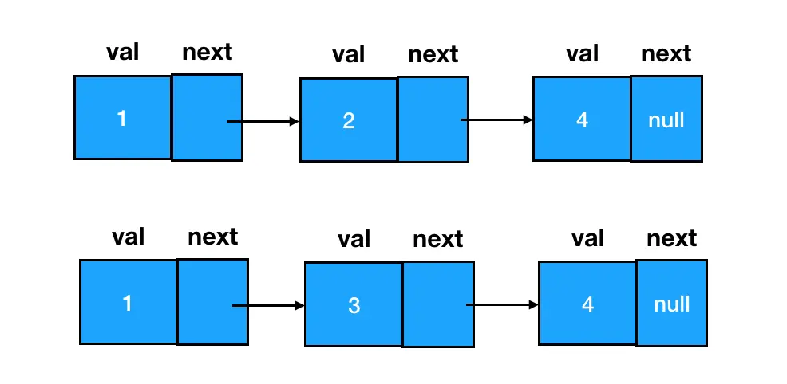

[链表](https://juejin.cn/book/6844733800300150797/section/6844733800350498823)

链表结构相对数组、字符串来说，稍微有那么一些些复杂，所以针对链表的真题戏份也相对比较多。

题目分为以下三类：
- 链表的处理：合并、删除等
- 链表的反转及其衍生题目
- 链表成环问题及其衍生题目

## 链表的合并

真题描述：将两个有序链表合并为一个新的有序链表并返回。新链表是通过拼接给定的两个链表的所有结点组成的。 

示例： 输入：1->2->4, 1->3->4 输出：1->1->2->3->4->4

做链表处理类问题，大家要把握住一个中心思想——处理链表的本质，是处理链表结点之间的指针关系。



两个链表如果想要合并为一个链表，我们恰当地补齐双方之间结点 next 指针的指向关系，就能达到目的。


如果这么说仍然让你觉得抽象，那么大家不妨把图上的6个结点想象成6个扣子：现在的情况是，6个扣子被分成了两拨，各自由一根线把它们穿起来。而我们的目的是让这六个扣子按照一定的顺序，串到一根线上去。这时候需要咱们做的就是一个穿针引线的活儿，现在线有了，咱缺的是一根针：


这根针每次钻进扣子眼儿之前，要先比较一下它眼前的两个扣子，选择其中值较小的那个，优先把它串进去。一次串一个，直到所有的扣子都被串进一条线为止（下图中红色箭头表明穿针的过程与方向）：

同时我们还要考虑 l1 和 l2 两个链表长度不等的情况：若其中一个链表已经完全被串进新链表里了，而另一个链表还有剩余结点，考虑到该链表本身就是有序的，我们可以直接把它整个拼到目标链表的尾部。

1.js
https://leetcode.cn/problems/merge-two-sorted-lists/description/

## 合并两个有序数组

给定两个升序数组 nums1、nums2，nums1 长度足够容纳两数组全部元素，把 nums2 合并到 nums1，合并后依旧升序。

nums1=[1,2,3,0,0,0], m=3，nums2=[2,5,6], n=3，结果 [1,2,2,3,5,6]

2.js
逆序双指针

## 链表结点的删除

真题描述：给定一个排序链表，删除所有重复的元素，使得每个元素只出现一次。

示例 1:
输入: 1->1->2
输出: 1->2
示例 2:
输入: 1->1->2->3->3
输出: 1->2->3

链表的删除是一个基础且关键的操作，我们在数据结构部分就已经对该操作的编码实现进行过介绍，这里直接复用大家已经学过的删除能力，将需要删除的目标结点的前驱结点 next 指针往后指一格：

判断两个元素是否重复，由于此处是已排序的链表，我们直接判断前后两个元素值是否相等即可。

```
/**
 * @param {ListNode} head
 * @return {ListNode}
 */
const deleteDuplicates = function(head) {
    // 设定 cur 指针，初始位置为链表第一个结点
    let cur = head;
    // 遍历链表
    while(cur != null && cur.next != null) {
        // 若当前结点和它后面一个结点值相等（重复）
        if(cur.val === cur.next.val) {
            // 删除靠后的那个结点（去重）
            cur.next = cur.next.next;
        } else {
            // 若不重复，继续遍历
            cur = cur.next;
        }
    }
    return head;
};

```

## 删除问题的延伸——dummy 结点登场

给定一个排序链表，删除所有含有重复数字的结点，只保留原始链表中 没有重复出现的数字。

示例 1:
输入: 1->2->3->3->4->4->5
输出: 1->2->5
示例 2:
输入: 1->1->1->2->3
输出: 2->3


我们先来分析一下这道题和上道题有什么异同哈：相同的地方比较明显，都是删除重复元素。不同的地方在于，楼上我们删到没有重复元素就行了，可以留个“独苗”；但现在，题干要求我们只要一个元素发生了重复，就要把它彻底从链表中干掉，一个不留。

这带来了一个什么问题呢？我们回顾一下前面咱们是怎么做删除的：在遍历的过程中判断当前结点和后继结点之间是否存在值相等的情况，若有，直接对后继结点进行删除：

