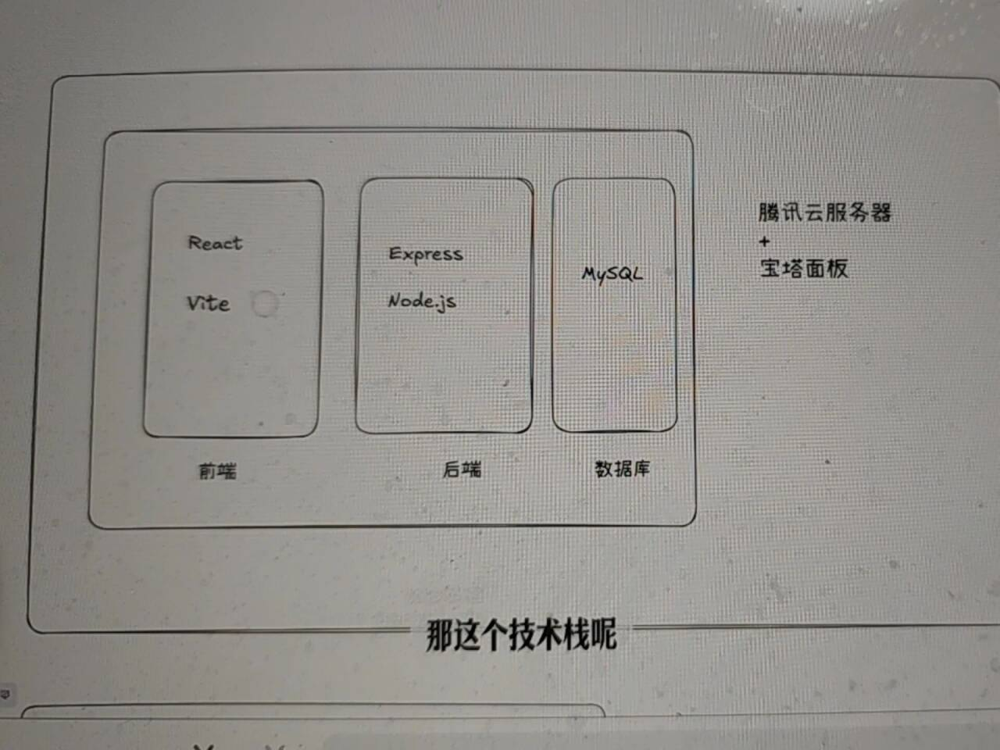

# 宝塔部署入门

## 新手真正理解项目部署全流程

将学会：
- 理解部署的全流程
- 用宝塔面板搭建生产环境：Nginx + Node 多版本
- 部署一个前后端分离项目：


这是一个前后端分离的项目
- 前端 采用的是React + Vite 
  - React 打包产物作为静态资源由 Nginx 托管
- 后端 采用的是Express node 框架
    - Nginx 通过 /api 反向代理到本机 Express
- 数据库采用的是MySQL

腾讯云服务器 + 宝塔面板

> 对于新手而言，我还是更加推荐使用 Vercel 的方式来进行部署。而不是通过宝塔，宝塔的运维与心智负担更高。

宝塔适合想掌控一切、成本可控、能部署任何形态服务，同时业务在国内，并逐步具备运维能力的朋友。

但是使用宝塔可以带着熟悉购买服务器、配置HTTPS、部署服务的全流程，拥有自己的一台服务器，对于新手而言还是很有成就感的，我体会那种感觉。


## 2. 宝塔和部署的基础知识

2.1 什么是宝塔?


宝塔（BT Panel）是一套服务器管理面板：把原本需要在命令行里完成的服务器运维工作（装软件、建站点、配 Nginx、申请 HTTPS、看日志、管理进程等）做成了可视化的网页界面，让你用“点按钮”的方式管理一台 Linux 服务器。

你可以把它理解成：给服务器装了一个“控制台/操作系统的后台”。

1. 宝塔的优势
- 可视化：更容易上手，比纯命令行友好
- 自由度高：想怎么部署就怎么部署
- 适合长期运行服务：API、WebSocket、worker、定时任务都好处理
- 可迁移：掌握的是通用服务器能力，不绑定某个平台

2. 新手注意点
- 需要理解一些基础概念：端口、安全组、防火墙、Nginx、目录权限
  端口就是**操作系统用来区分同一台电脑上不同网络程序的编号**。
  3306 mysql
  80 http 默认端口
  443 https 默认端口
  1. 安全组是什么?
  - 位置：云厂商网络层（比如腾讯云/阿里云/华为云那一层）
  - 作用：控制“这台云服务器允许哪些端口被外网访问”
  - 类比：小区大门保安——不让进，小区里的人就算想接待也接不到
    
  常见设置：
  - 放行：80（HTTP）、443（HTTPS）、22（SSH）
  - 其他端口默认不放行（更安全）
    
2. 防火墙是什么（服务器系统层的门禁）
  - 位置：服务器操作系统内部（Linux 上常见是 ufw / firewalld / iptables）
  - 作用：控制“已经到达这台机器的流量，系统允不允许它通过”
  - 类比：你家门口的门禁——就算进了小区，还得过你家门


## 用户访问网页经历什么？


当用户在浏览器打开：https://<YOUR_DOMAIN>，请求会按这张图走一遍：

1. Browser → DNS：先找到你的服务器
Domain Name System 把网址（域名）翻译成服务器 IP 地址。
- 浏览器先去 DNS 问：<YOUR_DOMAIN> 对应哪个服务器？
- DNS 返回你的 服务器公网 IP
你可以理解为：先“查地址”，再去“敲门”。

它的核心作用只有一个：把域名转换成 IP 地址。
- 人更擅长记：example.com
- 电脑真正要访问的是：1.2.3.4（服务器 IP）
所以当你在浏览器输入 https://example.com 时，第一步就是：去问 DNS：这个域名对应哪个 IP？

2. 安全组和防火墙：看门的放不放行
请求要进服务器，先过两道“门禁规则”：
- 安全组 / 防火墙 是否放行 80/443
- 我们的原则：公网只开 80/443
后端端口（例如 <API_PORT>）不对外开放，避免后端裸奔。

3. Nginx：真正的入口（SSL + 分流）
请求进来后，先到 Nginx。它负责两件事：
1. SSL（HTTPS）：处理证书与加密通信
2. Routing（分流）：根据路径决定走哪条路

Nginx 是一个高性能的 Web 服务器 + 反向代理服务器。
它最常做三件事：接收请求、返回静态文件、把请求转发给后端。

4. 分成两条路：静态文件 or API

A. 前端（静态文件） → React dist/build
- 访问页面需要的 index.html / js / css
- Nginx 直接从服务器目录里把 React 打包产物（dist/build）返回给浏览器

B. 后端/api 反向代理 →  127.0.0.1:3000
- 访问 /api/* 时
- Nginx 把请求 转发到本机后端：127.0.0.1:<API_PORT>
- Express 返回 JSON，再由 Nginx 转回给浏览器

解决了跨域

重点：外网访问的是域名 + /api，不是直接访问后端端口。

纯前端项目是一堆的静态文件，后端项目是一个进程。


## 购买腾讯云服务器并配置宝塔
- https://cloud.tencent.com/
产品（移上去）-> 轻量应用服务器->  入门型
cpu （2核2GB） 内存 ssd （40GB） 带宽(3Mbs)  流量包(200GB/月)
每秒最多可以传输 3 兆比特的数据
每个月最多可以使用 200GB 的数据流量，用完之后要么限速、要么额外扣费，下个月 1 号流量重置恢复 200GB。

应用模版 入门型 35元/月
宝塔Linux 面板
离我们最近的 南京
购买

放心买，即使你只用一天学习也可以直接退还费用，是按天扣费的。比如是30元/月，那么你只用了一天，一天是1元，腾讯云会直接退还你29元。

站内信， 密码
点击 登录

ls
cd /  服务器根目录
cd www/ 网站目录
cd wwwroot 网站根目录
pwd

- 点击你的服务器的卡片， 选择应用管理
立即登录 进入面板
接下来就会服务器的域名下的8888端口，你需要首先同意宝塔的用户协议。然后点击【进入面板】

http://81.70.236.120:8888/home  服务器ip 地址
宝塔运行的端口号8888 
不用它显示推荐的， 关掉。
宝塔面试其实就是服务器的运维面板

- 网站  Node项目 安装node 

node.js 版本管理器 点击安装
不同项目对应node 版本不一样

- HTML项目 安装nginx 
点击Nginx  点击极速安装
比较久， 关掉， 后台运行

- 数据库  
安装Mysql, 安装到本地

数据库名称 time_capsule_dev
用户名 time_capsule_dev
密码 5hY2WYiTcha8Adtb
本地服务器 所有人 调试开发

点击备份的意思 定时备份

保存到

再添加一个生产环境的数据库
time_capsule_product
time_capsule_product
EeDW7yJxFsFF5DM4
本地服务器 更安全
确定

## 3.3 监控

- 安全
放行一些端口
21 FTP 控制端口 上传现在
22 远程登录服务器、执行命令、传输文件，**加密传输**。 Secure Shell 安全外壳协议
80 HTTP 默认端口
443 HTTPS 默认端口
39000-40000 自定义端口
面板端口 
后面有要放行的端口添加到这里

- 软件商店
  - php 7.4
  - phpmyadmin
  可视化数据库数据面板

- 初始化数据库
点击管理 dev
```
CREATE TABLE capsules (
  id INT AUTO_INCREMENT PRIMARY KEY,
  content TEXT NOT NULL,
  author VARCHAR(100) DEFAULT '匿名',
  unlock_time DATETIME NOT NULL,
  created_at DATETIME DEFAULT CURRENT_TIMESTAMP
);
```

点击管理 product
```
CREATE TABLE capsules (
  id INT AUTO_INCREMENT PRIMARY KEY,
  content TEXT NOT NULL,
  author VARCHAR(100) DEFAULT '匿名',
  unlock_time DATETIME NOT NULL,
  created_at DATETIME DEFAULT CURRENT_TIMESTAMP
);

```


## 4. 部署服务
### 4.1 本地运行

- 下载项目源码
baotao-tutorial
trae 打开
client 前端
.env 
server 后端


### 前端
- 复制.env.example 到.env
VITE_API_URL=http://localhost:3001

安装依赖， 跑起来
### 后端
- 复制.env.example 到.env
DB_HOST=81.70.236.120/
DB_PORT=3306
DB_USER=time_capsule_dev
DB_PASSWORD=5hY2WYiTcha8Adtb
DB_NAME=time_capsule_dev

PORT=3001
cd server
npm i 

防火墙的概念 两个
腾讯云 （面板里） 防火墙  添加规则  
3306打开
宝塔 安全 添加规则 3306

本地运行起来， 就说明项目跑通了， 部署

## 4.2 在宝塔上传文件
### 上传
停掉项目

- 前端
删除node_modules和dist等没有必要的依赖文件。
- 后端
删除node_modules

www/wwwroot 新建文件夹 baota-tutorial
点击上传文件夹   client server 两个文件夹
前端文件夹 上传
继续上传服务端  上传 

## 4.3 部署

- 网站， Node项目， 添加Node项目
项目目录 server
项目名称 server 
启动选项 start:node dist/app.js
node 版本 安装 更新版本列表 只显示LTS版本
包管理器 pnpm 点击确认

还没有构建
文件 -》 终端

.env 改成 生产环境的数据库的配套
npm i 
npm run build
- 再点击运行，就能看到运行成功了

## 部署前端
- html项目
1. .env 改下
修改VITE_API_URL为自己的域名
VITE_API_URL=http://ip
2. 进入项目 npm install  
3. npm run build
dist 目录
纯静态资源
4. 网站 html 项目
添加项目 目录为dist 
- 点击【HTML项目】，点击【添加项目】。
输入对应绑定的域名和根目录的值

### 重定向
html项目 设置 配置文件
```
#反向代理配置 - API接口
location ~ /api/ {
    proxy_pass http://127.0.0.1:3001;

    # 必要的请求头设置，确保后端能获取客户端真实IP
    proxy_set_header Host $host;
    proxy_set_header X-Real-IP $remote_addr;
    proxy_set_header X-Forwarded-For $proxy_add_x_forwarded_for;
    proxy_set_header X-Forwarded-Proto $scheme;

    # 如果你的后端涉及WebSocket（如Socket.io），需要解开下面两行的注释
    # proxy_set_header Upgrade $http_upgrade;
    # proxy_set_header Connection "upgrade";
}

```

