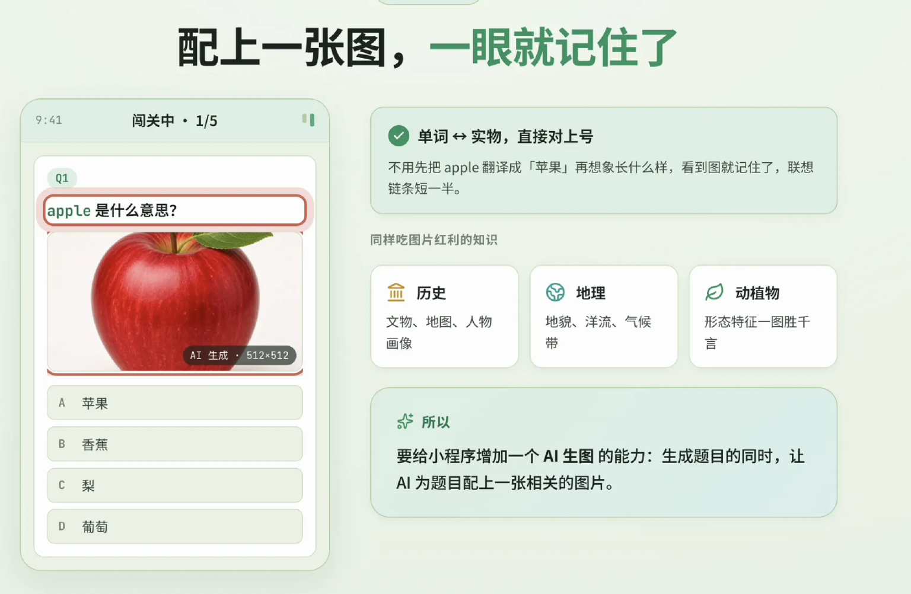
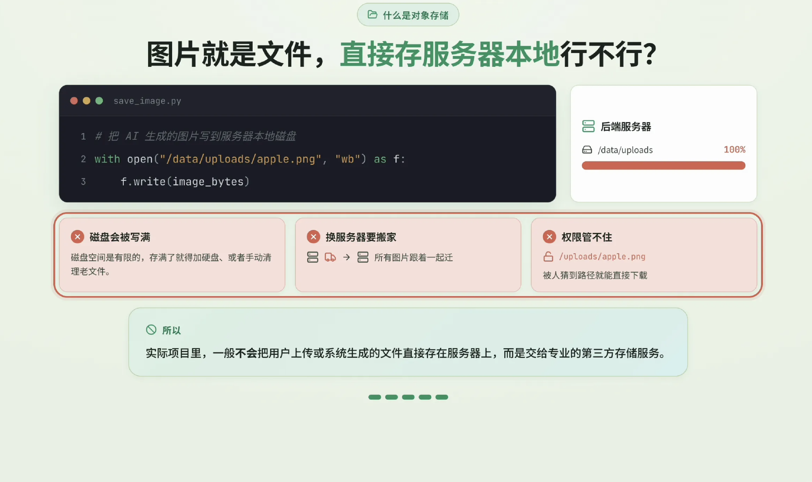
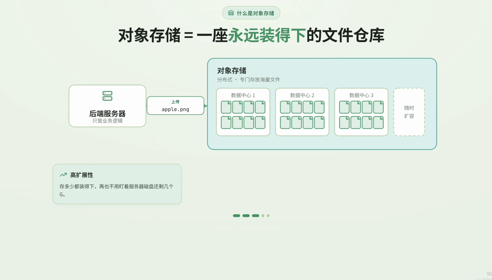

## 图片上传

```
你是一位后端开发工程师，基于 Node.js + Express 搭建图片上传Demo项目。
只复用成熟npm包，不要手写底层文件IO逻辑。
任务：
1.初始化项目，生成package.json，安装依赖 express、multer、cors
2.搭建基础express服务，开启静态资源托管，把 public 文件夹设置成静态目录
3.创建项目目录结构：public/uploads 用来存放上传后的图片
4.编写入口文件app.js，启动端口3000，无多余业务逻辑，只保证静态服务器正常运行
```

```
在上一步Express项目基础上继续迭代，复用multer成熟组件，不要手写文件读写。
开发POST图片上传接口 /api/upload
需求清单：
1.配置multer存储目标文件夹为项目下 public/uploads
2.限制只允许 jpg、png、gif 图片类型上传，限制文件大小5MB
3.上传成功后返回图片可直接访问的静态url路径，例如 /uploads/xxx.png
4.做好基础错误捕获，文件超限、格式错误返回友好json提示
5.不做复杂权限校验，本demo只实现基础上传。
```
```
继续上面后端项目，胶水式开发，新建前端html页面放置于public文件夹。
页面功能：
1.提供表单，文件选择框只接受图片，上传按钮调用后端 /api/upload 接口
2.上传完成后自动展示刚刚上传成功的图片预览，利用返回的静态url渲染图片
3.简单友好提示：上传成功 / 上传失败文字反馈
4.页面样式简洁，原生HTML+JS实现，不要引入前端框架。
产出完整 index.html 文件，存放路径 public/index.html，访问根路由就打开这个上传页面。
```

# AI 生图 + 对象存储

之前我们做了一个背单词的应用， 是纯文字的， 不够直观。
比如 “apple 是什么意思？”
如果能配上一张苹果的图片， 用户一眼就能建立起单词和实物之间的联想， 学习效果会好很多。

## AI生图功能
- 成本较高
  不要自动配图， 用户选择是否生成图片，
  后端加上生图次数限制，VIP 更高，自己选择是否付费
- 生成的图片需要一个地方来存储， 得到永久可访问的URL, 存到数据中。


## 对象存储

图片本质上是一种文件，把文件存在哪里呢？

最简单的方式是存到后端服务器本地，用 node 代码进行文件读写就能搞定。但这种方式问题很多。

- 服务器的磁盘空间是有限的，存满了就得加硬盘或者清理文件。
- 如果哪天服务器要迁移，所有图片都得跟着搬。
- 权限控制也很麻烦，万一被人找到文件路径直接下载，就存在安全风险。


所以在实际项目开发中，我们一般不会把用户上传或者系统生成的文件直接存在服务器上，而是使用专业的第三方存储服务。其中最常用的就是对象存储。

对象存储是一种专门用来存放海量文件的分布式存储服务，具有高扩展性、低成本、安全可靠这些优点。



## 腾讯云cos 
按量付费， 主要按照存储容量和访问流量来计费。

https://cloud.tencent.com/act/pro/cos

轻量对象存储 Lighthouse 版
存储桶

[https://console.cloud.tencent.com/lighthouse/cos/index](https://console.cloud.tencent.com/lighthouse/cos/index)腾讯云

COS_BUCKET COS_REGION

https://console.cloud.tencent.com/cam/capi
 key


我想把 '/Users/shunwuyu/workspace/lesson/ai_lesson/cf/cos/demo'     
  目录下的传统图片上传,改成基于腾讯轻量对象存储, 用200字,             
  讲下执行流程.  

安装依赖：npm i cos-nodejs-sdk-v5，删掉不再需要的 multer

初始化 COS 客户端：在 app.js 引入 SDK，用
  SecretId/SecretKey、Bucket、Region 新建 COS 实例
.env 有相应的环境变量
改造上传接口：把 /api/upload 从 diskStorage 落盘改为
  memoryStorage,拿到 req.file.buffer 后调用 cos.putObject({ Bucket, 
  Region, Key, Body: buffer })。

生成访问地址：上传成功后拼出
  https://<Bucket>.cos.<Region>.myqcloud.com/<Key> 作为返回 URL,Key
  用时间戳+随机数+扩展名保证唯一。

保留校验：文件类型/5MB 大小限制照旧

前端无需改动：index.html 仍走 /api/upload,只是返回的 url 变成 COS
  外链,previewImage.src 直接可用。

错误处理：把 COS 回调的 err 接到现有错误中间件,返回统一 JSON。