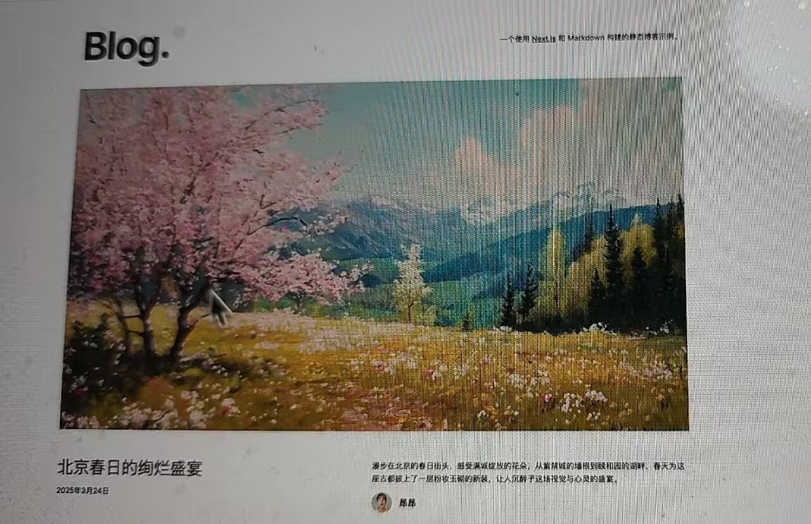

# 搭建个人静态博客网站

- 采用模版的方式
  首页
点击，进入个人博客详情页，底部可以放各个社媒平台的一个跳转

nextjs.com
template
左边选择blog  选择blog starer Kit 第一个 https://vercel.com/templates/next.js/blog-starter-kit
看下在线demo 的示例

npx create-next-app --example blog-starter blog-starter-app

npm run dev

## 怎么修改博客和页面？
- 博客 对应的是_posts 目录下 3个md 文件
- 修改 dynamic-routing.md 为spring-beijing.md
- 第一个文件作为组图的封面， 可以修改
- 删除两篇， 只保留一篇
- public/assets 静态资源
  也删除一下
- 元数据的概念 
  spring-beijing.md
  网站博客的标题 比如北京的春天
  eccerpt 北京的春天， 万物复苏，春暖花开 
  coverImage: "/assets/blog/spring-beijing/cover.jpg"
  ogImage 也改下
  作者： 旅梦
  头像
  日期改成今天的日期

  找一张图片放到相应目录下

  ```
  @spring-beijing.md 请你帮我重写这篇文章， 修改为北京的春天，
  写一个800字左右的文章。
  ```

- 移除头部的引用
  ```
  帮我找下 The source code for this blog  在哪个文件
  ```
  ```
  哪个文件引入了alert.tsx
  ```
  移除alert.tsx 和引入

  intro.tsx 
  "AI Native Coder"
  

- AI创建多几篇文章
```
#_posts 请你在该目录下，帮我创建另外3篇博客：
1. 北京的夏
2. 北京的秋
3. 北京的冬
```
- 尝试对底部做个修改
相关的icon 跳转到对应的页面
https://www.iconfont.cn
public/icons
```
#icon
修改底部的icon, 引入leetcode、github、juejin 的svg图片，并进行相应的跳转。把底部原有的样式移除掉，变成了解旅梦。
```
修改链接
#footer.tsx github 地址改为 https://github.com/shunwuyu/ai_lesson
juejin 地址改为 https://juejin.cn/user/2664871913601613
leetcode 地址改为 https://leetcode.cn/u/user8312u/

- more storage 更多故事

## 博客样式
太简约了
https://www.neobrutalism.dev/
挺火的。
强边框和阴影的效果

```
# blog-starter-app
请你把网站样式，修改成为neobrutalism 主题风格。包括网站首页和全部博客页面都改成这个风格。使用tailwindcss 进行修改。
```
图片风格不太搭
feat: 完成风格的修改

## 部署
- npm run build
- github nextjs-blog
我的博客
create rpo
复制三行命令， 点击回车

- vercel
  add new project 
  deploy