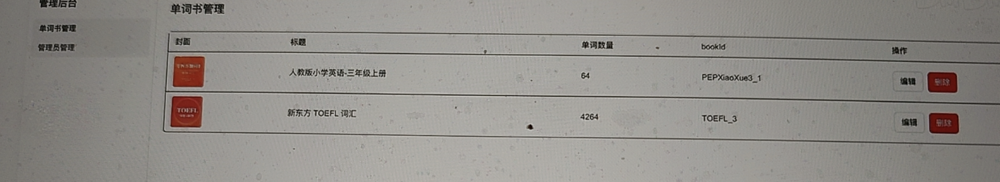
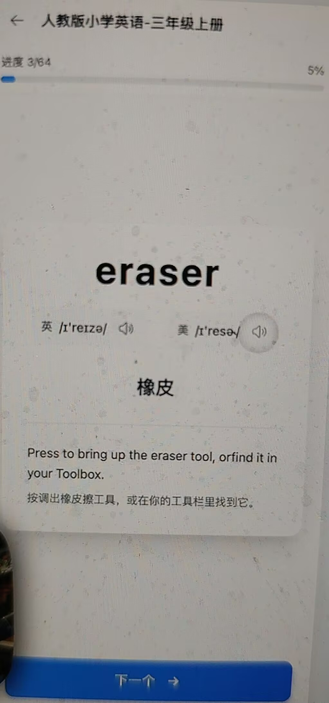
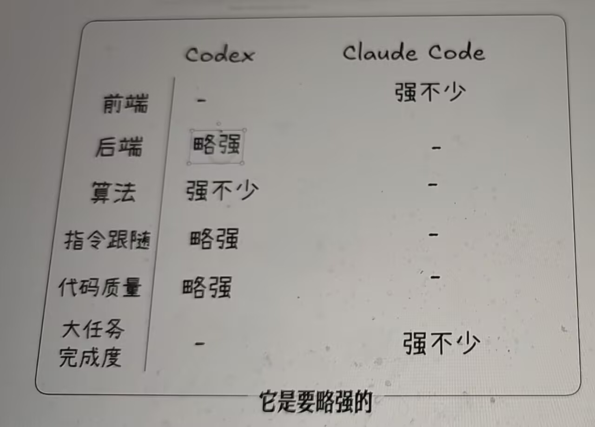

# Codex 

## 基础使用技巧

- 对比claude code 
提示词的任务颗粒度要比cc 小， 会带来更好地效果。
Codex **天生就是被训练成「执行者」而不是「规划者」**
你给它小颗粒分步指令，刚好命中它学习到的样本模式，它就很少跳步偷懒。

### 1. 训练数据底色（最根本）

初代 Codex 训练素材：GitHub 海量**小函数、短脚本、分步注释、伪代码→代码**的样本。
大量例子长这样：
```
# 1.读取文件
# 2.分割行
# 3.过滤空行
它看过无数「**一条注释 = 一步动作**」的案例。
```
2. 目标不一样：Codex 偏向「照单执行」
Codex 的对齐目标是：**严格执行你给出的动作清单**，自主性低、纪律性强。

### 3. 推理短板：缺少长程自主规划

Codex 不擅长**自己把一个大任务自动拆成细步骤**。

Codex：**程序员小弟**，执行力很强，但不爱自己动脑拆任务；你一步一步交代清楚，活干得最稳。

## 实战

英语背单词的应用

会使用到github上的一个仓库
```
https://github.com/kajweb/dict?tab=readme-ov-file
```
非常多的单词的数据

我们会做一个后台 ， 使用codex-cli



用codex 实现 去创建管理员的登录和注册

以及录入单词书这样的功能。

同时我们会做一个背单词的h5 

点击书， 可以进入单词卡片， 播放发音，

点进去， 可以查看更多的 单词的 内容，解释，同近义词，
点击下一个， 会记录学习进度

## codex 入门
### 安装方式

1. IDE 插件 
2. codex-cli
npm i -g @openai/codex
codex --version
cc switch 
/model 看模型
/status 看状态
/new 新的对话， 不受上面的影响， 节省上下文开销
/compact 压缩对应的上下文
/init  创建Agents.md 
类似于 claude.md
/mcp 列出mcp 工具

  .codex/config.toml

  [mcp_servers.context7]
  args = ["-y", "@upstash/context7-mcp", "--api-key", "ctx7sk-5061c48d-52b0-4e18-8a91-090f82d50724"]
  command = "npx" 

  Context7 是 Upstash 开发的 MCP 服务，可为 AI 编程助手实时拉取对应库版本最新官方文档，消除过时 API 与代码幻觉问题

  codex chat "使用 context7 获取 React 19 最新文档，写一个最简 use() Hook 读取 Promise 的示例，使用最新官方写法，不要过时代码"
  ```
  import { use } from "react";

  // 返回 Promise 的模拟数据
  const messagePromise = Promise.resolve("Hello React 19 use Hook");

  export default function Message() {
    // use 直接等待 Promise 解析
    <!-- `use()` 可以在组件内读取 Promise、Context，**不需要 useEffect**。 -->
    const message = use(messagePromise);

    return <h1>{message}</h1>;
  }

  ```

@ 对应文件的索引 非常重要 
粘贴图， ctrl + v 方式 

与claude code 对比 


cc 对新手更友好， 提示词不需要拆分那么细， 前端能力非常强
codex 适合高手

### Agents.md
类似claude.md 的角色， 是专门写给Ai Agent的， 提供对应的上下文。
很多coding agent 都支持。

https://github.com/FarmBot/Farmbot-Web-App/blob/staging/AGENTS.md
根目录下有个Agents.md

它非常简洁
它其实给前端、后端分别创建了不同的一个Agents.md
点进去看
/init 创建
```
请你用中文重写AGENTS.md，要求实现：
 
1. 项目概述
2. 项目如何安装（包括环境变量）、运行、构建命令
3. 项目前后端目录结构，页面路由、项目API接口
4. 项目重要的技术栈和依赖说明
5. 需要npm执行的，全部替换成pnpm
```

3. codex 桌面| 云端


## Codex 实战： 单词书管理后台

效果图
2个tab页面
1. 
2. 管理员管理页面 


next.js 

新建项目 desktop  ai-coding/codex-projects/

npx create-next-app@latest
admin-nextjs 默认

第一次， 授权的修改
/permissions 省的都需要授权

```
请你帮我基于 shadcn/ui 和 tailwindcss，实现一个管理后台的UI界面，要求有以下几个页面
 
1.  / ：如果用户已登陆，跳转到 /books页面，如果用户没有登陆，跳转到
2.  /signup ：系统管理员注册功能，输入姓名、邮箱、密码、确认密码。
3.  /signin ：管理员的登陆页，输入邮箱和密码登陆
4.  /books ：单词书管理
5.  /admin‑users ：管理员管理
 
单词书管理和管理员管理页面要求登陆后才能查看，并显示对应的侧边栏。侧边栏底部显示用户邮箱 + 退出登陆icon
```

feat: 完成前端ui开发

### supabase 数据库

supabase.com

创建一个新的项目 
codex-beike
创建一个密码
选新加坡

设置环境变量 
DATABASE_URL= 

```
给该Next.js项目，安装并引入Drizzle ORM的相关依赖和配置，我需要集成我的supabase的数据库。
我已经在项目中创建了  .env  文件，并且设置了  DATABASE_URL  环境变量。注意，只安装依赖并引入相关配置，不要给我默认创建额外的表。
```

```
现在请你基于Drizzle ORM，帮我实现管理员注册功能的前后端，要求：
 
1. 创建对应的管理员数据表  admin‑users ，该表用来保存管理员和系统管理员的数据，以及 admin‑session ，用来保存用户的session状态，用户登陆态有效期7天。注意：如果数据表中没有任何数据，那么自动跳转到 /signup ，实现首个系统管理员的注册功能。如果有管理员数据，不允许再二次注册系统管理员，自动跳转到 /signin 。
2. 实现 /signin 页面的登陆逻辑
3. 实现 /admin‑users 页面新建管理员 + 管理员列表查看、编辑等逻辑，管理员分为系统管理员和普通管理员。系统管理员可以增加管理员，并且设置管理员为普通管理员或者是系统管理员。如果是普通管理员，无法看到管理员管理这一个侧边栏，同时后端接口也不允许调用。
```
npm run drizzle:push  生成sql 

```
优化一下管理员管理页面
 
1. 系统管理员不能修改自己的状态和修改自己的角色，只能修改他人的状态。
2. 优化整体的UI，新建管理员用弹框的方式，同时编辑管理员，也是用弹框，不要在姓名和邮箱后面添加编辑按钮。点击弹框后将数据进行回显后编辑
```
feat: 管理员注册功能

移除管理员注册功能

feat: UI优化

到单词github 项目下载三年级 ， 放到temp 目录下 放入JSON 文件

### words 表
创建一个words 表 
字段如图
导入数据 csv 格式 
上下文不够的， 不要直接转 1万多行， 让它写一个脚本去转

```
帮我生成一个nodejs 脚本， 能够把 @json 的json 文件 处理成为一个csv 的格式并保存在同级目录下，
这是这个josn的示例数据
```
{
  "wordRank": 1,
  "headWord": "ruler",
  "content": {
    "word": {
      "wordHead": "ruler",
      "wordId": "PEPXiaoXue3_1_1",
      "content": {
        "sentence": {
          "sentences": [
            {
              "sContent": "a 12-inch ruler",
              "sCn": "一把12英寸的尺子"
            }
          ],
          "desc": "例句"
        },
        "usphone": "'rulɚ",
        "syno": {
          "synos": [
            {
              "pos": "n",
              "tran": "[计量]尺；统治者；[测]划线板，划线的人",
              "hwds": [
                {
                  "w": "governor"
                },
                {
                  "w": "dominator"
                }
              ]
            }
          ],
          "desc": "同近"
        },
        "ukphone": "'ruːlə",
        "ukspeech": "ruler&type=1",
        "relWord": {
          "desc": "同根",
          "rels": [
            {
              "pos": "adj",
              "words": [
                {
                  "hwd": "ruling",
                  "tran": " 统治的；主要的；支配的；流行的，普遍的"
                },
                {
                  "hwd": "ruled",
                  "tran": " 有横隔线的；有直线行的；受统治的"
                }
              ]
            },
            {
              "pos": "n",
              "words": [
                {
                  "hwd": "rule",
                  "tran": " 统治；规则"
                },
                {
                  "hwd": "ruling",
                  "tran": " 统治，支配；裁定"
                },
                {
                  "hwd": "rulership",
                  "tran": " 统治者的地位；职权或任期"
                }
              ]
            },
            {
              "pos": "v",
              "words": [
                {
                  "hwd": "ruled",
                  "tran": " 统治；裁决（rule的过去分词）"
                }
              ]
            },
            {
              "pos": "vi",
              "words": [
                {
                  "hwd": "rule",
                  "tran": " 统治；管辖；裁定"
                }
              ]
            },
            {
              "pos": "vt",
              "words": [
                {
                  "hwd": "rule",
                  "tran": " 统治；规定；管理；裁决；支配"
                }
              ]
            }
          ]
        },
        "remMethod": {
          "val": " 没有规矩(rule)， 不成方圆， 尺子(ruler)可以用来规划图形",
          "desc": "记忆"
        },
        "usspeech": "ruler&type=2",
        "trans": [
          {
            "tranCn": "尺子",
            "descOther": "英释",
            "descCn": "中释",
            "tranOther": "a long flat straight piece of plastic, metal, or wood that you use for measuring things or drawing straight lines"
          }
        ]
      }
    }
  },
  "bookId": "PEPXiaoXue3_1"
}
{
  "wordRank": 2,
  "headWord": "pencil",
  "content": {
    "word": {
      "wordHead": "pencil",
      "wordId": "PEPXiaoXue3_1_2",
      "content": {
        "sentence": {
          "sentences": [
            {
              "sContent": "a sharp pencil",
              "sCn": "尖尖的铅笔"
            },
            {
              "sContent": "a blue pencil",
              "sCn": "蓝色铅笔"
            },
            {
              "sContent": "a pencil sketch",
              "sCn": "铅笔速写"
            }
          ],
          "desc": "例句"
        },
        "usphone": "'pɛnsl",
        "ukphone": "'pens(ə)l; -sɪl",
        "ukspeech": "pencil&type=1",
        "phrase": {
          "phrases": [
            {
              "pContent": "blue pencil",
              "pCn": "蓝铅笔（用于删改书稿或剧本等的）"
            },
            {
              "pContent": "pencil case",
              "pCn": "文具盒"
            },
            {
              "pContent": "pencil box",
              "pCn": "铅笔盒"
            },
            {
              "pContent": "pencil sharpener",
              "pCn": "卷笔刀"
            },
            {
              "pContent": "eyebrow pencil",
              "pCn": "眉笔"
            },
            {
              "pContent": "pencil lead",
              "pCn": "铅笔心"
            },
            {
              "pContent": "lead pencil",
              "pCn": "n. 铅笔"
            },
            {
              "pContent": "color pencil",
              "pCn": "彩色铅笔"
            },
            {
              "pContent": "mechanical pencil",
              "pCn": "自动铅笔"
            },
            {
              "pContent": "pencil factory",
              "pCn": "铅笔厂"
            },
            {
              "pContent": "pencil sketch",
              "pCn": "素描"
            },
            {
              "pContent": "test pencil",
              "pCn": "n. 测电笔，电笔；试验笔"
            }
          ],
          "desc": "短语"
        },
        "relWord": {
          "desc": "同根",
          "rels": [
            {
              "pos": "adj",
              "words": [
                {
                  "hwd": "penciled",
                  "tran": " 用铅笔写的；光线锥的"
                },
                {
                  "hwd": "pencilled",
                  "tran": " 用铅笔写的"
                }
              ]
            },
            {
              "pos": "v",
              "words": [
                {
                  "hwd": "pencilled",
                  "tran": " 用笔写（pencil的过去分词）"
                }
              ]
            }
          ]
        },
        "usspeech": "pencil&type=2",
        "trans": [
          {
            "tranCn": "铅笔",
            "descOther": "英释",
            "descCn": "中释",
            "tranOther": "an instrument that you use for writing or drawing, consisting of a wooden stick with a thin piece of a black or coloured substance in the middle"
          }
        ]
      }
    }
  },
  "bookId": "PEPXiaoXue3_1"
}
```
csv 的列包括： wordRand、headWord、content、bookId, 将content当做一个json 保存
```
数据清洗 脚本处理
复制命令行， 执行 
supabase browse your file 找到 csv import 
```
数据清晰完成

AI 不知道这张表

```
我在supabase后台创建了一个words的表，请你帮我在项目中定义该表的schema，这是表的定义：
 
sql
  
create table public.words (
  id bigint generated by default as identity not null,
  "wordRank" integer null,
  "headWord" text null,
  content json null,
  "bookId" text null,
  constraint words_pkey primary key (id)
) TABLESPACE pg_default;
```

```
请你帮我创建单词书的录入功能和单词书管理功能，要求：
1、用户点击新建单词书后，出现弹框，要求用户输入标题、单词数量、封面url、bookId、标签（逗号分割）。
2、单词书两个表渲染封面、标题、单词数量、bookId信息。用户点击编辑可以弹出编辑弹框。
3、帮我完成单词书的 books 的表创建工作，并实现表的迁移操作。
4、通过bookId 实现和words表的关联关系
```
npm run drizzle:push  生成sql 文件
关闭RLS 

新建一本书
bookID  
storage 中
如图
```
完成删除单词书的功能，同时删除books这张表中对应的单词书，以及words这张表中相同booksId的所有数据
```
在添加一本书， 下载他的zip文件 四级真题核心词
放到temp 目录下， 输入之前的命令 文件改一下
import data 

```
我现在在supabase 中插入数据遇到报错 

这是这个表的定义
```
复制第一个方式  打开sql editor 复制命令点击

feat: 完成管理后台单词书管理的逻辑