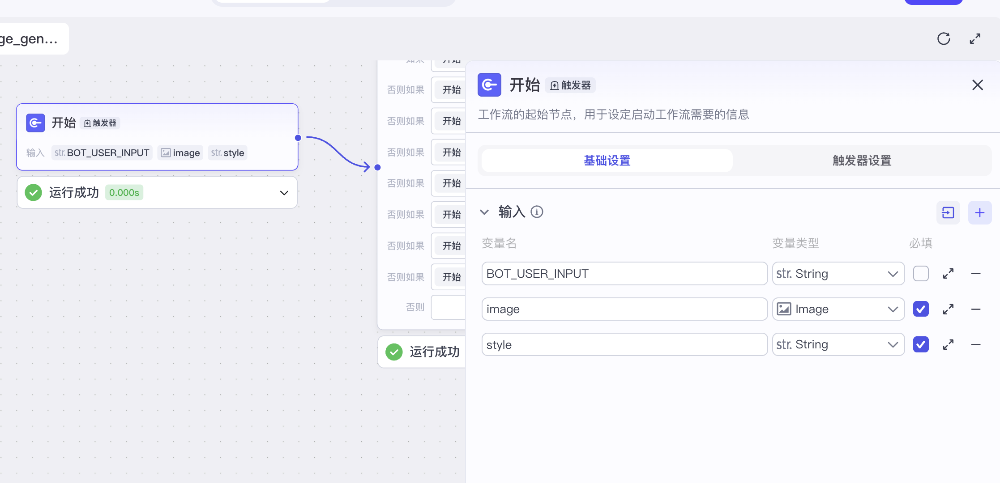
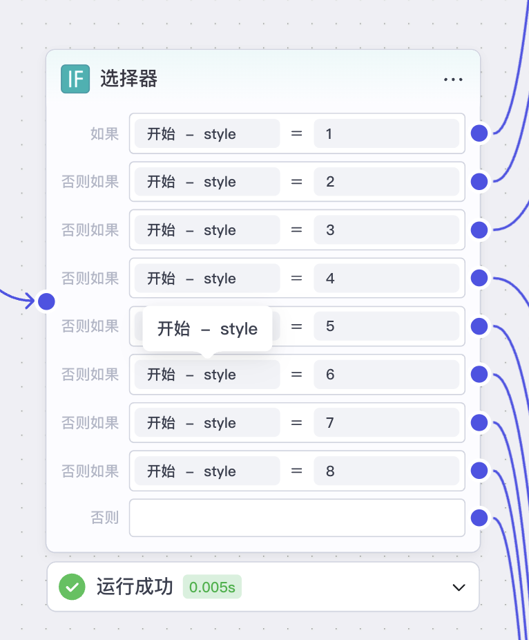
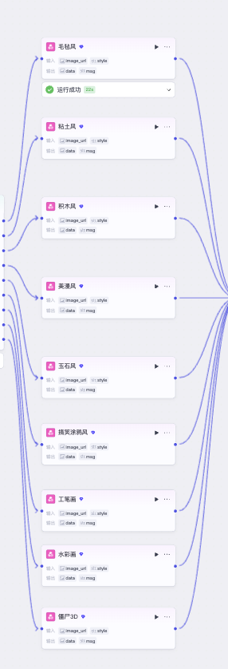
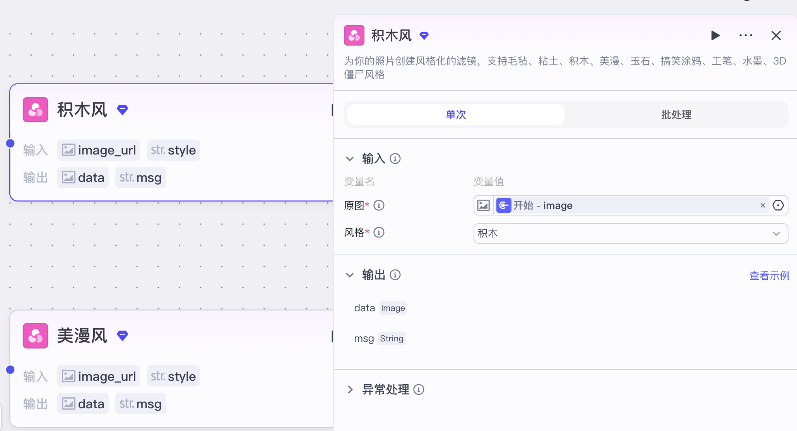
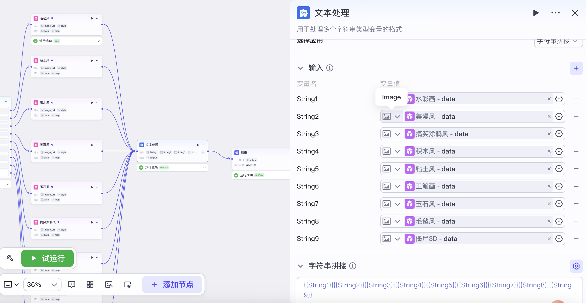
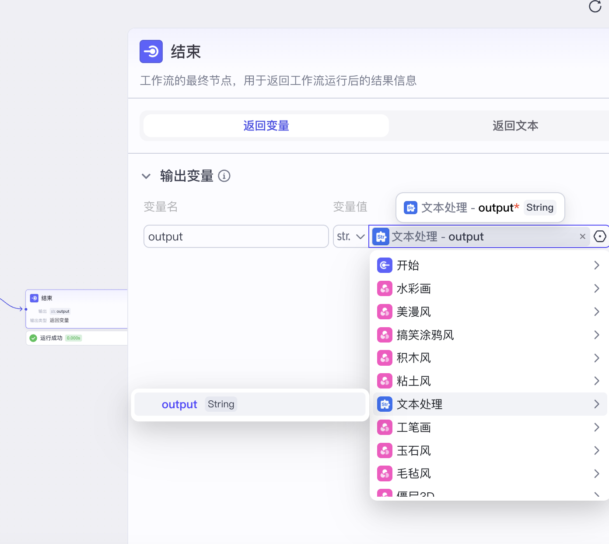
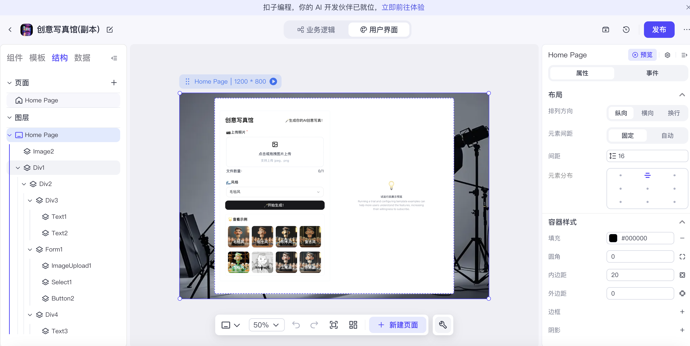
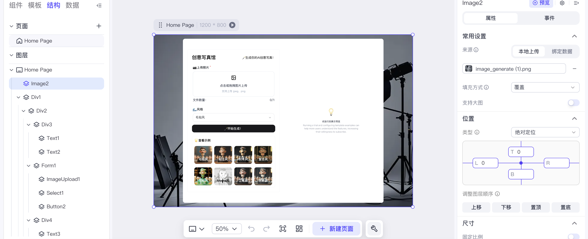

[source](https://mp.weixin.qq.com/s/GRJpC3UUy1HZ9nSB25kSeA)

照相馆可一键切换多种 AI 风格，快速生成个性化客片，丰富产品矩阵，提升出片效率与客单价。

这是一个 AI 绘图风格分发工作流，通过选择器根据 style 参数分发，调用对应风格生成器，最后输出风格化后照片地址。

code.coze.cn/home 智能体开发

## 智能体
title: 创意写真馆
描述： 上传你的照片，生成你的创意写真。

## 工作流

image_generate
根据用户上传照片和选择风格 生成风格照片

- 开始节点

- 选择器节点

- 风格滤镜节点

- 文本处理节点

- 文本结束节点

## 界面
- 容器填充黑色

- 加入背景图片

