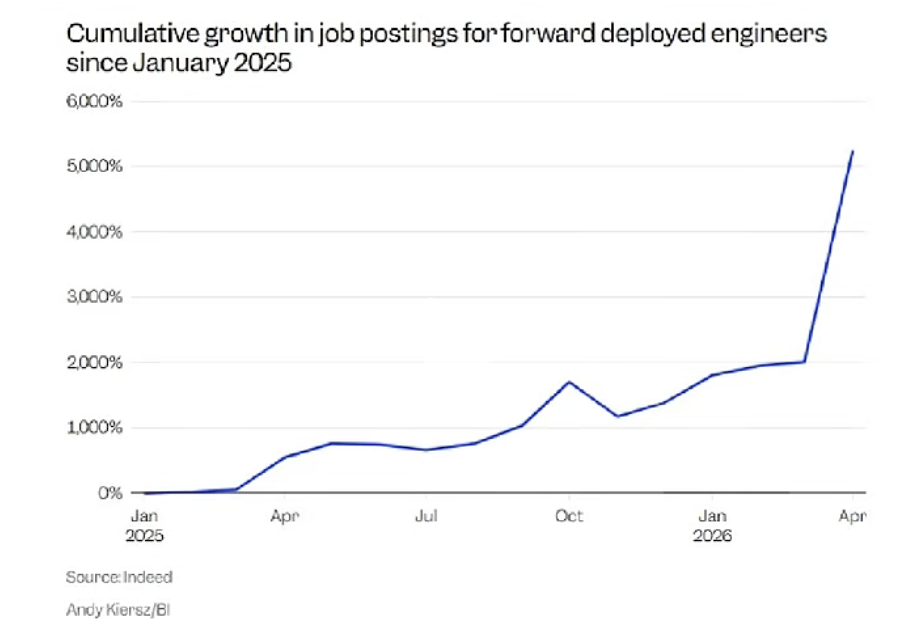

# FDE Forward Deployed Engineer

最近AI 圈有个岗位很火，不是算法工程师，也不是agent工程师，而是FDE。

前沿部署工程师。

自2025年1月以来，前线部署工程师职位发布的累计增长情况

[Indeed](https://www.indeed.com/)

去年4月份的600个，今年4月的6000多个， 800%。

OpenAI, Anthropic, Google 都在招，

OpenAI成立了一个FDE 公司 tomoro

Anthropic 也和高盛/黑石 等成立了AI服务公司，把claude 带进企业的核心业务流程。

AI公司已经进入一个新的阶段，过去大家拼的是模型能力， 谁参数更强，谁上下文更长， 谁跑分更高， 谁写代码更厉害， 现在是
谁真正的把AI 落地到企业业务里。

企业买AI不是买一个API, 也不是为了买token, 企业要的是降本、提效、增长、风控，是一个能真正嵌入业务流程、每天被员工使用，最后能产生业务结果的系统。

售前、交付或者解决方案工程师， FDE更像是一个站在客户现场的一个AI工程的负责人

工作内容：

- 理解客户的业务流程
- 那些环节适合用AI来改造
- 把企业内部的数据、权限、系统、工具接起来。
- 搭建Agent工作流、知识库和评测体系。
- 确保这些东西在生产环境跑起来

FDE不是会写代码的销售，也不是高级的实施顾问， 是Ai落地最后一公里的负责人。

AI卖模型， 转卖结果

## 工作流

