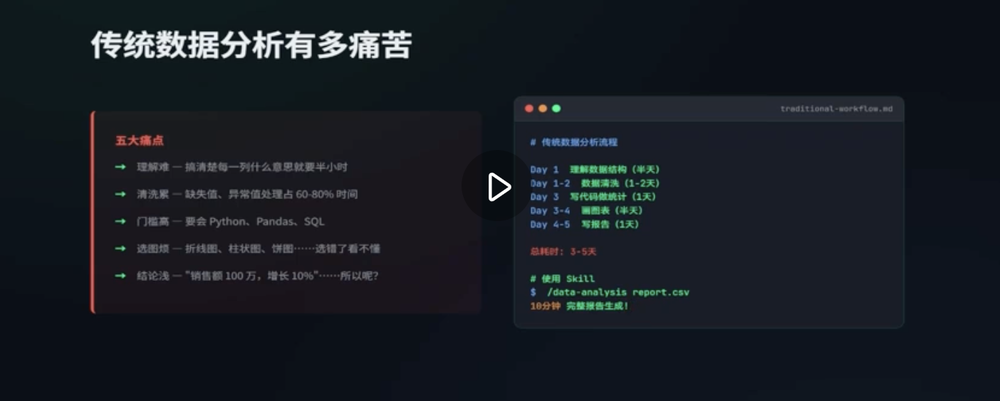

# Data Analysis Skill

老板周一早上发来一个excel文件， 里面是上个月的销售数据，帮我分析下流式用户的特征信息。周三例会要使用。

地狱之旅：

1. 大概理解每一列的含义
字段是什么意思， 指标要怎么统计， 
2. 数据清洗操作
处理缺失的值和异常数据
3. 打开python ,编写脚本，一遍又一遍的调试
4. 怎么给数据画图
流式用户按年龄段是使用折线图还是柱状图，按地区分是使用饼状图还是热力图。
5. 最后编写数据分析报告。
  本月销售额100万元， 流失用户500人， 但是写着写着卡壳了。

以上表现了传统数据分析的5个痛点。



数据分析不但要求需求会使用excel, python,还需要懂得相关的业务逻辑，而且这些工作流程高度标准。每次却又要手动执行。

## 数据分析SKILL
把它理解为得力的数据分析师
你只要说， 分析下这份数据，导出流式用户的特征。
他就能自动完成数据勤洗、统计分析、图标制作和数据分析报告的编写。

让原本需要2-3天的工作， 现在只需要十分钟就能搞定。

而且输出的不仅是纯文字的报告，还有带交互式图表的HTML页面。

这个页面可以直接在浏览器打开

### SKILL的具体实现

七步数据分析法， 是完整的数据分析方法论

1. 明确业务背景
![4.png]
不要一拿到数据就开始统计， 想想为啥要分析这些数据。
在提示词中增加了一条约束 没有业务目标的数据分析， 只是在做无用功

这就像去医院， 医生不会一上来给你开药， 

而是问哪里不舒服，是从什么时候开始的。

这份数据是谁给的， 需要解决什么问题。 

预计得出那些结论。 

只有目标明确了， 后面的分析才有方向。

第二步， 给数据拍一张体检报告

skill会自动检查 有多少行 多少页， 有没有缺失， 重复行，

数据类型是否合理， 有没有明显的异常值， 会进行质量评分

当分数 > 80分时， 表示质量良好， 进行下一步操作，

60-79 分， 说明存在问题， 会主动向用户提示

< 60 分， 代表数据质量不合格

第三步， 数据清洗

关键一步。
行业名言 Garbage in, garbage out, 脏数据会导致错误的结论。

skill 会自动运行脏数据的发现和处理。 当出现脏数据时， 可以逐项选择
策略， 然后勤洗完成后会输出一份清洗日志。

接下来， 


接下来进行数据分析阶段。

描述统计， 了解真个数据的整体分布情况
进行单个变量的统计分析， 分析每个维度的分布情况。
然后是多变量分析，对比不同维度之间的关系。

最后： 输出交付

三段式结构

### 实际案例

Raven Stack 数据集

虚构的sass(Software as a Service)平台用户数据,1500 多行用户数据
分为用户画像， 订阅生命周期， 产品交互日志，客户工单和流式事件。

```
@archive\ 进行数据分析， 并输出中文报告和网页
```
会开始分析， 我们让它 分析第三部分

确认

