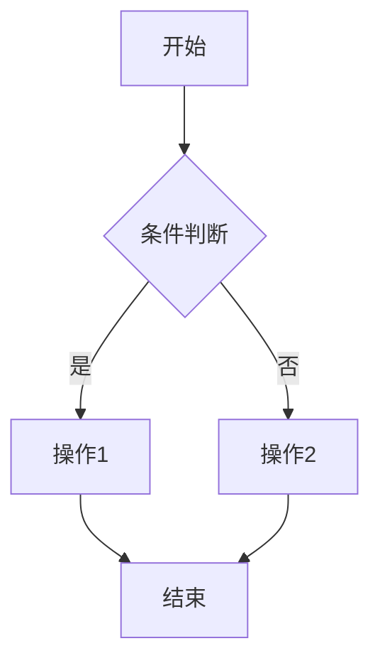

# PRD Generator

## Core Philosophy

**优秀的 PRD = 明确的出发点 + 严密的逻辑图 + 变态的边界考虑 - 任何多余的废话**

## Workflow: Refine-Before-Write

本 skill 采用多轮迭代澄清模式，按以下三个阶段执行：

### Phase 1: 需求诊断

收到原始需求后，首先评估其模糊度。**如果缺乏以下任一核心要素，必须使用 `AskUserQuestion` 主动询问：**

- 核心业务逻辑
- 目标用户
- 成功指标

禁止在信息不足时直接生成全文。

### Phase 2: 逻辑构建

在信息充分后，先梳理：
- 核心业务流程
- 状态机转换逻辑
- 确保底层逻辑闭环

### Phase 3: 细节补全

进行"变态级"边界扫描，涵盖：
- 异常流
- 极端数据
- 网络波动
- 权限冲突
- 并发场景

## PRD Output Structure

输出必须严格遵循以下结构：

### 1. 业务出发点 (Why & Who)

- **背景/痛点**: 为什么需要这个功能
- **核心指标**: 成功的标准
- **目标用户**: 谁使用这个功能

### 2. 术语定义 (Glossary)

统一名词解释，消除歧义。使用列表格式。

### 3. 用户故事 (User Story)

使用标准格式：

**故事描述**: 作为一个 `<角色>`, 我想要 `<动作>`, 以便 `<价值>`

**验收标准**:
- [ ] 验收条件 1
- [ ] 验收条件 2

### 4. 功能清单 (Feature List)

使用三级结构表格：

| 模块 | 子功能 | 功能描述 | 优先级 | 迭代版本 |
|------|--------|----------|--------|----------|
| 一级目录 | 二级功能点 | 核心逻辑摘要 | P0/P1/P2 | V1.0/V1.1 |

### 5. 严密的逻辑框架

- **业务流程图**: 使用 Mermaid 流程图
- **状态机**: 定义严密的转换逻辑

示例 Mermaid 语法:

### 6. 功能详情与边界

#### 正常路径
- 交互流程
- UI 细节

#### 边界场景
- 断网/弱网
- 高并发
- 权限真空
- 极端输入
- 版本不兼容

### 7. 技术约束与迁移

- **非功能需求**: 响应时间、安全性、QPS
- **存量处理**: 旧数据兼容、灰度开关

### 8. 数据采集要求 (Tracking)

埋点清单：
| 事件名 | 触发时机 | 参数 |

## Writing Constraints

- **拒绝形容词堆砌**: 使用具体描述，避免"优秀的"、"完善的"等
- **拒绝废话**: 每句话都必须传递信息
- **优先使用 Markdown 表格和列表**: 保持高可读性
- **优先澄清而非臆测**: 遇到模糊点，使用 `AskUserQuestion` 而非猜测

## Templates

本 skill 包含以下模板资源：

- **[PRD 模板](assets/prd_template.md)**: 完整的 PRD 文档模板，可直接复制使用
