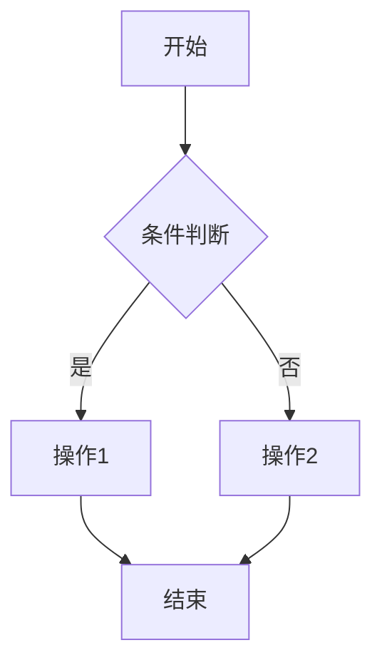

# [功能名称] PRD

## 1. 业务出发点 (Why & Who)

### 背景/痛点
<!-- 描述当前存在的问题或用户痛点 -->

### 核心指标
<!-- 定义成功的衡量标准，如：转化率提升 X%、日活增长 Y% -->
- 指标 1: 目标值
- 指标 2: 目标值

### 目标用户
<!-- 描述目标用户群体及其特征 -->

---

## 2. 术语定义 (Glossary)

| 术语 | 定义 |
|------|------|
| 术语1 | 定义说明 |
| 术语2 | 定义说明 |

---

## 3. 用户故事 (User Story)

### 故事描述
作为一个 `<角色>`, 我想要 `<动作>`, 以便 `<价值>`

### 验收标准
- [ ] 验收条件 1
- [ ] 验收条件 2
- [ ] 验收条件 3

---

## 4. 功能清单 (Feature List)

| 模块 | 子功能 | 功能描述 | 优先级 | 迭代版本 |
|------|--------|----------|--------|----------|
| 模块1 | 功能点1 | 核心逻辑摘要 | P0 | V1.0 |
| 模块1 | 功能点2 | 核心逻辑摘要 | P1 | V1.0 |
| 模块2 | 功能点3 | 核心逻辑摘要 | P2 | V1.1 |

---

## 5. 严密的逻辑框架

### 业务流程图

### 状态机

| 状态 | 触发条件 | 转换后状态 |
|------|----------|------------|
| 状态A | 触发条件 | 状态B |
| 状态B | 触发条件 | 状态C |

---

## 6. 功能详情与边界

### 正常路径
1. 用户执行操作 A
2. 系统返回结果 B
3. 用户确认并完成

### 边界场景

#### 网络异常
- 断网: 用户操作时的处理方式
- 弱网: 超时设置与重试机制

#### 并发场景
- 多用户同时操作同一资源: 冲突处理策略

#### 极端输入
- 空值/超长输入: 验证规则
- 特殊字符: 过滤规则

#### 权限冲突
- 无权限用户访问: 错误提示与引导

---

## 7. 技术约束与迁移

### 非功能需求
- **响应时间**: API 响应 < X ms
- **QPS**: 支持 X 并发请求
- **安全性**: 需要的鉴权/加密措施

### 存量处理
- **旧数据兼容**: 历史数据的迁移方案
- **灰度开关**: 功能开关配置方式

---

## 8. 数据采集要求 (Tracking)

| 事件名 | 触发时机 | 参数 |
|--------|----------|------|
| event_name | 用户点击按钮时 | user_id, button_type, timestamp |
| page_view | 页面加载完成时 | page_name, user_id, referrer |
