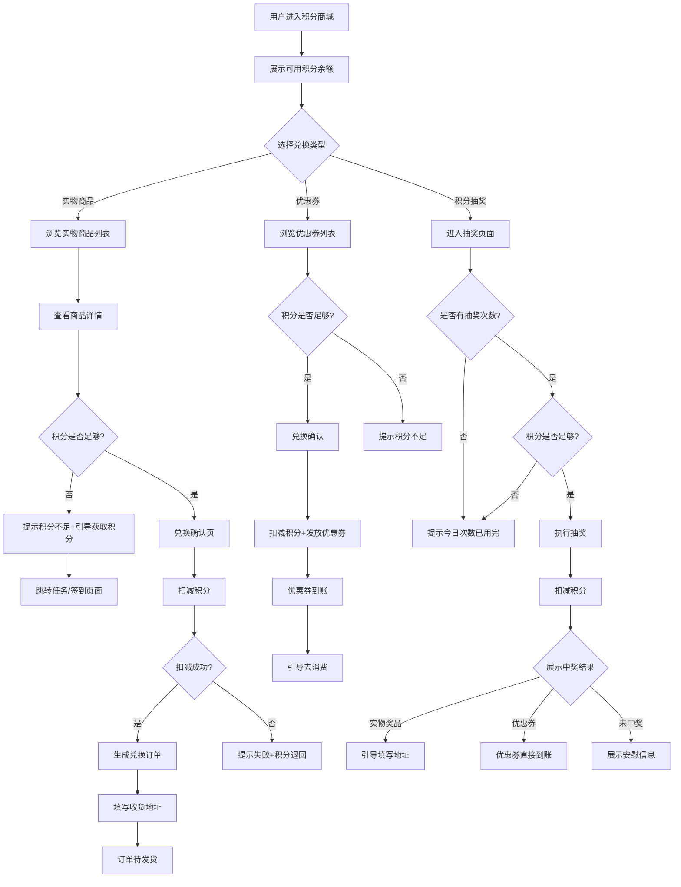
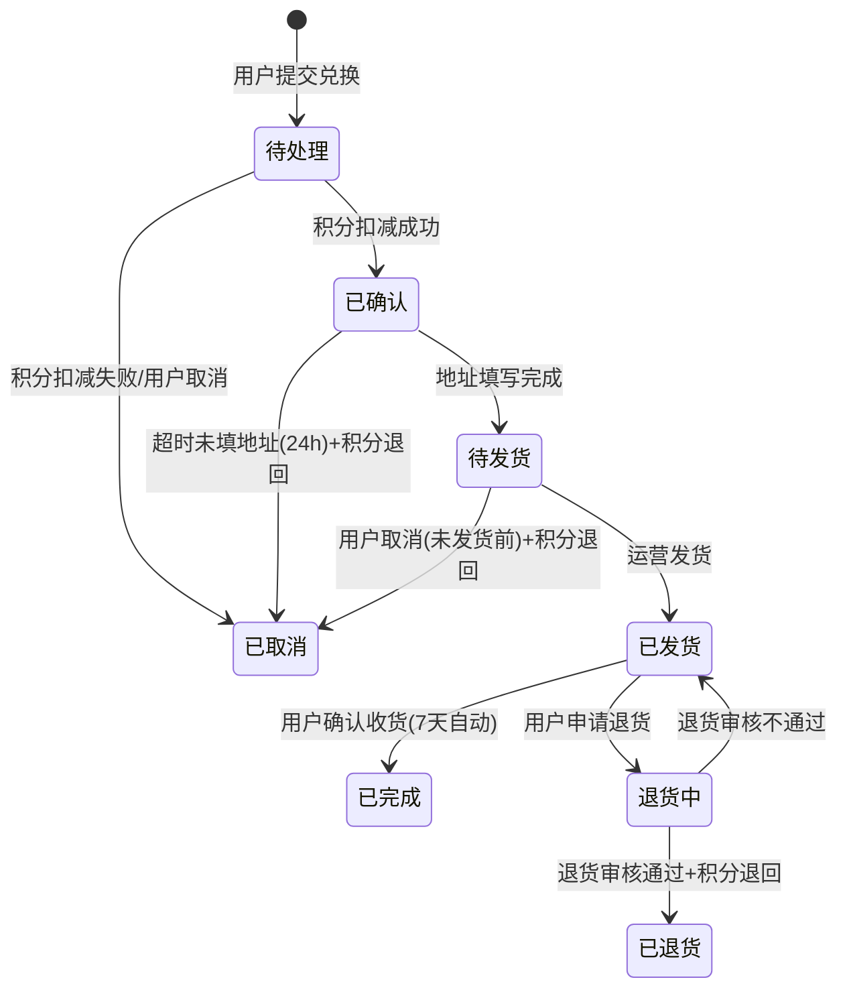
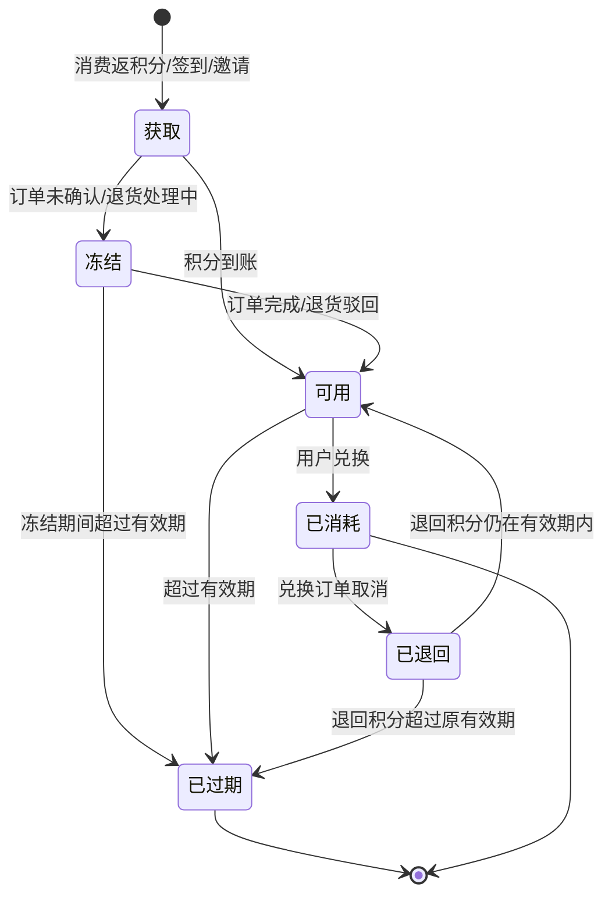

# 积分商城 PRD

## 1. 业务出发点 (Why & Who)

### 背景/痛点
- 平台有积分资产但缺乏消耗出口，积分堆积导致用户感知价值下降
- 缺少将积分转化为留存行为的闭环：用户获取积分后无使用场景，积分体系形同虚设
- 竞品普遍具备积分商城，作为留存和促活的标准手段

### 核心指标
- **积分消耗率**: 日均积分消耗量 / 日均积分获取量 ≥ 60%
- **留存提升**: 积分商城月活跃用户 30 日留存率相比全站提升 ≥ 5pp
- **兑换转化率**: 进入积分商城的用户中，完成至少一次兑换的占比 ≥ 20%

### 目标用户
- C 端已注册用户，拥有可用积分余额
- 特征：近 30 日有消费或活跃行为，积分余额 > 0

---

## 2. 术语定义 (Glossary)

| 术语 | 定义 |
|------|------|
| 积分 | 平台虚拟货币，用户通过消费、签到、邀请等方式获取，可用于兑换商品/优惠券/抽奖 |
| 可用积分 | 可立即用于兑换的积分余额，排除冻结积分 |
| 冻结积分 | 因订单未确认、退货处理中等原因暂时不可用的积分 |
| 商品 | 兑换标的，分为实物商品、优惠券、抽奖活动三类 |
| 兑换 | 用户使用积分换取商品的行为，一笔兑换产生一条兑换订单 |
| 过期积分 | 按积分有效期规则自动失效的积分，到期前应有提醒 |
| 安全库存 | 兑换商城中实际可售的库存量 = 总库存 - 已锁库存 |

---

## 3. 用户故事 (User Story)

### US-1: 浏览积分商城

**故事描述**: 作为一个有积分的 C 端用户，我想要浏览积分商城中的可兑换商品，以便了解我能用积分换到什么。

**验收标准**:
- [ ] 页面展示用户当前可用积分
- [ ] 商品按分类（实物/优惠券/抽奖）展示，支持筛选
- [ ] 每个商品显示所需积分、库存状态、兑换截止时间
- [ ] 用户积分不足以兑换时，商品不置灰但标记"积分不足"
- [ ] 商品列表支持按积分升序/降序排列

### US-2: 兑换实物商品

**故事描述**: 作为一个有积分的 C 端用户，我想要兑换实物商品，以便免费获得心仪的物品。

**验收标准**:
- [ ] 选择实物商品后跳转兑换确认页，展示商品详情、所需积分、预计发货时间
- [ ] 用户确认后扣减积分，生成兑换订单，引导填写收货地址
- [ ] 收货地址支持新增/编辑/删除，默认填充最近使用的地址
- [ ] 兑换成功后展示订单编号，可查看订单状态
- [ ] 单个用户对同一商品可兑换次数受限制（由运营配置）
- [ ] 兑换成功/失败有明确的页面提示和消息推送

### US-3: 兑换优惠券

**故事描述**: 作为一个有积分的 C 端用户，我想要用积分兑换优惠券，以便在购物时抵扣现金。

**验收标准**:
- [ ] 优惠券展示面额、使用门槛、有效期
- [ ] 兑换成功后优惠券即时到账，可在"我的优惠券"中查看
- [ ] 同一优惠券每人限兑 N 张（由运营配置）
- [ ] 优惠券兑换后不可退积分

### US-4: 积分抽奖

**故事描述**: 作为一个有积分的 C 端用户，我想要用小额积分参与抽奖，以便有机会获得高价值奖品。

**验收标准**:
- [ ] 抽奖页面展示奖品池、各奖品概率、单次消耗积分
- [ ] 支持单抽和连抽（N 连抽应享受积分折扣）
- [ ] 抽奖过程有动画交互，结果有明确展示
- [ ] 中奖后实物奖品引导填写地址，优惠券直接发放到账户
- [ ] 每日抽奖次数上限（防沉迷/防刷）
- [ ] 抽奖记录可在"我的抽奖记录"中查看

---

## 4. 功能清单 (Feature List)

| 模块 | 子功能 | 功能描述 | 优先级 | 迭代版本 |
|------|--------|----------|--------|----------|
| 积分商城首页 | 商城入口 | 首页/个人中心展示积分商城入口，带积分余额气泡 | P0 | V1.0 |
| 积分商城首页 | 商品列表 | 分类展示（实物/优惠券/抽奖），支持排序和筛选 | P0 | V1.0 |
| 积分商城首页 | 积分余额展示 | 实时展示可用积分，带积分获取引导链接 | P0 | V1.0 |
| 实物商品模块 | 商品详情页 | 展示商品图片、描述、所需积分、库存、限兑规则 | P0 | V1.0 |
| 实物商品模块 | 兑换确认 | 确认兑换页，扣减积分二次确认 | P0 | V1.0 |
| 实物商品模块 | 地址管理 | 收货地址增删改查，默认地址设置 | P0 | V1.0 |
| 实物商品模块 | 订单管理 | 兑换订单列表与详情，支持取消（未发货前） | P0 | V1.0 |
| 实物商品模块 | 物流追踪 | 已发货订单查看物流信息 | P1 | V1.1 |
| 优惠券模块 | 优惠券列表 | 可兑换优惠券展示，含面额/门槛/有效期 | P0 | V1.0 |
| 优惠券模块 | 兑换与到账 | 扣减积分后优惠券即时到账 | P0 | V1.0 |
| 优惠券模块 | 我的优惠券 | 已兑换优惠券查看（含使用/未使用/已过期状态） | P0 | V1.0 |
| 优惠券模块 | 优惠券使用引导 | 引导用户去消费页面使用优惠券 | P1 | V1.1 |
| 积分抽奖模块 | 抽奖主页 | 展示奖品池、概率公示、单次消耗积分、剩余次数 | P1 | V1.1 |
| 积分抽奖模块 | 抽奖动画 | 轮盘/九宫格抽奖动画 | P1 | V1.1 |
| 积分抽奖模块 | 中奖结果页 | 中奖展示，引导填写地址/查看优惠券 | P1 | V1.1 |
| 积分抽奖模块 | 抽奖记录 | 历史抽奖记录列表 | P1 | V1.1 |
| 积分体系 | 积分获取 | 消费返积分的计算与发放 | P0 | V1.0 |
| 积分体系 | 积分明细 | 流水记录：来源/数量/时间/过期时间 | P0 | V1.0 |
| 积分体系 | 积分过期提醒 | 即将过期积分推送通知 | P2 | V1.2 |
| 运营后台 | 商品管理 | 商品/优惠券/抽奖活动的增删改查、上下架 | P0 | V1.0 |
| 运营后台 | 库存管理 | 库存设置与预警 | P0 | V1.0 |
| 运营后台 | 兑换记录 | 兑换订单查询与导出 | P0 | V1.0 |
| 运营后台 | 抽奖配置 | 奖品池、概率、消耗积分、次数限制配置 | P1 | V1.1 |
| 运营后台 | 数据看板 | 积分商城核心指标看板 | P2 | V1.2 |

---

## 5. 严密的逻辑框架

### 5.1 整体业务流程



### 5.2 兑换订单状态机



### 5.3 积分生命周期状态机



### 5.4 兑换并发扣减逻辑

```mermaid
flowchart TD
    A[用户点击兑换] --> B[获取分布式锁: 商品ID]
    B --> C{获取锁成功?}
    C -->|否| D[返回"操作频繁，请稍后重试"]
    C -->|是| E[查询当前库存]
    E --> F{库存 > 0?}
    F -->|否| G[释放锁+返回"已售罄"]
    F -->|是| H{用户积分 >= 所需积分?}
    H -->|否| I[释放锁+返回"积分不足"]
    H -->|是| J[原子操作: 扣减库存-1]
    J --> K[原子操作: 扣减用户积分]
    K --> L[写入兑换订单记录]
    L --> M[写入积分流水]
    M --> N[释放锁]
    N --> O[返回兑换成功]
```

---

## 6. 功能详情与边界

### 6.1 实物商品兑换

#### 正常路径
1. 用户进入积分商城 → 选择实物分类 → 浏览商品列表
2. 点击商品进入详情页，查看商品图、描述、所需积分、库存
3. 点击"立即兑换" → 弹出二次确认弹窗（含积分扣减明细）
4. 确认 → 扣减积分 → 跳转订单页，引导填写收货地址
5. 填写地址后提交 → 订单状态更新为"待发货"
6. 运营后台审核发货 → 订单状态变为"已发货" → 推送物流通知
7. 用户确认收货 → 订单完成

#### 边界场景

| 场景 | 处理策略 |
|------|----------|
| 库存为 0 | 商品标记"已兑完"，不可点击兑换 |
| 积分不足 | 按钮置灰，hover 显示"积分不足，去获取积分"，点击跳转积分获取页 |
| 用户已达限兑上限 | 按钮显示"已达兑换上限"，不可兑换 |
| 兑换期间库存被抢光 | 高并发下通过分布式锁+库存扣减原子操作保证不超卖；用户侧返回"已售罄" |
| 扣减积分失败（网络超时） | 前端不可重复提交（按钮 loading + 防重），后端使用幂等键（request_id）防止重复扣减 |
| 用户下单后24小时未填地址 | 订单自动取消，积分全额退回，库存+1 |
| 用户收到货后退货 | 运营审核通过后积分退回用户账户（按原过期时间），库存+1 |
| 实物商品补货 | 运营后台修改库存后，商品从"已兑完"变回可兑换状态 |
| 断网场景 | 点击兑换按钮时检测网络，无网络时提示"网络异常，请检查后重试"，不发起请求 |
| 弱网场景 | 接口超时设为 10s，超时后前端展示"网络不稳定，请稍后查看兑换记录"；幂等机制保障后台一致性 |

### 6.2 优惠券兑换

#### 正常路径
1. 用户进入积分商城 → 选择优惠券分类
2. 浏览可兑换优惠券，查看面额、使用门槛、有效期
3. 点击"兑换" → 二次确认弹窗
4. 确认 → 扣减积分 → 优惠券即时到账
5. 展示"兑换成功"页 + "去逛逛"引导按钮

#### 边界场景

| 场景 | 处理策略 |
|------|----------|
| 已达限兑数量 | 按钮显示"已兑完（限兑N张）" |
| 优惠券库存耗尽 | 标记"已兑完"，不可兑换 |
| 重复兑换同一优惠券 | 用户已持有一张未使用的同类型券时，提示"你已拥有此优惠券"但不禁止兑换（由运营配置决定） |
| 优惠券兑换后不退 | 优惠券属于虚拟商品，兑换成功后积分不退 |
| 优惠券过期 | 优惠券到达有效期后自动标记"已过期"，过期前 3 天推送提醒 |

### 6.3 积分抽奖

#### 正常路径
1. 用户进入抽奖页面 → 查看奖品池和概率公示
2. 点击"抽一次"或"连抽 N 次"
3. 执行抽奖动画 → 展示中奖结果
4. 实物奖品 → 引导填写地址；优惠券 → 直接到账；未中奖 → 安慰提示

#### 边界场景

| 场景 | 处理策略 |
|------|----------|
| 每日抽奖次数用完 | 按钮置灰，显示"今日次数已用完，明天再来" |
| 积分不足 | 按钮置灰，引导获取积分 |
| 抽奖过程中退出页面 | 前端监听页面关闭事件，但后台已扣减积分 + 已生成结果，结果可在"抽奖记录"中查看 |
| 连抽时网络中断 | 幂等机制保障：已完成的抽奖不重复执行，中断的抽奖不扣积分 |
| 奖品库存不足 | 实时校验奖品库存，库存为 0 时该奖品不进入奖池；概率按预设的兜底奖品补齐 |
| 概率异常 | 运营后台设置概率总和必须 = 100%，否则不允许发布 |
| 防刷 | 同一设备每日抽奖上限 + 同一 IP 每日抽奖上限 + 验证码（极端频率时触发） |

### 6.4 积分体系

#### 积分获取规则

| 来源 | 计算规则 | 上限 | 有效期 |
|------|----------|------|--------|
| 消费返积分 | 实付金额 × 返积分比例（%） | 单笔上限 5000 积分 | 次年 12 月 31 日 |
| 每日签到 | 每日签到得 N 积分，连续签到递增（1→2→3→5→7→7→7...） | 断签重置 | 180 天 |
| 邀请好友 | 被邀请人注册成功得 100 积分，被邀请人首单完成再得 200 积分 | 月上限 5000 | 次年 12 月 31 日 |

#### 积分过期规则
- 积分按自然年批次过期：当年获取的积分于次年 12 月 31 日过期
- 兑换时优先消耗即将过期的积分（FIFO 过期时间）
- 积分退回时，原过期时间不变；若已过期则退回后立即过期

---

## 7. 技术约束与迁移

### 非功能需求

| 维度 | 要求 |
|------|------|
| 兑换接口响应时间 | P99 < 500ms |
| 并发处理 | 单个商品支持 1000 QPS 兑换请求，无超卖 |
| 分布式锁超时 | 单次兑换锁持有时间 < 200ms |
| 幂等性 | 所有兑换/抽奖接口使用 request_id 保证幂等 |
| 数据一致性 | 积分扣减、库存扣减、订单写入在同一数据库事务内完成 |
| 安全性 | 所有兑换接口校验用户身份（Token），积分扣减走服务端逻辑，禁止前端传积分值 |
| 可用性 | 积分商城核心接口可用性 ≥ 99.95% |

### 存量处理

| 事项 | 方案 |
|------|------|
| 已有积分用户 | V1.0 上线后，现有积分余额直接可用，无需迁移 |
| 已有积分流水 | 保持原有流水格式，V1.0 新增消耗流水的 `source_type=exchange` |
| 灰度开关 | 积分商城整体通过 feature flag 控制，支持按用户白名单/百分比灰度 |
| 商品数据初始化 | 运营在后台手动创建 V1.0 商品，无需数据迁移 |

---

## 8. 数据采集要求 (Tracking)

| 事件名 | 触发时机 | 参数 |
|--------|----------|------|
| `points_mall_enter` | 进入积分商城页面 | user_id, points_balance, from_page |
| `points_mall_browse` | 浏览商品列表 | user_id, category, page, item_count |
| `points_goods_view` | 查看商品详情 | user_id, goods_id, goods_type, points_required |
| `points_exchange_click` | 点击兑换按钮 | user_id, goods_id, goods_type, points_required, points_balance |
| `points_exchange_confirm` | 二次确认兑换 | user_id, goods_id, goods_type, points_cost |
| `points_exchange_success` | 兑换成功 | user_id, goods_id, goods_type, points_cost, order_id |
| `points_exchange_fail` | 兑换失败 | user_id, goods_id, reason（insufficient_points/sold_out/limit_reached/error） |
| `points_lottery_enter` | 进入抽奖页面 | user_id, points_balance, daily_draws_used |
| `points_lottery_draw` | 执行抽奖 | user_id, draw_type（single/multi）, draw_count, points_cost |
| `points_lottery_result` | 中奖结果展示 | user_id, prize_id, prize_type, draw_id |
| `points_address_fill` | 填写收货地址 | user_id, order_id, address_type（new/existing） |
| `points_coupon_use` | 使用已兑换优惠券 | user_id, coupon_id, order_amount, discount_amount |
| `points_expire_warning` | 积分过期提醒已读 | user_id, expire_points, expire_date |
