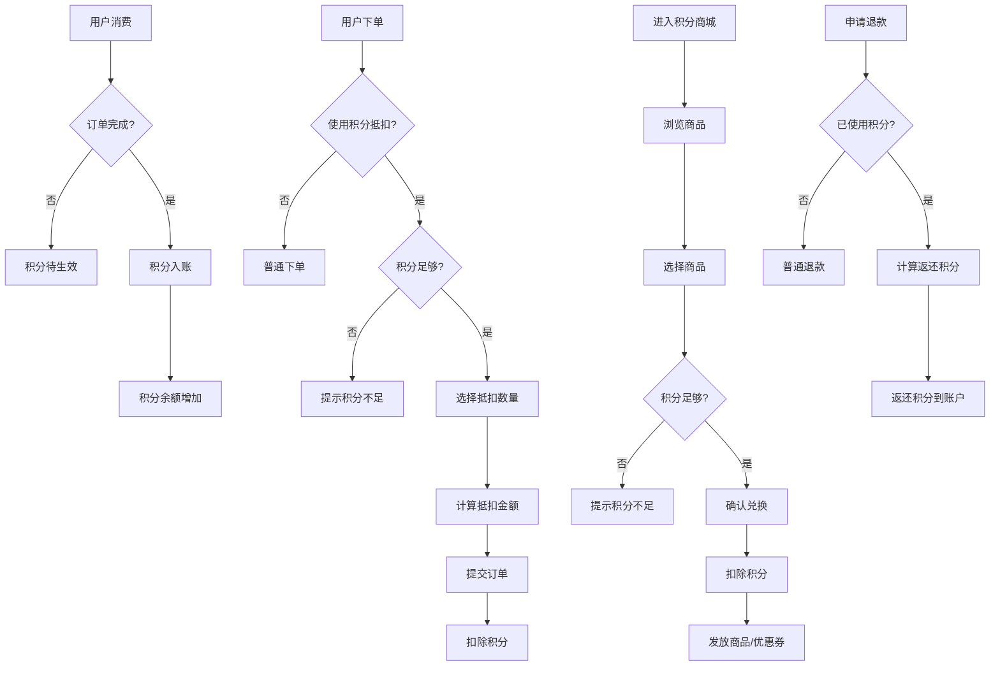
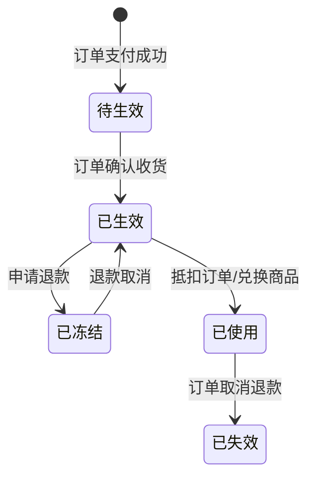

# 积分兑换功能 PRD

## 1. 业务出发点 (Why & Who)

### 背景/痛点

1. **用户留存问题**：电商平台用户复购率增长乏力，需要通过积分体系增强用户粘性
2. **用户价值感知弱**：用户消费后缺乏直接的回报反馈，削弱了持续消费的意愿
3. **竞品压力**：主流电商平台均已建立完善的积分体系，我方缺失该功能导致竞争力不足

### 核心指标

- **积分使用率**: 目标 ≥ 40%（历史积累积分被使用的比例）
- **兑换转化率**: 目标 ≥ 15%（访问积分商城的用户完成兑换的比例）
- **复购率提升**: 目标较上线前提升 10%

### 目标用户

- 所有已完成注册并有消费行为的电商平台用户
- 用户等级：无限制（所有用户均可参与）
- 平台：APP + Web 端

---

## 2. 术语定义 (Glossary)

| 术语 | 定义 |
|------|------|
| 积分余额 | 用户当前持有的可支配积分总数 |
| 待生效积分 | 订单已支付但未确认收货，暂不可用的积分 |
| 已冻结积分 | 因退款/售后等操作被冻结的积分 |
| 积分汇率 | 积分与人民币的兑换比例，当前为 100积分 = 1元 |
| 兑换商品 | 可用积分直接抵扣的实物商品或优惠券 |
| 抵扣订单 | 使用积分抵扣订单金额的场景 |

---

## 3. 用户故事 (User Story)

### 故事 1：查看积分

**故事描述**: 作为一个电商用户，我想要查看我的积分余额和积分明细，以便了解我的积分来源和使用情况

**验收标准**:
- [ ] 用户可以在个人中心查看当前积分余额
- [ ] 用户可以查看积分收入/支出的明细记录
- [ ] 明细记录包含时间、事件、积分变动数量
- [ ] 明细支持分页加载，每次加载 20 条

---

### 故事 2：积分抵现

**故事描述**: 作为一个电商用户，我想要在下单时使用积分抵扣订单金额，以便获得价格优惠

**验收标准**:
- [ ] 结算页显示可用积分数量和可抵扣金额
- [ ] 用户可选择使用的积分数量（100 积分起兑）
- [ ] 抵扣金额实时计算并展示
- [ ] 订单提交后积分实时扣除
- [ ] 积分不足时提示用户

---

### 故事 3：积分兑换商品

**故事描述**: 作为一个电商用户，我想要进入积分商城兑换商品，以便使用积分换取实物或优惠券

**验收标准**:
- [ ] 用户可以浏览积分商城的商品列表
- [ ] 商品列表显示名称、所需积分、库存状态
- [ ] 用户可以查看商品详情
- [ ] 用户可以立即兑换（积分足够时）
- [ ] 兑换成功后发放至用户账户

---

### 故事 4：退款退还积分

**故事描述**: 作为一个电商用户，当我申请订单退款时，系统应当退还我之前使用的积分

**验收标准**:
- [ ] 用户申请退款时，系统计算已使用的积分
- [ ] 退款成功后，积分自动返还至用户账户
- [ ] 积分返还记录在明细中显示

---

## 4. 功能清单 (Feature List)

| 模块 | 子功能 | 功能描述 | 优先级 | 迭代版本 |
|------|--------|----------|--------|----------|
| 积分账户 | 积分余额展示 | 在个人中心展示用户当前积分余额 | P0 | V1.0 |
| 积分账户 | 积分明细 | 展示积分收入/支出的详细记录 | P0 | V1.0 |
| 积分账户 | 积分入账 | 订单完成后根据消费金额发放积分 | P0 | V1.0 |
| 积分抵扣 | 结算页抵扣入口 | 在订单结算页显示积分抵扣选项 | P0 | V1.0 |
| 积分抵扣 | 抵扣计算 | 根据输入积分计算抵扣金额 | P0 | V1.0 |
| 积分抵扣 | 抵扣下单 | 提交订单时扣除相应积分 | P0 | V1.0 |
| 积分商城 | 商品列表 | 展示可兑换的实物商品和优惠券 | P0 | V1.0 |
| 积分商城 | 商品详情 | 展示商品详情和兑换按钮 | P0 | V1.0 |
| 积分商城 | 立即兑换 | 执行积分兑换操作 | P0 | V1.0 |
| 积分商城 | 兑换记录 | 展示用户的历史兑换记录 | P1 | V1.0 |
| 售后场景 | 退款还积分 | 订单退款时返还已使用的积分 | P0 | V1.0 |
| 售后场景 | 部分退款 | 部分退款时按比例返还积分 | P1 | V1.1 |

---

## 5. 严密的逻辑框架

### 业务流程图

### 积分状态机

### 积分抵扣计算规则

| 场景 | 规则 |
|------|------|
| 积分汇率 | 100 积分 = 1 元 |
| 最低起兑 | 100 积分 |
| 单笔最高抵扣 | 订单金额的 30% |
| 积分使用单位 | 100 的整数倍 |

### 积分发放规则

| 场景 | 规则 |
|------|------|
| 发放时机 | 订单确认收货后 |
| 发放比例 | 1 元 = 1 积分 |
| 积分取整 | 向下取整 |
| 退款订单 | 已发放积分原路扣回 |

---

## 6. 功能详情与边界

### 6.1 积分账户

#### 正常路径

1. **查看余额**
   - 用户进入个人中心
   - 系统查询用户积分余额
   - 页面展示当前积分数量

2. **积分明细**
   - 用户点击积分明细入口
   - 系统查询积分变动记录
   - 列表展示：时间、事件类型(+/-)、积分数量、备注

3. **积分入账**
   - 订单确认收货
   - 系统计算积分：订单实付金额 × 1
   - 积分写入用户账户
   - 记录积分明细

#### 边界场景

- **订单部分退款**：已发放积分按退款金额比例扣回
- **积分系统故障**：记录积分流水，后台异步补账
- **并发入账**：使用分布式锁保证积分计算的准确性

---

### 6.2 积分抵扣

#### 正常路径

1. 用户进入结算页
2. 系统查询用户可用积分
3. 页面展示"可用 X 积分，可抵 Y 元"
4. 用户输入要使用的积分数量（或滑动选择）
5. 系统实时计算抵扣金额并更新总价
6. 用户提交订单
7. 系统扣除积分，生成积分流水
8. 订单创建成功

#### 边界场景

| 场景 | 处理方案 |
|------|----------|
| 输入积分 > 可用积分 | 提示"积分不足"，自动调整为最大可用积分 |
| 输入积分 < 100 | 提示"最低使用 100 积分" |
| 非100整数倍 | 自动取整到100的整数倍 |
| 抵扣后金额 ≤ 0 | 提示"订单金额已为0，无需使用积分" |
| 网络超时 | 提示"网络异常，请稍后重试"，不扣除积分 |
| 订单提交失败 | 积分不扣除，原单重试 |

---

### 6.3 积分商城

#### 正常路径

1. 用户进入积分商城
2. 系统查询可兑换商品列表
3. 页面分类展示：实物商品、优惠券
4. 用户点击商品查看详情
5. 用户点击"立即兑换"
6. 系统校验积分充足
7. 扣除积分
8. 发放商品/优惠券到账户
9. 展示兑换成功提示

#### 边界场景

| 场景 | 处理方案 |
|------|----------|
| 库存不足 | 展示"已抢光"，不可点击 |
| 积分不足 | 按钮置灰，提示"还差 X 积分" |
| 兑换数量超限 | 提示"该商品每人限兑 N 件" |
| 优惠券已领完 | 展示"已领完"状态 |
| 并发兑换 | 库存扣减使用乐观锁，超库存则兑换失败 |

---

### 6.4 退款返还积分

#### 正常路径

1. 用户申请订单退款
2. 系统判断订单是否使用过积分抵扣
3. 如有，计算应返还积分数量
4. 用户确认退款
5. 退款成功后，积分返还至用户账户
6. 记录积分返还明细

#### 边界场景

| 场景 | 处理方案 |
|------|----------|
| 部分退款 | 按退款金额比例返还积分 |
| 积分已使用部分抵扣 | 仅返还已使用的积分 |
| 积分已入账后被使用 | 返还后可能为负（不允退款，需人工介入） |

---

## 7. 技术约束与迁移

### 非功能需求

| 指标 | 要求 |
|------|------|
| API 响应时间 | < 200ms（P99 < 500ms） |
| QPS 峰值 | 支持 10000 QPS |
| 可用性 | 99.9% |
| 积分计算准确性 | 100%，不允许丢失 |

### 安全要求

- 积分操作需登录态验证
- 积分扣减使用数据库事务保证一致性
- 防止恶意刷积分：同一用户/设备/IP 限频限次
- 积分流水需持久化存储，支持追溯

### 存量处理

- **历史数据**：上线前已存在的用户积分保持不变
- **灰度开关**：支持按用户 ID 灰度开启功能
- **配置中心**：积分汇率、抵扣比例等参数通过配置中心管理

---

## 8. 数据采集要求 (Tracking)

| 事件名 | 触发时机 | 参数 |
|--------|----------|------|
| point_balance_view | 用户进入积分页面 | user_id, balance, page_source |
| point_detail_load | 加载积分明细 | user_id, page, page_size |
| point_deduction_click | 点击使用积分抵扣 | user_id, order_id, available_point |
| point_deduction_submit | 提交积分抵扣 | user_id, order_id, used_point, deducted_amount |
| point_mall_enter | 进入积分商城 | user_id, entry_source |
| point_mall_item_click | 点击商品 | user_id, item_id, item_type |
| point_exchange_click | 点击立即兑换 | user_id, item_id, item_price |
| point_exchange_success | 兑换成功 | user_id, item_id, item_type, point_spent |
| point_exchange_fail | 兑换失败 | user_id, item_id, fail_reason |
| refund_point_return | 退款返还积分 | user_id, order_id, returned_point |

---

## 9. 迭代计划

### V1.0（MVP）

- 积分账户展示
- 积分明细查询
- 积分入账（消费获得）
- 积分抵扣订单
- 积分商城商品列表
- 积分兑换商品
- 退款返还积分

### V1.1（优化版）

- 积分抽奖活动
- 限时折扣兑换
- 部分退款按比例返还积分
- 积分到期提醒通知

### V2.0（增强版）

- 积分转让/赠送
- 积分任务体系
- 会员等级与积分联动
