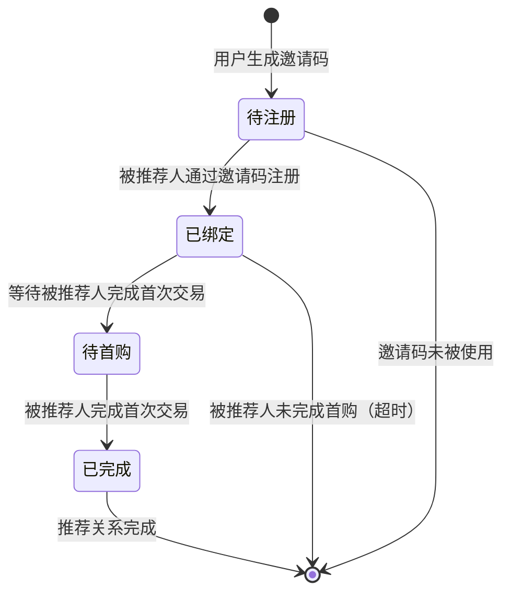

# 积分兑换系统 PRD

## 1. 业务出发点 (Why & Who)

### 背景/痛点
当前产品用户增长主要依赖自然流量，获客成本高且增长缓慢。需要通过推荐裂变机制，利用现有用户社交关系链实现低成本用户增长。

### 核心指标
- **用户裂变数**: 每月通过推荐注册的新用户数 ≥ 5,000
- **推荐转化率**: 老用户推荐参与率 ≥ 15%
- **被推荐用户留存率**: 被推荐用户 7 日留存率 ≥ 30%

### 目标用户
- **C端用户**: 通过分享邀请码获得积分奖励，用积分兑换商品
- **运营人员**: 配置积分规则、管理商品、监控裂变数据

---

## 2. 术语定义

| 术语 | 定义 |
|------|------|
| 推荐人 | 发起邀请并分享邀请码给好友的现有用户 |
| 被推荐人 | 通过邀请码完成注册的新用户 |
| 邀请码 | 系统生成的唯一标识码，用于绑定推荐关系 |
| 积分 | 用户通过推荐行为获得的虚拟货币，用于兑换商品 |
| 积分商城 | 用户使用积分兑换商品的平台 |
| 有效推荐 | 被推荐人通过邀请码注册成功且完成首次交易 |
| 双向奖励 | 推荐成功后，推荐人和被推荐人都获得积分奖励 |

---

## 3. 用户故事

### 故事 1: 推荐人分享邀请码
**故事描述**: 作为一个 `C端用户`, 我想要 `分享我的邀请码给好友`, 以便 `获得积分奖励`

**验收标准**:
- [ ] 可在"我的邀请码"页面查看专属邀请码
- [ ] 支持一键分享邀请码到微信、朋友圈、QQ等社交平台
- [ ] 支持复制邀请码链接
- [ ] 显示我的推荐人数和已获得的积分奖励

### 故事 2: 被推荐人注册
**故事描述**: 作为一个 `新用户`, 我想要 `通过邀请码注册`, 以便 `获得新手积分奖励`

**验收标准**:
- [ ] 注册流程支持输入邀请码
- [ ] 通过邀请链接注册时自动绑定推荐关系
- [ ] 注册成功后显示"获得XX积分"的提示
- [ ] 积分实时到账且可在积分中心查看

### 故事 3: 被推荐人完成首次交易
**故事描述**: 作为一个 `被推荐用户`, 我想要 `完成首次交易后获得额外积分`, 以便 `兑换心仪商品`

**验收标准**:
- [ ] 首次交易成功后触发积分奖励
- [ ] 推荐人和被推荐人都收到积分到账通知
- [ ] 积分明细清晰显示积分来源（推荐奖励/首购奖励）

### 故事 4: 积分兑换商品
**故事描述**: 作为一个 `用户`, 我想要 `在积分商城用积分兑换商品`, 以便 `将积分转化为实际价值`

**验收标准**:
- [ ] 可浏览积分商城所有可兑换商品
- [ ] 显示商品所需积分和库存
- [ ] 积分足时支持一键兑换
- [ ] 兑换成功后显示订单信息
- [ ] 积分不足时提示"还差XX积分"

### 故事 5: 运营配置规则
**故事描述**: 作为一个 `运营人员`, 我想要 `配置积分奖励规则`, 以便 `控制推荐裂变的激励力度`

**验收标准**:
- [ ] 可设置注册成功奖励积分（推荐人/被推荐人）
- [ ] 可设置首次交易奖励积分（推荐人/被推荐人）
- [ ] 支持启用/禁用推荐功能
- [ ] 可查看推荐裂变数据报表

---

## 4. 功能清单

| 模块 | 子功能 | 功能描述 | 优先级 | 迭代版本 |
|------|--------|----------|--------|----------|
| 邀请码管理 | 生成邀请码 | 为每个用户生成唯一邀请码 | P0 | V1.0 |
| | 查看邀请码 | 用户查看自己的专属邀请码 | P0 | V1.0 |
| | 分享邀请码 | 一键分享到社交平台/复制链接 | P0 | V1.0 |
| 推荐关系绑定 | 邀请码注册 | 新用户注册时填写邀请码 | P0 | V1.0 |
| | 链接注册 | 通过邀请链接注册自动绑定关系 | P0 | V1.0 |
| | 关系验证 | 验证推荐关系有效性（防止自己推荐自己） | P0 | V1.0 |
| 积分发放 | 注册奖励 | 被推荐人注册成功，双方获得积分 | P0 | V1.0 |
| | 首购奖励 | 被推荐人完成首次交易，双方获得积分 | P0 | V1.0 |
| | 积分通知 | 积分到账时推送站内信/推送通知 | P1 | V1.0 |
| 积分账户 | 积分查询 | 查看当前积分余额 | P0 | V1.0 |
| | 积分明细 | 查看积分获取和消费记录 | P0 | V1.0 |
| | 推荐统计 | 查看成功推荐人数、累计获得积分 | P0 | V1.0 |
| 积分商城 | 商品浏览 | 浏览可兑换的商品列表 | P0 | V1.0 |
| | 商品详情 | 查看商品详情、所需积分、库存 | P0 | V1.0 |
| | 积分兑换 | 使用积分兑换商品 | P0 | V1.0 |
| | 兑换记录 | 查看历史兑换订单 | P1 | V1.0 |
| | 地址管理 | 兑换实物商品时填写收货地址 | P1 | V1.0 |
| 后台管理 | 规则配置 | 设置各项行为的积分奖励值 | P0 | V1.0 |
| | 商品管理 | 上架/下架积分商城商品，设置库存 | P0 | V1.0 |
| | 数据报表 | 查看推荐裂变数据、积分发放统计 | P1 | V1.1 |
| | 订单管理 | 处理积分兑换订单（发货） | P1 | V1.0 |

---

## 5. 严密的逻辑框架

### 5.1 推荐裂变业务流程

```mermaid
flowchart TD
    A[老用户A分享邀请码] --> B[新用户B接收邀请]
    B --> C{用户B是否已注册?}
    C -->|是| D[提示"该账号已注册"]
    C -->|否| E[用户B填写邀请码注册]
    E --> F[注册成功]
    F --> G[推荐人A获得注册奖励积分]
    F --> H[被推荐人B获得注册奖励积分]
    H --> I{用户B完成首次交易?}
    I -->|否| J[流程结束]
    I -->|是| K[交易成功]
    K --> L[推荐人A获得首购奖励积分]
    K --> M[被推荐人B获得首购奖励积分]
    G --> N[积分到账通知]
    H --> N
    L --> N
    M --> N
    N --> O[用户在积分商城兑换商品]
```

### 5.2 积分兑换流程

```mermaid
flowchart TD
    A[用户浏览积分商城] --> B[选择商品]
    B --> C[查看商品详情]
    C --> D{点击兑换}
    D --> E{用户积分是否足够?}
    E -->|否| F[提示"积分不足，还差XX积分"]
    F --> G[引导用户去做任务获取积分]
    E -->|是| H{实物商品?}
    H -->|是| I[填写收货地址]
    H -->|否| J[虚拟商品直接发放]
    I --> K[确认兑换]
    J --> K
    K --> L[扣除积分]
    L --> M[生成兑换订单]
    M --> N[扣减商品库存]
    N --> O[兑换成功提示]
```

### 5.3 推荐关系状态机



---

## 6. 功能详情与边界

### 6.1 邀请码管理

#### 正常路径
- 用户登录后可在"我的邀请码"页面查看专属邀请码
- 邀请码格式: 8位字母+数字组合，如 `A3B9C7D2`
- 支持生成邀请海报（包含邀请码和二维码）
- 一键分享: 微信好友、朋友圈、QQ、复制链接

#### 边界场景
- **邀请码重复**: 系统生成时需校验唯一性，如重复则重新生成
- **邀请码泄露**: 邀请码本身不包含敏感信息，泄露无安全风险
- **用户被封禁**: 封禁用户的邀请码自动失效，新用户无法使用

### 6.2 推荐关系绑定

#### 正常路径
- 方式1: 新用户注册时输入邀请码
- 方式2: 点击邀请链接注册，系统自动填充邀请码
- 推荐关系绑定后不可变更

#### 边界场景
- **自己推荐自己**: 系统校验被推荐人不能是推荐人本人
- **循环推荐**: A推荐B，B推荐A，系统校验已注册用户不能作为被推荐人
- **邀请码过期**: 邀请码永久有效，除非推荐人被封禁
- **多个邀请码**: 一个新用户只能绑定一个推荐人，以后者为准
- **弱网场景**: 注册时网络中断，恢复后需重新提交，幂等性保证不重复发放积分

### 6.3 积分发放

#### 正常路径
- 注册奖励: 被推荐人注册成功后，双方各获得 `X` 积分（可配置）
- 首购奖励: 被推荐人完成首次交易后，双方各获得 `Y` 积分（可配置）
- 积分实时到账
- 触发通知: 站内信 + App推送

#### 边界场景
- **并发注册**: 多个被推荐人同时注册，通过分布式锁保证积分发放准确性
- **交易退款**: 被推荐人首单退款，已发放的积分不扣除（一次性奖励）
- **作弊刷单**: 同设备/同IP批量注册触发风控，暂缓发放积分待人工审核
- **积分发放失败**: 因系统故障导致积分发放失败，通过补偿机制重试，最大重试3次
- **重复发放**: 幂等性设计，同一推荐行为只发放一次积分

### 6.4 积分兑换

#### 正常路径
- 用户在积分商城选择商品
- 系统校验积分余额 ≥ 商品所需积分
- 实物商品: 填写收货地址 → 确认兑换 → 扣除积分 → 生成订单
- 虚拟商品: 确认兑换 → 扣除积分 → 直接发放（优惠券/会员卡等）

#### 边界场景
- **积分不足**: 提示"积分不足，还差XX积分"，引导去邀请好友
- **库存不足**: 商品库存为0时，商品置灰且显示"已兑完"
- **兑换后退款**: 实物商品发货前支持取消兑换，积分退还；发货后不支持退款
- **高并发兑换**: 秒杀场景下，通过Redis分布式锁保证库存扣减准确性，避免超卖
- **网络中断**: 兑换请求发出后网络中断，用户端显示"兑换处理中"，后台异步处理
- **重复点击**: 前端防抖 + 后端幂等性校验，避免重复扣除积分

### 6.5 积分账户

#### 正常路径
- 显示当前积分余额
- 积分明细: 时间、类型（注册奖励/首购奖励/兑换消费）、变化值、余额
- 推荐统计: 成功推荐人数、累计获得积分、待到账积分

#### 边界场景
- **数据同步延迟**: 积分变化后可能存在秒级延迟，提示"数据可能延迟"
- **历史数据量大**: 积分明细分页加载，每页20条，按时间倒序
- **积分为负**: 不允许出现负积分，兑换时前置校验

### 6.6 后台管理

#### 正常路径
- 运营人员登录后台，配置积分规则、管理商品、查看数据
- 规则变更实时生效
- 数据报表支持按日期、渠道等维度筛选

#### 边界场景
- **权限控制**: 不同角色有不同权限，普通运营不可修改关键规则
- **规则冲突**: 新旧规则切换时，以行为发生时的规则为准
- **数据导出**: 报表导出最大支持10万行，超时需异步处理

---

## 7. 技术约束与迁移

### 非功能需求

| 指标 | 要求 |
|------|------|
| 接口响应时间 | ≤ 500ms (P95) |
| 积分发放成功率 | ≥ 99.9% |
| 系统可用性 | ≥ 99.9% |
| 并发支持 | 推荐注册 1000 QPS，积分兑换 500 QPS |
| 数据一致性 | 积分变动最终一致性，延迟 ≤ 1s |

### 安全性
- 邀请码不可猜测（随机生成 + 足够长度）
- 接口防刷: 限流、签名校验
- 防作弊: 设备指纹、IP风控、行为分析

### 存量处理
- 无存量数据，新系统从零开始
- 支持灰度发布: 按用户ID哈希分流，逐步放开推荐功能

---

## 8. 数据采集要求 (Tracking)

| 事件名 | 触发时机 | 参数 |
|--------|----------|------|
| invite_code_view | 用户查看邀请码页面 | user_id, timestamp |
| invite_code_share | 用户点击分享邀请码 | user_id, share_channel(wechat/friend/qq/copy), timestamp |
| invite_code_click | 被推荐人点击邀请链接 | invite_code, device_id, ip, timestamp |
| register_success | 新用户注册成功 | user_id, invite_code, device_id, ip, timestamp |
| first_purchase | 被推荐人完成首次交易 | user_id, order_id, transaction_amount, timestamp |
| points_awarded | 积分到账 | user_id, points, reason(register/first_purchase), timestamp |
| mall_view | 用户浏览积分商城 | user_id, timestamp |
| product_view | 用户查看商品详情 | user_id, product_id, timestamp |
| exchange_click | 用户点击兑换按钮 | user_id, product_id, points_cost, timestamp |
| exchange_success | 兑换成功 | user_id, order_id, product_id, points_cost, timestamp |
| exchange_fail | 兑换失败 | user_id, product_id, fail_reason(insufficient_points/insufficient_stock), timestamp |

---

## 9. 附录

### 9.1 积分规则初始配置

| 行为 | 推荐人奖励 | 被推荐人奖励 |
|------|-----------|-------------|
| 注册成功 | 100 积分 | 50 积分 |
| 首次交易 | 200 积分 | 100 积分 |

### 9.2 商品积分示例

| 商品类型 | 所需积分 |
|---------|---------|
| 10元优惠券 | 500 积分 |
| 50元优惠券 | 2000 积分 |
| 实物商品（价值50元） | 2500 积分 |
| 会员月卡 | 1500 积分 |

---

**版本**: V1.0
**文档状态**: 待评审
**最后更新**: 2025-01-12
