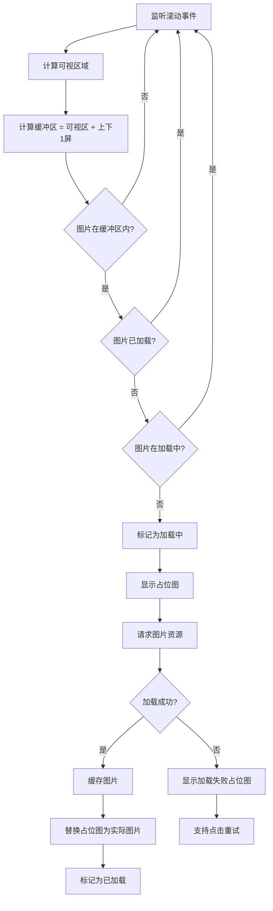

# 移动端瀑布流页面 PRD

## 1. 业务出发点 (Why & Who)

### 背景/痛点
当前内容列表采用传统单列布局，用户在一屏内可浏览内容数量少，需要频繁滑动才能看到更多内容，导致浏览深度不足、停留时长较短。参考小红书、Pinterest等产品，瀑布流布局能在单屏内展示更多内容，提升视觉吸引力和浏览效率。

### 核心指标
- **浏览深度**: 单用户平均浏览卡片数 ≥ 50 张
- **停留时长**: 单用户平均页面停留时长 ≥ 3 分钟
- **滑到底部比例**: 滑动到页面底部的用户占比 ≥ 40%

### 目标用户
- **C端用户**: 浏览 UGC 图片内容，发现感兴趣的内容

---

## 2. 术语定义

| 术语 | 定义 |
|------|------|
| 瀑布流 | 内容卡片按列排列，每列卡片高度不固定，新卡片自动填充到高度最短的列 |
| 懒加载 | 图片进入可视区域（或即将进入）时才开始加载，减少初始加载压力 |
| 预加载 | 提前加载可视区域前后若干张图片，保证滑动流畅性 |
| 占位图 | 图片加载前显示的灰色占位块，避免布局抖动 |
| 卡片 | 瀑布流中的单个内容单元，包含图片、标题、用户信息、互动按钮等 |
| 可视区域 | 用户当前屏幕可见的内容范围 |
| 缓冲区 | 可视区域上下扩展的区域，用于提前加载即将显示的内容 |

---

## 3. 用户故事

### 故事 1: 浏览瀑布流内容
**故事描述**: 作为一个 `用户`, 我想要 `浏览瀑布流图片内容`, 以便 `快速发现感兴趣的内容`

**验收标准**:
- [ ] 页面加载时显示首屏内容（约10-15张卡片）
- [ ] 卡片按2-4列响应式布局（小屏2列，中屏3列，大屏4列）
- [ ] 图片保持原始宽高比，卡片高度自适应
- [ ] 内容按发布时间倒序排列

### 故事 2: 滚动加载更多
**故事描述**: 作为一个 `用户`, 我想要 `滑动到底部时自动加载更多内容`, 以便 `持续浏览无需手动操作`

**验收标准**:
- [ ] 滑动到距离底部约2屏位置时自动触发加载
- [ ] 每次加载20条新内容
- [ ] 加载中显示"加载中..."占位提示
- [ ] 加载完成后新内容自动插入瀑布流底部
- [ ] 所有内容加载完毕显示"没有更多了"

### 故事 3: 图片懒加载
**故事描述**: 作为一个 `用户`, 我想要 `图片在滚动到可见位置时才加载`, 以便 `页面加载更快、滑动更流畅`

**验收标准**:
- [ ] 初始页面只加载首屏图片
- [ ] 图片进入可视区域前1屏开始加载（预加载）
- [ ] 加载前显示灰色占位图，避免布局抖动
- [ ] 加载失败显示"图片加载失败"占位图
- [ ] 已加载图片缓存，回退时不重新加载

### 故事 4: 下拉刷新
**故事描述**: 作为一个 `用户`, 我想要 `下拉刷新获取最新内容`, 以便 `看到最新发布的内容`

**验收标准**:
- [ ] 页面顶部支持下拉手势
- [ ] 下拉时显示刷新动画
- [ ] 释放后触发刷新，加载最新20条内容
- [ ] 刷新成功后，瀑布流重置为最新内容
- [ ] 刷新失败时提示"刷新失败，请重试"

### 故事 5: 点击卡片交互
**故事描述**: 作为一个 `用户`, 我想要 `点击卡片查看详情/点赞/收藏/分享`, 以便 `与内容互动`

**验收标准**:
- [ ] 点击卡片图片区域跳转到详情页
- [ ] 点击点赞按钮切换点赞状态（红心点亮/熄灭）
- [ ] 点击收藏按钮切换收藏状态（星标点亮/熄灭）
- [ ] 点击分享按钮调起系统分享面板
- [ ] 点击图片触发图片预览（放大查看）

### 故事 6: 图片预览
**故事描述**: 作为一个 `用户`, 我想要 `点击图片放大查看细节`, 以便 `更清晰地查看图片内容`

**验收标准**:
- [ ] 点击卡片图片打开全屏图片预览
- [ ] 支持双指缩放
- [ ] 支持左右滑动查看该卡片的其他图片（如有）
- [ ] 点击关闭按钮或空白区域关闭预览
- [ ] 预览时显示图片描述和作者信息

---

## 4. 功能清单

| 模块 | 子功能 | 功能描述 | 优先级 | 迭代版本 |
|------|--------|----------|--------|----------|
| 瀑布流布局 | 响应式列数 | 小屏2列，中屏3列，大屏4列 | P0 | V1.0 |
| | 卡片渲染 | 卡片包含图片、标题、作者信息、互动数据 | P0 | V1.0 |
| | 高度计算 | 根据图片实际宽高比计算卡片高度 | P0 | V1.0 |
| | 列平衡 | 新卡片插入高度最短的列 | P0 | V1.0 |
| 滚动加载 | 触发加载 | 距离底部2屏时触发加载 | P0 | V1.0 |
| | 分页请求 | 每次请求20条新内容 | P0 | V1.0 |
| | 加载状态 | 显示加载中/加载失败/无更多数据 | P0 | V1.0 |
| | 去重处理 | 已加载内容不重复插入 | P1 | V1.0 |
| 图片懒加载 | 可视区域检测 | 监听滚动，检测图片是否进入缓冲区 | P0 | V1.0 |
| | 预加载策略 | 进入可视区域前1屏开始加载 | P0 | V1.0 |
| | 占位图 | 加载前显示灰色占位块 | P0 | V1.0 |
| | 失败处理 | 加载失败显示占位提示 | P1 | V1.0 |
| | 图片缓存 | 已加载图片缓存，回退不重载 | P0 | V1.0 |
| 下拉刷新 | 手势识别 | 识别下拉手势并触发刷新 | P0 | V1.0 |
| | 刷新动画 | 下拉时显示刷新动画 | P0 | V1.0 |
| | 内容重置 | 刷新成功后重置为最新内容 | P0 | V1.0 |
| | 失败重试 | 刷新失败可重试 | P1 | V1.0 |
| 卡片交互 | 点击跳转 | 点击图片跳转详情页 | P0 | V1.0 |
| | 点赞 | 点赞按钮切换状态，数量+1/-1 | P0 | V1.0 |
| | 收藏 | 收藏按钮切换状态 | P0 | V1.0 |
| | 分享 | 调起系统分享面板 | P1 | V1.0 |
| 图片预览 | 全屏预览 | 点击图片打开全屏预览 | P0 | V1.0 |
| | 手势缩放 | 支持双指缩放 | P0 | V1.0 |
| | 左右滑动 | 多图时支持左右滑动 | P1 | V1.1 |
| | 关闭预览 | 点击关闭按钮或空白区域关闭 | P0 | V1.0 |

---

## 5. 严密的逻辑框架

### 5.1 页面加载与滚动流程

```mermaid
flowchart TD
    A[用户打开页面] --> B[请求首屏数据20条]
    B --> C{请求成功?}
    C -->|是| D[渲染首屏卡片]
    C -->|否| E[显示加载失败重试按钮]
    D --> F[加载首屏图片]
    F --> G[用户开始滑动]
    G --> H{距离底部 < 2屏?}
    H -->|否| G
    H -->|是| I{正在加载?}
    I -->|是| G
    I -->|否| J[触发加载下一页]
    J --> K[请求下一页数据20条]
    K --> L{请求成功?}
    L -->|是| M[插入新卡片到瀑布流]
    L -->|否| N[显示加载失败提示]
    M --> O[懒加载新卡片图片]
    O --> P{还有更多数据?}
    P -->|是| G
    P -->|否| Q[显示"没有更多了"]
```

### 5.2 图片懒加载流程



### 5.3 下拉刷新流程

```mermaid
flowchart TD
    A[用户下拉页面] --> B{下拉距离 > 阈值?}
    B -->|否| A
    B -->|是| C[显示刷新动画]
    C --> D[用户释放手指]
    D --> E[请求最新数据20条]
    E --> F{请求成功?}
    F -->|是| G[清空当前瀑布流]
    G --> H[渲染最新内容]
    H --> I[重置滚动位置到顶部]
    F -->|否| J[显示"刷新失败"提示]
    J --> K[恢复原瀑布流内容]
```

---

## 6. 功能详情与边界

### 6.1 瀑布流布局

#### 正常路径
- 响应式布局: 屏幕宽度 < 375px → 2列，375-768px → 3列，> 768px → 4列
- 卡片宽度 = (屏幕宽度 - 列间距 × (列数+1)) / 列数
- 卡片高度 = 卡片宽度 / 图片原始宽高比 + 标题高度 + 作者信息高度
- 新卡片插入到当前高度最短的列

#### 边界场景
- **图片高度差异大**: 极长图片（如9:16）和极宽图片（如16:9）混排，限制单张卡片最大高度不超过屏幕高度的2倍，超过部分截断显示"查看更多"
- **空数据**: 瀑布流无内容时显示"暂无内容"空状态页
- **单条数据**: 仅1条数据时仍按瀑布流布局（居中显示）
- **屏幕旋转**: 横竖屏切换时重新计算列数和卡片布局，可能出现短暂重排
- **图片加载失败**: 失败图片占位高度固定为卡片宽度的1倍

### 6.2 滚动加载

#### 正常路径
- 监听滚动事件，计算 `滚动位置 + 可视高度 >= 总高度 - 2屏高度`
- 满足条件时触发下一页加载
- 每次请求20条数据
- 加载成功后将新卡片追加到瀑布流

#### 边界场景
- **快速滑动**: 用户快速滑动触发多次加载，通过 `isLoading` 标志位防止重复请求
- **网络慢**: 加载请求超过3秒未响应显示"加载较慢..."，超过10秒超时失败
- **断网**: 请求失败显示"网络异常，点击重试"，支持手动点击重试
- **无更多数据**: 后端返回空列表时显示"没有更多了"，不再触发加载
- **数据去重**: 如果网络延迟导致重复请求同一页，通过内容ID去重避免重复插入
- **页面离开**: 用户滑动中途离开页面（如跳转详情），回来时保持滚动位置，不重新触发加载

### 6.3 图片懒加载

#### 正常路径
- 使用 Intersection Observer API 监听图片是否进入缓冲区
- 缓冲区 = 可视区域 + 向上1屏 + 向下1屏
- 图片进入缓冲区且未加载时，触发图片加载
- 加载前显示灰色占位图（#F0F0F0）
- 加载完成后替换占位图

#### 边界场景
- **快速滑动**: 用户快速滑动导致大量图片瞬间进入缓冲区，通过并发限制（最多同时加载6张）避免网络拥堵
- **回退查看**: 用户滑动到底部后快速回到顶部，已加载图片从缓存读取不重新请求
- **弱网环境**: 图片加载超过5秒未响应显示"图片加载失败"，支持点击重试
- **图片资源不存在**: 404时显示"图片加载失败"占位图
- **内存占用**: 缓存图片数量限制为最近100张，超出后释放最早加载的图片内存
- **占位图高度**: 在获取图片实际尺寸前，使用卡片宽度的1倍作为占位高度，获取到尺寸后动态调整卡片高度（可能引起布局抖动，但可接受）

### 6.4 下拉刷新

#### 正常路径
- 页面顶部下拉距离超过80px时显示刷新动画
- 释放后触发刷新请求
- 刷新成功后清空瀑布流，渲染最新数据
- 重置滚动位置到顶部

#### 边界场景
- **下拉中断**: 用户下拉中途松手但未达到阈值，回弹不触发刷新
- **刷新中下拉**: 刷新进行中用户再次下拉，忽略第二次下拉
- **刷新失败**: 显示"刷新失败"提示，3秒后自动消失，保留原内容
- **刷新中跳转**: 刷新进行中用户点击卡片跳转详情，回来时页面显示刷新后的最新内容
- **无新数据**: 刷新成功但返回数据为空时，显示"暂无最新内容"

### 6.5 卡片交互

#### 正常路径
- 点击图片区域: 跳转到详情页，传递内容ID
- 点击点赞按钮: 切换点赞状态，点赞数+1/-1，红心图标点亮/熄灭
- 点击收藏按钮: 切换收藏状态，星标图标点亮/熄灭
- 点击分享按钮: 调起系统分享面板，支持分享到微信、朋友圈、复制链接等

#### 边界场景
- **快速连击**: 用户快速连续点击点赞，通过防抖（500ms）处理，避免重复请求
- **网络延迟**: 点击点赞后网络延迟，图标状态先更新为最新状态，请求失败时回滚状态并提示"操作失败"
- **未登录**: 未登录用户点击点赞/收藏时跳转登录页
- **分享无内容**: 某些平台不支持分享（如微信需接入SDK），显示"当前平台不支持分享"
- **图片预览与跳转冲突**: 区分单击（跳转详情）和长按（图片预览），或增加图片预览按钮

### 6.6 图片预览

#### 正常路径
- 点击图片打开全屏预览页
- 背景黑色半透明，图片居中显示
- 支持双指缩放，最大放大3倍
- 支持双击放大/还原
- 底部显示图片描述和作者信息
- 点击关闭按钮或空白区域关闭预览

#### 边界场景
- **预览中加载新卡片**: 图片预览时瀑布流继续加载，关闭预览后回到原滚动位置
- **缩放到边缘**: 图片放大后拖拽到屏幕边缘，回弹效果
- **多图左右滑动**: 卡片有多张图片时，左右滑动切换，最后一张继续滑则关闭预览
- **预览中横竖屏切换**: 横竖屏切换时保持图片缩放比例和位置
- **图片加载失败**: 预览时图片未加载成功显示"图片加载失败"

---

## 7. 技术约束与迁移

### 非功能需求

| 指标 | 要求 |
|------|------|
| 首屏加载时间 | ≤ 2s |
| 滚动帧率 | ≥ 55 FPS |
| 图片加载时间 | ≤ 3s (4G网络) |
| 页面内存占用 | ≤ 150MB |
| 滑动流畅性 | 无明显卡顿 |

### 兼容性
- iOS Safari ≥ 13
- Android Chrome ≥ 80
- 微信内置浏览器 ≥ 7.0
- 支持 Intersection Observer API，不支持的浏览器使用 Polyfill

### 性能优化
- 图片压缩: 返回WebP格式，fallback到JPEG
- 图片CDN加速
- 虚拟列表优化: 移除可视区域外的图片DOM，保留占位
- 防抖节流: 滚动事件节流（100ms），搜索防抖（500ms）

### 存量处理
- 无存量数据，新功能从零开发
- 支持AB测试: 对比旧列表页和瀑布流页的数据指标

---

## 8. 数据采集要求 (Tracking)

| 事件名 | 触发时机 | 参数 |
|--------|----------|------|
| page_view | 用户进入瀑布流页面 | page_name, timestamp, device_info |
| card_exposure | 卡片进入可视区域超过50%且停留超过500ms | card_id, exposure_position, timestamp |
| scroll_load_trigger | 触发滚动加载 | current_page, timestamp |
| scroll_load_success | 加载成功 | page, count, timestamp |
| scroll_load_fail | 加载失败 | page, error_code, error_msg, timestamp |
| card_click | 点击卡片 | card_id, click_position, timestamp |
| like_click | 点击点赞按钮 | card_id, is_liked, timestamp |
| favorite_click | 点击收藏按钮 | card_id, is_favorited, timestamp |
| share_click | 点击分享按钮 | card_id, share_platform, timestamp |
| image_preview_click | 点击图片预览 | card_id, image_index, timestamp |
| pull_refresh_trigger | 触发下拉刷新 | timestamp |
| pull_refresh_success | 刷新成功 | timestamp |
| pull_refresh_fail | 刷新失败 | error_code, error_msg, timestamp |
| scroll_depth | 用户离开页面时记录浏览深度 | max_scroll_position, total_cards_viewed, duration, timestamp |

---

## 9. 附录

### 9.1 卡片UI元素规范

| 元素 | 尺寸 | 说明 |
|------|------|------|
| 卡片间距 | 8px | 列间距和上下间距 |
| 圆角 | 8px | 卡片和图片圆角 |
| 图片高度 | 自适应 | 根据宽高比计算，最大不超过屏幕2倍 |
| 标题行数 | 最多2行 | 超出显示省略号 |
| 作者头像 | 32x32px | 圆形 |
| 点赞/收藏按钮 | 24x24px | 图标大小 |

### 9.2 加载状态文案

| 状态 | 文案 |
|------|------|
| 首次加载中 | "加载中..." |
| 加载失败 | "加载失败，点击重试" |
| 加载更多 | "加载中..." |
| 无更多数据 | "没有更多了" |
| 下拉刷新 | "释放刷新" |
| 刷新中 | "正在刷新..." |
| 刷新失败 | "刷新失败，请重试" |

---

**版本**: V1.0
**文档状态**: 待评审
**最后更新**: 2025-01-12
