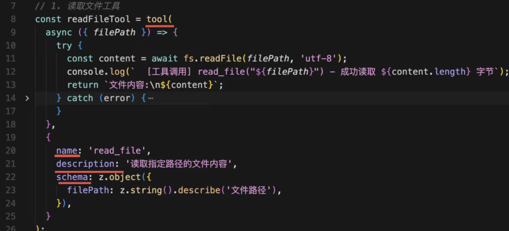
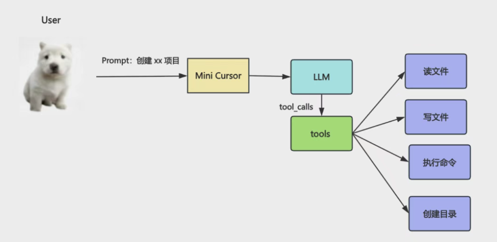
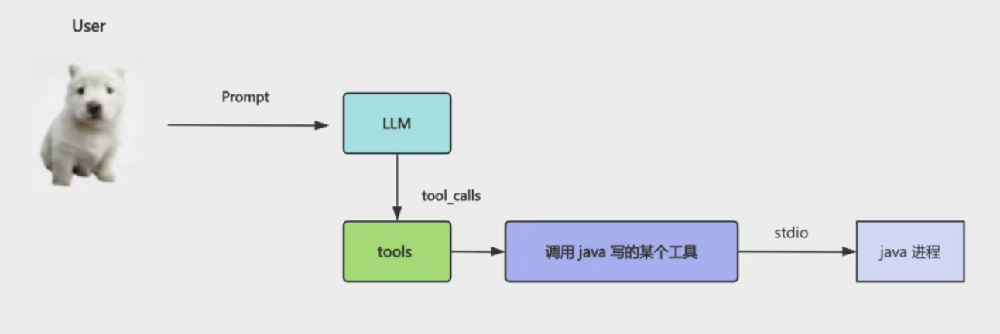
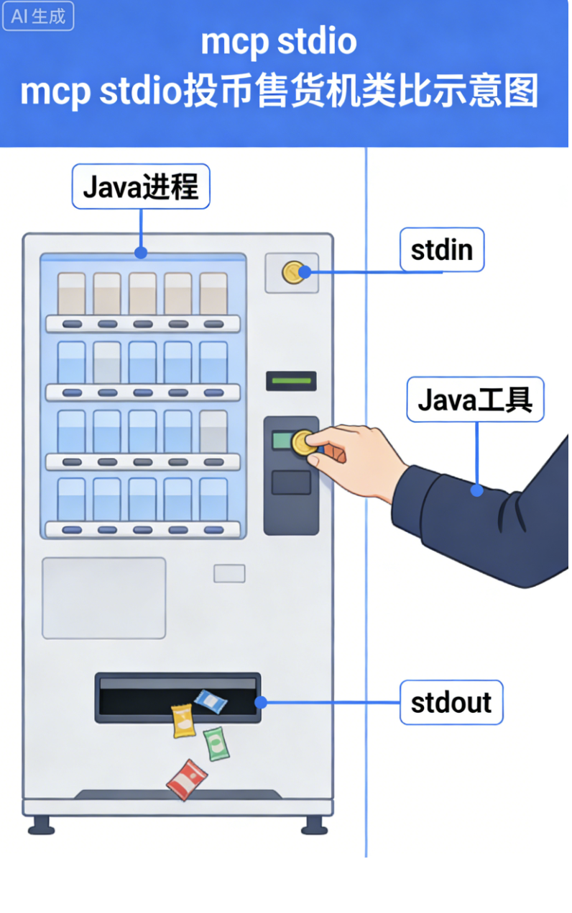
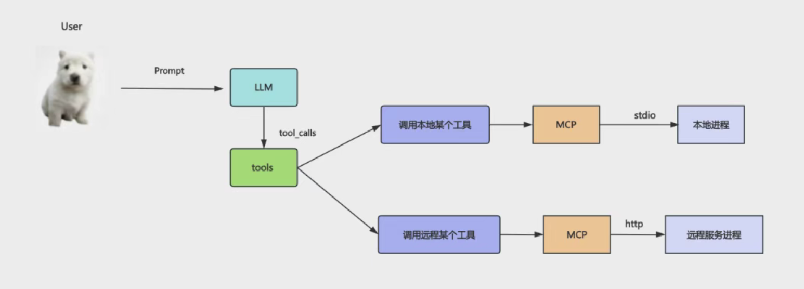
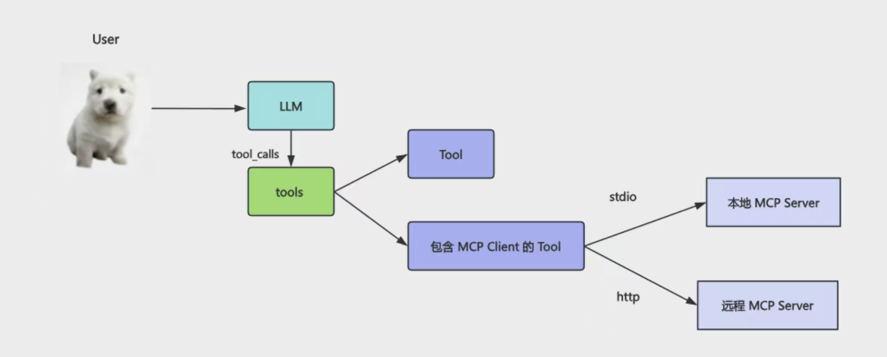

# MCP：可跨进程调用的 Tool

我们已经写了一些 tool 了：读写文件和目录、执行命令

只要声明 tool 的名字、描述、参数格式，模型会在发现需要用 tool 的时候自动解析出参数传入来调用，然后把执行结果封装成 ToolMessage 传入 chat。
简易的 cursor 架构图

比如上节我们实现了简易的 cursor，就是声明了读写文件和目录、执行命令的 tool，这样你让大模型创建 react + vite 项目，它就会自动判断什么时候调用哪个 tool，自动实现目录、文件的创建，以及 pnpm install 和 pnpn run dev 的执行。

这些 tool 怎么调用、参数是什么都是大模型自己决定的。

tool 给大模型扩展了做事情的能力，本来它只能思考，不能做事情，但是现在可以自己调用 tool 来帮你做事情了。但你有没有发现 tool 有个问题：

## llm with tools 的问题

node 写的 ai agent 的代码，你的 tool 也得是 node 写。

如果你之前有一些工具是 java、python、rust 写的呢？

你想封装成 tool 怎么办呢？

llm  和 tools 解耦

## 两种通信方式

有的同学说：现在不是可以执行命令么，通过单独进程把这些其他语言写的代码跑一下就行啊。

- stdio  本地

这里的 stdio 就是标准输入输出流，也就是键盘输入、控制台输出。当你进程跑一个子进程，就可以用这种方式通信。
比喻 投币售货机 

- http 
还有的同学说：简单，用 http 啊！本地跑个服务就好了。

## MCP 

想跨进程调用某个工具，通过这个MCP协议通信就行。

给 Model 扩展 Context 上下文，让它能做的更多，知道的更多的 Protocal 协议。

MCP 最大的特点就是可以跨进程调用工具。

跨本地的进程调用，就是用 stdio。
跨远程的进程调用，就是用 http。

Anthropic 官方图

你的 ai agent 就是 MCP 客户端（Cursor），可以通过 MCP 协议调用各种 MCP Server（读取邮件email, 日历日程安排），实现跨进程的工具调用。

当然，在 langchain 里，它也是 tool ，只不过是 tool 的一种而已：

你在 tool 的函数里，调用下 MCP Client，访问下远程 Mcp Server，它本质上还是 tool，但是却集成了 MCP 工具。

MCP 是由 AI 巨头 Anthropic 公司发起（2024年11月）并开发，但是 2025 年 12 月交给了 Linux 基金会维护。

- mcp 配置

现在，大模型就知道这个 resource 的信息，可以用来回答问题了。resource 可以用在 system message 里，也可以用在 human message 里，总之，是作为信息引用的。我们主要还是用 mcp 的 tools。

mcp 本质上还是 tool，和之前的 tool 的区别只不过是可以跨进程调用：

当你不需要跨进程用的时候，还是之前那样写更好，还少了进程通信的成本。