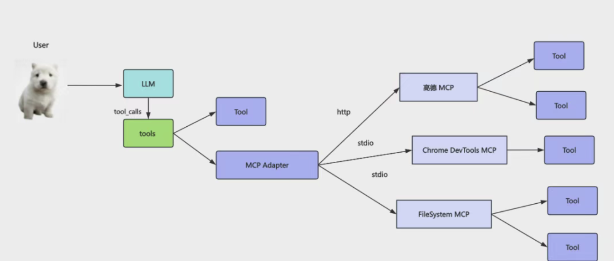

# 高德 MCP + 浏览器 MCP：LangChain 复用别人的 MCP Server 有多爽！

自己实现了一个 MCP Server，然后在 Cursor 或者 LangChain 里连上这个 server，就可以用里面的 tools 了。

它本质上还是 tool，只不过包了一层进程，可以通过 stdio（本地） 和 http（远程） 来访问。

有些tool 第三方已经提供了， 不要重复造轮子。

高德MCP: 可以做位置查询、路线规划等

Chrome Devtools MCP 控制浏览器，打开关闭页面、点击元素、截图等

FileSystem MCP 读写文件、创建目录等

## MCP 好处

任何人都可以开发基于这个协议的 MCP Server，然后我们可以直接复用！

## 高德 MCP

- apiKey
https://developer.amap.com/

创建新应用

类型选 web 服务就行。

"amap-maps-streamableHTTP": {
    "url": "https://mcp.amap.com/mcp?key=cf385e5d7f12309e54eaa6a9180e068d"
}
从北京西站到故宫怎么走？
这就是 http 的接入方式。

本地接入的方式

其实你的前端简历里就可以写一下这个：我开发了一个 mcp server 的 npm 包，包含 xxx tool，支持 stdio 访问。可以在 cursor 或 langchain 里用 npx 执行来连上这个 mcp server。这样面试官一看就知道，这个人是真懂 MCP 的，而且还有实践经验。

 langchain 里用一下这个 mcp：

mcp client 的代码和上节一样，用 @langchain/mcp-adapters拿到其中的 tools 绑定给 model

然后文件读写、创建目录这种，也不用自己写 tool，可以用现成 mcp：

可以看到，大模型首先调用高德 mcp 拿到了附近的酒店位置，然后规划了路线最后调用 FileSystem MCP 写入了文件。

直接复用别人的 MCP，完全不用自己写。

你自己写的 tool 想给别人用，也可以封装成 MCP，最好发个 npm 包，这样还可以写到简历上去，让面试官用。

## Chrome Devtools MCP

最后我们再来用一下 Chrome Devtools 的 MCP，它是可以用来做浏览器自动化的。

比如打开页面、点击元素、截图等。

只要配好 MCP，大模型就可以直接调用里面的 tools 了：

## 总结

这节我们使用了高德、FileSystem、Chrome Devtools 的 MCP，用它们结合来实现了一些功能。这些 MCP Server 有的是 stdio 本地进程调用，有的是 http 远程进程调用。MCP 的一大好处就是别人开发好的，可以直接用。你全程不需要知道怎么用高德的 API 查询位置、路线，不需要知道怎么用 cdp （Chrome DevTools Protocol）协议控制浏览器。你只需要把这些 MCP 给到 AI，让它自己去调用。你不需要知道这些 tool 里面的高德 API 怎么用、浏览器控制怎么用，大模型会自己读取 tool 描述来传入参数调用。是不是特别爽！