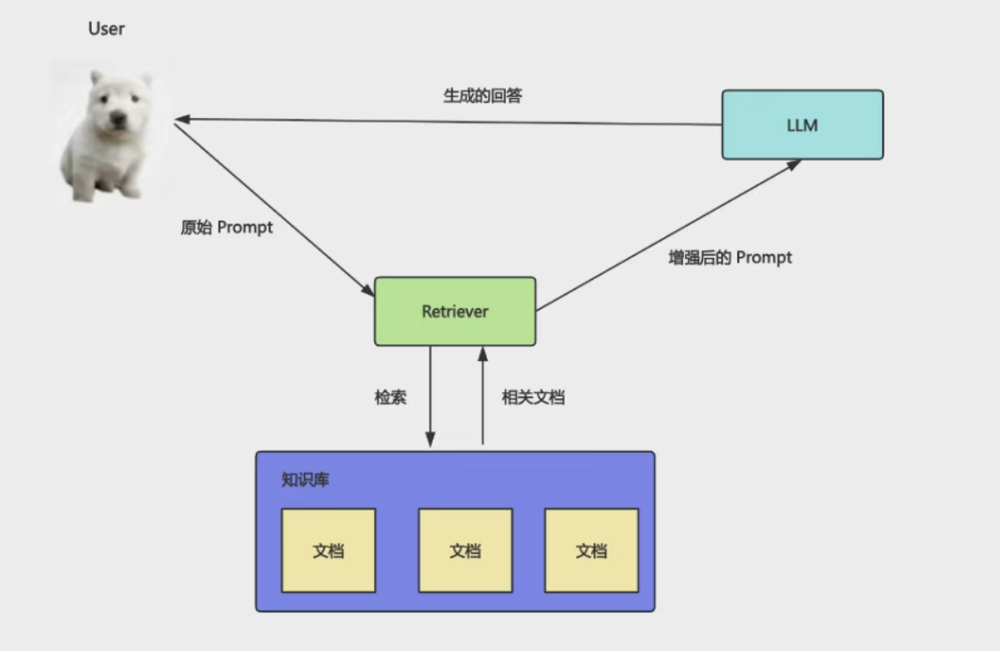
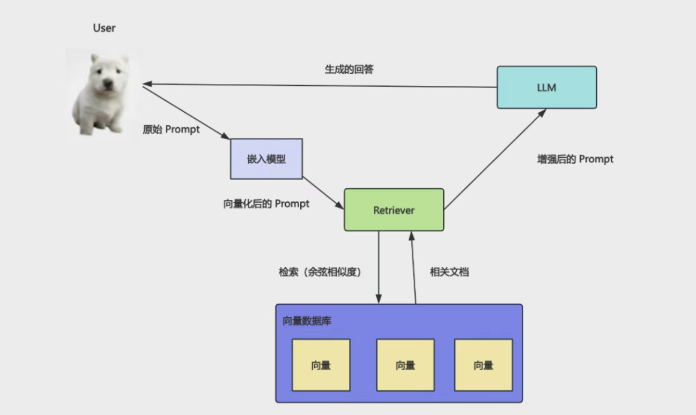

# RAG：把文档向量化，基于向量实现真正的语义搜索

- 大模型所知道的知识，取决于?

在训练的时候给它的数据集。

- 那如果你问它最近发生的事情，或者你企业内部私有文档的一些事情？

不知道， 但它很可能不会说自己不知道，而是会胡乱回答，也就是所谓的幻觉（以为自己知道）。

- 如何解决大模型的幻觉呢？

用户要查询的内容，我们先去内部知识库里查一下，把它放到 prompt 里再给大模型。

这样大模型通过这些文档知道了背景知识，就可以回答响应的问题了。

这就是 RAG：

Retrieval 检索 - Augmented 增强 - Generation 生成

工作流

去知识库里**检索（Retrieve）**用户问的知识的相关文档片段，作为背景知识加到 prompt 里**增强(Argumented)**它，让大模型根据这些来**生成(Generation)**回答。

- 架构图

## 文档片段

- 用户问了一个问题，你怎么把相关的文档片段查出来呢？

    比如用户查水果的信息，你要把苹果、香蕉、草莓的相关文档查出来。

- 关键词搜索可以么？
    水果 -> 苹果、香蕉、草莓
    很明显不行。 这种语义搜索就需要向量（Vector）了。

    比如如果按照两个维度存储信息，
    分为可食用性、硬度：
    维度 1： 食用性（0 = 无，1 = 高）
    维度 2： 硬度（0 = 软/液体，1 = 硬）

    那这几个概念大概是这样的向量：
    水果：[0.9, 0.3] 极高食用性，中低硬度
    苹果：[0.9, 0.5] 高食用性，硬度适中
    香蕉：[0.9, 0.1] 高食用性，非常软
    石头：[0.1, 0.9] 几乎不可食用，非常硬

    可视化一下是这样：
    2.png

    明显可以看出来，苹果、水果、香蕉，这三个概念相关性很大，而水果和石头相关性就不大。

    计算的话，可以通过夹角判断相似度，夹角越小相似度越高：

    3.png
    也就是余弦相似度（两个向量夹角的余弦值）。

    当然，具体的向量数据肯定不会只有二维，可能会是几百维。
    text-embedding-3-small 1536 维

    虽然高纬度没法可视化，但是原理是一样的。

    我们都是通过两个概念对应的向量的余弦相似度来判断相关性。也就是说通过向量计算实现语义检索！

    这就是为啥 RAG 一般都结合向量化来做，虽然基于关键词来做也是 RAG，但是那种没法语义搜索，意义不大。

- 怎么计算它的向量值呢？

    专门的模型，叫嵌入模型（Embedding Model）。

    它和大语言模型（LLM）是不一样的，它的功能就只有把知识转成向量。

    这个知识可以是文本、图片、语音等，向量化之后，就都可以实现语义搜索了！

    我们写代码会用专门的嵌入模型，收费比大模型便宜很多很多。

- 加上向量化之后的 RAG 流程是什么样的呢？
    
    

    用户的 prompt 会通过嵌入模型转成向量，然后 retriever 基于这个向量去向量数据库中检索，找到相似的向量，把对应的文档块返回，加到 prompt 里作为背景知识，给大模型。

- 存的不是向量么？怎么记录向量关联的文档？

    文档在向量化的时候，会在向量的元信息里记录来源文档。

综上，我们可以在原始 prompt 给到大模型之前，查询下知识库，把相关的文档作为背景知识加入到 Prompt 里，再让大模型回答，这就是 RAG。

RAG 要实现语义查询，需要基于向量来做，把文档向量化存储到向量数据库，查询的时候也把 Prompt 向量化，去数据库中做相似度检索，这样就可以找到语义相近的文档块。

## rag-test

pnpm install @langchain/core @langchain/openai dotenv

大模型训练完后，知识就不再更新了，它没法知道最新的一些信息，以及一些非互联网上公开的信息。所以对于它不知道的东西，会胡乱回答，也就是幻觉问题。解决这个问题的方式就是 RAG。RAG 是检索、增强、生成，会基于用户的 query 去检索知识库，拿到相关文档后放到 Prompt 里增强它，之后给大大模型来生成回答。检索肯定是要语义检索，但是关键词检索做不到这点，我们需要用向量来做，通过嵌入模型把知识向量化，这样就可以通过向量的余弦相似度（也就是夹角大小）来计算出两个知识的相关性，从而根据用户的 query 查询出相关的文档。我们基于 LangChain 写了 RAG 的代码：fromDocuments api 基于 embeddings 模型把文档向量化存入数据库。asRetriever 指定查询相似度最大的几个文档。similaritySearchWithScore 相似度评分retriever.invoke 来查询文档。只要你理解了 RAG 的流程，这些 api 自然也就会用了。想一下，如果你要做公司内部文档的智能助手，是不是就可以用 RAG 来实现呢？