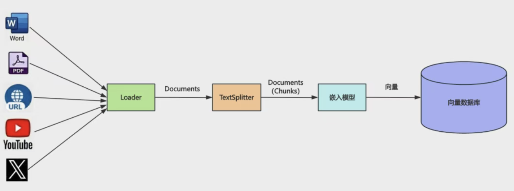
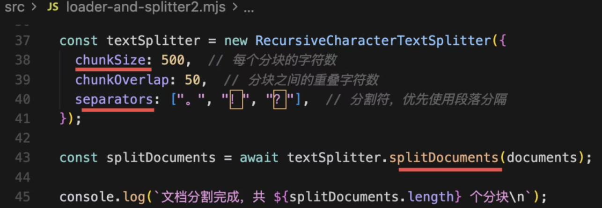
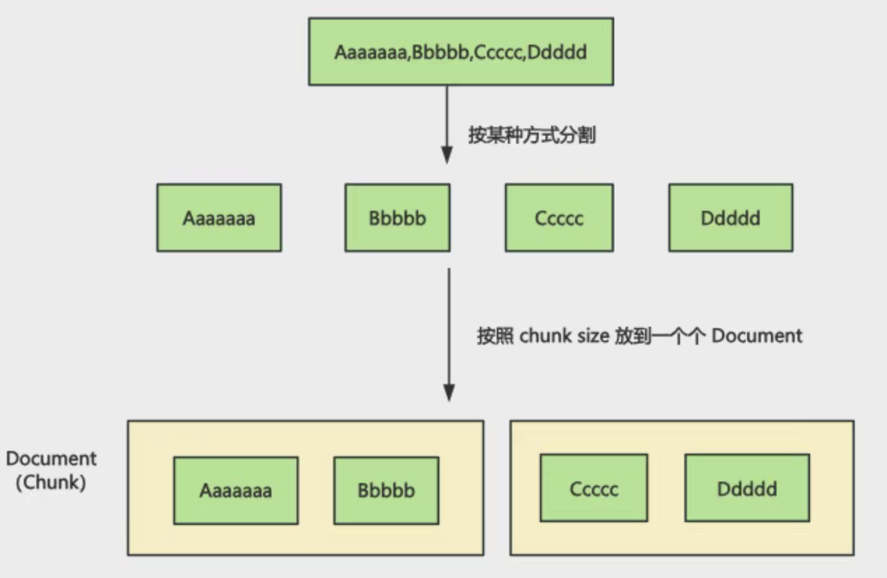
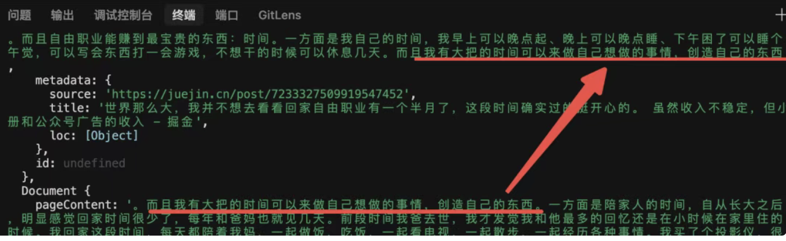
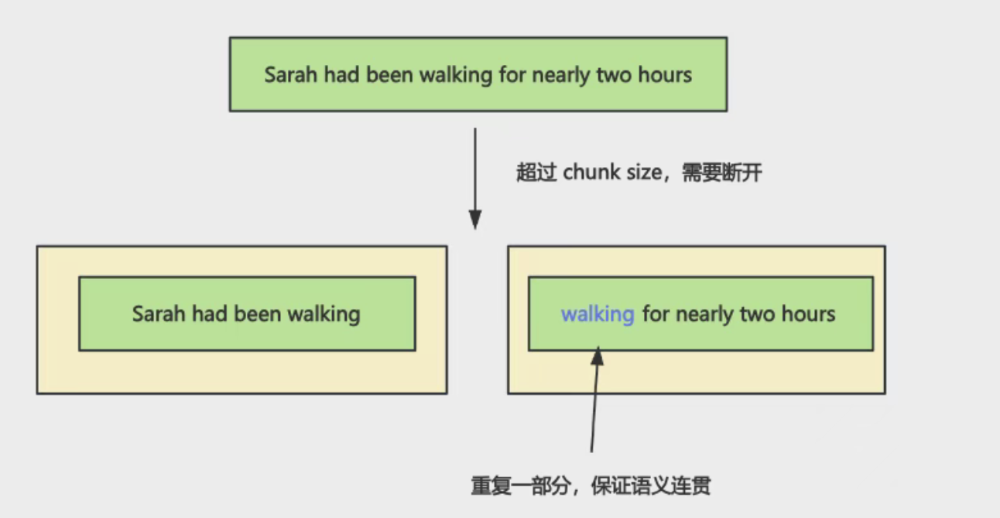
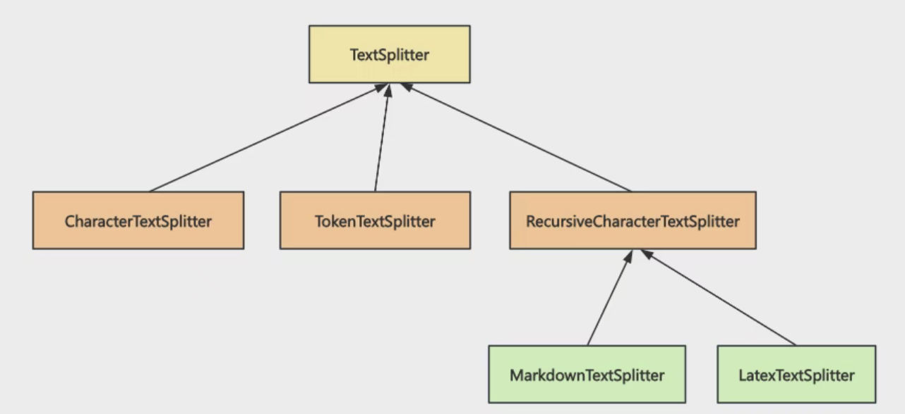
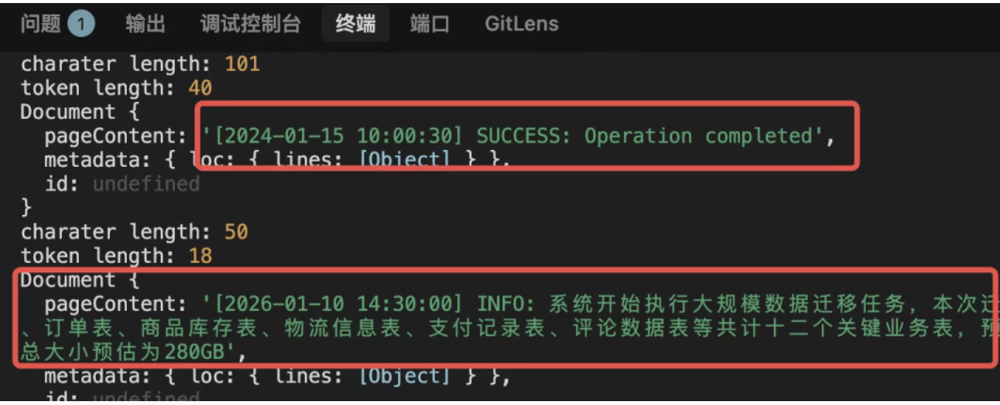
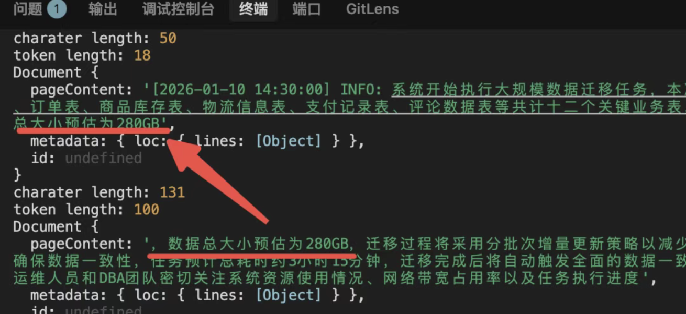
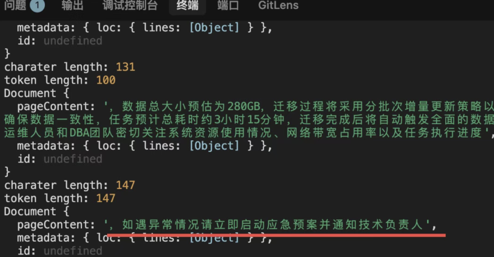

# LangChain 全部 Splitter，其实只需要其中的一个

1.  聊聊这张图

- 知识可能有各种来源，比如一个视频、一个 pdf、一个网页、一个 word 文档
- 各种 loader 从中提取信息，把它们转换成 Document
- 但是 Document 可能会很大，需要用 Splitter 分割成一个个的比较小的 Document（chunk）
    一本书，某个问题的答案就在哪个自然段
- 用嵌入模型，把分块的文档向量化后存入向量数据库。
- RAG prompt embedding 后 相识度查询出相关片段， 加入prompt

2. sperator 和 chunk size

首先按照 。的 sperator 来分割字符串，然后按照 chunk size 放入一个个 Document。

先。 再 ！ ？，优雅递归尝试断句，语义完整。

如果分割后还是大于 chunk size，就需要按照后面的 sperator 继续分割，然后加上 overlap：

overloap 只有文本超过 chunk size，文本被打断了才会加，不是所有的块都会有 overlap
为了保证语义连贯性

通常设置为 chunkSize 的 10% - 20%

牺牲了一点存储空间（因为数据重复了），换取了模型对上下文理解的完整性。

## 那 langchain 都有哪些 splitter 呢？

@langchain/textsplitters 

1. TextSplitter 基类

所有的 Splitter 都继承自 TextSplitter，包括 RecursiveCharacterTextSplitter 等。而 MarkdownTextSplitter、又继承自 RecursiveCharacterTextSplitter。

CharacterTextSplitter 是按照某个字符来分割，比如按照句号

RecursiveCharacterTextSplitter 是递归分割，比如“ 。 ？ ！”就是先尝试按照 。 分割，如果分割后大于 chunk 剩余空间再按照 ？ 分割，是一个递归过程。

RecursiveCharacterTextSplitter 更聪明，它会按多个分隔符“递归降级”拆分文本，优先保证语义完整，而不是像 CharacterTextSplitter 那样简单粗暴按固定规则切块。

而 MarkdownTextSplitter 自然就是按照 #、##、### 等一级级标题来递归分割，所以是 RecursiveCharacterTextSplitter 的子类。

### TokenTextSplitter

- 按照字符分割，分割出来的文档的 token 大小是不一定的。

token 是大模型输入的一个单位，可能一个单词是 1 到 2 个 token：

apple 是 1 个 token、pineapple 是 2 个 token、苹果是 1-2 个 token

 js-tiktoken 这个包，它是 openai 模型的分词器

- demo

tiktoken-test.mjs

字符和 token 数量并没有一个确定的关系，与不同模型的分词器有关。

这样我们按照字符数来计算 chunk size 就没法准确估算 token 大小

对于需要精准控制 token 数量的场景就不大合适了。

这时候就可以用 TokenTextSplitter，它是按照 token 数来分割的。

### CharacterTextSplitter

CharacterTextSplitter-test.mjs

可以看到，按照换行符分割文本，然后按照 chunk size 放到了 3 个块里。有同学可能会问，chunk 的大小也没有到 200 啊？因为 splitter 会优先保证语义完整，宁愿 chunk 小一点。这里到了 160 左右字符的时候，发现加上下一个文本就超过 200 了，所以会放到下一个块。这里因为没有被断开的文本，所以就没有需要加 overlap 重复的，只有被断开的文本才有 overlap

CharacterTextSplitter 非常死板，你告诉它按照换行符分割，它就会严格按照这个，就算超过了 chunk size 也不拆分。

所以一般还是用 RecursiveCharacterTextSplitter

### RecursiveCharacterTextSplitter

这两段文本是用换行符分割的。

按照换行符分割后下面的文本超过 chunk size，就会尝试按照句号逗号分割，然后加上 overlap：

最后这个是按照逗号分隔的，也没超过 chunk size，就没有 overlap了：

所以说 RecursiveCharacterTextSplitter 这种递归的方式灵活太多了。

绝大多数情况下，用这个就可以了。

### MarkdownTextSplitter

## 总结

这节我们把所有 splitter 过了一遍。

结论是直接用 RecursiveCharacterTextSplitter 就行。

splitter 是先按照 sperator 来分割，然后按照 chunk size 放到一个个 chunk 里。

chunk 的实际大小可能小于 chunk size 也可以大于。

如果分割后文本长度大于 chunk size，会继续按照后面的 sperator 拆分，然后放到两个 chunk 里，加上 overlap 来保证语义连贯。

