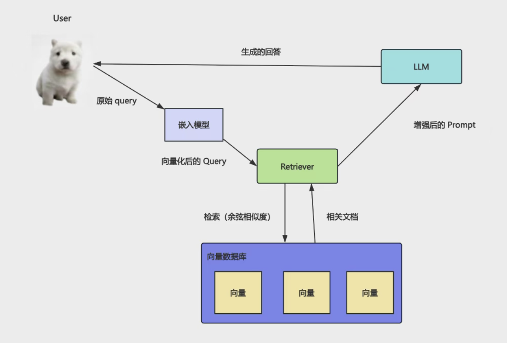
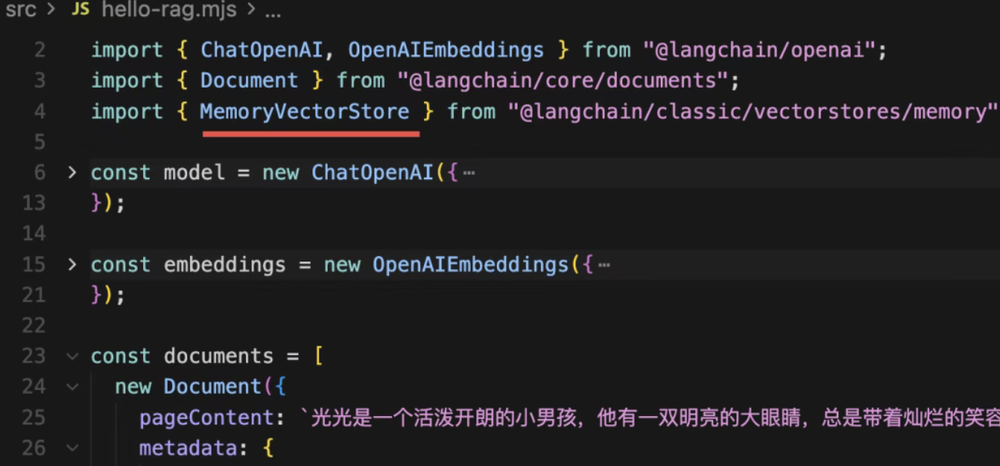
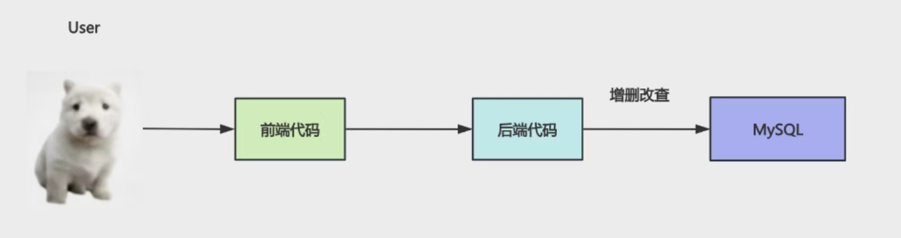
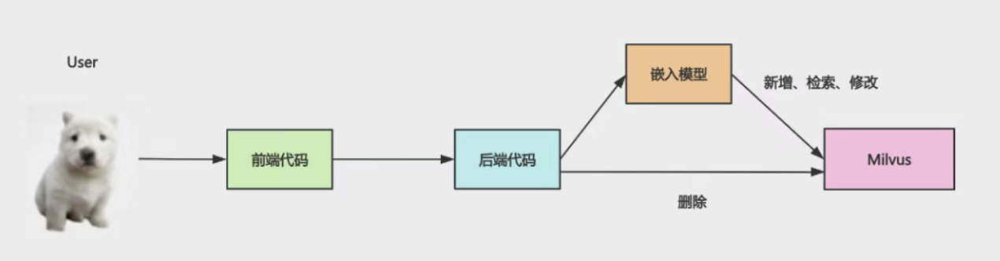
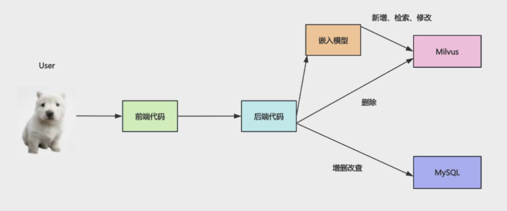

# 向量数据库 Milvus：做 AI Agent 开发必备技术已付费

- RAG 架构图

文档向量化放到向量数据库，每次查询根据向量化的 query 去数据库做相似度匹配，查出相关文档放到 prompt 里给大模型，大模型来生成回答。

- 丛内存到向量数据库
 内存中

## 向量数据库 Milvus 
Milvus 是一款开源的向量数据库，专为处理海量高维向量数据而设计。
 AI Agent 产品都会用 Milvus 这种向量数据库。

像 web 应用会把数据存在 mysql 里，基于对数据的增删改查实现各种业务功能。
mysql、psql CRUD 

根据 id 或者关键词去关联查询一系列表的数据。

AI Agent 应用会把知识、记忆放在 Milvus 数据库中，基于对知识的检索、增删改实现各种功能。

不同的是这里涉及到向量化，就需要嵌入模型，比如检索、新增、修改。

但是删除直接根据 id，不需要嵌入模型。

1. 把数据存在 MySQL 里，和现在存在 Milvus 里有什么不同么？

- 在 MySQL 里查询数据，只能用 id、关键词匹配。
- 在 Milvus 里查询知识，是根据语义匹配的，你可以用自然语言来检索。

2. AI 日记本 举例两种功能都要

- 查询日记列表可以从 MySQL 来查，不走 AI
- 查询“我哪几天的日记心情比较好”，就要去 Milvus 做向量相似度检索，然后交给 AI 生成回答

所以一般会做 mysql 和 milvus 的双写，也就是同时对两个数据库做增删改，保持数据同步。

项目里既要MySQL存结构化数据，又要Milvus搞向量检索，一个管“是什么”，一个管“像什么”，双剑合璧才够用

### zilliz 

基于开源 Milvus 的全托管向量数据库服务。

1. milvus-test demo 

https://zilliz.com.cn/

