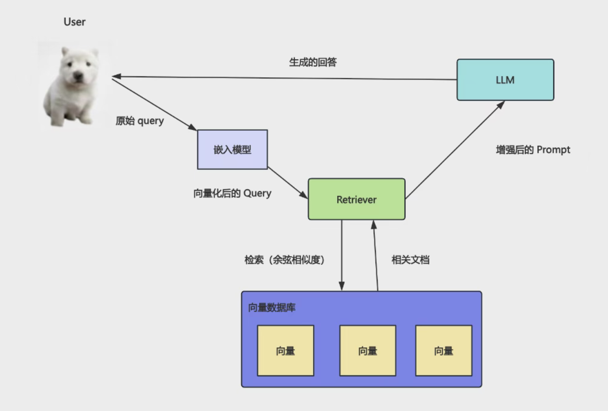
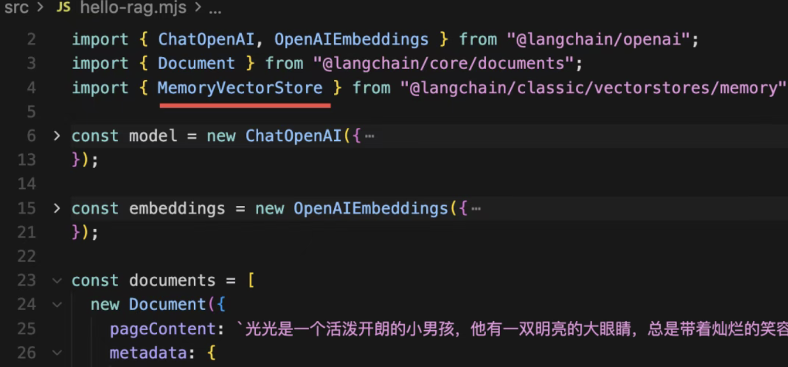
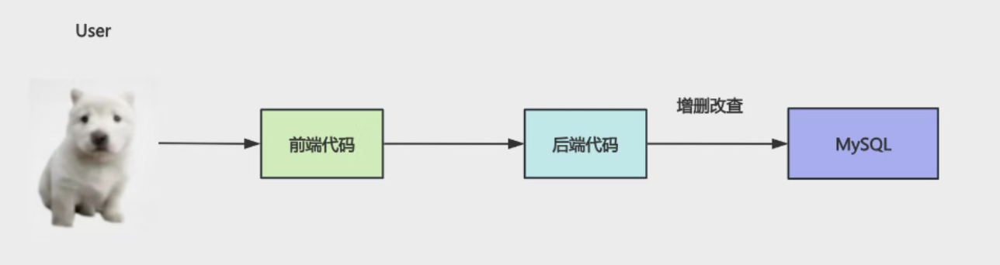

 web 应用会把数据存在 mysql 里，基于对数据的增删改查实现各种业务功能
 
 
 根据 id 或者关键词去关联查询一系列表的数据。
而 AI Agent 应用会把知识、记忆放在 Milvus 数据库中，基于对知识的检索、增删改实现各种功能。

不同的是这里涉及到向量化，就需要嵌入模型，比如检索、新增、修改。
但是删除直接根据 id，不需要嵌入模型。
有同学可能会问，把数据存在 MySQL 里，和现在存在 Milvus 里有什么不同么？
你在 MySQL 里查询数据，只能用 id、关键词匹配。
而在 Milvus 里查询知识，是根据语义匹配的，你可以用自然语言来检索。
这两种功能一般都需要。

比如你做了一个 AI 日记本：
查询日记列表可以从 MySQL 来查，不走 AI
查询“我哪几天的日记心情比较好”，就要去 Milvus 做向量相似度检索，然后交给 AI 生成回答
所以一般会做 mysql 和 milvus 的双写，也就是同时对两个数据库做增删改，保持数据同步。


## 安装milvus

https://github.com/milvus-io/milvus/releases

点击 下载 
milvus-standalone-docker-compose.yml

如果把一个个 Docker 容器比作“乐高积木”，那 Docker Compose 就是那张“乐高模型图纸”。
以前你想搭个复杂的应用，得自己一个个找积木、手动拼，还容易拼错；现在你只需要照着这张“图纸”（配置文件），喊一声“一键启动”，它就能自动帮你把所有积木完美拼成一个完整的模型，省心又省力。

实现整个应用栈的一键自动化编排、部署

新建milvus 目录
将yaml文件放入

```
docker compose -f ./milvus-standalone-docker-compose.yml up -d
```
compose 合成  多容器应用进行操作
-f --file 指定文件
up 启动命令
-d 后台运行

milvus 跑在19530 端口

http://localhost:9091/health

node 链接milvus

pnpm i @zilliz/milvus2-sdk-node
pnpm i @langchain/openai dotenv

.env

安装 GUI 工具

Attu 是Milvus 生态最好的GUI工具

https://github.com/zilliztech/attu/releases/tag/v3.0.0-beta.6

可以分为多个 database，每个 database 下有多个 collection
每个 collection 下是符合 schema 的 entity，也就是数据。
所以我们插入数据，就定义一个 schema，然后插入 entity 就好了。
同时要建立一个向量字段的索引，用来快速查询。

这就是 schema，创建 collection 集合的时候需要指定。
具体字段包含 id、vector、content、date、mode、tags
其实和 mysql 的表差不多，唯一的区别是 vector 这个字段，我们设置了 FloatVector 类型，也就是向量，指定维度是 1024 维。
这样我们后面插入数据，也要把嵌入模型指定为 1024 的维度。

vector 字段需要建立索引
IndexType.IVF_FLAT
IVF_FLAT 是一种分桶聚类型索引，它通过将向量数据聚类划分到不同的“桶”中，在查询时只检索最相近的几个桶，从而在查询速度和召回率（准确度）之间取得最佳平衡，是百万级常规业务中最常用的索引类型。
图书馆 各个馆 各种书

如果把向量搜索比作“在图书馆找相关的书”，那“召回率”就是“你有没有把相关的书都找全”。

gui 智能体  1月10日天气如何？

## 双写
