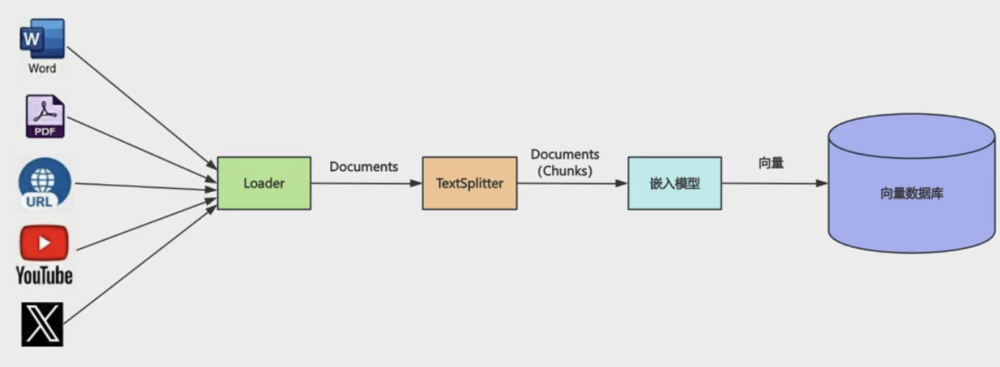
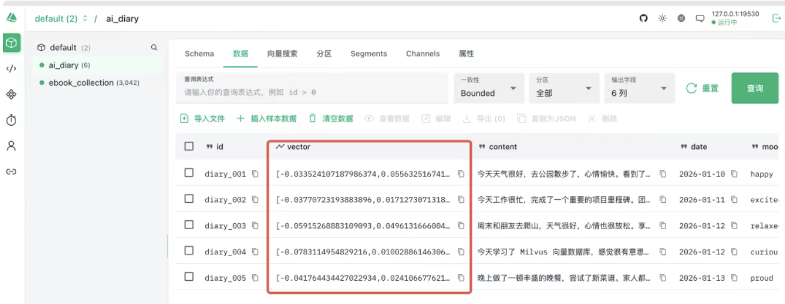
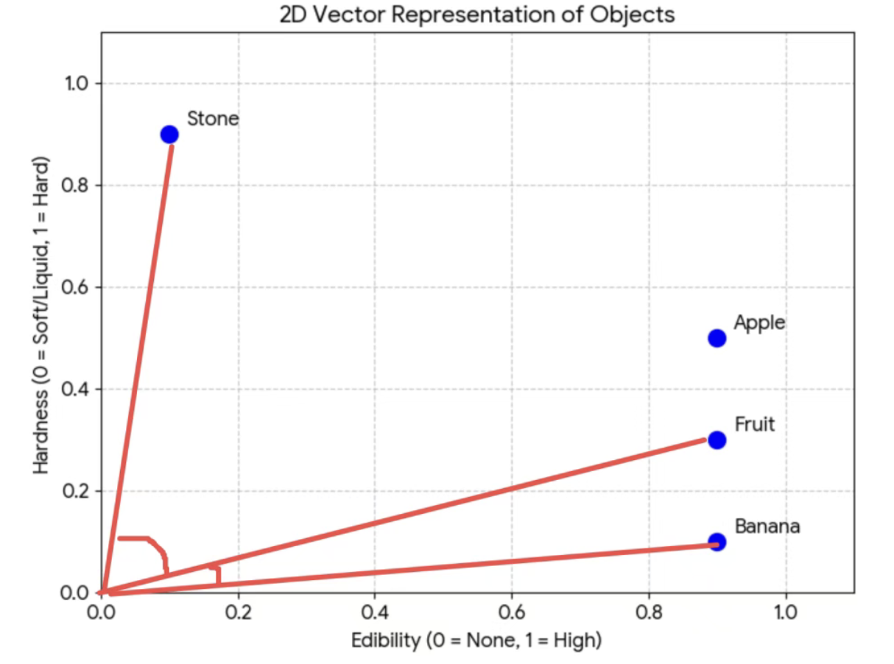
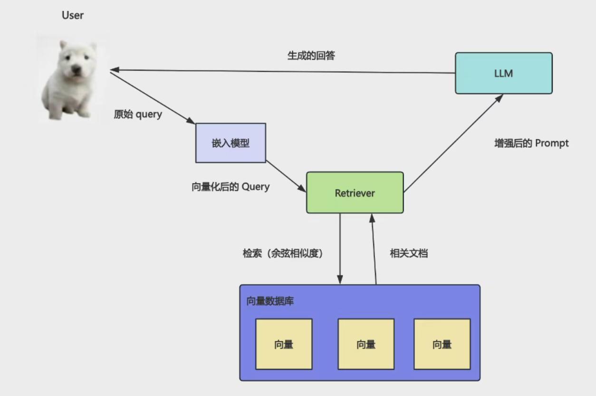
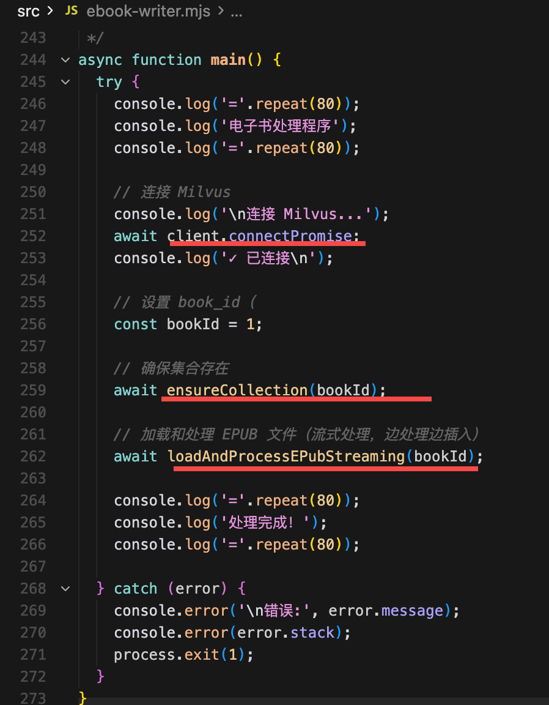
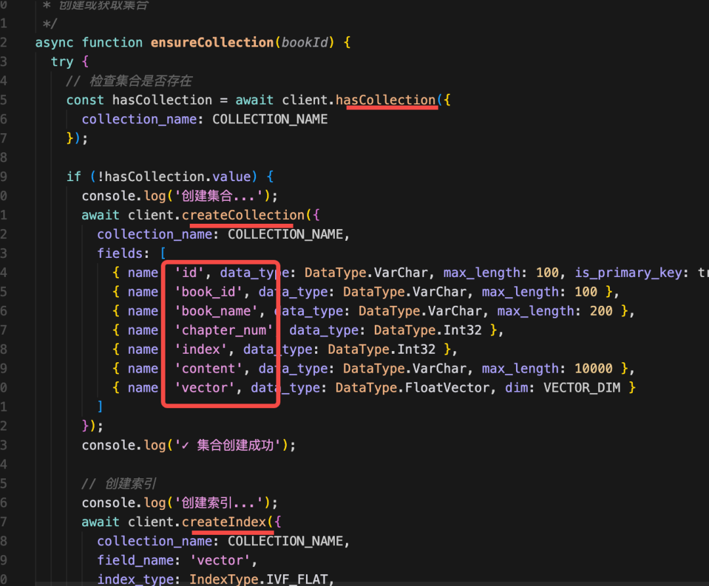
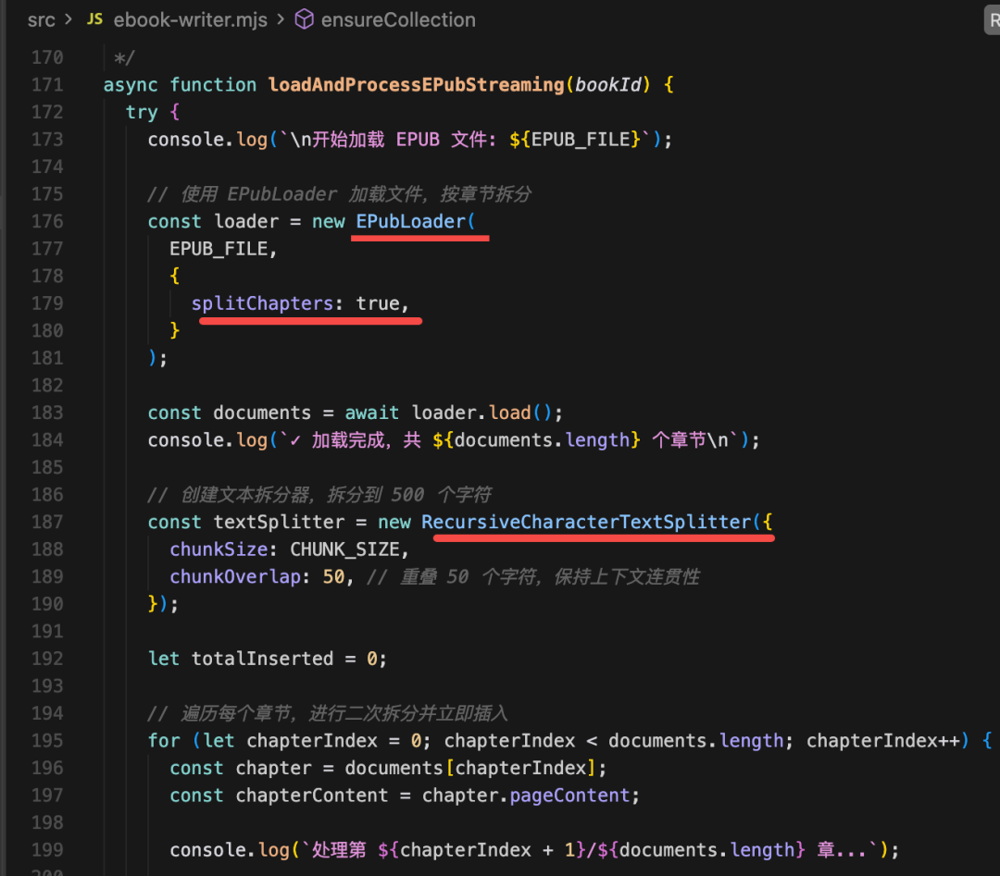

# Milvus + RAG 实战：电子书语义检索助手

- RAG 完整流程跑通

loader 从各种来源加载文档
splitter 分块
然后用嵌入模型向量化后存到向量数据库 Milvus。
查询的时候，把 query 也用嵌入模型向量化，根据余弦相似度，匹配最相近的文档返回

 看到了什么？

 这个流程涉及到的技术我们已经详细了一遍。

## 电子书语义检索助手。

一些 .epub 格式的电子书：

比如《天龙八部》这本书，还是挺厚的。

如果我想从中查一下段誉会什么武功

怎么查？

用 mysql 那种关键词查询可以么？很明显不行，你关键词都不知道怎么定。

这种只能用向量数据库语义查询，然后交给大模型来生成回答，也就是用 RAG 来做。

milvus-test

src/ebook-writer.mjs

整体分为 3 步：

- 连接 Milvus
- 创建 ebook 的集合
    schema:
    
    hasCollection、createCollection、createIndex、loadCollection
- 加载 epub 文件用 splitter 分块存入 Milvus
    -  loader 加载 epub 的文件，并 splitter 分块
    

## 查询

- src/ebook-query.mjs

    鸠摩智会什么武功？

## 完整的 RAG 

