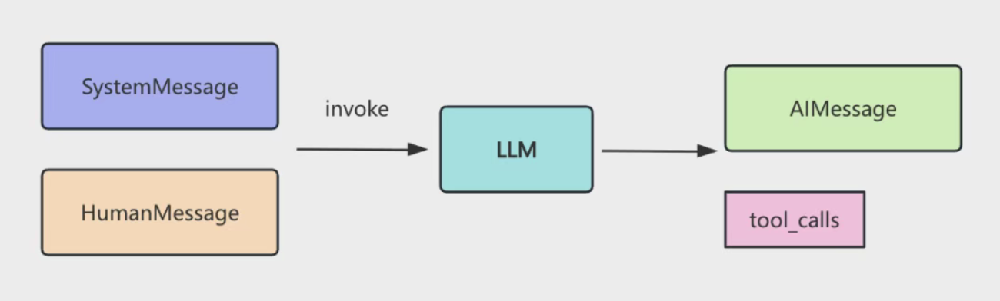
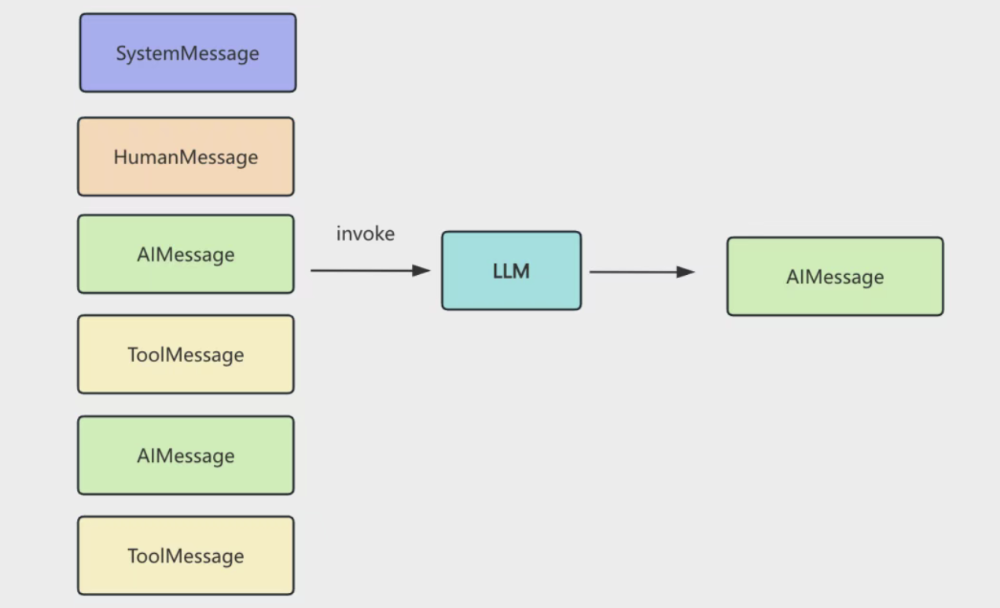
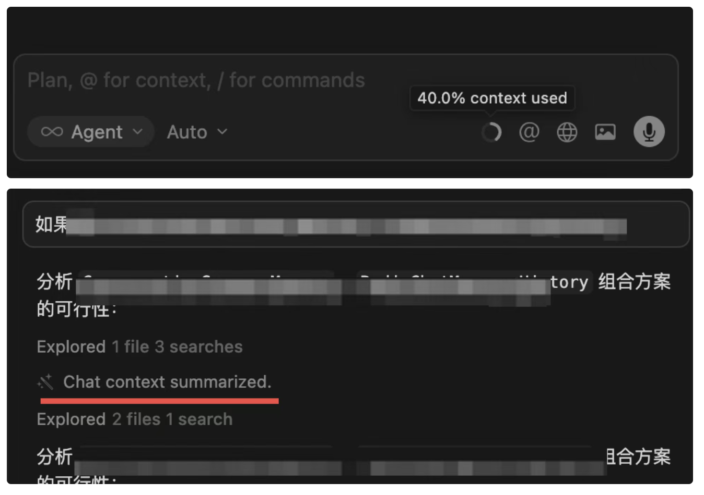
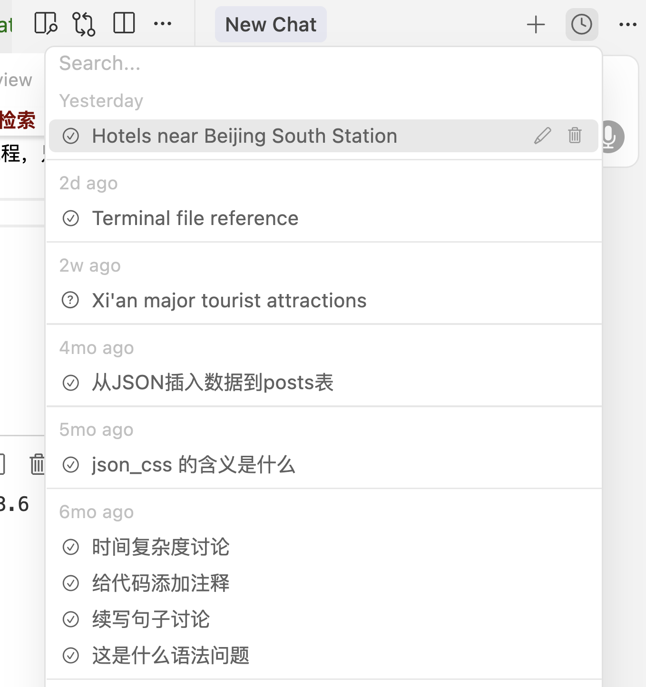

# Memory 管理的三大策略：截断、总结、检索

- 大模型是无状态的

    你这次调用和下次调用没区别，它并不知道之前你问了什么，回答了什么。

- 我明明可以基于上次的回答继续问?

    你已经做了 Memory 管理。

- 循环
    - 我们在 messages 数组放入了 SystemMessage，告诉大模型它的角色、功能，然后放入了 HumanMessage，也就是用户问的问题。然后 invoke 大模型，这是第一次调用。
    大模型返回了 AIMessage 和 tool_calls 信息。
    
    - 我们基于 tool_calls 去调用工具，然后把结果封装成 ToolMessage 也放入 messages 数组。这样 messages 数组里就有了 SystemMessage、HumanMessage、AIMessage、ToolMessage循环继续调用大模型，这是第二次调用。
    - 直到不再有 tool_calls，就把那个 AIMessage 返回，这就是最终回复。
    

- 你觉得大模型是怎么知道之前问过什么、回答过什么的？

    就是基于 messages 数组，也就是 Memory。

    如果不做 Memory 管理，大模型根本不知道之前回答过什么，所以说它是无状态的。

    但这种 messages 数组不断 push 的 Memory 管理机制显然不靠谱。

- 不靠谱在哪？

    大模型的上下文大小是有限的，比如 GPT-4o 大概是 200k token

    不管这个限制是多大，当你无限往 memory 里增加 message 的时候，总是会超的。

    所以我们要学一些 Memory 的管理策略。

- 怎么管理？

    - 有同学说，可以只保留最近的几条 message，之前的舍弃掉啊。
        截断
    - 有同学说，直接舍弃之前的也不好，可以对之前的做一些总结，保留这个总结和最近的几条 message。
        总结
    - 有同学说可以用我们刚学的向量数据库啊，根据语义检索之前的 message
        检索

- 举例

    - 你用 cursor 或者 claude code 的时候，会有一个 token 的计数，当达到的时候，会触发总结，然后开始新的一轮计数：
    
    达到上下文限制，会自动触发总结。
    达到限制自动触发总结，或者也可以 /compact 手动总结（compact 是压实压紧的意思）

-  messages 存在哪?

    内存中、可以做持久化，存在文件、redis、数据库等。

- memory 一共有两个维度的 api：
    - 一个是 ChatMessageHistory 相关的：
    它是存储层，也就是 messages 存在哪，可以是内存、文件、数据库等。
    - 然后是逻辑层，也就是截断、总结、向量数据库这些：

- 截断、总结、检索（向量数据库）完全可以自己实现
    - 截断就是根据总 token 数量来保留最近的 message
    trimMessages 
    - 总结就是调用大模型对之前的 message 生成一个摘要
    - 检索向量数据库就是之前的 RAG 流程，只不过用来对 message 做语义检索

- 你看 cursor 就是把对话过程持久化了
    

    这就是 message 持久化的好处，也叫做长时记忆（LTM long-term memory）。相应的，内存中那种叫短时记忆（short-term memory）。

    有了这个文件 完全可以实现 

- slice token 缺点是前面可能有重要内容
    summarization 

- 更常用的是根据 token 来触发总结，而不是消息条数

大模型是无状态的，需要我们管理 Memory，也就是管理给它的 messages，它才能继续之前的话题聊。langchain 封装了 ChatMessageHistory 的 api 用来存储 messages，可以存在内存、redis、数据库等。之前有 memory 的 api，现在都废弃了，因为完全可以自己实现。memory 有三种管理策略：截断、总结、检索截断就是超出一定条数、一定 token 数量就去掉之前的 message总结就是调用大模型生成对话摘要，这样就可以删掉原始 message 了检索是结合向量数据库来做语义检索，通过 RAG 来检索之前聊的内容我们常用的 cursor 就是超出一定 token 会触发总结也可以用总结 + 检索，在 milvus 中存储对话总结，然后结合检索来查找管理好了 memory，就无论什么时候都可以基于之前的话题继续聊了，这是做 AI Agent 开发必须要做的。