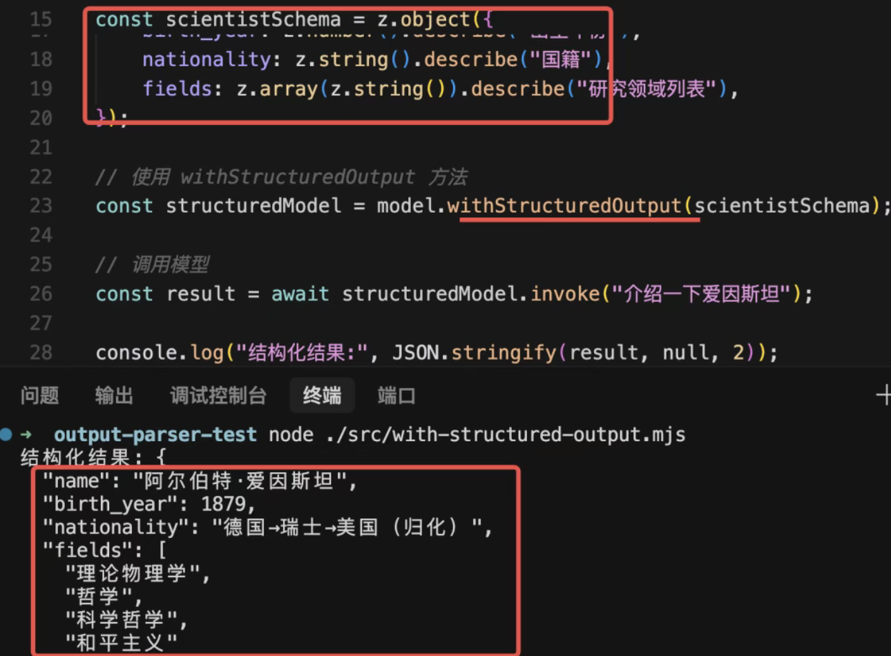

# Output Parser 实战：智能录入 + 流式版 mini cursor

- 根据图回顾一下

    - zod json 输出格式的schema
    - 用 model.withStructuredOutput 来控制输出的结构
    - 它底层会根据模型来决定用 tool 或者 output parser

- 但如果要支持流式输出呢？
    一般用 withStructuredOutput 就可以了，但当流式返回内容的时候，如果要实现打字机效果，就要直接用 output parser 了，比如 tool 参数的流式打印。

## 录入信息实战

- 传统是表单提交或传入excel 后台管理系统

    这需要你把数据按结构整理好，代码里解析出来保存到数据库。

- 但在 AI 时代，一般都是智能录入的：
    你只需要给一段文本，让 AI 分析并提取其中的数据，按照结构整理好，然后插入数据库。这是 AI 应用常见功能。

    这个功能就需要用 withStructuredOutput 实现大模型的结构化输出控制。

- 安装mysql 

##  JSON Schema
structured-json-schema.mjs

## 流式+output parser 