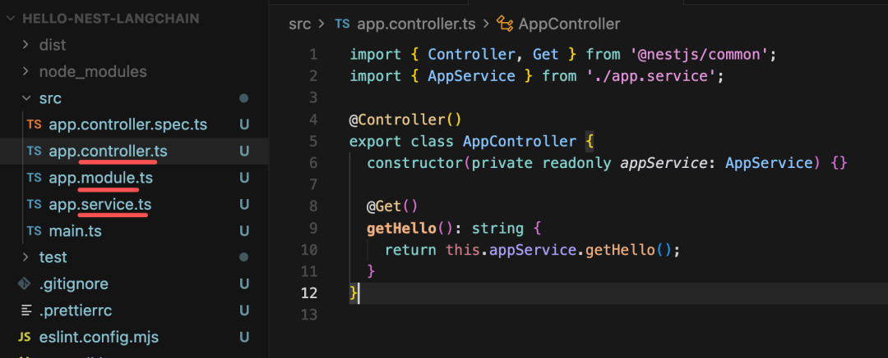
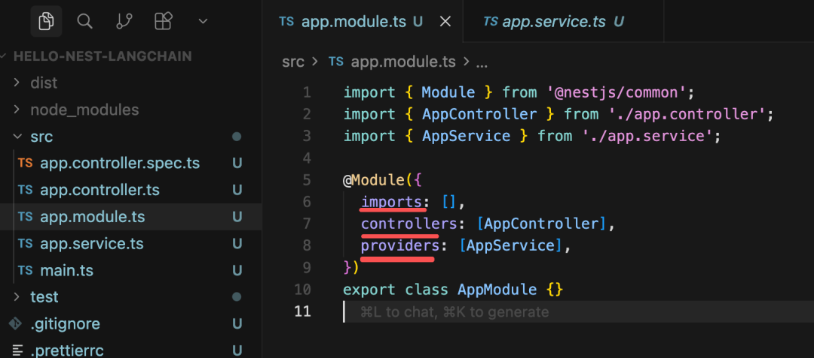
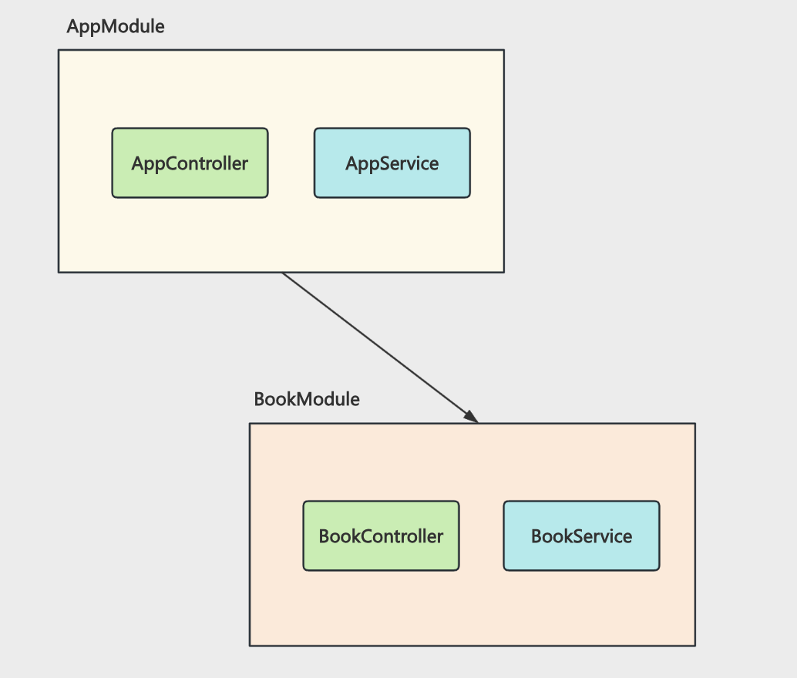
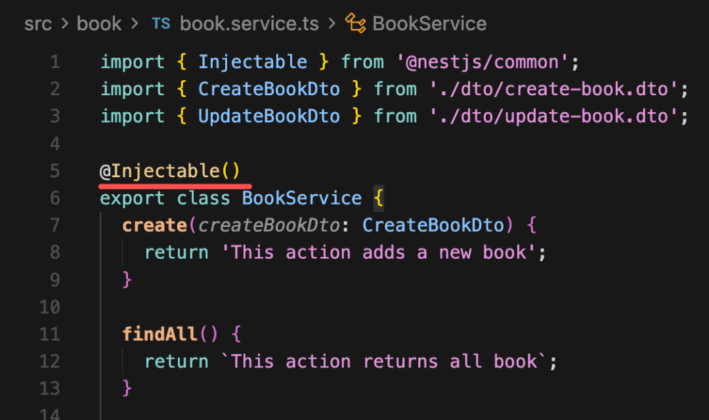
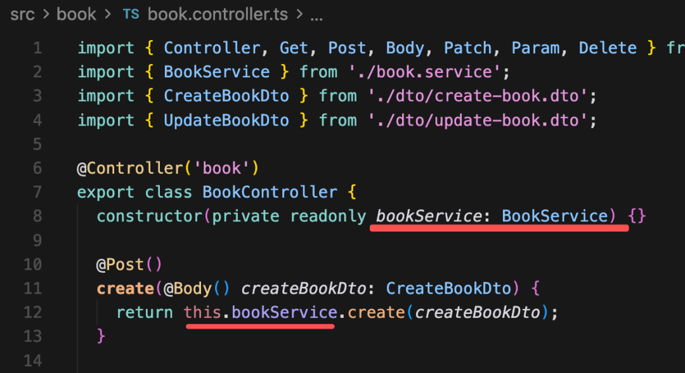
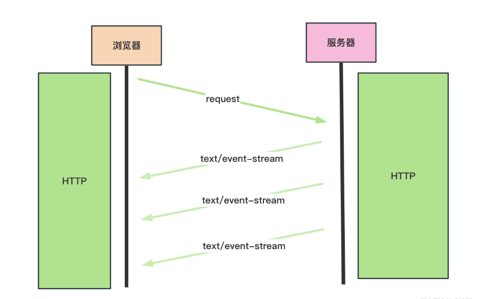

# Nest + LangChain 实现基于 SSE 的流式 ai 接口

- 大多数 Agent 都是跑在后端服务里, 所以？
    Nest + LangChain 开发 ai 接口

- 什么是nest?
    Node.js + Typescript 的最主流的框架
    底层是 Express，封装后提供了 MVC、DI（依赖注入）等架构特性。

- 创建项目

```
npm install -g @nestjs/cli
nest new hello-nest-langchain
```

- mvc 架构



在 controller 里面写路由，比如 /list 的 get 接口，/create 的 post 接口。

在 service 里写具体的业务逻辑，比如增删改查、调用第三方服务等

然后这些都是以 module 的形式组织，一个 module 里有 controller、service 等

前后端分离所以没有view


@Module 声明模块，里面 controllers 数组里放本模块的 Controller，providers 数组里是本模块的 service 等，imports 是引用的其他模块。

- 创建一个 crud 的模块
nest g res book --no-spec
nest 自带的生成命令 generate
res resource 的缩写，用于生成包含 CRUD 操作的完整资源模块
--no-spec 不生成测试
选择RestFul  一切皆资源， 靠网址和动词（增删改查）来操作数据，简单直接
url 定义标准 

- 看看目录
    app 所有模块要在这注册
    自身模块
    dto  post 参数 请求体， 封装dto 接收参数
    entitiy 数据库实体
    service 
pnpm run start:dev
/book 



Nest 还支持 DI（Dependency Injection） 依赖注入

也就是你不用手动 new 依赖对象，只要声明下，运行的时候会自动注入依赖的实例对象。

比如这里用 @Injectable 声明了 BookService

然后 BookController 里在构造器声明了依赖：


这样运行的时候就会自动注入 BookService 的实例对象。这样一个好处是所有的依赖都是单例的，不用自己去 new。

这也是为啥叫 providers：就是可以提供某种能力的对象。

- ai 模块
    pnpm install @langchain/core @langchain/openai
    nest g res ai --no-spec
    restful， 不生成crud 

- 然后在 AiService 里调用 langchain 创建一个 chain：
    ai.server.ts
    ai.controller.ts 路由
    http://localhost:3000/ai/chat?query=%E7%BA%A2%E7%83%A7%E8%82%89%E7%9A%84%E5%81%9A%E6%B3%95

- 现在有两个问题
    - 配置没有抽离
        pnpm install @nestjs/config
        App 配置 global
        service constructor 注入
    - 没有流式返回内容
        这种不断返回内容一般用 SSE（server-sent event） 来做
        不end  一直write 
        

    服务端返回的 Content-Type 是 text/event-stream，这是一个流，可以多次返回内容。

    


