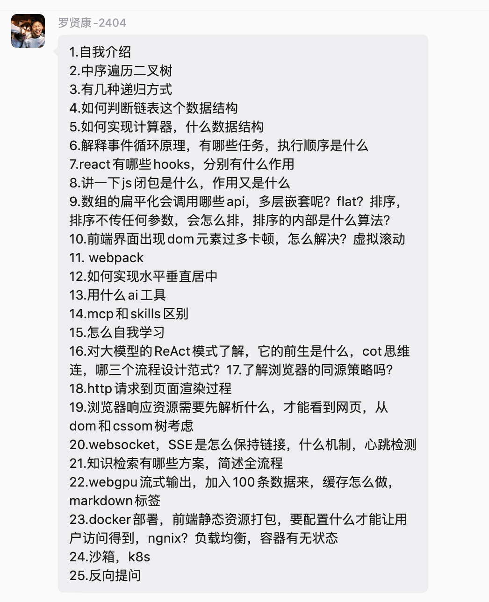

# 小米一面面试题



## 数据结构与算法

### 中序遍历二叉树
- 先/中/后序遍历
考察的是「根节点」被访问的顺序， 左子树永远优先于右子树（固定：左 → 右），变化的只有**根**的位置。
属于深度优先遍历（DFS）
- 层序遍历
层序遍历借助队列，按从上至下、同层从左到右的顺序逐层访问二叉树节点，属于广度优先遍历（BFS）。

```js
// 中序 遍历 递归
// 二叉树中序遍历：左 -> 根 -> 右，递归实现
// root：当前遍历的节点；res：存放遍历结果的数组
function inorder(root, res = []) {
  // 递归终止条件：当前节点为空，直接返回，不再往下递归
  if (!root) return

  // 递归遍历【左子树】
  inorder(root.left, res)
  // 访问【根节点】，把节点值存入结果数组
  res.push(root.val)
  // 递归遍历【右子树】
  inorder(root.right, res)

  // 返回最终遍历结果数组
  return res
}
遇到一个节点，先一头扎进左子树；左看完，记自己；再扎进右子树。空节点就停下来。res 全程共用同一个数组，一路往里面填数字。
```


- 递归
  优点 写法简单， 靠函数调用栈存节点。
  树一旦很深，比如链表一样的斜树()，调用栈会不断叠加，超过浏览器或者系统栈上限，直接栈溢出报错。而且递归会产生很多函数调用开销，大量节点的时候，性能不如迭代版本。

```js
// 中序遍历 迭代（栈）版本：左 -> 根 -> 右
function inorderIter(root) {
  const res = []; // 保存遍历结果
  const stack = []; // 手动栈，代替递归的函数调用栈
  let curr = root; // 当前遍历节点

  // 当前节点不为空，或者栈里还有待处理节点就继续循环
  while (curr || stack.length) {
    // 一路向左，把沿途所有节点压入栈
    while (curr) {
      stack.push(curr);
      curr = curr.left;
    }
    // 左走到头，弹出栈顶节点
    curr = stack.pop();
    res.push(curr.val); // 访问根节点
    curr = curr.right; // 转向处理右子树
  }
  return res;
}

```

- 为什么要有两层 while？内层负责一直向左深入、压节点；
外层循环不断弹出节点，处理右子树
- 为什么循环条件是 `curr || stack.length`：curr 是当前新节点，stack 是之前暂存的节点，两个有一个不为空就不能停

```js
// 层序遍历
// root是根节点，返回二维数组，每一层单独一个数组
function levelOrder(root) {
  if (!root) return []
  const queue = [root] // 队列，初始放入根节点
  const result = []

  while (queue.length) {
    const levelSize = queue.length // 当前这一层节点个数
    const curLevel = []
    for (let i = 0; i < levelSize; i++) {
      const node = queue.shift() // 队头出队
      curLevel.push(node.val)
      // 左、右子节点入队，下一轮循环处理
      if (node.left) queue.push(node.left)
      if (node.right) queue.push(node.right)
    }
    result.push(curLevel)
  }
  return result
}

```

### 如何判断链表这个数据结构

- 链表
  从“底层结构”判断：
  - 物理非连续，逻辑连续
    链表的节点在内存中是分散存储的，不需要像数组那样申请一块连续的内存空间6。它的逻辑顺序完全是通过节点之间的“指针”来维系
  - 节点结构
    链表由一系列节点组成，每个节点包含“数据域”（存储实际数据）和“指针域”
  - 动态内存分配
    链表支持运行时的动态内存管理，无需预先知道数据规模，按需申请和释放内存，避免了数组扩容或溢出的问题
  性能与操作：
  - 增删高效：如果已知目标节点的位置，插入和删除操作只需修改指针，时间复杂度为 O(1)，无需像数组那样移动大量元素
  - 查找低效：链表不支持随机访问（不能通过下标直接获取），查找或访问特定节点必须从头开始遍历，时间复杂度为 O(n)
  - 空间开销与缓存不友好：每个节点都需要额外存储指针，且由于内存地址不连续，遍历时的 CPU 缓存命中率较低

  判断链表有环
  快慢指针法
  逻辑巧妙，而且能在 O(1) 的空间复杂度下完成判断，非常受面试官青睐

  ```js
var hasCycle = function(head) {
    // 边界处理：空链表或只有一个节点时，不可能有环
    if (!head || !head.next) {
        return false;
    }

    // 初始化快慢指针，均指向头节点
    let slow = head;
    let fast = head;

    // 循环条件：必须确保 fast 和 fast.next 都不为 null，
    // 防止在 fast.next.next 时抛出 TypeError
    while (fast && fast.next) {
        slow = slow.next;        // 慢指针每次走 1 步
        fast = fast.next.next;   // 快指针每次走 2 步

        // 如果快慢指针相遇，说明链表有环
        if (slow === fast) {
            return true;
        }
    }

    // 如果快指针顺利走到了链表末尾（null），说明没有环
    return false;
};
  ```

### 如何实现计算器，什么数据结构

栈 ， 计算器实现的核心

### 解释事件循环原理，有哪些任务，执行顺序是什么


### react有哪些hooks，分别有什么作用

**先分类，再讲核心作用 + 使用场景 + 坑点，最后拔高理念**，不要单纯罗列 API。

React Hooks可以分成四类：基础Hook、额外Hook、性能优化Hook，还有React18新增并发相关Hook。

- 基础三个：
1. `useState`
**作用**：给函数组件添加**本地状态**，返回状态变量 + 更新函数。
特点：
-  当 useState 的初始值需要进行昂贵的计算（读取本地存储、大数据预处理、复杂数学运算）使用惰性初始化（传函数）确保昂贵的计算仅在组件首次挂载时执行一次。
```js
const [users] = useState(() => heavyComputation());
```
- 状态更新是**异步批量更新**；更新会触发组件重渲染。
```js
const handleAdd = () => {
    // ❌ 错误写法：连续三次基于 count 更新
    // 假设当前 count 为 0，这三次调用都会计算 0 + 1 = 1
    // React 批处理会将它们合并，最终 count 只会变成 1，而不是 3
    setCount(count + 1); 
    setCount(count + 1); 
    setCount(count + 1); 
  };
当新状态依赖旧状态时，必须使用函数式更新（updater 函数），让 React 在更新队列中依次基于最新值进行计算：
const handleAdd = () => {
    // ✅ 正确写法：React 会按顺序执行，prevCount 会依次拿到 0, 1, 2
    setCount(prevCount => prevCount + 1);
    setCount(prevCount => prevCount + 1);
    setCount(prevCount => prevCount + 1);
  };
```
- 闭包捕获了旧渲染周期的状态快照，导致函数执行时拿到的是过期的旧值，从而引发状态更新丢失或逻辑异常。
```
import { useState, useEffect } from 'react';

function Counter() {
  const [count, setCount] = useState(0);

  useEffect(() => {
    const timer = setInterval(() => {
      // ❌ 陷阱：这里的 count 永远是 0
      // 因为 useEffect 的依赖数组为空 []，它只在组件挂载时执行一次。
      // setInterval 的回调函数在创建时，捕获了当时作用域里的 count 值（即 0）。
      // 无论后续组件重渲染多少次，这个定时器里的 count 永远是初始的快照值 0。
      setCount(count + 1); 
    }, 1000);

    return () => clearInterval(timer);
  }, []); // 空依赖数组

  return <div>Count: {count}</div>;
}

解决方案 
  useEffect(() => {
    const timer = setInterval(() => {
      // ✅ 正确：传递一个函数给 setCount
      // React 内部会保证传入的 prevCount 永远是最新的真实状态值，
      // 完美绕开了闭包捕获旧快照的问题。
      setCount(prevCount => prevCount + 1);
    }, 1000);

    return () => clearInterval(timer);
  }, []); // 依赖数组依然可以保持为空
```

2. `useEffect` 副作用
依赖数组控制执行时机，为空挂载执行一次， 有值，值更新执行；返回函数用来做**清理工作**。

3. useContext
读取`Context`上下文，**跨层级传参**，避免 props 层层传递（props drilling）。


#### 其他内置Hook：
- useRef
  useRef 本质上就是一个持久化可变对象， 它不触发重渲染，专用于存储不影响UI的后台可变值或直接操作DOM，是状态管理的补充。

  **作用两件事**

  1. 获取 DOM 元素实例；
  2. 存**可变值**，保存在 ref.current，修改**不会触发重渲染**。

- useReducer
  复杂状态管理，state 多、状态之间相互依赖时使用。
  因为Todo有增删改查，逻辑复杂。用它能集中管状态，组件更干净，代码更好维护。

  ```
  import React, { useReducer, useState } from 'react';

// 1. 定义 Reducer 函数：集中处理所有的状态更新逻辑
// 它是一个纯函数，接收当前的 state 和触发的 action，返回新的 state
function todoReducer(state, action) {
  switch (action.type) {
    case 'ADD_TODO':
      // 返回新数组，不直接修改原 state（不可变数据原则）
      return [...state, { id: Date.now(), text: action.payload, completed: false }];
    
    case 'TOGGLE_TODO':
      // 遍历数组，找到对应 id 的任务并切换其完成状态
      return state.map(todo =>
        todo.id === action.payload ? { ...todo, completed: !todo.completed } : todo
      );
    
    case 'DELETE_TODO':
      // 过滤掉对应 id 的任务
      return state.filter(todo => todo.id !== action.payload);
    
    default:
      return state;
  }
}

function TodoApp() {
  // 2. 初始化 useReducer：传入 reducer 和初始空数组，获取当前状态和派发函数
  const [todos, dispatch] = useReducer(todoReducer, []);
  const [inputText, setInputText] = useState('');

  // 3. 通过 dispatch 派发不同的 action 来更新状态
  const handleAdd = () => {
    if (inputText.trim()) {
      dispatch({ type: 'ADD_TODO', payload: inputText });
      setInputText('');
    }
  };

  return (
    <div>
      <h2>Todo List</h2>
      <input
        value={inputText}
        onChange={(e) => setInputText(e.target.value)}
        placeholder="输入待办事项"
      />
      <button onClick={handleAdd}>添加</button>
      
      <ul>
        {todos.map(todo => (
          <li key={todo.id} style={{ textDecoration: todo.completed ? 'line-through' : 'none' }}>
            {/* 点击文字切换完成状态 */}
            <span onClick={() => dispatch({ type: 'TOGGLE_TODO', payload: todo.id })}>
              {todo.text}
            </span>
            {/* 点击按钮删除任务 */}
            <button onClick={() => dispatch({ type: 'DELETE_TODO', payload: todo.id })}>
              删除
            </button>
          </li>
        ))}
      </ul>
    </div>
  );
}

export default TodoApp;
  ```

  - 性能优化
  useCallback

  缓存**函数引用**，防止每次渲染生成新函数，传给子组件时减少不必要重渲染。 
  加分：搭配`React.memo`才有意义；

  函数组件每次渲染时，内部定义的函数都会重新创建，导致引用地址改变。如果这个函数传给了子组件，就会打破子组件的优化。

  ```
  import { useState, memo } from 'react';

// 子组件：用 memo 包裹，期望 props 不变时不渲染
const Child = memo(({ onClick }) => {
  console.log('子组件渲染了');
  return <button onClick={onClick}>子组件按钮</button>;
});

const Parent = () => {
  const [count, setCount] = useState(0);

  // ❌ 问题：每次父组件渲染，都会创建一个全新的函数
  // 即使逻辑完全一样，但内存中的引用地址变了
  const handleClick = () => {
    console.log('点击了');
  };

  return (
    <div>
      <p>父组件计数：{count}</p>
      {/* 点击这个按钮，count 变化，父组件重渲染 */}
      <button onClick={() => setCount(count + 1)}>父组件+1</button> 
      
      {/* 因为 handleClick 引用变了，memo 失效，Child 会跟着无效重渲染 */}
      <Child onClick={handleClick} />
    </div>
  );
};

  优化版本：使用 useCallback 缓存函数引用

  import { useState, memo, useCallback } from 'react';

const Child = memo(({ onClick }) => {
  console.log('子组件渲染了');
  return <button onClick={onClick}>子组件按钮</button>;
});

const Parent = () => {
  const [count, setCount] = useState(0);

  // ✅ 优化：useCallback 会缓存函数的引用
  // 只要依赖数组 [] 为空，无论父组件怎么重渲染，handleClick 永远是同一个引用
  const handleClick = useCallback(() => {
    console.log('点击了');
  }, []); 

  return (
    <div>
      <p>父组件计数：{count}</p>
      <button onClick={() => setCount(count + 1)}>父组件+1</button>
      
      {/* 因为 handleClick 引用没变，memo 生效，Child 不会重渲染 */}
      <Child onClick={handleClick} />
    </div>
  );
};

  useCallback 本身并不能阻止子组件渲染，它必须和 React.memo 配合使用（即“黄金搭档”）：
  父组件用 useCallback 保证传给子组件的函数引用是稳定的。
  子组件用 React.memo 拦截渲染，发现函数引用没变，就跳过更新。
  ```

  - `useMemo`

  **作用**：缓存**计算结果**，避免每次渲染重复执行昂贵计算。

  ```
  import React, { useState } from 'react';

function SearchList({ items }) {
  const [filterText, setFilterText] = useState('');
  const [count, setCount] = useState(0);

  // ❌ 问题所在：每次组件重新渲染（包括点击无关按钮），都会重新执行这个过滤操作
  // 如果 items 有上万条数据，这里会非常卡顿
  const filteredItems = items.filter(item => 
    item.includes(filterText)
  );

  return (
    <div>
      <input 
        value={filterText} 
        onChange={(e) => setFilterText(e.target.value)} 
        placeholder="搜索..." 
      />
      
      {/* 这是一个与搜索完全无关的按钮 */}
      <button onClick={() => setCount(count + 1)}>
        无关按钮 (点击次数: {count})
      </button>

      <ul>
        {filteredItems.map((item, index) => <li key={index}>{item}</li>)}
      </ul>
    </div>
  );
}

  优化后
  import React, { useState, useMemo } from 'react';

function SearchList({ items }) {
  const [filterText, setFilterText] = useState('');
  const [count, setCount] = useState(0);

  // ✅ 优化：使用 useMemo 缓存计算结果
  // 只有当依赖项 [items, filterText] 发生变化时，才会重新执行过滤计算
  const filteredItems = useMemo(() => {
    console.log('正在进行高耗能的过滤计算...');
    return items.filter(item => item.includes(filterText));
  }, [items, filterText]); 

  return (
    <div>
      <input 
        value={filterText} 
        onChange={(e) => setFilterText(e.target.value)} 
        placeholder="搜索..." 
      />
      
      <button onClick={() => setCount(count + 1)}>
        无关按钮 (点击次数: {count})
      </button>

      <ul>
        {filteredItems.map((item, index) => <li key={index}>{item}</li>)}
      </ul>
    </div>
  );
}
  当你点击“无关按钮”触发组件重新渲染时，useMemo 会检查依赖项 items 和 filterText。发现它们没有变化，于是直接从内存中拿出上次算好的 filteredItems，耗时 0 秒，完美避免了页面卡顿。
  ```

- useImperativeHandle（命令式的）
  自定义向父组件暴露的实例值（方法或属性） 

  Imperative = 命令式的
Handle = 句柄 / 把手 / 控制权
连起来的意思就是：“允许父组件用命令式的方式，直接控制子组件的句柄（方法）”。

 ```
 import React, { useRef } from 'react';
import CustomInput from './CustomInput';

function App() {
  // 1. 创建一个 ref
  const myInputRef = useRef(null);

  const handleFocus = () => {
    // 2. 通过 ref.current 直接调用子组件暴露的方法
    myInputRef.current.focus(); 
  };

  const handleClear = () => {
    myInputRef.current.clear();
  };

  // ❌ 如果你尝试 myInputRef.current.value = 'xxx'，会报错，因为 DOM 被隐藏了

  return (
    <div>
      <CustomInput ref={myInputRef} />
      <button onClick={handleFocus}>点击聚焦</button>
      <button onClick={handleClear}>点击清空</button>
    </div>
  );
}

export default App;

  import React, { useRef, useImperativeHandle, forwardRef } from 'react';

// 使用 forwardRef 接收父组件传来的 ref
const CustomInput = forwardRef((props, ref) => {
  // 1. 在子组件内部创建一个真实的 DOM ref
  const inputRef = useRef(null);

  // 2. 使用 useImperativeHandle 自定义暴露给父组件的实例值
  useImperativeHandle(ref, () => ({
    // 只暴露这两个方法，父组件无法直接拿到 inputRef.current
    focus: () => {
      inputRef.current.focus();
    },
    clear: () => {
      inputRef.current.value = '';
    }
  }), []); // 依赖数组为空，因为这些方法不需要随状态变化而改变

  return <input ref={inputRef} {...props} placeholder="请输入内容..." />;
});

export default CustomInput;
 ```
 - useLayoutEffect
  ```
  useEffect 是在浏览器绘制（Paint）之后异步执行的。
  useLayoutEffect 是在 DOM 更新之后、浏览器绘制之前同步执行的

  可以解决UI闪烁。比如动态获取元素宽度，用它在渲染前改好样式，避免跳变。

  import { useState, useRef, useEffect } from 'react';

function FlickerCard() {
  const [width, setWidth] = useState(0);
  const divRef = useRef(null);

  useEffect(() => {
    if (divRef.current) {
      setWidth(divRef.current.offsetWidth);
    }
  }, []);

  return (
    <div 
      ref={divRef} 
      style={{ 
        width: '100%', 
        height: 100, 
        backgroundColor: width > 500 ? 'blue' : 'red' 
      }}
    >
      当前宽度: {width}px
    </div>
  );
}

  ----- 
  import { useState, useRef, useLayoutEffect } from 'react';

function SmoothCard() {
  const [width, setWidth] = useState(0);
  const divRef = useRef(null);

  useLayoutEffect(() => {
    if (divRef.current) {
      setWidth(divRef.current.offsetWidth);
    }
  }, []);

  return (
    <div 
      ref={divRef} 
      style={{ 
        width: '100%', 
        height: 100, 
        backgroundColor: width > 500 ? 'blue' : 'red' 
      }}
    >
      当前宽度: {width}px
    </div>
  );
}

  DOM 生成后，浏览器还没来得及画屏幕，useLayoutEffect 就同步执行了。
它立刻测量出真实宽度（800px）并更新状态。
组件基于正确的宽度重新计算，然后浏览器才把蓝色的卡片画到屏幕上。
  ```

- React18 新增 Hook
 useId用于SSR生成稳定唯一id；

 在 SSR（服务端渲染）中，最典型的痛点就是服务端生成的随机 ID 和客户端生成的不一致，导致 React 报 Hydration failed（水合失败）警告，甚至导致页面首屏闪烁15。
下面我用一个“密码输入框与提示文本的无障碍关联”作为简单案例来驱动说明。
❌ 不用 useId 的情况（SSR 水合报错）
假设我们使用 Math.random() 来生成 ID，以便让屏幕阅读器知道 <p> 标签是 <input> 的提示：
jsx

预览


function PasswordField() {
  // ❌ 每次渲染都会生成一个新的随机数
  const hintId = `hint-${Math.random().toString(36).slice(2)}`; 

  return (
    <>
      <input type="password" aria-describedby={hintId} />
      <p id={hintId}>密码至少包含8个字符</p>
    </>
  );
}
为什么会出问题？
服务端渲染时：Math.random() 生成了 hint-0.123，服务端返回的 HTML 是 <input aria-describedby="hint-0.123" />。
客户端水合时：React 在浏览器里又执行了一遍代码，Math.random() 生成了 hint-0.789。
冲突发生：React 发现客户端的 hint-0.789 和服务端的 hint-0.123 对不上，直接抛出 Hydration failed 警告，甚至丢弃整棵子树重新渲染，导致页面闪一下15。
✅ 使用 useId 解决（SSR 完美水合）
jsx

预览


import { useId } from 'react';

function PasswordField() {
  // ✅ 基于组件在 Fiber 树中的位置生成确定性 ID
  const hintId = useId(); 

  return (
    <>
      <input type="password" aria-describedby={hintId} />
      <p id={hintId}>密码至少包含8个字符</p>
    </>
  );
}
为什么解决了？
useId 是 React 18 专为 SSR 设计的 Hook。它不依赖随机数，而是根据组件在 React 组件树中的“父级路径（parent path）”来生成 ID（例如 :r1:）48。
服务端渲染时：生成 ID :r1:。
客户端水合时：React 发现组件树结构没变，根据相同的路径精确生成同样的 ID :r1:58。
完美水合：服务端和客户端的 HTML 完全一致，无障碍属性（aria-describedby）精准配对，没有任何警告和闪烁16。

因为 SSR 的核心目的是“复用已有 DOM，而不是重新创建”6。
服务端先渲染出 HTML 发给浏览器，客户端的 React 需要接管这些已有的 HTML 让它变成可交互的应用，这个过程叫水合（Hydration）36。
水合的本质是：客户端“重新执行一遍渲染逻辑”，并且结果必须和服务端完全一致5。React 期望服务端和客户端渲染的内容是相同的，这样它只需要在已有的 HTML 上绑定事件监听器即可，性能最好6。
如果 ID 对不上（比如服务端是 :r0:，客户端是 :r1:），React 就会发现 DOM 属性不匹配，触发 Hydration Mismatch（水合不匹配）。这时候 React 只能放弃复用，重新渲染整棵子树，导致：
控制台报大量警告
页面首屏闪烁
性能优势完全丧失15
所以必须保证 ID 一致，才能顺利水合。

### useTransition 

`useTransition` 用来**标记一段状态更新为非紧急更新**，让高优先级任务（输入、点击）优先执行，避免页面卡顿，是 React18 并发渲染的 API。

```
import { useState, useTransition } from 'react'

// 模拟超大原始数据
const bigData = Array.from({ length: 10000 }, (_, i) => `测试数据-${i}-${Math.random().toString(36).slice(2)}`)

function SearchList() {
  const [inputVal, setInputVal] = useState('')
  const [list, setList] = useState([])
  const [isPending, startTransition] = useTransition()

  const handleChange = (e) => {
    const val = e.target.value
    // 紧急更新：输入框立刻回显
    setInputVal(val)

    // 非紧急低优先级更新
    startTransition(() => {
      const newList = bigData.filter(item => item.includes(val))
      setList(newList)
    })
  }

  return (
    <>
      <input
        style={{ width: 300, padding: 6, fontSize: 16 }}
        placeholder="输入关键词搜索上万条数据"
        value={inputVal}
        onChange={handleChange}
      />
      {isPending && <div style={{color:'#666'}}>正在加载...</div>}
      <div style={{marginTop:10,maxHeight:'400px',overflow:'auto'}}>
        {list.map(item => (
          <div key={item} style={{padding: '4px 0'}}>{item}</div>
        ))}
      </div>
    </>
  )
}

export default SearchList
面试补充一句话：去掉 useTransition 之后，快速打字会明显感受到输入框卡顿，因为大量列表渲染阻塞主线程。
```
#### react 19 hooks
- use ()

在面试中介绍 React 19 的 use() Hook，最好的策略是“先讲旧痛点（样板代码多），再讲新特性（极简API），最后点出核心限制”。
你可以参考下面这套“案例驱动”的面试话术：
1. 抛出痛点：旧版异步获取数据的“繁琐模板”
“面试官您好，在 React 19 之前，我们在组件里获取异步数据（比如调接口），通常需要写一堆样板代码：用 useState 管 loading 和 error 状态，用 useEffect 发请求，最后还要写一堆 if/else 做条件渲染。代码非常冗长，而且容易遗漏边缘情况。”
2. 引入 use()：极简的异步与上下文读取
“React 19 引入了 use() Hook，它极大地简化了这个过程。它允许我们直接在渲染阶段读取 Promise 或 Context。
比如获取数据，我只需要 const data = use(fetchData())。如果数据还没返回，React 会自动挂起渲染，配合 Suspense 显示加载状态，完全不需要手动维护 loading 状态了。”

```
import React, { Suspense, use } from 'react';

// 1. 模拟一个异步请求（返回 Promise）
const fetchUser = () => {
  return new Promise((resolve) => {
    setTimeout(() => {
      resolve({ name: '张三', age: 28 });
    }, 1500); // 模拟 1.5 秒的网络延迟
  });
};

// 2. 子组件：直接使用 use() 读取数据
function UserProfile({ userPromise }) {
  // use() 会在数据准备好前自动挂起组件
  const user = use(userPromise); 

  return (
    <div style={{ padding: '20px', border: '1px solid #ccc' }}>
      <h2>{user.name}</h2>
      <p>年龄：{user.age}</p>
    </div>
  );
}

// 3. 父组件：提供 Promise 并用 Suspense 包裹
export default function App() {
  // 注意：Promise 最好在父组件或外部创建，避免每次渲染都重新请求
  const userPromise = fetchUser(); 

  return (
    <div style={{ padding: '20px' }}>
      <h1>React 19 use() 示例</h1>
      
      {/* Suspense 负责在 use() 挂起时显示加载状态 */}
      <Suspense fallback={<p style={{ color: 'gray' }}>⏳ 正在加载用户信息...</p>}>
        <UserProfile userPromise={userPromise} />
      </Suspense>
    </div>
  );
}
```