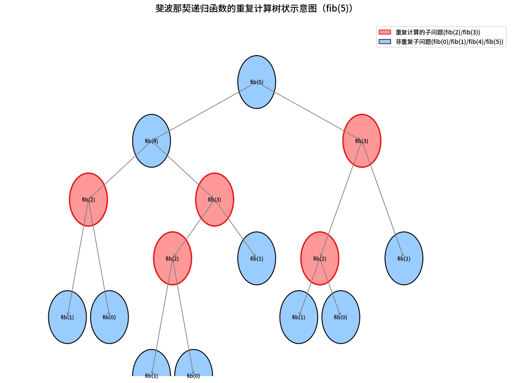

## 记忆函数
- 先看一个例子：斐波那契数列
斐波那契数列是指从 0 和 1 开始，后续每一项都等于前两项之和的整数序列，其核心规律为 F (0)=0，F (1)=1，F (n)=F (n-1)+F (n-2)（n≥2，n 为整数）。

```
fib(0) = 0  
fib(1) = 1  
fib(n) = fib(n-1) + fib(n-2)
```

递归写法
```js
function fib(n) {
  if (n <= 1) return n;
  return fib(n - 1) + fib(n - 2);
}

console.log(fib(10)); // 55
```

功能正确，但效率极低！


红色背景节点（fib(2)、fib(3)）是被重复计算的核心子问题
还有函数不断的入栈，占用了大量的内存

fib(40) 可能要等好几秒

它重复计算了大量相同的子问题（如 fib(3) 被算了好多次）
时间复杂度是 指数级 O(2ⁿ)！

- 为什么时间复杂度是O(2ⁿ)?
算斐波那契递归时，求 fib (n) 得先算 fib (n-1) 和 fib (n-2)，这两个又要各自拆成两个更小的计算，就像树枝不断分叉。每往下算一层，需要算的次数就翻倍（比如算 fib (5) 拆 2 个，再拆 4 个…）。n 层递归下来，总的计算次数大概是 2 的 n 次方，所以时间复杂度是 O (2ⁿ)，n 越大，计算量会像滚雪球一样指数级增长，越算越慢。


- 怎么办？
记忆函数
记忆函数 是一种优化技术：将函数的输入和对应的输出缓存起来，当下次传入相同输入时，直接返回缓存结果，避免重复计算。
核心思想：用空间换时间。

我们要改造 fib，让它“记住”算过的值。

const cache = {};

function fib(n) {
  if (n in cache) {
    console.log(`命中缓存: fib(${n}) = ${cache[n]}`);
    return cache[n];
  }

  if (n <= 1) {
    cache[n] = n;
    return n;
  }

  const result = fib(n - 1) + fib(n - 2);
  cache[n] = result; // 缓存结果
  return result;
}

现在 fib(40) 瞬间出结果！

但有个问题：cache 是全局变量，容易被污染或冲突。
能不能把 cache 隐藏起来，只让 fib 函数自己用？

答案：用闭包！

- 用闭包封装缓存 —— 真正的记忆函数
```
const fib = (function () {
  const cache = {}; // 私有缓存，外部无法访问

  return function (n) {
    if (n in cache) {
      return cache[n];
    }
    if (n <= 1) {
      cache[n] = n;
      return n;
    }
    cache[n] = fib(n - 1) + fib(n - 2);
    return cache[n];
  };
})();
```

这就是经典的 闭包 + 记忆化 组合！

外层 IIFE 创建了一个私有作用域
cache 被内层函数通过闭包捕获
外部只能调用 fib(n)，无法看到或修改 cache


2.js

为什么需要闭包？
cache 必须持久存在，不能每次调用都重置。
但又不能暴露给全局（避免污染、安全、模块化）。
闭包 正好提供了：函数 + 私有状态 的能力。


## 高阶函数
1.js
传给高阶函数的函数就是一个中间件，它把数据预处理好了，然后再转交给高阶函数继续运算。

