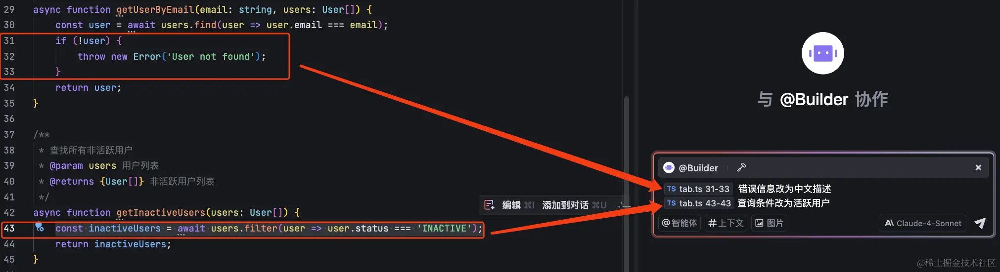

[source](https://juejin.cn/book/7517259125575647272/section/7517259553176731682)

理解JS 执行上下文， 是理解JS 运行机制的关键。
与 AI 编程助手对话的质量，很大程度上取决于你提供给它的"上下文"。

上下文可以是一段代码、一个文件、甚至整个项目。

提供精准的上下文，能让 Trae 更深入地理解你的意图，给出更贴切、更准确的回答。

rag 其实就是给llm上下文，生成一个符合上下文的响应。

聚焦Trae 提供上下文信息

## 编辑器中的代码

当前文件：当你向 Trae 提问时，它默认就能"看到"你当前正在编辑的文件。你可以直接就当前文件的内容进行提问。

Trae 在这里的交互体验非常出色，选中的代码块会作为一个独立的"上下文标签"显示在输入框中，你可以自由地在它的前后输入描述文字。

可以讲点ts
```
interface User {
  email: string;
  status: string;
  // 其他用户字段省略
}

const users: User[] = [
  { email: 'user1@example.com', status: 'ACTIVE' },
  { email: 'user2@example.com', status: 'ACTIVE' },
  { email: 'user3@example.com', status: 'INACTIVE' },
];

async function getUserByEmail(email: string, users: User[]) {
  const user = await users.find(user => user.email === email);
  if (!user) {
    throw new Error('User not found');
  }
  return user;
}

/**
 * 查找所有非活跃用户
 * @param users 用户列表
 * @returns {User[]} 非活跃用户列表
 */
async function getInactiveUsers(users: User[]) {
  const inactiveUsers = await users.filter(user => user.status === 'ACTIVE');
  return inactiveUsers;
}
```

选中代码, 点击悬浮菜单中的"添加到对话"按钮, 


##  终端中的内容

```
/**
 * 根据邮箱获取用户信息
 * @param email 用户邮箱
 * @param users 用户列表
 * @returns {User} 用户对象
 */
async function getUser(email: string, users: User[]) {
  const user = await users.find(user => user.email === email);
  if (!user) {
    throw new Error('User not found');
  }
  return user;
}

// 函数调用
getUser('123@qq.com', [{ email: '123@qq.com', status: 'ACTIVE' }]);
```
node 2.ts
选中报错 添加到对话 运行之后为什么会报这个错？

## 代码索引：让 Trae 成为你的项目专家

代码索引是 Trae 理解整个项目的基石。它会扫描你的项目文件，并创建一个"地图"（即索引），帮助 AI 快速导航和理解代码库的结构与关系。

为什么需要代码索引？
回答更准确：AI 能基于整个项目的知识来回答问题，而不是猜测。
理解跨文件关系：轻松理解函数调用、类继承等跨文件逻辑。
重构建议更精准：进行全局性的代码重构和优化。

如何管理索引？

通常，Trae 会自动为小型项目（文件数小于 5000）创建索引，你基本无需干预。
对于大型项目，你可以在 AI 对话框右上角的 设置 > 索引与文档 -> 代码索引管理 中手动管理。
清楚， 重新构建
重新构建：当代码库发生大的变化或你修改了忽略文件列表后，手动更新索引。
清空：删除当前项目的索引。删除时会有确认提示，并告知预计释放的磁盘空间。

## 忽略文件：保护你的敏感信息
不是项目中的所有文件都应该被 AI 看到，例如包含密码的配置文件、本地开发环境的日志等。

rae 允许你精确地控制哪些文件需要被排除在索引之外。
Trae 默认会遵守 .gitignore 文件中的规则。

设置 > 索引与文档 -> 忽略文件

## 使用 # 符号：上下文的瑞士军刀

# 符号是 Trae 中一个极其强大的功能，它让你能够灵活、精确地指定多种来源的上下文。你可以在对话输入框中输入 # 或直接点击输入框左侧的 # 上下文 按钮来唤起上下文菜单。

#Folder：将整个文件夹作为上下文，适用于分析一个模块或一组相关组件。

#Workspace：将整个项目作为上下文，当你需要进行全局重构、添加新功能或快速了解一个陌生项目时，这个功能非常有用。

重要提示：#Folder 和 #Workspace 的强大能力依赖于 代码索引。如果索引未完成，AI 的回答可能不完整。

## #Workspace 快速理解新项目

让我们来看一个实际例子，体验一下 #Workspace 的威力。假设你刚接触一个开源的图片压缩项目：https://github.com/qufei1993/compressor。

1. 将项目克隆到本地，并用 Trae 打开。
2. 等待 Trae 自动完成代码索引。
3. 在 AI 对话框中，输入 #Workspace，然后提出你的问题，例如："介绍下这个项目的作用和使用的技术栈"。

#Workspace 介绍下这个项目的作用和使用的技术栈

Trae 会立即开始分析整个项目。从下方的结果可以看到，它自动引用了 README.md、.gitignore 以及核心的 .ts 文件等共计 101 个上下文，然后给出了非常精准和全面的回答，涵盖了项目作用、技术栈和核心功能。

这个过程完美展示了代码索引结合 #Workspace 的强大能力，它能让你在几分钟内对一个陌生的项目建立起准确的宏观认识。

#Code：  聚焦函数与类    要加:

当你想要讨论某个具体的函数或类时，#Code 是最佳选择。它会将指定代码块作为上下文，而不是整个文件。

#File：指定单个或多个文件 直接#File 文件路径  加冒号

如果你的问题涉及多个文件，或者需要 AI 理解单个文件的全部内容，可以使用 #File。

trae 还支持直接从资源管理器将文件拖拽到对话输入框中，非常方便。

#Doc：打造你的私人知识库

除了代码，Trae 还能索引你的外部文档，如技术手册、API 文档、项目笔记等，打造一个随叫随到的私人知识库。这就是 #Doc 功能。

总结：成为 Trae 上下文大师
我们已经探索了 Trae 丰富而强大的上下文功能。掌握它们，是将 Trae 从一个"聊天机器人"变为一个真正"懂你代码"的智能伙伴的关键。

回顾一下，我们拥有一个立体的上下文工具箱：


