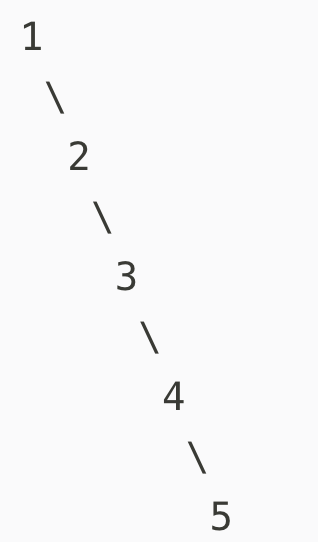

# 二叉搜索树 
Binary Search Tree BST ,是二叉树的一种特殊形式。
还有别名：排序二叉树、二叉查找树

- 为什么会叫做排序二叉树？
左子树 < 根 < 右子树
- 为什么会叫二叉查找树？
因为其结构支持高效查找：对任意节点，左子树值小、右子树值大，可快速定位目标值。
二叉查找树（BST）的平均时间复杂度为 O(log n)，最坏情况（退化为链表）为 O(n)，适用于查找、插入、删除操作。


## 什么是二叉搜索树
树的定义总是以递归的形式出现
- 是一棵空树
- 是一棵由根结点、左子树、右子树组成的树，同时左子树和右子树都是二叉搜索树，且左子树上所有结点的数据域都小于等于根结点的数据域，右子树上所有结点的数据域都大于等于根结点的数据域

二叉搜索树强调的是数据域的有序性, 


## 操作
1. 查找数据域为某一特定值的结点
2. 插入新结点
3. 删除指定结点

## 查找
1. 递归遍历二叉树，若当前遍历到的结点为空，就意味着没找到目标结点，直接返回。
2. 若当前遍历到的结点对应的数据域值刚好等于n，则查找成功，返回。
3. 若当前遍历到的结点对应的数据域值大于目标值n，则应该在左子树里进一步查找，设置下一步的遍历范围为 root.left 后，继续递归。
4. 若当前遍历到的结点对应的数据域值小于目标值n，则应该在右子树里进一步查找，设置下一步的遍历范围为 root.right 后，继续递归。

1.js 

```
function search(root, n) {
    // 若 root 为空，查找失败，直接返回
    if(!root) {
        return 
    }
    // 找到目标结点，输出结点对象
    if(root.val === n) {
        console.log('目标结点是：', root)
    } else if(root.val > n) {
        // 当前结点数据域大于n，向左查找
        search(root.left, n)
    } else {
        // 当前结点数据域小于n，向右查找
        search(root.right, n)
    }
}

class TreeNode {
    constructor(val) {
        this.val = val;
        this.left = null;
        this.right = null;
    }
}

const root = new TreeNode(6);
root.left = new TreeNode(3);
root.right = new TreeNode(8);
root.left.left = new TreeNode(1);
root.left.right = new TreeNode(4);
root.right.left = new TreeNode(7);
root.right.right = new TreeNode(9);

search(root, 7);

```

## 插入新结点

2.js
```
function insertIntoBST(root, n) {
    // 若 root 为空，说明当前是一个可以插入的空位
    if(!root) { 
        // 用一个值为n的结点占据这个空位
        root = new TreeNode(n)
        return root
    }
    
    if(root.val > n) {
        // 当前结点数据域大于n，向左查找
        root.left = insertIntoBST(root.left, n)
    } else {
        // 当前结点数据域小于n，向右查找
        root.right = insertIntoBST(root.right, n)
    }

    // 返回插入后二叉搜索树的根结点
    return root
}

```
## 删除指定结点

想要删除某个结点，首先要找到这个结点。在定位结点后，我们需要考虑以下情况：

1. 结点不存在，定位到了空结点。直接返回即可。
2. 需要删除的目标结点没有左孩子也没有右孩子——它是一个叶子结点，删掉它不会对其它结点造成任何影响，直接删除即可。
3. 需要删除的目标结点存在左子树，那么就去左子树里寻找小于目标结点值的最大结点，用这个结点覆盖掉目标结点
4. 需要删除的目标结点存在右子树，那么就去右子树里寻找大于目标结点值的最小结点，用这个结点覆盖掉目标结点
5. 需要删除的目标结点既有左子树、又有右子树，这时就有两种做法了：要么取左子树中值最大的结点，要么取右子树中取值最小的结点。两个结点中任取一个覆盖掉目标结点，都可以维持二叉搜索树的数据有序性

3.js
```
function deleteNode(root, n) {
    // 如果没找到目标结点，则直接返回
    if(!root) {
        return root
    }
    // 定位到目标结点，开始分情况处理删除动作
    if(root.val === n) {
        // 若是叶子结点，则不需要想太多，直接删除
        if(!root.left && !root.right) {
            root = null
        } else if(root.left) {
            // 寻找左子树里值最大的结点
            const maxLeft = findMax(root.left)
            // 用这个 maxLeft 覆盖掉需要删除的当前结点  
            root.val = maxLeft.val
            // 覆盖动作会消耗掉原有的 maxLeft 结点
            root.left = deleteNode(root.left, maxLeft.val)
        } else {
            // 寻找右子树里值最小的结点
            const minRight = findMin(root.right)
            // 用这个 minRight 覆盖掉需要删除的当前结点  
            root.val = minRight.val
            // 覆盖动作会消耗掉原有的 minRight 结点
            root.right = deleteNode(root.right, minRight.val)
        }
    } else if(root.val > n) {
        // 若当前结点的值比 n 大，则在左子树中继续寻找目标结点
        root.left = deleteNode(root.left, n)
    } else  {
        // 若当前结点的值比 n 小，则在右子树中继续寻找目标结点
        root.right = deleteNode(root.right, n)
    }
    return root
}

// 寻找左子树最大值
function findMax(root) {
    while(root.right) {
        root = root.right
    }
    return root 
}

// 寻找右子树的最小值
function findMin(root) {
    while(root.left) {
        root = root.left
    }
    return root
}

```


## DFS（深度优先搜索）和BFS（广度优先搜索）

看到这张图片你能想到啥？
迷宫游戏

- DFS 是啥？
深度优先搜索
深度优先搜索也不过是在用编码的方式玩一场迷宫游戏。

- 那么BFS 呢？
广度优先搜索

## DFS
尝试把每一条能走的路都走一遍——也就是所谓的“穷举法”
- 以当前位置为起点，闷头往前走
- 在前进的过程中，难免会遇到岔路口。这个路口可能分叉出去两条、三条、四条甚至更多的道路，你只能选择其中的一条路、然后继续前进（注意，你可能会不止一次遇到岔路口；每遇到一个新的岔路口，你都需要做一次选择）。
- 你选择的这条路未必是一条通路。如果你走到最后发现此路不通，那么你就要退回到离你最近的那个分叉路口，然后尝试看其它的岔路能不能走通。如果当前的岔路口分叉出去的所有道路都走不通，那么就需要退回到当前岔路口的上一个岔路口，进一步去寻找新的路径。

按照这个思路走下去，只要迷宫是有出口的，你就一定能找到这个出口。

在这个过程里，我们贯彻了“不撞南墙不回头”的原则：只要没有碰壁，就决不选择其它的道路，而是坚持向当前道路的深处挖掘——像这样将“深度”作为前进的第一要素的搜索方法，就是所谓的“深度优先搜索”。

深度优先搜索的核心思想，是试图穷举所有的完整路径。

深度优先搜索的本质？——栈结构


图中蓝色的是入口，灰色的是岔路口，黑色的是死胡同，绿色的是出口。

从 A 出发，沿着唯一的一条道路往下走，遇到了第1个岔路口B。眼前有三个选择：C、D、E。这里我按照从上到下的顺序来走（你也可以按照其它顺序），先走C。
发现 C是死胡同，后退到最近的岔路口 B，尝试往D方向走。
发现D 是死胡同，，后退到最近的岔路口 B，尝试往E方向走。
E 是一个岔路口，眼前有两个选择：F 和 G。按照从上到下的顺序来走，先走F。
发现F 是死胡同，后退到最近的岔路口 E，尝试往G方向走。
G 是一个岔路口，眼前有两个选择：H 和 I。按照从上到下的顺序来走，先走H。
发现 H 是死胡同，后退到最近的岔路口 G，尝试往I方向走。
I 就是出口，成功走出迷宫。

现在我们把迷宫中的每一个坐标看做是栈里的一个元素，用栈来模拟这个过程：

从 A 出发（A入栈），经过了B（B入栈），接下来面临 C、D、E三条路。这里按照从上到下的顺序来走（你也可以选择其它顺序），先走C（C入栈）。
发现 C是死胡同，后退到最近的岔路口 B（C出栈），尝试往D方向走（D入栈）。
发现D 是死胡同，，后退到最近的岔路口 B（D出栈），尝试往E方向走（E入栈）。
E 是一个岔路口，眼前有两个选择：F 和 G。按照从上到下的顺序来走，先走F（F入栈）。
发现F 是死胡同，后退到最近的岔路口 E（F出栈），尝试往G方向走（G入栈）。
G 是一个岔路口，眼前有两个选择：H 和 I。按照从上到下的顺序来走，先走H（H入栈）。
发现 H 是死胡同，后退到最近的岔路口 G（H出栈），尝试往I方向走（I入栈）。
I 就是出口，成功走出迷宫。

此时栈里面的内容就是A、B、E、G、I，因此 A->B->E->G->I 就是走出迷宫的路径。通过深度优先搜索，我们不仅可以定位到迷宫的出口，还可以记录下相关的路径信息。

DFS 中，我们往往使用递归来模拟入栈、出栈的逻辑。

## DFS 与二叉树的遍历

现在我们站在深度优先搜索的角度，重新理解一下二叉树的先序遍历过程：


从 A 结点出发，访问左侧的子结点；如果左子树同样存在左侧子结点，就头也不回地继续访问下去。一直到左侧子结点为空时，才退回到距离最近的父结点、再尝试去访问父结点的右侧子结点——这个过程，和走迷宫是何其相似！事实上，在二叉树中，结点就好比是迷宫里的坐标，图中的每个结点在作为父结点时无疑是岔路口，而空结点就是死胡同。我们回顾一下二叉树先序遍历的编码实现：

```
// 所有遍历函数的入参都是树的根结点对象
function preorder(root) {
    // 递归边界，root 为空
    if(!root) {
        return 
    }
     
    // 输出当前遍历的结点值
    console.log('当前遍历的结点值是：', root.val)  
    // 递归遍历左子树 
    preorder(root.left)  
    // 递归遍历右子树  
    preorder(root.right)
}

```
二叉树的先序遍历正是深度优先搜索思想的递归实现。可以说深度优先搜索过程就类似于树的先序遍历、是树的先序遍历的推广。

DFS 是图/树的遍历策略，先序遍历是 DFS 在二叉树中的一种具体实现（根→左→右）

4.js


