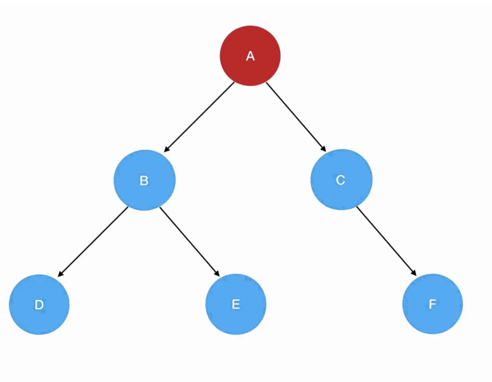

# 二叉树的遍历

- 数组的遍历
- 链表的遍历

## 二叉树遍历方式

二叉树和“递归”两个大热命题点
递归遍历：
- 先序遍历 
- 中序遍历
- 后序遍历
迭代遍历
- 层次遍历

编程语言中，函数Func(Type a,……)直接或间接调用函数本身，则该函数称为递归函数。

“递归”就意味着“反复”，像咱们之前对二叉树的定义，就可以理解为是一个递归式的定义：

- 它可以没有根结点，作为一棵空树存在
- 如果它不是空树，那么必须由根结点、左子树和右子树组成，且左右子树都是二叉树。

这意味着我们要反复地执行“创建一个由数据域、左右子树组成的结点”这个动作，直到数据被分配完为止。


- 左子树一定先于右子树遍历
根结点 -> 左子树 -> 右子树 先序遍历
左子树 -> 根结点 -> 右子树 中序遍历
左子树 -> 右子树 -> 根结点 后序遍历

在这三种顺序中，根结点的遍历分别被安排在了首要位置、中间位置和最后位置。

##  先序遍历

顺序？ ABDECF

- 用树来申明
```
const root = {
  val: "A",
  left: {
    val: "B",
    left: {
      val: "D"
    },
    right: {
      val: "E"
    }
  },
  right: {
    val: "C",
    right: {
      val: "F"
    }
  }
};

```
## 递归函数的编写要点
编写一个递归函数之前，大家首先要明确两样东西：
- 递归式
  你每一次重复的内容是什么
  其实就是 根结点 -> 左子树 -> 右子树 这个旅行路线。
- 递归边界
  你什么时候停下来
  目标树为空的时候

```
// 所有遍历函数的入参都是树的根结点对象
function preorder(root) {
    // 递归边界，root 为空
    if(!root) {
        return 
    }
     
    // 输出当前遍历的结点值
    console.log('当前遍历的结点值是：', root.val)  
    // 递归遍历左子树 
    preorder(root.left)  
    // 递归遍历右子树  
    preorder(root.right)
}

```
- 执行细节


1. 调用 preorder(root)，这里 root 就是 A，它非空，所以进入递归式，输出 A 值。接着优先遍历左子树，preorder(root.left) 此时为 preorder(B) ：

2. 进入 preorder(B) 的逻辑： 入参为结点 B，非空，进入递归式，输出 B 值。接着优先遍历 B 的左子树，preorder(root.left) 此时为 preorder(D) ：

3. 进入 preorder(D) 的逻辑： 入参为结点 D，非空，进入递归式，输出 D 值。接着优先遍历 D 的左子树，preorder(root.left) 此时为 preorder(null)：

4. 进入preorder(null) ，发现抵达了递归边界，直接 return 掉。紧接着是 preorder(D) 的逻辑往下走，走到了 preorder(root.right) ：

5. 再次进入preorder(null) ，发现抵达了递归边界，直接 return 掉，回到preorder(D) 里。接着 preorder(D) 的逻辑往下走，发现 preorder(D) 已经执行完了。于是返回，回到preorder(B) 里，接着preorder(B) 往下走，进入 preorder(root.right) ，也就是 preorder(E) ：

6. E 不为空，进入递归式，输出 E 值。接着优先遍历 E 的左子树，preorder(root.left) 此时为 preorder(null)，触碰递归边界，直接返回 preorder(E)；继续preorder(E)执行下去，是preorder(root.right) ，这里 E 的 right 同样是 null，故直接返回。如此一来，preorder(E)就执行完了，回到preorder(B)里去；发现preorder(B)也执行完了，于是回到preorder(A)里去，执行preorder(A)中的 preorder(root.right)。
6. root 是A，root.right 就是 C 了，进入preorder(C)的逻辑：


7. 进入preorder(F)的逻辑，F 不为空，进入递归式，输出 F 值。接着优先遍历 F 的左子树，preorder(root.left) 此时为 preorder(null)，触碰递归边界，直接返回 preorder(F)；继续preorder(F)执行下去，是preorder(root.right) ，这里 F 的 right 同样是 null，故直接返回preorder(F)。此时preorder(F)已经执行完了，返回preorder(C)；发现preorder(C)也执行完了，就回到 preorder(A)；发现preorder(A)作为递归入口，它的逻辑也已经执行完了，于是我们的递归活动就正式画上了句号。到此为止，6个结点也已全部按照先序遍历顺序输出：

## 中序遍历
唯一的区别只是把遍历顺序调换了左子树 -> 根结点 -> 右子树：
```
// 所有遍历函数的入参都是树的根结点对象
function inorder(root) {
    // 递归边界，root 为空
    if(!root) {
        return 
    }
     
    // 递归遍历左子树 
    inorder(root.left)  
    // 输出当前遍历的结点值
    console.log('当前遍历的结点值是：', root.val)  
    // 递归遍历右子树  
    inorder(root.right)
}
```
## 后序遍历
```
function postorder(root) {
    // 递归边界，root 为空
    if(!root) {
        return 
    }
     
    // 递归遍历左子树 
    postorder(root.left)  
    // 递归遍历右子树  
    postorder(root.right)
    // 输出当前遍历的结点值
    console.log('当前遍历的结点值是：', root.val)  
}

```
## 层序遍历（Level-order Traversal） 是按树的层级从上到下、每层从左到右访问节点的遍历方式，通常借助**队列（Queue）**实现。

```
class TreeNode {
  constructor(val, left = null, right = null) {
    this.val = val;
    this.left = left;
    this.right = right;
  }
}

function levelOrder(root) {
  if (!root) return [];

  const result = [];
  const queue = [root]; // 使用数组模拟队列

  while (queue.length > 0) {
    const node = queue.shift(); // 出队（O(n)，实际可用更高效结构）
    result.push(node.val);

    if (node.left) queue.push(node.left);  // 左子入队
    if (node.right) queue.push(node.right); // 右子入队
  }

  return result;
}
```

## 二维数组


长方阵列排列的复数或实数集合，被称为“矩阵”。因此二维数组的别名就叫“矩阵”。


```
const arr =(new Array(7)).fill([])
arr[0][0] = 1
你会发现一整列的元素都被设为了 1：
当你给 fill 传递一个入参时，如果这个入参的类型是引用类型，那么 fill 在填充坑位时填充的其实就是入参的引用。

```
其实这7个数组对应了同一个引用、指向的是同一块内存空间，它们本质上是同一个数组。
- 初始化一个二维数组
```
const len = arr.length
for(let i=0;i<len;i++) {
    // 将数组的每一个坑位初始化为数组
    arr[i] = []
}
```
- 二维数组的访问
```
// 缓存外部数组的长度
const outerLen = arr.length
for(let i=0;i<outerLen;i++) {
    // 缓存内部数组的长度
    const innerLen = arr[i].length
    for(let j=0;j<innerLen;j++) {
        // 输出数组的值，输出数组的索引
        console.log(arr[i][j],i,j)
    }
}
```
N 维数组需要 N 层循环来完成遍历。
