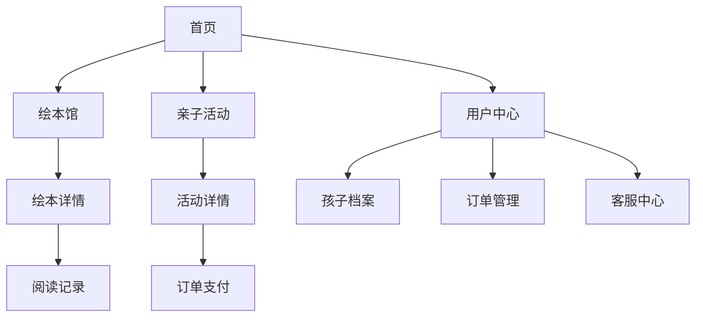

## 1. 产品概述
绘本岛是一个面向中国亲子家庭的"绘本阅读 + 亲子活动"平台，致力于为0-12岁儿童和家长提供优质的绘本阅读体验和亲子互动活动。通过温馨的界面设计和丰富的内容资源，让亲子时光更温暖，帮助孩子培养阅读兴趣，促进亲子关系。

目标用户：0-12岁儿童的家长，注重亲子教育和阅读培养的家庭
市场价值：打造中国领先的亲子阅读平台，成为家庭教育的得力助手

## 2. 核心功能

### 2.1 用户角色
| 角色 | 注册方式 | 核心权限 |
|------|----------|----------|
| 家长用户 | 手机号/微信注册 | 浏览绘本、参与活动、管理孩子档案、购买商品 |
| 游客用户 | 无需注册 | 浏览基础内容、查看活动信息 |

### 2.2 功能模块
绘本岛平台包含以下核心页面：
1. **首页**：轮播图、热门绘本推荐、亲子活动、节日专题、搜索功能
2. **注册登录页**：手机号注册、微信登录、孩子信息设置
3. **绘本馆页面**：绘本分类浏览、年龄段筛选、主题筛选、搜索排序
4. **绘本详情页**：绘本信息展示、评论查看、收藏阅读
5. **亲子活动页**：活动列表、详情查看、报名预约、地区筛选
6. **阅读记录页**：阅读历史、打卡记录、读后感、照片上传
7. **用户中心**：孩子档案管理、订单管理、地址管理、客服联系
8. **购物车页**：商品管理、结算流程
9. **订单页**：订单查看、物流跟踪

### 2.3 页面详情
| 页面名称 | 模块名称 | 功能描述 |
|----------|----------|----------|
| 首页 | 轮播图模块 | 展示精选内容，支持自动切换和手动滑动 |
| 首页 | 搜索栏 | 支持关键词搜索绘本和活动 |
| 首页 | 热门绘本 | 展示推荐绘本，支持点击查看详情 |
| 首页 | 亲子活动 | 展示最新活动，支持筛选和报名 |
| 首页 | 节日专题 | 节日主题内容推荐 |
| 注册登录页 | 手机号注册 | 输入手机号获取验证码完成注册 |
| 注册登录页 | 微信登录 | 一键微信授权登录 |
| 注册登录页 | 孩子信息设置 | 设置孩子姓名、年龄、兴趣标签 |
| 绘本馆页面 | 分类导航 | 按年龄段、主题分类展示 |
| 绘本馆页面 | 筛选功能 | 支持多维度筛选和排序 |
| 绘本馆页面 | 搜索功能 | 关键词搜索和智能推荐 |
| 绘本详情页 | 基本信息 | 展示封面、简介、适读年龄 |
| 绘本详情页 | 内容预览 | 页内插画预览功能 |
| 绘本详情页 | 家长评论 | 显示用户评价和推荐语 |
| 绘本详情页 | 收藏阅读 | 支持加入收藏和开始阅读 |
| 亲子活动页 | 活动列表 | 展示各类亲子活动 |
| 亲子活动页 | 地区筛选 | 按地理位置筛选活动 |
| 亲子活动页 | 活动详情 | 查看活动信息和报名状态 |
| 亲子活动页 | 报名预约 | 在线报名和预约提醒 |
| 阅读记录页 | 阅读历史 | 展示已读绘本记录 |
| 阅读记录页 | 打卡功能 | 每日阅读打卡 |
| 阅读记录页 | 读后感 | 撰写和分享读后感受 |
| 阅读记录页 | 照片上传 | 上传阅读照片记录成长 |
| 用户中心 | 孩子档案 | 管理多个孩子信息，支持切换 |
| 用户中心 | 订单管理 | 查看购买记录和订单状态 |
| 用户中心 | 地址管理 | 收货地址添加和编辑 |
| 用户中心 | 客服联系 | 微信客服和邮件联系 |

## 3. 核心流程

### 用户注册流程
1. 访问首页 → 点击登录/注册 → 选择注册方式 → 填写基本信息 → 设置孩子信息 → 完成注册

### 绘本阅读流程
1. 浏览绘本馆 → 筛选感兴趣绘本 → 查看详情 → 开始阅读 → 添加到阅读记录 → 分享读后感

### 活动参与流程
1. 浏览亲子活动 → 筛选地区活动 → 查看活动详情 → 在线报名 → 支付费用 → 参与活动

### 购物流程
1. 选择商品 → 加入购物车 → 确认订单 → 选择支付方式 → 完成支付 → 查看物流

## 4. 用户界面设计

### 4.1 设计风格
- **主色调**：米白色(#FAF7F0)、淡黄色(#FFE4B5)、天蓝色(#87CEEB)
- **辅助色**：温暖橙色(#FFB366)、柔和绿色(#90EE90)
- **按钮样式**：圆角设计，柔和阴影，手绘风格
- **字体选择**：主标题使用圆润字体，正文字体清晰易读
- **布局风格**：卡片式布局，留白充足，图文结合
- **图标风格**：手绘风格图标，统一线条粗细，避免使用emoji

### 4.2 页面设计概述
| 页面名称 | 模块名称 | UI元素 |
|----------|----------|--------|
| 首页 | 轮播图 | 全屏宽度，圆角过渡，自动播放，指示器清晰 |
| 首页 | 导航栏 | 底部固定导航，图标+文字，选中状态高亮 |
| 首页 | 绘本卡片 | 圆角卡片，封面图+标题，淡阴影效果 |
| 绘本馆 | 分类标签 | 圆角标签，柔和配色，选中状态填充色 |
| 绘本详情 | 封面展示 | 大封面图，圆角边框，阴影效果 |
| 绘本详情 | 信息区域 | 清晰的信息层级，适当的留白 |
| 活动页面 | 活动卡片 | 时间地点突出显示，报名按钮醒目 |
| 用户中心 | 个人信息 | 头像圆角，信息分类清晰 |

### 4.3 响应式设计
- **设计原则**：移动端优先，适配各种屏幕尺寸
- **断点设置**：手机(<768px)、平板(768px-1024px)、桌面(>1024px)
- **交互优化**：触摸友好的按钮大小，适合手指操作
- **图片适配**：响应式图片，支持WebP格式，懒加载优化