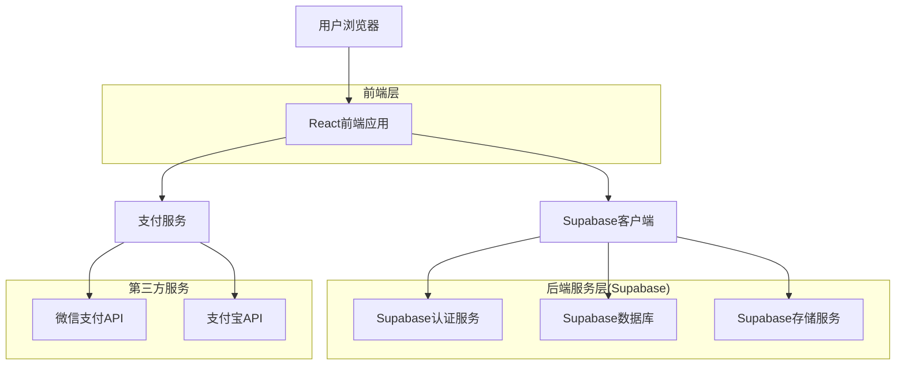
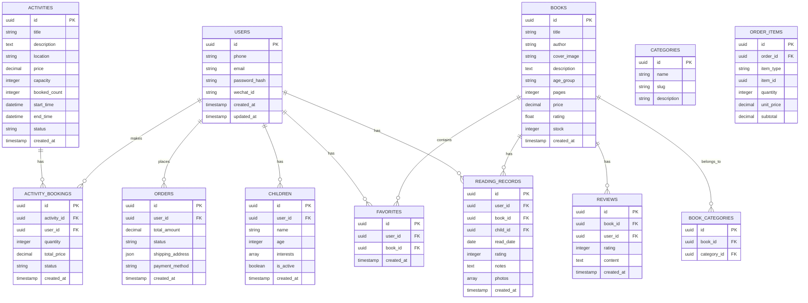

## 1. 架构设计



## 2. 技术描述

- **前端**: React@18 + TypeScript + TailwindCSS@3 + Vite
- **初始化工具**: vite-init
- **后端**: Supabase (BaaS)
- **数据库**: PostgreSQL (Supabase提供)
- **认证**: Supabase Auth (支持手机号、微信登录)
- **存储**: Supabase Storage (图片、文件存储)
- **支付**: 微信支付 + 支付宝 (集成第三方支付SDK)
- **部署**: Vercel/Netlify (前端) + Supabase (后端)

## 3. 路由定义

| 路由 | 用途 |
|------|------|
| / | 首页，展示轮播图、推荐内容 |
| /login | 登录注册页面 |
| /register | 注册页面，设置孩子信息 |
| /books | 绘本馆，绘本分类浏览 |
| /books/:id | 绘本详情页面 |
| /activities | 亲子活动列表页面 |
| /activities/:id | 活动详情页面 |
| /reading-record | 阅读记录页面 |
| /profile | 用户中心 |
| /profile/children | 孩子档案管理 |
| /profile/orders | 订单管理 |
| /cart | 购物车 |
| /checkout | 结算页面 |
| /payment | 支付页面 |

## 4. API定义

### 4.1 用户认证API

```
POST /api/auth/register
```

请求参数：
| 参数名 | 参数类型 | 是否必需 | 描述 |
|--------|----------|----------|------|
| phone | string | true | 手机号 |
| code | string | true | 验证码 |
| password | string | true | 密码 |
| child_name | string | true | 孩子姓名 |
| child_age | number | true | 孩子年龄 |
| child_interests | array | false | 兴趣标签 |

响应：
```json
{
  "success": true,
  "data": {
    "user_id": "uuid",
    "token": "jwt_token",
    "refresh_token": "refresh_token"
  }
}
```

### 4.2 绘本相关API

```
GET /api/books
```

查询参数：
| 参数名 | 参数类型 | 是否必需 | 描述 |
|--------|----------|----------|------|
| age_group | string | false | 年龄段(0-3,3-6,6-9,9-12) |
| category | string | false | 主题分类 |
| sort | string | false | 排序方式(popularity,rating,newest) |
| page | number | false | 页码 |
| limit | number | false | 每页数量 |

### 4.3 活动相关API

```
GET /api/activities
```

查询参数：
| 参数名 | 参数类型 | 是否必需 | 描述 |
|--------|----------|----------|------|
| city | string | false | 城市 |
| type | string | false | 活动类型 |
| date | string | false | 日期筛选 |
| page | number | false | 页码 |

## 5. 数据模型设计

### 5.1 数据库实体关系图



### 5.2 数据定义语言

```sql
-- 用户表
CREATE TABLE users (
    id UUID PRIMARY KEY DEFAULT gen_random_uuid(),
    phone VARCHAR(20) UNIQUE,
    email VARCHAR(255) UNIQUE,
    password_hash VARCHAR(255),
    wechat_id VARCHAR(100) UNIQUE,
    avatar_url TEXT,
    created_at TIMESTAMP WITH TIME ZONE DEFAULT NOW(),
    updated_at TIMESTAMP WITH TIME ZONE DEFAULT NOW()
);

-- 孩子档案表
CREATE TABLE children (
    id UUID PRIMARY KEY DEFAULT gen_random_uuid(),
    user_id UUID REFERENCES users(id) ON DELETE CASCADE,
    name VARCHAR(100) NOT NULL,
    age INTEGER CHECK (age >= 0 AND age <= 18),
    interests TEXT[], -- PostgreSQL数组类型
    avatar_url TEXT,
    is_active BOOLEAN DEFAULT true,
    created_at TIMESTAMP WITH TIME ZONE DEFAULT NOW()
);

-- 绘本表
CREATE TABLE books (
    id UUID PRIMARY KEY DEFAULT gen_random_uuid(),
    title VARCHAR(255) NOT NULL,
    author VARCHAR(255) NOT NULL,
    cover_image TEXT NOT NULL,
    description TEXT,
    age_group VARCHAR(20) CHECK (age_group IN ('0-3', '3-6', '6-9', '9-12')),
    pages INTEGER,
    price DECIMAL(10,2) DEFAULT 0,
    rating DECIMAL(3,2) DEFAULT 0,
    rating_count INTEGER DEFAULT 0,
    stock INTEGER DEFAULT 0,
    images TEXT[],
    created_at TIMESTAMP WITH TIME ZONE DEFAULT NOW(),
    updated_at TIMESTAMP WITH TIME ZONE DEFAULT NOW()
);

-- 分类表
CREATE TABLE categories (
    id UUID PRIMARY KEY DEFAULT gen_random_uuid(),
    name VARCHAR(100) NOT NULL,
    slug VARCHAR(100) UNIQUE NOT NULL,
    description TEXT,
    icon_url TEXT,
    sort_order INTEGER DEFAULT 0,
    created_at TIMESTAMP WITH TIME ZONE DEFAULT NOW()
);

-- 绘本分类关联表
CREATE TABLE book_categories (
    id UUID PRIMARY KEY DEFAULT gen_random_uuid(),
    book_id UUID REFERENCES books(id) ON DELETE CASCADE,
    category_id UUID REFERENCES categories(id) ON DELETE CASCADE,
    UNIQUE(book_id, category_id)
);

-- 阅读记录表
CREATE TABLE reading_records (
    id UUID PRIMARY KEY DEFAULT gen_random_uuid(),
    user_id UUID REFERENCES users(id) ON DELETE CASCADE,
    book_id UUID REFERENCES books(id) ON DELETE CASCADE,
    child_id UUID REFERENCES children(id) ON DELETE CASCADE,
    read_date DATE DEFAULT CURRENT_DATE,
    rating INTEGER CHECK (rating >= 1 AND rating <= 5),
    notes TEXT,
    photos TEXT[],
    created_at TIMESTAMP WITH TIME ZONE DEFAULT NOW()
);

-- 收藏表
CREATE TABLE favorites (
    id UUID PRIMARY KEY DEFAULT gen_random_uuid(),
    user_id UUID REFERENCES users(id) ON DELETE CASCADE,
    book_id UUID REFERENCES books(id) ON DELETE CASCADE,
    created_at TIMESTAMP WITH TIME ZONE DEFAULT NOW(),
    UNIQUE(user_id, book_id)
);

-- 评论表
CREATE TABLE reviews (
    id UUID PRIMARY KEY DEFAULT gen_random_uuid(),
    book_id UUID REFERENCES books(id) ON DELETE CASCADE,
    user_id UUID REFERENCES users(id) ON DELETE CASCADE,
    rating INTEGER CHECK (rating >= 1 AND rating <= 5),
    content TEXT NOT NULL,
    created_at TIMESTAMP WITH TIME ZONE DEFAULT NOW()
);

-- 活动表
CREATE TABLE activities (
    id UUID PRIMARY KEY DEFAULT gen_random_uuid(),
    title VARCHAR(255) NOT NULL,
    description TEXT NOT NULL,
    location VARCHAR(255) NOT NULL,
    price DECIMAL(10,2) DEFAULT 0,
    capacity INTEGER NOT NULL,
    booked_count INTEGER DEFAULT 0,
    start_time TIMESTAMP WITH TIME ZONE NOT NULL,
    end_time TIMESTAMP WITH TIME ZONE NOT NULL,
    images TEXT[],
    status VARCHAR(20) DEFAULT 'active' CHECK (status IN ('active', 'full', 'cancelled', 'completed')),
    created_at TIMESTAMP WITH TIME ZONE DEFAULT NOW(),
    updated_at TIMESTAMP WITH TIME ZONE DEFAULT NOW()
);

-- 活动报名表
CREATE TABLE activity_bookings (
    id UUID PRIMARY KEY DEFAULT gen_random_uuid(),
    activity_id UUID REFERENCES activities(id) ON DELETE CASCADE,
    user_id UUID REFERENCES users(id) ON DELETE CASCADE,
    quantity INTEGER NOT NULL DEFAULT 1,
    total_price DECIMAL(10,2) NOT NULL,
    contact_phone VARCHAR(20) NOT NULL,
    contact_name VARCHAR(100) NOT NULL,
    status VARCHAR(20) DEFAULT 'pending' CHECK (status IN ('pending', 'confirmed', 'cancelled', 'completed')),
    created_at TIMESTAMP WITH TIME ZONE DEFAULT NOW(),
    updated_at TIMESTAMP WITH TIME ZONE DEFAULT NOW()
);

-- 订单表
CREATE TABLE orders (
    id UUID PRIMARY KEY DEFAULT gen_random_uuid(),
    user_id UUID REFERENCES users(id) ON DELETE CASCADE,
    order_number VARCHAR(50) UNIQUE NOT NULL,
    total_amount DECIMAL(10,2) NOT NULL,
    status VARCHAR(20) DEFAULT 'pending' CHECK (status IN ('pending', 'paid', 'shipped', 'completed', 'cancelled')),
    shipping_address JSONB,
    payment_method VARCHAR(50),
    payment_status VARCHAR(20) DEFAULT 'pending',
    created_at TIMESTAMP WITH TIME ZONE DEFAULT NOW(),
    updated_at TIMESTAMP WITH TIME ZONE DEFAULT NOW()
);

-- 订单明细表
CREATE TABLE order_items (
    id UUID PRIMARY KEY DEFAULT gen_random_uuid(),
    order_id UUID REFERENCES orders(id) ON DELETE CASCADE,
    item_type VARCHAR(20) NOT NULL CHECK (item_type IN ('book', 'activity')),
    item_id UUID NOT NULL,
    quantity INTEGER NOT NULL DEFAULT 1,
    unit_price DECIMAL(10,2) NOT NULL,
    subtotal DECIMAL(10,2) NOT NULL,
    created_at TIMESTAMP WITH TIME ZONE DEFAULT NOW()
);

-- 创建索引
CREATE INDEX idx_users_phone ON users(phone);
CREATE INDEX idx_users_wechat ON users(wechat_id);
CREATE INDEX idx_children_user_id ON children(user_id);
CREATE INDEX idx_books_age_group ON books(age_group);
CREATE INDEX idx_books_rating ON books(rating DESC);
CREATE INDEX idx_reading_records_user_id ON reading_records(user_id);
CREATE INDEX idx_reading_records_book_id ON reading_records(book_id);
CREATE INDEX idx_favorites_user_id ON favorites(user_id);
CREATE INDEX idx_reviews_book_id ON reviews(book_id);
CREATE INDEX idx_activities_start_time ON activities(start_time);
CREATE INDEX idx_activity_bookings_user_id ON activity_bookings(user_id);
CREATE INDEX idx_orders_user_id ON orders(user_id);
CREATE INDEX idx_order_items_order_id ON order_items(order_id);

-- 设置RLS(Row Level Security)
ALTER TABLE users ENABLE ROW LEVEL SECURITY;
ALTER TABLE children ENABLE ROW LEVEL SECURITY;
ALTER TABLE reading_records ENABLE ROW LEVEL SECURITY;
ALTER TABLE favorites ENABLE ROW LEVEL SECURITY;
ALTER TABLE reviews ENABLE ROW LEVEL SECURITY;
ALTER TABLE activity_bookings ENABLE ROW LEVEL SECURITY;
ALTER TABLE orders ENABLE ROW LEVEL SECURITY;

-- 创建策略
CREATE POLICY "Users can view own profile" ON users FOR SELECT USING (auth.uid() = id);
CREATE POLICY "Users can update own profile" ON users FOR UPDATE USING (auth.uid() = id);
CREATE POLICY "Users can view own children" ON children FOR SELECT USING (auth.uid() = user_id);
CREATE POLICY "Users can manage own children" ON children FOR ALL USING (auth.uid() = user_id);
CREATE POLICY "Users can view own reading records" ON reading_records FOR SELECT USING (auth.uid() = user_id);
CREATE POLICY "Users can create own reading records" ON reading_records FOR INSERT WITH CHECK (auth.uid() = user_id);
CREATE POLICY "Users can view own favorites" ON favorites FOR SELECT USING (auth.uid() = user_id);
CREATE POLICY "Users can manage own favorites" ON favorites FOR ALL USING (auth.uid() = user_id);
CREATE POLICY "Users can view own reviews" ON reviews FOR SELECT USING (auth.uid() = user_id);
CREATE POLICY "Users can create reviews" ON reviews FOR INSERT WITH CHECK (auth.uid() = user_id);
CREATE POLICY "Users can view own bookings" ON activity_bookings FOR SELECT USING (auth.uid() = user_id);
CREATE POLICY "Users can create bookings" ON activity_bookings FOR INSERT WITH CHECK (auth.uid() = user_id);
CREATE POLICY "Users can view own orders" ON orders FOR SELECT USING (auth.uid() = user_id);
CREATE POLICY "Users can create orders" ON orders FOR INSERT WITH CHECK (auth.uid() = user_id);
```

## 6. 开发计划与里程碑

### 第一阶段 (1-2周) - 基础架构
- [ ] 项目初始化和环境配置
- [ ] Supabase项目设置和数据库创建
- [ ] 基础组件库搭建
- [ ] 响应式布局框架

### 第二阶段 (2-3周) - 用户系统
- [ ] 注册登录功能
- [ ] 孩子档案管理
- [ ] 用户中心页面
- [ ] 基础权限控制

### 第三阶段 (3-4周) - 核心功能
- [ ] 绘本浏览和搜索
- [ ] 绘本详情页面
- [ ] 阅读记录功能
- [ ] 收藏功能

### 第四阶段 (2-3周) - 活动系统
- [ ] 活动列表和筛选
- [ ] 活动详情页面
- [ ] 活动报名功能
- [ ] 订单管理

### 第五阶段 (2周) - 购物功能
- [ ] 购物车和结算
- [ ] 支付集成
- [ ] 订单跟踪
- [ ] 地址管理

### 第六阶段 (1周) - 优化和测试
- [ ] 性能优化
- [ ] 移动端适配
- [ ] 用户测试
- [ ] Bug修复

### 技术规范
- **代码规范**: 使用ESLint + Prettier进行代码格式化
- **组件规范**: 统一使用React Hooks和函数组件
- **状态管理**: 使用React Context + useReducer
- **API调用**: 统一封装Supabase客户端
- **错误处理**: 统一的错误边界和提示机制
- **性能优化**: 图片懒加载、代码分割、缓存策略