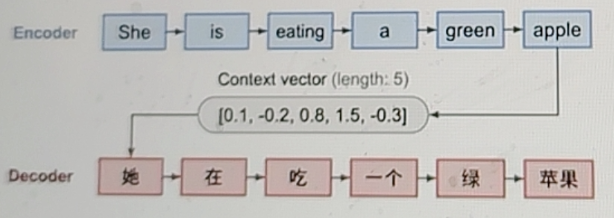
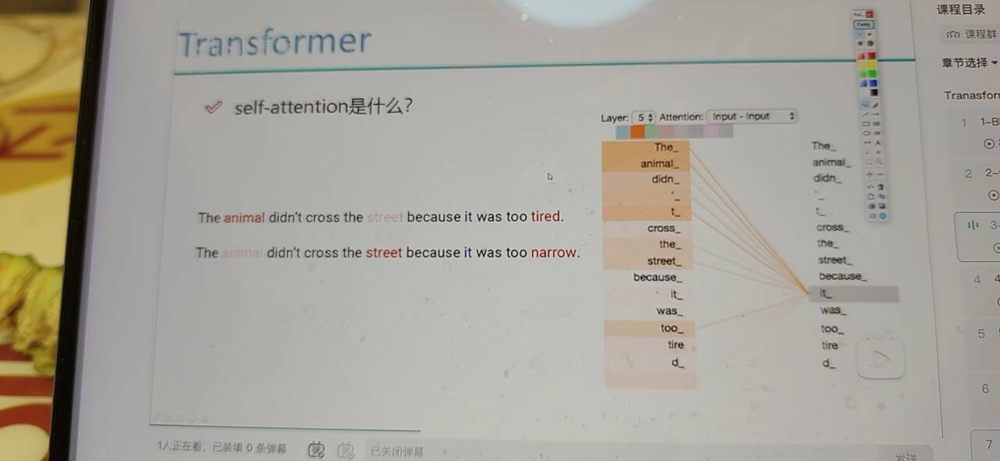

https://www.bilibili.com/cheese/play/ep696328?spm_id_from=333.1391.0.0&t=4&csource=common_hp_history_null

# self-attention 注意力机制的作用

transformer最核心的机制。

## Attention 是啥意思？

输入的数据， 可能不光是文本数据， 什么数据都行。 无论什么数据， 你都会有些关注点。

比如 下图 

斗鱼主播乔碧萝殿下，靠甜美女声做不露脸直播，全程用这张卡通 GIF 遮挡脸部，搭配精修自拍营造年轻美女形象，大量男粉丝为她大额刷礼物。

- 你的关注点在哪里？
乔碧萝殿下长什么样子啊？

下面的热度图

热度图的意思啊 当你把数据输入到卷积网络（专门抓图片纹理、轮廓、色块特征的图像神经网络）当中， 卷积网络会自动提取出数据中的特征。
哪些是重点， 最重点的东西是描述这个数据的特点， 有什么样的分辨能力。

不同的数据可能关注点不同， 图片好理解， 文本也是一样的。 

- 怎么样让计算机关注到这些有价值的信息？

翻译的机器学习任务

输入英文序列
输出中文序列

如果没有强调哪个词重要， 结果就是平行的。苹果可以是手机。
如果强调吃这个词很重要， 结果可能不同了。 水果
 
关键在于任务目标。让计算机关注到哪些有价值的信息？
不是人定，不是说一开始加个向量， 加权，而是根据上下文判断。

应该是你实际的数据传进来之后，根据数据长什么样子， 然后根据任务，根据数据做判断。

根据不同的数据， 找出不同的attention 的机制。 

第一句 it 指代 animal , 根据上下文语境
第二句 it 指代 steet , 
同样一句话当中，由于我的语境不同的， 对于期中的每个词来说， 它在理解这句话是不同的。 

self attention是什么？
self 自己和自己玩， 

每个 token 自己和整个序列（包括自己）做注意力匹配

对于第一句话， 对于animal 这个词来说， 它在它看来， 上下文里边，如果你用这个词，用上下文信息都融合进去之后， 
the 这个词， 加入一丁丁信息， 不重要， 
didn't 也加入一点信息
cross the 也加入一点信息
street 是主体的， 让这个信息多往animal 里加一加。
beacuse 加少一点， tired 加多一点
每个词啊， 对于上下文整体的信息到当前词当中。 

咱当前这个词考虑的就不是自己了， 也考虑是整体了， 
self attention 在这个整体当中， 你需要都考虑进去。 
看有图， it 这个词就不在是自己了， 它需要考虑你输入的整体了。 
如果对it 这个词进行编码， 那就不是对这一个词进行编码了， 你需要考虑每个占有的比例多少，

怎么让计算机更好地理解咱得自然语言处理任务？
it 这个词， 在这个上下文过程中， 关联越深对结果影响越大，那就是animal。

我们希望计算机在预训练后能达到这个效果吧？
这就是self attention 机制要做的。
对于自己的这样一句话来说， 每个词都是句子中的一部分， 每个词可能在它融合句子信息当中，融合的方法是不太一样的。 
因为， 对于每个词的权重的分配可能是不同的。

总结：
self attention 说件什么事？
当我对词做编码的时候， 不简简单单考虑当前一个词， 而是考虑当前词所处的上下文语境。把整个上下文语境融入当前词当中。

