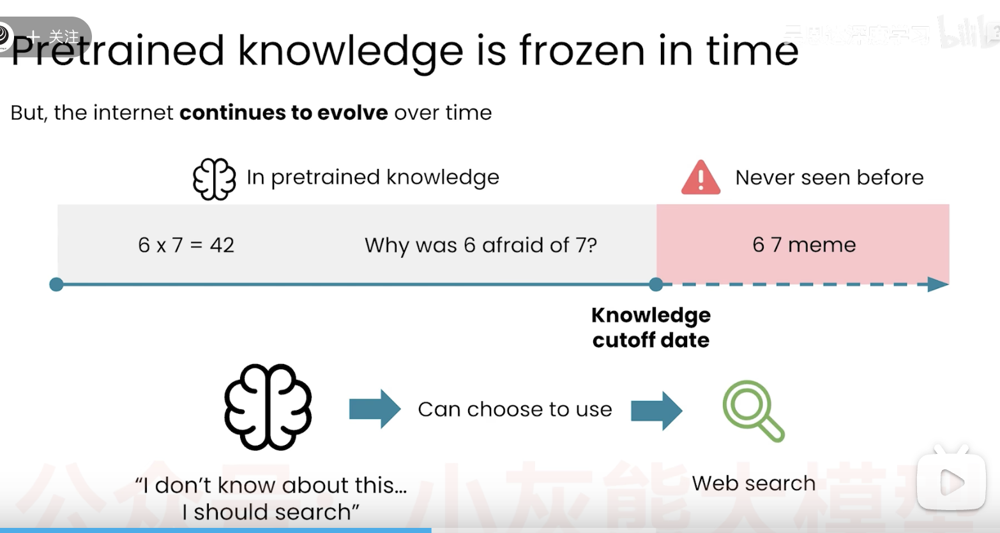
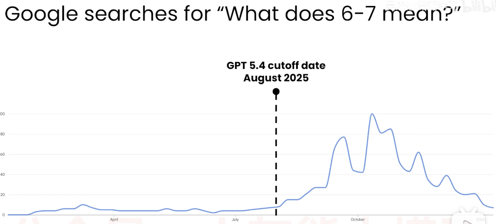
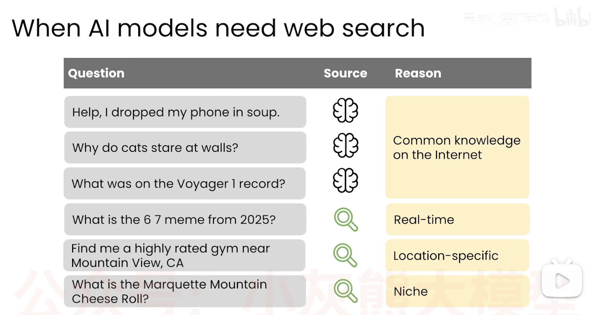
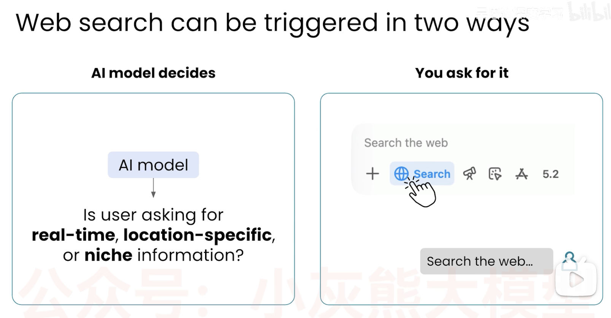

# 网络搜索

模型训练完成之日， llm 知识在那个时间点冻结。

世界还在变化， 世界别来了， 周星驰的女足要来了， 我们看AI 模型如何通过网页搜索获取新信息。

## 案例

6x7=42 数学知识
Why was 6 afraid of 7?
Because seven ate nine (seven eight nine).
这是英文谐音笑话：
ate（吃）和 eight（数字 8）读音一样
- 6 7 meme 啥意思？
  2025 爆火海外 TikTok「6-7（six seven）」洗脑 meme

  2024 年底说唱歌手 Skrilla 单曲《Doot Doot (6-7)》副歌反复唱 6-7；后来用来剪辑身高 6 尺 7 寸的球星拉梅洛・鲍尔彻底走红，一个小男孩赛场大喊 6-7 的视频直接引爆全网。

- openai gpt 5.4 模型为例
截止 2025年8月
 

google search 

1. 帮我找一家加州芒廷维尤附近评分很高的健身房
什么才算高评价？
那些内容可能开放， 那些内容可能封闭？
这些信息可能随着时间改变，会触发一次网络搜索。

2. 芝士滚赛是什么？
非常小众的信息，  人们追着滚动的奶酪轮子下山。网络搜索。

- 已有知识 Common knowledge on the Internet 
  pre train
- real-time、 Location-specific、 Niche（小众） 等Web Search 

## 网络搜索触发方式
- llm 自行决定启动网络搜索
- 手动触发网络搜索

如果AI进行网络搜索， 它在你想让它执行的很多任务上会表现得更好。

网络搜索使他能把预训练知识与最新信息结合起来。

但是， 网络搜索有可能返回质量较差的来源，怎么办？
如何让他使用更可靠的信息源？

python/function_call/functionCall.py