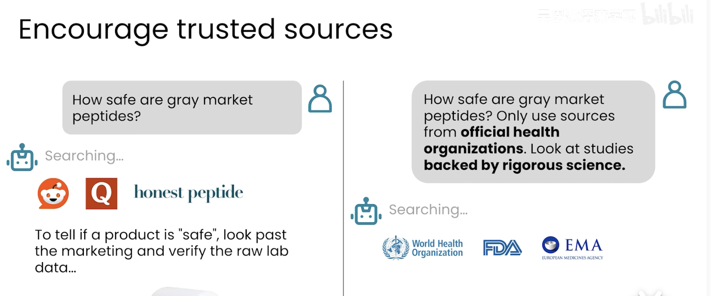
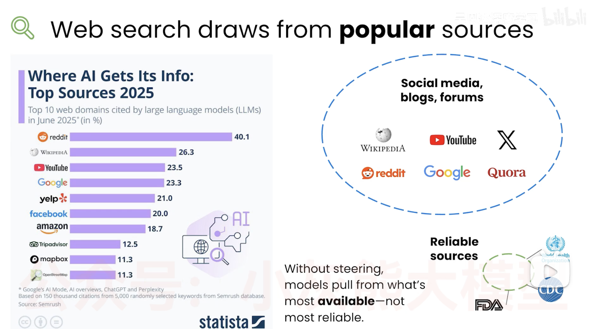
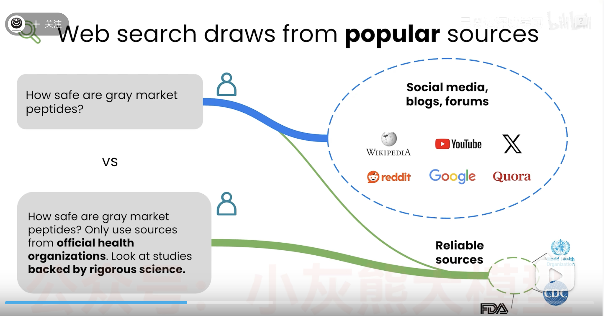
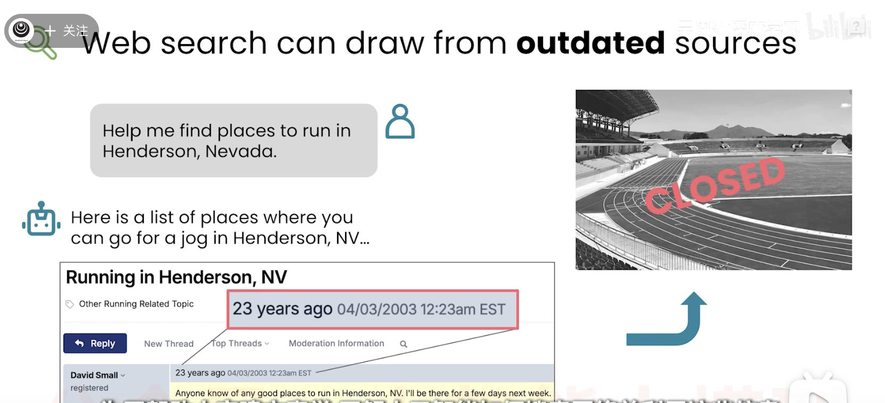
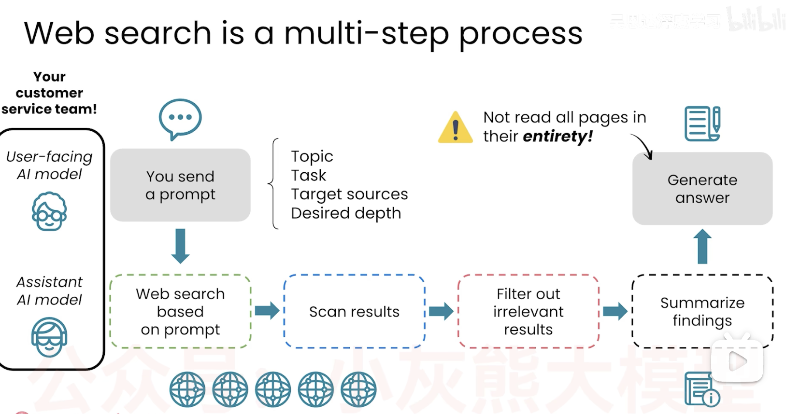
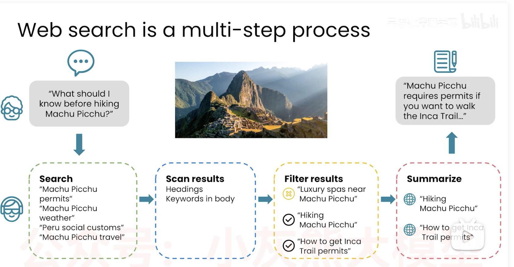

# 网络搜索来源

网络搜索非常有价值， 但也并不完美。

就像我们自己在网上找东西， 也并不总能找到想要的内容。

- 例如找到过时或不准确的资料

如何让Ai 找到 准确且最新的资料？
```
灰色市场肽类药物的安全性如何？
```

灰色市场肽类是绕开正规药监审批、非官方渠道流通的注射型肽制剂，多用于减脂、增肌、抗衰等，质量与安全无保障。

llm 可能会上网搜索， 并找到社交媒体或网站 ， 或者一些销售肽的网站

你得到的答案可能准确， 也可能不准确

但你如果引导llm 使用官方机构的资料或查阅有研究支持的内容

```
灰色市场肽类制剂安全性如何？仅可选用官方卫生机构认证渠道的产品，参考有严谨科学依据支撑的研究成果。

```
它会找 World Health Organization 等官方机构的资料


这样能为你提供更可靠， 更具科学可信度的答案。

无论是google 或llm 搜索， 往往倾向于引用流行来源的内容。

llm 引用次数最多的网站是reddit , wikipedia, youtube, google, yelp 等

其中一些来源比其他来源更值得信任。

social media, 

高可信度经过科学验证的内容数量要少得多

所以你不引导模型选择， 你希望偏好的信息来源类型

llm 可能会倾向于获取最容易获取的文本而不是来源最可靠内容。




这就是为什么问 灰色市场肽类药物的安全性如何？ 主要是从受欢迎的社交媒体网站获取信息。
而 灰色市场肽类制剂安全性如何？仅可选用官方卫生机构认证渠道的产品，参考有严谨科学依据支撑的研究成果。
从可靠的来源获取信息。

## 网络搜索的另一项局限 有时网页内容已过时

```
帮我找找内华达州亨德森市适合跑步的地点。
```
这是一个和地点相关的特定细分查询

结果给了20年前的网页， 这所推荐的学校已经不对外开放跑步了。 


网络搜索在底层是如何运作的呢？


- 是个多步骤的过程
- 你在向一个由两位成员组成的客服团队提问
  - 面向终端用户的人工智能模型
    我们向它下达指令
    调用第二个助手 please do web search for me 
  - AI 助手模型
    执行网络搜索 google等
    扫描结果
    去除不想关的结果， 下载最相关的网页内容， 然后总结整理。
    将结果返回给第一个助手， 

    第一个助手根据这些摘要内容， 生成最终的回答结果。

    有趣的是 第一个助手并未读取所有网页内容，只是读取了摘要。


1. 用户提问
“徒步马丘比丘之前我需要了解哪些事项？”
第一步：Search（发起搜索）
搜索关键词：
马丘比丘通行许可
马丘比丘天气
秘鲁当地社交习俗
马丘比丘旅行攻略
第二步：Scan results（浏览检索结果）
查看标题、正文里的关键词
第三步：Filter results（筛选结果）
❌ 无关内容：马丘比丘附近高端水疗会所✅ 有效内容：马丘比丘徒步须知✅ 有效内容：如何申请印加古道通行许可
第四步：Summarize（汇总提炼信息）
参考信息源：
马丘比丘徒步相关资料
印加古道许可办理方式
最终输出结论
“如果想走印加古道前往马丘比丘，必须提前办理通行许可……”

什么时候用llm, 什么时候用google等搜索引擎呢？
### 搜索引擎
-如果你想快速查看多个信息来源， 
- 导航到固定网站
- 你想看最原始的数据内容
  2013款本田思域的空气滤芯， 找个购买页面

### AI model
- 从多个来源中获取综合内容
- 更复杂的信息
- 比较各种资源
ai 搜索可以执行网页搜索， 并整理多页结果， 省去读大量网页的时间。


