[source](https://learn.deeplearning.ai/courses/build-with-andrew/lesson/a45t1o/creating-an-app-with-ai)

# 用AI 创建应用

使用AI创建 有趣的、使用的软件，无论我们之前的基础和能力如何。

## vibe coding 氛围编程

我相信大家对使用AI编程已经有了一些经验， 大厂希望我们能驾驭好AI，100%的代码都由AI生成，效率和质量都非常高。

让我先给大家介绍一个概念： vibe coding!

Vibe coding 说白了就是“凭感觉写代码”。现在有了超强 AI，你根本不用死磕语法和细节，只要像聊天一样用大白话告诉 AI 你想要什么功能，它就能立马帮你把代码写好。你只需要负责提需求和验收，主打一个轻松随性，让写程序变得像玩游戏一样简单！沉浸在创造的氛围中！


## 有趣的生日贺卡应用

我们将创建一个有趣的生日贺卡应用，使用chatgpt,gemini,豆包..., 只需要几分钟，即使我们没有写过任何代码。

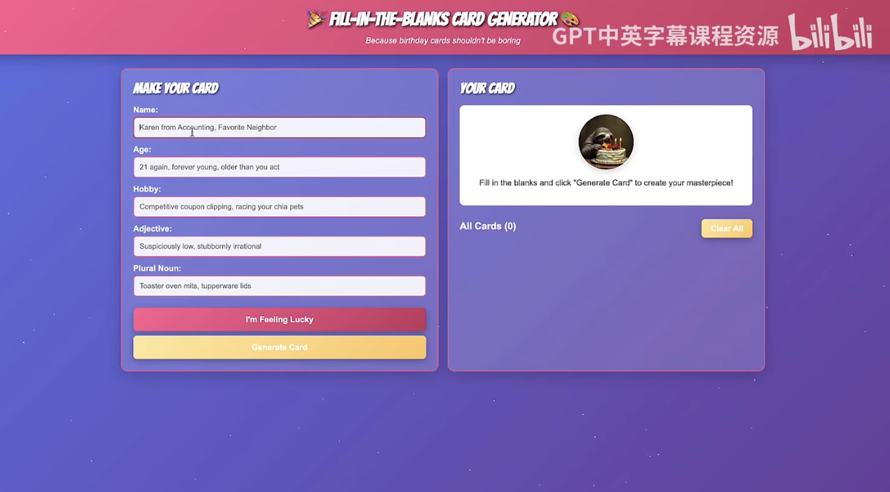

- 它是一个web应用程序
跑在网页浏览器中。

- 我们输入一些内容，如名字、年龄、爱好、特征等
它会为我们创建一张定制贺卡

我们只需要讲我们的需求（prompt）描述给llm(大语言模型), AI将为我们编写所有代码。

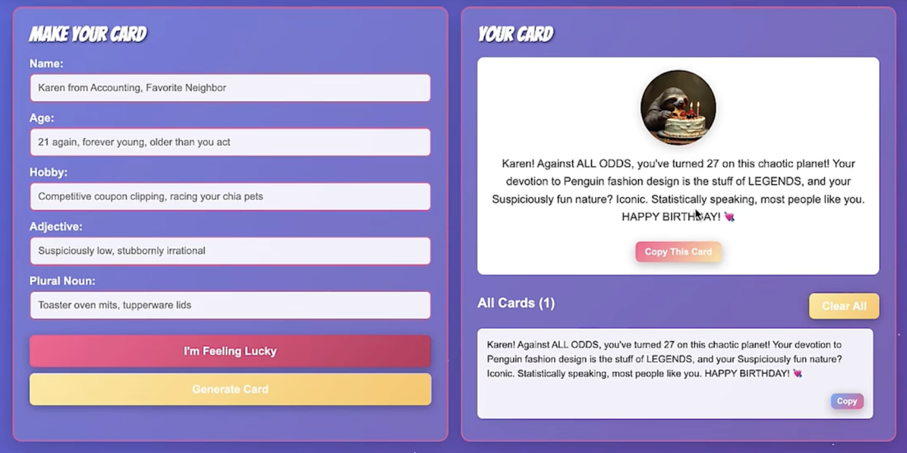

输入名字 karen, 27, Penguin fashion design  企鹅服设计，形容词可疑的有趣， 和一个负数名词 lucky socks 幸运袜子 点击生成卡片

凯伦！排除万难，你在这个混乱的星球上迎来了27岁生日！你对企鹅时装设计的执着简直是传奇，还有你那可疑的有趣天性？太经典了。统计来说，大多数人都喜欢你。
生日快乐！

如果不想填这些词， 可以点击 I'm feeling lucky,让它自动填充，你又得到了一张不同的有趣生日卡片。

你可能很兴奋，想直接开始创建你的创意。 
花一些时间亲自构建这个生日贺卡应用，会有很大帮助。
这样做 会让我们更好地体会如何与AI沟通，从而真正得到你想要的结果。
这个实践过程将简历我们的直觉，让我们懂得如何塑造AI实际创造的内容。
你也能更好地理解微小的调整如何能带来不同的结果。
一旦我们熟练掌握，构建自己的创意会变得更快更容易，因为你懂得如何驾驭这个过程。

## 告诉AI我们想要什么

在人工智能时代，创建软件最简单的方法，不再是亲自敲出代码。相反，你应该告诉AI替你来做。

### Prompting

告诉AI 去做什么，被称为Prompting(提示).

AI得到精确的指令时，可以为我们做很多事。
让我们一起来提示AI为我们创建软件。

何用任何chat bot 

- 1. 创建一个网页来帮我写生日贺卡。
当我提供一个人的姓名、年龄和爱好时，它应该给我返回一条有趣的消息。
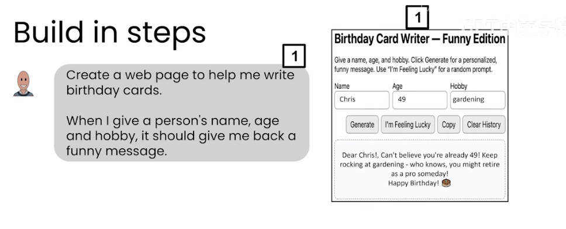

如果我们不满意呢？

可以与AI继续对话并说：

- 2. 加上节日风格的标题和配色，让它更好看些。
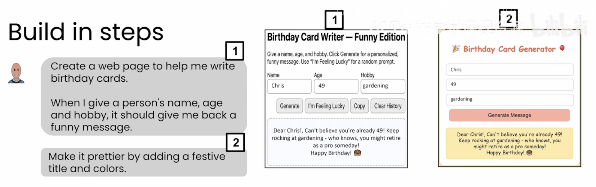  第二个版本

如果任然不满意， 继续

- 3. 把卡片放在右侧展示，让它看起来像生日贺卡的内页。
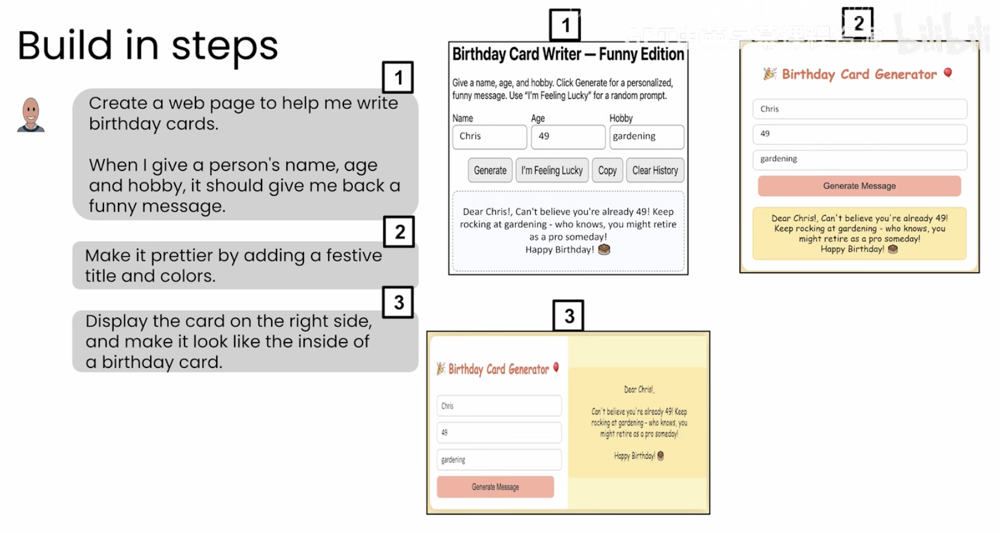

- 4. 在页面顶部加一个有趣的标题。另外，不要替换掉旧卡片，而是保留它们并叠放在新卡片的下方。
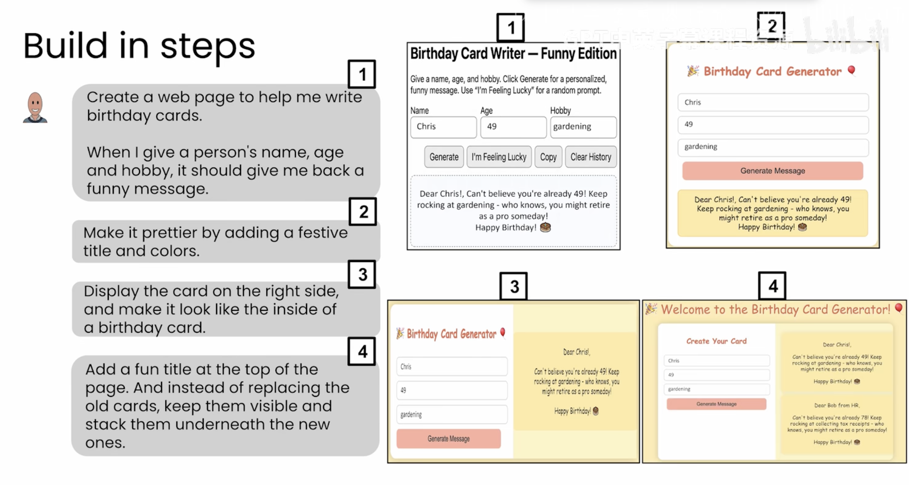

这就是实际工作中的做法， vibe coding, 当使用AI为我写代码时，我们通常从一组基本指令开始，看看得到了什么，然后反复告诉AI我想怎么改进。

事实证明，让你构建软件时，有一些基本的构建块，你可能会最终包含在提示prompt中
### building blocks of a good prompt 
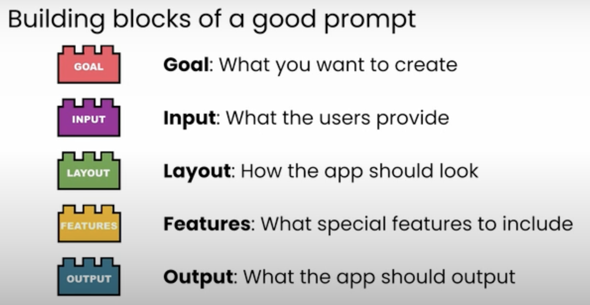
首先是目标（第一步），创建一个web应用来帮我写生日贺卡。
其次是输入 用户必须告诉软件会输入什么
接着是输出 
还有布局， 左边是什么，右边是什么，你如何安排应用的不同部分
最后，你想包含的附加功能

写好提示词的方法有很多，刚开始时，可以考虑这五个构建块。

Goal: What you want to create
Input: What the user provide
Layout: How the app should look
FEATURES: What special features to include
Output: What the app should output

  GOAL + INPUT + OUTPUT + LAYOUT + FEATURES

当我们做了些训练后， 可以把之前分四步，在单个提示中指定所有的构建块。

所以最后的prompt是

  ```
  创建一个网页来帮我写生日贺卡。

  当我输入一个人的姓名、年龄和爱好后，它应该返回一条有趣的消息。

  使用喜庆的标题和配色。

  把贺卡显示在右侧，并且让它看起来像生日贺卡的内页。

  在页面顶部添加一个有趣的标题。
  
  另外，不要替换旧的贺卡，而是保留它们的显示状态，把它们堆叠在新贺卡的下方。
  ```
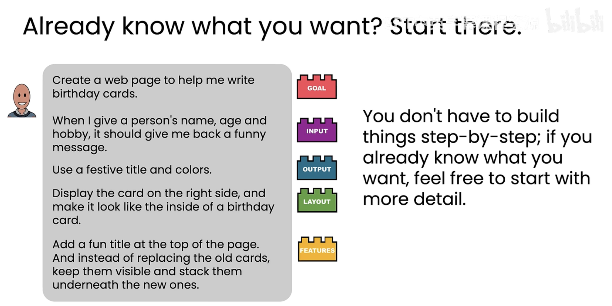

我们用了总结的5个构建块， 并把他们都写进一个长得多的单一提示里，我们可以得到一个更好的应用初版。
而且你还可以继续改进它

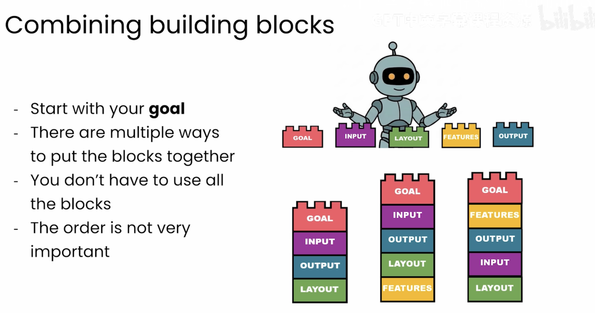

每次生成可能不一样， 我们可以多生成几次， 选择一下

反过来，如果有人给出的提示词要模糊的多，一个非常简短的，仅仅写着
“创建一个网页来帮我写生日贺卡”
由于这些是相对模糊的提示词，多运行几次，他会看起来完全不同
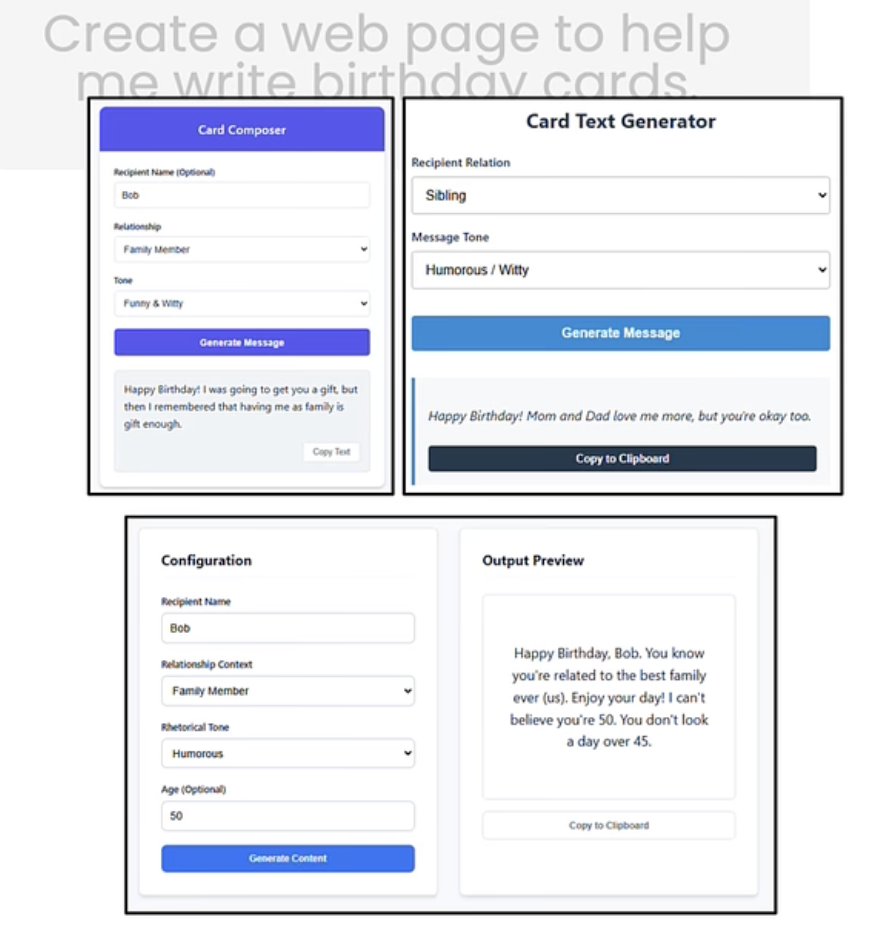  
 
你写的prompt 越具体，越是准确，结果的可预见性就越高。

## 给应用添加新特点

我们已经构建了一个基础的生日贺卡应用，我们来添加下其他的通能，这样可以做更多的事情或更有趣。让我们把app 给别人用时，也许他们也会提一些建议。

我们告诉AI要添加那些功能的方式，任然是通过提示(prompting)

我们通过一个餐车的例子来重温一下用具体的方式编写提示很重要。
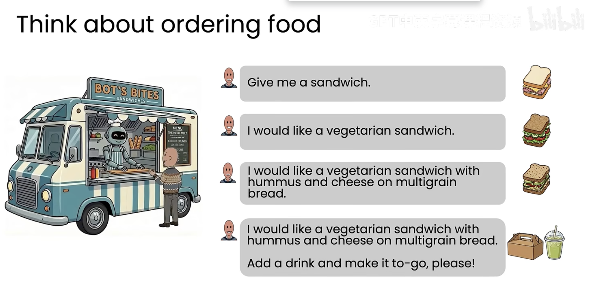
- 你说给我一个三明治
  如果你只说这些， llm 可能随机给你一个三明治（肉包，菜包，豆沙包）
- 如果你具体点说 给我一个蔬菜三明治 这样就缩小你可能得到东西的范围。
- 我想要一个蔬菜沙拉，加油豆泥、奶酪、用全麦面包做的 这条具体的指令意味着你得到的东西会变得可预测的多
- 我想要一个蔬菜沙拉，加油豆泥、奶酪、用全麦面包做的，还要一杯饮料，并帮我打好包。那更妥了。

通过具体说明你想要什么，你更有可能得到你想要的东西，对AI 提示就是这样。

## 加新特点

- 不只设置三个输入框， 而希望是五个用户可以输入（爱好、星座、 故事、风格、 城市），可以提供更个性化的信息
- 手气不错按钮 帮我们自动填写所有字段
- 更新标题
- 添加按钮将信息加入剪贴版，方便发送给朋友
- 重新设计整个配色方案

通过决定你要添加哪些功能， 将ai 生成的应用变成你的应用。
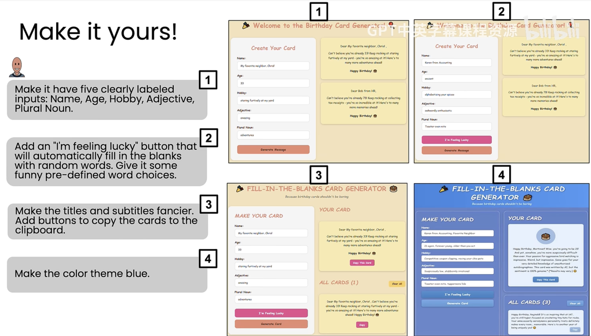
- 包含五个明确标注的输入项：姓名、年龄、爱好、形容词、复数名词。

  我们在这里写的是非常具体的指令， 不止是说让它有5个字段， 而是指定哪5个

- 添加一个“我感觉幸运”按钮，它会自动用随机词语填充空白处。提供一些有趣的预设词语选项。

- 让标题和副标题更精致一些。添加按钮，用于将卡片内容复制到剪贴板。
- 将配色主题设置为蓝色。
  - 如果后悔了
  我不喜欢蓝色主题，把它换成紫色吧。
  AI 非常擅长准确地完成你要求它做的事情。

- 如果有bug
  清楚的告诉AI 发生了什么
  当我点击“生成卡片”按钮时没有任何反应。你能帮我修复一下吗？

  AI 通常很擅长发现至少基本的缺陷并修复任何出错的地方。
  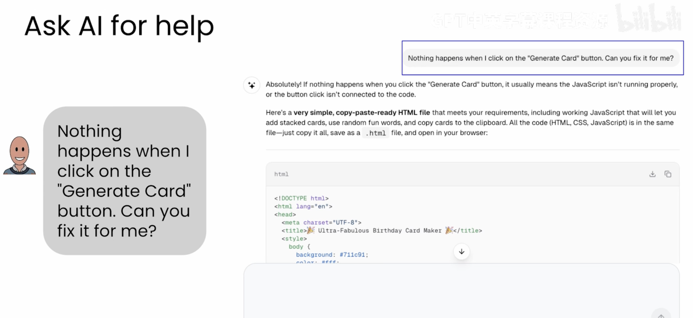
  我们不需要管他的那些术语， 只管专注于下载最新的HTML文件

### 总结
我们可以从这个基础生日应用开始，构建你朋友可能建议的一些功能，自己的点子，如果自己不确定，还可以向AI征求意见，比如你问它： 我怎么能让这个生日贺卡应用变酷，它可能会给出一些建议。利用AI的想法让你的应用更酷。
我经常把AI当头脑风暴


## 乒乓游戏

计算机历史上最早的视频游戏之一是一款叫做乒乓的游戏（乔布斯）花了数周的时间。现在用AI, 可以在短短几分钟时间构建出类似的东西。

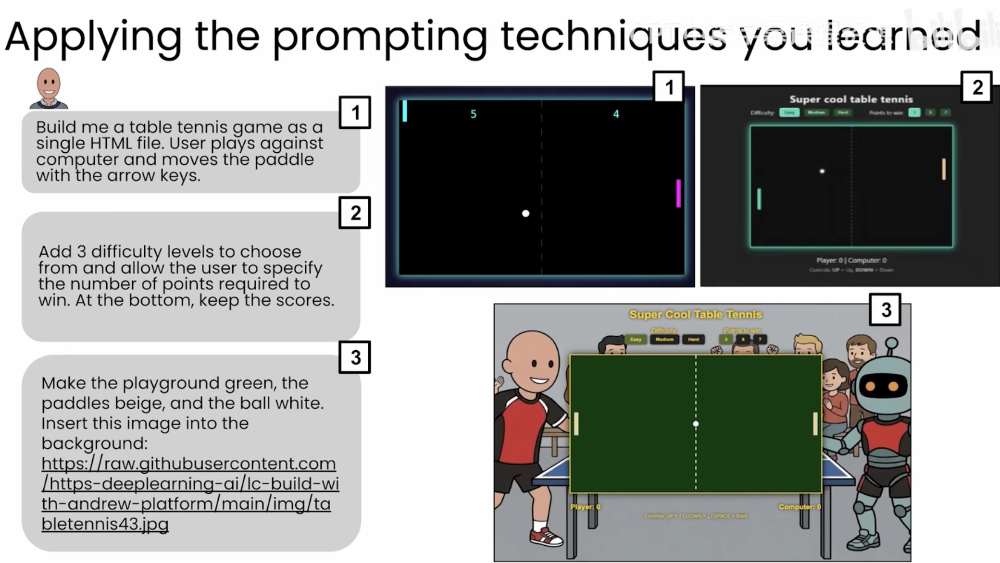

让我们应用所学到的提示技巧
这次我选择了快速开始，写了个中等具体的提示词

- 为我创建一个乒乓球游戏，使用单个HTML文件。用户通过方向键控制球拍，与电脑对战。
- 添加3个难度等级供选择，并允许用户指定获胜所需的分数。在底部保留比分显示。
- 将场地设为绿色，球拍设为米色，球设为白色。
将此图像插入为背景：https://raw.githubusercontent.com/https-deep-learning-with-andrew-platform/main/images/tabletennis43.jpg

### 原则
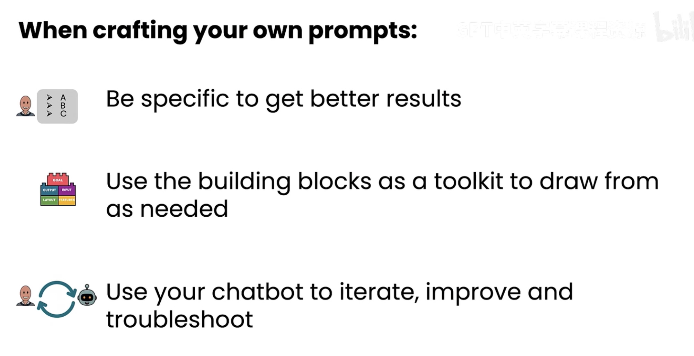
- 具体一些，才能获得更好的结果
  在许多细节上相当具体 颜色、分数等等
- 将基础模块作为工具箱，按需使用
  如果你不知道prompt 中需要什么， 想想构建模块
- 使用你的聊天机器人进行迭代、改进和故障排查
  你不需要第一次就作对

## A builder 
恭喜你， 你已经是一位AI构建者了。
不用怀疑， 你现在已经和我一样，是一位AI builder 
