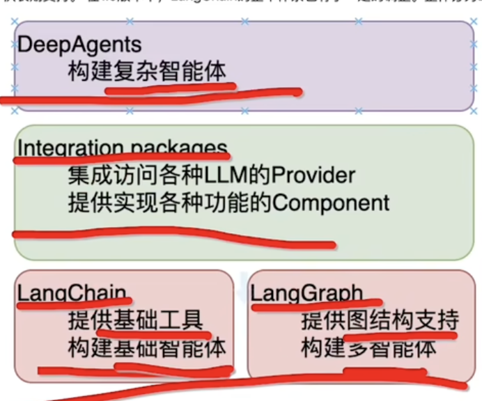

# langchain 

## 设计思路
围绕AI做应用的框架，所有做AI应用都应该快速掌握的一个工具。
2022 年10月份, chatgpt 还没有正式发布。

## langchain
- 提供基础工具
- 构建基础智能体

- langgraph
  提供图结构的支撑（工作流， 流程图）
  构建多智能体
- Integration packages
  集成各种LLM的Provider openai anthropic gemini
  提供实现各种功能的Component
- DeepAgents
  构建复杂智能体

## 快速构架第一个LangChain应用
Anaconda 
- !conda create -n langchain python=3.14  # 创建一个新的 虚拟环境
create 创建一个新的 Conda 环境 
-n langchain --name 的缩写 
python=3.14 

- conda actctivate langchainv1 
激活名为 langchainv1 的 Conda 虚拟环境，使后续操作（如安装包、运行代码）都在该环境中进行。

- pip install python-dotenv
- pip install -U langchain
- pip install -U langchain-openai
- pip install -U langgraph
- pip install -U deepagents
- conda list | grep langchain